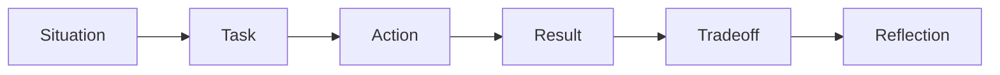

# Behavioral Strategy

Behavioral preparation is part of the technical interview plan because senior
and principal interviews often evaluate judgment, leadership, and communication
as heavily as technical depth.

This module sets up the Week 1 behavioral foundation.

## Learning goals

By the end of this module, you should be able to:

- Explain your career narrative clearly.
- Position your ML hardware background for NVIDIA, OpenAI, and Anthropic.
- Build a reusable story bank.
- Structure answers with evidence, tradeoffs, and reflection.
- Avoid behavioral answers that sound vague or inflated.
- Connect technical leadership to business and product outcomes.

## Why behavioral interviews matter

At senior and principal level, companies are not only asking:

> Can this person solve the problem?

They are also asking:

> Can this person lead ambiguous work, influence others, make sound tradeoffs,
> and raise the technical bar?

Strong behavioral answers show:

- Scope of ownership.
- Technical judgment.
- Cross-functional leadership.
- Decision quality.
- Conflict handling.
- Learning from failure.
- Communication with executives and non-experts.
- Impact on product, schedule, cost, or quality.

## Core positioning statement

Use this as a starting template:

> I am a senior ML hardware architect with experience defining custom AI
> accelerators, processor microarchitecture, performance models, ISA and
> programming models, and hardware/software co-design. I am now focusing on
> roles where that background can help build, optimize, or evaluate production
> LLM systems across hardware, software, and infrastructure.

This should be customized with specific evidence before interviews.

## Target-company positioning

| Company | What they may value | How to position experience | Risk to avoid |
| --- | --- | --- | --- |
| NVIDIA | GPU platforms and performance | ML accelerator architecture, PPA, and modeling | Weak NVIDIA stack fluency |
| OpenAI | Inference and infrastructure | Workload-driven architecture | Sounding only chip-focused |
| Anthropic | Reliable, careful systems | Principled tradeoffs and robustness | Sounding too hardware-only |

## Career narrative template

A two-minute narrative can follow this structure:

1. Origin:
   - How you entered computer architecture, performance, or systems.

2. Deep expertise:
   - Your experience in CPUs, ML accelerators, modeling, ISA, and PPA.

3. Recent relevance:
   - Your work on custom AI silicon and ML accelerator architecture.

4. Transition:
   - Why production LLM systems and GPU platforms are now the right next step.

5. Target fit:
   - Why NVIDIA, OpenAI, or Anthropic is a strong match.

6. Closing:
   - What kind of impact you want to have.

## STAR-plus-tradeoff framework

Use STAR, but add tradeoff and reflection.

The tradeoff step is critical for senior roles. It shows that you understand
constraints, not just actions.

## Evidence quality

Strong stories include evidence.

| Evidence type | What to include |
| --- | --- |
| Scope | Team size, system size, product area, or responsibility boundary |
| Metric | Performance, power, area, schedule, cost, quality, or adoption |
| Ambiguity | What was unknown at the beginning |
| Tradeoff | What options were considered and rejected |
| Conflict | Where people disagreed |
| Decision | What you chose and why |
| Outcome | What changed because of the work |
| Lesson | What you would repeat or change |

Do not invent metrics. Use placeholders until you fill in real details.

## Story bank themes

| Story theme | Likely interview signal | Example from your background to consider | Target relevance |
| --- | --- | --- | --- |
| Accelerator architecture | Technical leadership | Custom AI silicon architecture | All three |
| Performance modeling | Analytical depth | SystemC/TLM and PPA modeling | NVIDIA, OpenAI |
| Hardware/software co-design | Cross-functional execution | ISA and programming model work | All three |
| Ambiguous roadmap decision | Strategic judgment | Product roadmap or architecture tradeoff | All three |
| Tapeout or validation pressure | Execution under pressure | Chip tapeout or lab validation experience | NVIDIA |
| Bottleneck analysis | Systems thinking | ML workload performance analysis | NVIDIA, OpenAI |
| Conflict or disagreement | Leadership maturity | Architecture tradeoff disagreement | All three |
| Mentoring or team leadership | Senior-level leverage | Distributed or cross-functional team leadership | All three |

## Weak versus strong behavioral answers

Weak answer:

> I led the architecture and it was successful.

Why it is weak:

- No scope.
- No tradeoff.
- No conflict.
- No measurable outcome.
- No reflection.

Stronger answer pattern:

> The project had [scope] and [constraint]. My task was to decide between
> [option A] and [option B]. I used [data/model/experiment] to evaluate the
> tradeoff. The hard part was [conflict or ambiguity]. We chose [decision], which
> resulted in [outcome]. The lesson was [reflection].

## Week 1 exercise

Write three versions of your career narrative:

1. A 30-second version.
2. A two-minute version.
3. A role-specific version for each target company.

For each version, check:

- Does it explain why your background matters now?
- Does it connect hardware architecture to LLM systems?
- Does it sound senior without sounding inflated?
- Does it include evidence instead of vague claims?
- Does it avoid overfitting to one company?

## Practice prompts

Answer these out loud:

1. Tell me about yourself.
2. Why NVIDIA?
3. Why OpenAI?
4. Why Anthropic?
5. Tell me about a difficult architecture tradeoff.
6. Tell me about a time you influenced without authority.
7. Tell me about a time you were wrong technically.
8. Tell me about a time you handled ambiguity.
9. Tell me about a time you led across hardware and software.
10. What kind of role are you looking for now?

## Red flags to avoid

Avoid answers that:

- Sound like a resume recitation.
- Claim impact without evidence.
- Blame other teams.
- Overstate expertise in LLM research.
- Underplay your hardware architecture depth.
- Fail to connect your past work to future role needs.
- Sound uninterested in software, systems, or production constraints.
- Treat behavioral interviews as less important than technical interviews.

## Week 1 deliverables

Create:

- A 30-second career narrative.
- A two-minute career narrative.
- One NVIDIA positioning answer.
- One OpenAI positioning answer.
- One Anthropic positioning answer.
- A story bank with at least six candidate stories.
- A list of missing metrics or details you need to recover.

## Sources

- User-provided LinkedIn profile PDF.
- Behavioral structure is original interview-prep synthesis for this curriculum.
