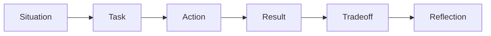

# Week 1: Behavioral Strategy

This module sets the behavioral foundation for senior/principal ML systems interviews.
It is not a script. It is a structure for turning Nawab Ali's real experience into clear,
company-relevant stories without inventing details.

## Learning Goals

- Build a concise positioning statement for ML systems and hardware/software co-design.
- Draft a two-minute career narrative.
- Identify story themes that match senior/principal interview signals.
- Separate real evidence from generic claims.
- Prepare to discuss tradeoffs, ambiguity, influence, conflict, and technical leadership.

## Why Behavioral Interviews Matter At Senior/Principal Level

At senior and principal levels, behavioral interviews may supersede technical interviews.
Companies are testing whether you can set direction, make durable tradeoffs, influence
without control, communicate across functions, and handle ambiguous high-stakes work.

Technical depth gets you into the conversation. Leadership evidence often determines
whether the interviewer trusts you with scope.

## Core Positioning Statement

Reusable short template:

> I am a senior ML hardware architect who connects accelerator architecture,
> performance modeling, and hardware/software co-design to production ML systems.
> I am now focusing that experience on LLM infrastructure, GPU platforms, and
> system-level bottlenecks where model behavior and hardware architecture meet.

Tune this for each company by changing the last clause, not by inventing a different
career. The center of gravity should stay consistent.

## Target-Company Positioning

| Company | What they may value | Positioning angle | Risk to avoid |
| --- | --- | --- | --- |
| NVIDIA | AI factories and platforms | PPA, modeling, co-design | Chip-only framing |
| OpenAI | Frontier systems and safety | Reliable LLM infrastructure | Overclaiming model depth |
| Anthropic | Reliable AI systems | Dependable co-design judgment | Ignoring safety context |

NVIDIA's public company material emphasizes accelerated computing, AI factories, chips,
systems, and software (Source 1). OpenAI's charter emphasizes technical leadership and
broadly beneficial AGI development (Source 2). Anthropic describes its work around
reliable, interpretable, and steerable AI systems (Source 3).

## STAR-Plus-Tradeoff Visual Framework

This is an original behavioral framework for this curriculum. It is synthesis, not a
claim from a source.

## Evidence Quality

Strong senior/principal stories need evidence. Use this checklist before deciding that a
story is interview-ready:

- Scope: what system, team, product, or decision surface was involved?
- Metric: what changed, even if the metric is approximate or qualitative?
- Ambiguity: what was unknown or contested?
- Tradeoff: what did you give up, and why?
- Conflict: who disagreed, and how did you handle it?
- Decision: what did you personally decide, influence, or clarify?
- Outcome: what happened because of the work?
- Lesson: what would you repeat or change next time?

If a story lacks evidence, keep it in the story bank but do not lead with it.

## Story Bank Themes

| Story theme | Likely signal | Background example to consider | Relevance |
| --- | --- | --- | --- |
| Architecture tradeoff | Judgment and PPA | [AI silicon tradeoff.] | All |
| Model changed the plan | Analytical leadership | [Modeling result.] | NVIDIA, OpenAI |
| ISA or programming model | Co-design maturity | [Compiler or kernel impact.] | All |
| Ambiguous decision | Influence and ownership | [Cross-functional case.] | All |
| Mentoring | Principal-level leverage | [Team decision quality.] | All |
| Reliability learning | Operational judgment | [Failure or mitigation.] | OpenAI, Anthropic |

Do not invent specifics. Fill placeholders only with real projects, decisions, and
outcomes you can defend under follow-up questions.

## Week 1 Exercise: Write Your Career Narrative

Use this two-minute template:

1. "My background is in [custom AI silicon / ML accelerator architecture / performance
   modeling / ISA and programming model work]."
2. "The throughline is that I connect workload behavior to hardware and software design
   choices."
3. "A representative example is [placeholder: one specific project and decision]."
4. "The impact was [placeholder: performance, power, cost, schedule, adoption, or risk]."
5. "I am now targeting ML systems roles because LLM infrastructure has made those
   hardware/software tradeoffs central to product capability."
6. "At [company], I would bring [company-specific angle] while learning the missing LLM
   domain depth quickly."

## STAR-Plus-Tradeoff Framework

Use STAR, but add the tradeoff explicitly:

- Situation: what was at stake?
- Task: what decision or leadership role did you own?
- Action: what did you do, and how did you influence others?
- Result: what changed because of your work?
- Tradeoff: what did you give up, why, and what would you revisit with hindsight?
- Reflection: what did the story teach you about future technical leadership?

The tradeoff and reflection sections are senior/principal differentiators. They show
judgment rather than just execution.

## Leadership Dimensions To Prepare

- Technical direction under ambiguity.
- Hardware/software co-design across teams.
- Performance modeling that changed a decision.
- PPA or cost tradeoffs with business consequences.
- Influence without authority.
- Clear communication to software, product, and executive audiences.
- Mentoring and raising engineering standards.
- Learning a new domain quickly without pretending to know everything.

## Weak Versus Strong Behavioral Answers

| Prompt | Weak pattern | Strong pattern |
| --- | --- | --- |
| Tradeoff | "I picked the best design." | "I named the cost and owned the result." |
| Conflict | "They were wrong." | "I aligned goals and surfaced evidence." |
| Impact | "The project mattered." | "The decision affected [metric] or [risk]." |
| Why this company? | "I want AI." | "My co-design background maps to this work." |

Use placeholders for facts until the real story is written. Do not fabricate metrics or
conflict.

## Red Flags To Avoid

- Over-indexing on hardware details without explaining system or product impact.
- Claiming LLM expertise beyond what you can defend.
- Turning every story into an individual hero narrative.
- Criticizing prior teams instead of explaining constraints and tradeoffs.
- Giving only abstract leadership principles without concrete evidence.
- Failing to connect your experience to the target company's mission and workload.

## Practice Prompts

- Tell me about a time you changed an architecture decision with performance data.
- Tell me about a hardware/software tradeoff you had to defend.
- Tell me about a time you influenced a team without direct authority.
- Tell me about a time you were wrong technically and corrected course.
- Tell me about a project with unclear requirements and high technical risk.
- Why NVIDIA, OpenAI, or Anthropic, given your hardware architecture background?

## Week 1 Deliverables

- One short positioning statement.
- One two-minute career narrative draft.
- Five story-bank candidates with placeholders filled in.
- One company-specific angle each for NVIDIA, OpenAI, and Anthropic.
- One red-flag note: the habit you most need to avoid in interviews.

## Sources

- Source 1: NVIDIA, "About Us."
  https://www.nvidia.com/en-us/about-nvidia/

- Source 2: OpenAI, "OpenAI Charter."
  https://openai.com/charter/

- Source 3: Anthropic, "Company."
  https://www.anthropic.com/company
