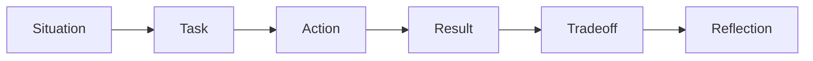

# Behavioral Strategy

This Week 1 module builds the behavioral interview foundation for senior ML
systems roles at NVIDIA, OpenAI, and Anthropic.

The goal is not to memorize scripted answers. The goal is to build a story bank
and answer framework that shows senior judgment, technical depth, leadership,
and hardware/software systems thinking.

Behavioral interviews at this level are not soft add-ons. They test whether you
can lead ambiguous work, make tradeoffs, influence teams, communicate clearly,
and learn from difficult outcomes.

## Learning goals

By the end of this module, you should be able to:

- Give a clear 30-second career narrative.
- Give a clear two-minute career narrative.
- Explain why your background fits NVIDIA, OpenAI, and Anthropic.
- Build a reusable story bank for senior/principal interviews.
- Use STAR plus tradeoff, evidence, and reflection.
- Connect hardware architecture experience to LLM systems work.
- Avoid vague, inflated, or purely resume-style answers.
- Identify missing metrics and details that must be recovered later.

## Week 1 scope

Week 1 is about structure and raw material.

You do not need perfect final stories yet. You do need a clear framework and a
list of candidate stories.

Later weeks should refine:

- company-specific positioning,
- final story wording,
- mock interview delivery,
- metrics and evidence,
- difficult follow-up questions,
- executive-level communication.

## Core positioning

Use this as a starting point, not as a final script.

> I am a senior ML hardware architect with experience in custom AI silicon,
> processor architecture, performance modeling, ISA and programming-model
> decisions, and hardware/software co-design. I am preparing for roles where
> that background can help build, optimize, or evaluate production LLM systems
> across accelerators, software, and infrastructure.

The important move is to connect your past work to the target role.

Do not present yourself only as a chip architect. Present yourself as someone
who can reason across:

- workload behavior,
- accelerator architecture,
- performance modeling,
- software stack constraints,
- infrastructure tradeoffs,
- product impact.

## The senior behavioral bar

At senior and principal level, interviewers are asking:

```text
Can this person lead important technical work when the answer is not obvious?
```

They are also asking:

```text
Can this person make good tradeoffs under constraints?
Can this person influence others?
Can this person communicate clearly?
Can this person recover from mistakes?
Can this person raise the technical bar?
```

Your answers should show:

| Signal | What it means |
| --- | --- |
| Scope | You owned work that mattered beyond a small task. |
| Judgment | You made a hard decision with incomplete information. |
| Tradeoff | You understood what was gained and what was sacrificed. |
| Evidence | You used data, modeling, experiments, or customer signals. |
| Influence | You moved people, not only code or documents. |
| Clarity | You can explain complexity without hiding behind jargon. |
| Reflection | You learned something and changed future behavior. |
| Impact | The work changed performance, cost, schedule, quality, or direction. |

## Do not sound generic

A weak answer sounds like this:

> I worked hard, collaborated with the team, and delivered the project.

That answer may be true, but it does not prove seniority.

A stronger answer sounds like this:

> The project had a performance target and a schedule constraint. I had to
> choose between a safer architecture and a more aggressive design. I built a
> model to compare the options, aligned hardware and software stakeholders, and
> recommended the option that improved the key bottleneck while controlling
> implementation risk. The result was measurable, and the lesson was that early
> workload modeling changed the decision quality.

The second answer shows judgment, tradeoff, evidence, influence, and reflection.

## STAR plus tradeoff

Use STAR as the base structure, but extend it.



The extra steps matter.

| Step | Purpose |
| --- | --- |
| Situation | Establish context and stakes. |
| Task | Explain your responsibility. |
| Action | Describe what you personally did. |
| Result | Give outcome and evidence. |
| Tradeoff | Show senior judgment. |
| Reflection | Show learning and maturity. |

Do not skip tradeoff and reflection. Those are often what separate senior
answers from mid-level answers.

## Answer shape

Use this structure for most behavioral answers.

```text
1. Context:
   What was the project, problem, or decision?

2. Stakes:
   Why did it matter?

3. Constraint:
   What made it hard?

4. Options:
   What alternatives were considered?

5. Your role:
   What did you personally own or influence?

6. Evidence:
   What data, model, experiment, or customer signal guided the choice?

7. Decision:
   What did you recommend or do?

8. Result:
   What changed because of the work?

9. Reflection:
   What would you repeat or change?
```

This pattern keeps answers from becoming vague.

## Evidence checklist

Before using a story in an interview, collect evidence.

| Evidence type | Examples |
| --- | --- |
| Technical scope | subsystem, architecture block, model, workload, platform |
| Team scope | number of teams, disciplines, or stakeholders |
| Decision scope | architecture, schedule, PPA, roadmap, risk, product |
| Metric | performance, power, area, cost, latency, throughput, schedule |
| Method | modeling, profiling, simulation, analysis, prototype, experiment |
| Conflict | disagreement, constraint, risk, ambiguity |
| Outcome | shipped decision, improved metric, avoided risk, changed roadmap |
| Lesson | what you now do differently |

Do not invent metrics. Use placeholders until you recover the real numbers.

## Career narrative

You need three versions.

### 30-second version

Use this when the interviewer says, "Tell me about yourself."

Template:

```text
I am a senior ML hardware architect focused on custom AI silicon and
hardware/software co-design. My background spans processor architecture,
performance modeling, ISA and programming-model decisions, and accelerator
tradeoffs. I am now focusing on roles where that experience can help build and
evaluate production LLM systems, especially where model behavior, GPU systems,
and infrastructure constraints meet.
```

### Two-minute version

Use this when the interviewer gives you room.

Template:

```text
I started in computer architecture and systems, where I built depth in
processor design, performance modeling, and hardware tradeoffs. Over time my
work moved toward ML acceleration and custom AI silicon, including architecture
definition, workload analysis, and hardware/software co-design.

The common thread is that I like turning ambiguous performance problems into
clear architecture decisions. That means understanding the workload, identifying
the real bottleneck, modeling options, and aligning hardware and software teams
around a practical tradeoff.

I am now preparing for roles in LLM systems because the most important problems
are no longer only chip-level. They require reasoning across models, GPU
platforms, memory, interconnect, serving software, cost, and reliability. My
background is a strong fit because I can bring hardware architecture discipline
to production AI systems and accelerator decisions.
```

### One-sentence version

Use this when you need a crisp identity.

```text
I am a senior ML hardware architect who connects workload behavior, accelerator
architecture, and systems tradeoffs for production AI platforms.
```

## Company positioning

### NVIDIA

NVIDIA likely values platform thinking, GPU architecture, performance, software
ecosystem awareness, and customer impact.

Position yourself as:

```text
A hardware architect who understands accelerator tradeoffs and can reason from
LLM workloads to GPU platform bottlenecks.
```

Strong themes:

- performance modeling,
- PPA tradeoffs,
- accelerator architecture,
- software ecosystem awareness,
- memory and interconnect reasoning,
- customer or workload-driven decisions.

Avoid:

- sounding unfamiliar with current NVIDIA platforms,
- talking only about old architecture concepts,
- ignoring CUDA, NCCL, TensorRT-LLM, and the software stack,
- reducing NVIDIA to "fast GPUs."

### OpenAI

OpenAI likely values infrastructure judgment, production systems, model-serving
efficiency, reliability, and ability to work across research and engineering.

Position yourself as:

```text
A systems-oriented hardware architect who can evaluate and optimize the
hardware/software boundary for large-scale LLM training and inference.
```

Strong themes:

- workload-driven architecture,
- inference and training bottlenecks,
- cost and latency tradeoffs,
- hardware/software co-design,
- cross-functional influence,
- principled decisions under ambiguity.

Avoid:

- sounding like you only want to design chips,
- ignoring production constraints,
- overclaiming research expertise,
- treating models as abstract workloads without user impact.

### Anthropic

Anthropic likely values reliable systems, careful reasoning, safety-aware
engineering, and technical judgment under uncertainty.

Position yourself as:

```text
A careful systems architect who can reason about AI infrastructure tradeoffs
with reliability, robustness, and long-term maintainability in mind.
```

Strong themes:

- principled tradeoffs,
- reliability and risk management,
- clear communication,
- careful evaluation,
- operational maturity,
- humility about uncertainty.

Avoid:

- sounding careless about safety or reliability,
- sounding purely vendor-specific,
- over-indexing on performance while ignoring risk,
- pretending certainty when data is incomplete.

## Story bank

Build at least eight candidate stories.

| Story | What it should prove |
| --- | --- |
| Architecture tradeoff | You can choose between imperfect options. |
| Performance modeling | You can use evidence to drive decisions. |
| Hardware/software co-design | You can work across abstraction boundaries. |
| Ambiguous roadmap decision | You can lead when direction is unclear. |
| Cross-functional conflict | You can influence without authority. |
| Failure or mistake | You can learn and improve. |
| Execution under pressure | You can deliver under constraints. |
| Mentoring or technical leadership | You raise the level of others. |
| Debugging or root cause | You can isolate complex system behavior. |
| Customer or product impact | You connect engineering to real outcomes. |

## Story template

Use this template for each story.

```text
Story title:
Company/project:
Approximate year:
Target signal:

Situation:
Task:
Action:
Result:
Tradeoff:
Reflection:

Metrics to recover:
People involved:
Risks:
Follow-up questions interviewer may ask:
```

Fill in bullets first. Do not write polished prose until the evidence is clear.

## Candidate story prompts

Use these prompts to mine your experience.

### Architecture tradeoff

Think of a time you chose between two architecture options.

Questions:

- What were the options?
- What did each option optimize?
- What did each option sacrifice?
- What data or model supported the decision?
- Who disagreed?
- What was the outcome?

### Performance modeling

Think of a time a model, simulator, or analysis changed a decision.

Questions:

- What was the original assumption?
- What did the model show?
- How did you validate the model?
- What changed because of it?
- What were the limitations of the model?

### Hardware/software co-design

Think of a time hardware and software constraints interacted.

Questions:

- What did hardware want?
- What did software need?
- Where was the mismatch?
- How did you resolve it?
- What would have happened without co-design?

### Influence without authority

Think of a time you changed direction without being the direct owner.

Questions:

- Who owned the decision?
- Why did they initially disagree?
- What evidence did you bring?
- How did you communicate the tradeoff?
- What changed?

### Failure or mistake

Think of a time your technical assumption was wrong.

Questions:

- What did you believe initially?
- What evidence proved otherwise?
- How did you respond?
- What did you change afterward?
- How did the team benefit from the lesson?

### Execution under pressure

Think of a time schedule, quality, or risk was under pressure.

Questions:

- What was the deadline or constraint?
- What options were available?
- What did you cut, defer, or protect?
- How did you communicate the decision?
- What was the result?

## Story quality rubric

Score each story from 0 to 4.

| Score | Meaning |
| ---: | --- |
| 0 | No usable story yet |
| 1 | Basic memory of event |
| 2 | Clear situation and action |
| 3 | Strong evidence, tradeoff, and result |
| 4 | Senior-level story with reflection and follow-up readiness |

A Week 1 target is to identify stories. A later-week target is to polish them.

## Weak versus strong examples

### Weak

> I led a performance effort and improved the architecture.

Why this is weak:

- no context,
- no constraint,
- no tradeoff,
- no evidence,
- no measurable result,
- no reflection.

### Stronger

> We had a workload whose bottleneck was unclear. One option improved peak
> compute, while another improved memory behavior. I built a model to compare
> the two under expected workload shapes. The model showed that memory traffic,
> not peak compute, was the limiting factor. I aligned the architecture and
> software teams around the second option. The result was a better fit for the
> target workload and a clearer validation plan. The lesson was to model the
> workload before optimizing the most visible metric.

This is stronger because it shows judgment.

## Company-specific story mapping

Map each story to target companies.

| Story type | NVIDIA | OpenAI | Anthropic |
| --- | --- | --- | --- |
| Accelerator tradeoff | very strong | strong | useful |
| Performance modeling | very strong | very strong | strong |
| Hardware/software co-design | very strong | very strong | strong |
| Reliability or risk | strong | very strong | very strong |
| Influence without authority | strong | strong | strong |
| Failure and learning | strong | strong | very strong |
| Mentoring | strong | strong | strong |
| Product or customer impact | very strong | strong | strong |

Do not force every story to fit every company. Choose the best match.

## Interview question bank

Prepare answers for these Week 1 behavioral questions.

1. Tell me about yourself.
2. Why NVIDIA?
3. Why OpenAI?
4. Why Anthropic?
5. Why are you interested in LLM systems now?
6. Tell me about a difficult architecture tradeoff.
7. Tell me about a time you influenced without authority.
8. Tell me about a time you were wrong technically.
9. Tell me about a time you handled ambiguity.
10. Tell me about a time hardware and software constraints conflicted.
11. Tell me about a time you used data to change a decision.
12. Tell me about a time you had to communicate complexity simply.
13. Tell me about a time you led under pressure.
14. Tell me about a time you mentored someone.
15. What kind of role are you looking for?

## Answer patterns

### Tell me about yourself

Use:

```text
past depth -> current focus -> target fit
```

Do not list your resume chronologically.

Good structure:

```text
My background is in ML hardware architecture and systems.
I have worked on custom AI silicon, performance modeling, and co-design.
The thread across my work is turning workload behavior into architecture
decisions.
I am now focused on LLM systems because the key problems sit across models,
accelerators, memory, interconnect, and software.
That is why roles at NVIDIA, OpenAI, and Anthropic are a strong fit.
```

### Why NVIDIA?

Use:

```text
platform + workload + architecture fit
```

Example:

```text
NVIDIA is interesting because modern AI performance is a platform problem, not
only a chip problem. My background in accelerator architecture, PPA, modeling,
and hardware/software co-design maps well to the problems NVIDIA solves across
GPUs, memory, interconnect, libraries, and customer workloads.
```

### Why OpenAI?

Use:

```text
production LLM systems + infrastructure + hardware/software boundary
```

Example:

```text
OpenAI is interesting because the frontier systems problems are full-stack:
training, inference, reliability, latency, cost, and infrastructure. My hardware
architecture background gives me a useful lens for evaluating bottlenecks and
tradeoffs at the hardware/software boundary.
```

### Why Anthropic?

Use:

```text
reliable systems + careful tradeoffs + principled engineering
```

Example:

```text
Anthropic is interesting because building useful AI systems requires careful
engineering judgment, not only performance. My background fits problems where
architecture, reliability, evaluation, and long-term system behavior all matter.
```

## Red flags

Avoid these behaviors.

| Red flag | Why it hurts |
| --- | --- |
| Giving only resume chronology | Does not show judgment |
| Using vague impact claims | Sounds inflated |
| Blaming other teams | Signals weak leadership |
| Overclaiming LLM research depth | Creates credibility risk |
| Ignoring software | Makes you sound too hardware-only |
| Ignoring product impact | Makes work sound abstract |
| No metrics or evidence | Weakens seniority |
| No reflection | Suggests low learning velocity |
| Too much jargon | Reduces communication signal |

## Follow-up handling

Behavioral interviewers often probe.

Prepare for follow-ups like:

- What would you do differently?
- Who disagreed with you?
- How did you know you were right?
- What data did you use?
- What was the measurable result?
- What was your specific contribution?
- What happened after the decision?
- How did you communicate the risk?
- What did you learn?

A good answer should survive follow-up pressure.

## Metrics to recover

Do not invent numbers. Recover what you can.

Useful metrics include:

- performance improvement,
- power reduction,
- area reduction,
- schedule saved,
- risk reduced,
- simulation speedup,
- model accuracy impact,
- latency reduction,
- throughput improvement,
- cost avoided,
- number of teams influenced,
- number of people mentored.

If exact numbers are confidential, use safe ranges or qualitative framing.

Examples:

```text
a double-digit performance improvement
a meaningful reduction in model error
a schedule risk that was removed before tapeout
a decision adopted across multiple teams
```

## Confidentiality rule

Do not reveal confidential employer details.

Use safe framing:

| Unsafe | Safer |
| --- | --- |
| Exact unreleased product detail | high-level subsystem |
| Proprietary metric | relative improvement |
| Customer name | major customer or partner |
| Internal roadmap | roadmap-level decision |
| Secret architecture detail | architecture tradeoff category |

The goal is to show judgment without exposing private information.

## Week 1 deliverables

By the end of Week 1, create:

- one 30-second career narrative,
- one two-minute career narrative,
- one NVIDIA positioning answer,
- one OpenAI positioning answer,
- one Anthropic positioning answer,
- eight candidate stories,
- a list of missing metrics,
- a list of stories that need more evidence.

Use this table.

| Story | Signal | Evidence status | Priority |
| --- | --- | --- | --- |
| Architecture tradeoff | judgment | needs metrics | high |
| Performance modeling | analytical depth | needs outcome | high |
| Co-design story | cross-functional | needs details | high |
| Failure story | learning | needs reflection | medium |
| Influence story | leadership | needs stakeholders | high |
| Mentoring story | leverage | needs example | medium |

## Week 1 self-check

You are ready to move on when you can answer:

1. What is your 30-second narrative?
2. What is your two-minute narrative?
3. Why are you a fit for NVIDIA?
4. Why are you a fit for OpenAI?
5. Why are you a fit for Anthropic?
6. What are your top three technical leadership stories?
7. Which story best shows architecture judgment?
8. Which story best shows hardware/software co-design?
9. Which story best shows learning from failure?
10. What metrics do you still need to recover?

## What belongs in later weeks

Later weeks should add:

- polished final scripts,
- company-specific variants,
- mock interview practice,
- pressure-tested follow-up answers,
- concise executive communication,
- final story ranking,
- compensation and role-level positioning.

Week 1 is about building the foundation.

## Sources

This module is original interview-prep synthesis based on the target roles and
the user's stated background.

No personal stories or metrics are invented. Any final interview answer should
be grounded in the user's real experience.
