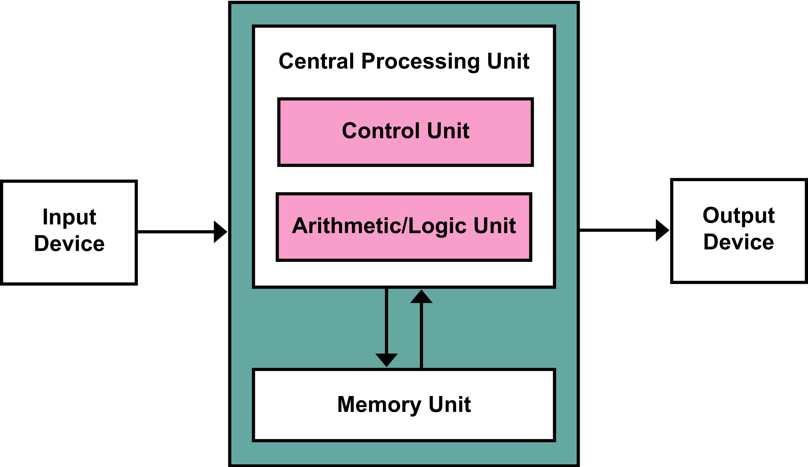
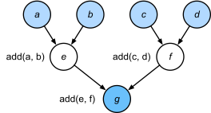
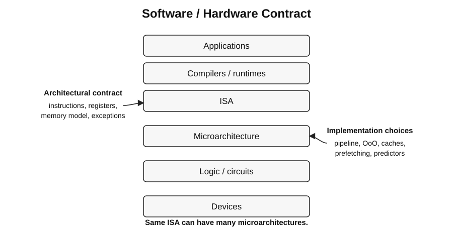

# Computer Architecture Foundations

## Amdahl's Law

If fraction `p` of execution time is improved by speedup `s`, total speedup is:

\[
S = \frac{1}{(1-p) + p/s}
\]

Key implications:

- The unimproved fraction `(1-p)` eventually dominates.
- As `s -> infinity`, maximum speedup is `1 / (1-p)`.
- Optimize the common case: a large speedup on a rare path may have little system impact.
- Parallel scaling is bounded by serial work plus synchronization, communication, and imbalance.

**Interview trap:** Amdahl's Law assumes a fixed workload. Gustafson-style reasoning instead asks how much larger
problem can be solved when resources scale.

## Von Neumann Model

A stored-program machine keeps instructions and data in memory and executes a logically sequential instruction
stream identified by a program counter.

Memory is conceptually a linear sequence of addressed locations. The same stored bits can be interpreted as
an instruction, an integer, or other data depending on which operation consumes them; memory does not inherently
label each bit pattern as code or data. Separate instruction/data caches do not change this programming model.



*Figure: CPU, shared instruction/data memory, and input/output in the Von Neumann model.*
Source: [Kapooht, Wikimedia Commons][von-neumann-source], [CC BY-SA 3.0][von-neumann-license].
The original vector artwork is rendered as a high-resolution PNG on a white background.

The arrows show input entering the machine, output leaving it, and transfers in both directions between CPU
and memory. They are conceptual connections, not separate data/control buses or a complete physical wiring diagram.
The CPU's control unit steers instruction execution; its ALU performs arithmetic and logic.
The overview omits individual registers; their roles are summarized below.

| Component | Role |
| --- | --- |
| Input / output | Transfer values between the machine and external devices |
| Memory address register (MAR) | Holds the address selected for a memory operation |
| Memory data register (MDR) | Buffers the value read from or written to memory |
| ALU and TEMP | Compute results and retain intermediate values |
| Instruction pointer (IP / PC) | Identifies the instruction to fetch |
| Instruction register (IR) | Holds the fetched instruction while it is decoded/executed |
| Control unit | Decodes the instruction and steers reads, ALU operations, writes, and the next PC |

A conceptual fetch sets `MAR = PC`, reads the instruction through MDR into IR, then decodes it.
Execution selects operands, computes through the ALU/TEMP path, and writes the destination; the next PC is
sequential or a control-transfer target. The named registers are teaching components, not a required physical
organization for every modern CPU. I/O values travel on data paths; the control unit enables the appropriate paths.

Core architectural state usually includes:

- program counter;
- integer, floating-point, vector, and control registers;
- architecturally visible memory;
- privilege, exception, and status state.

Modern CPUs are not physically sequential. They use pipelining, speculation, superscalar issue, out-of-order
execution, and caches while preserving the ISA-defined architectural behavior.

**Von Neumann bottleneck:** computation and memory share finite data-movement bandwidth and latency. Modern
systems attack it with caches, prefetching, vectorization, many memory channels, HBM, and near-data techniques.

## Dataflow Model

In a dataflow machine, an operation becomes eligible to execute when its input operands are available. Ordering
comes primarily from data dependences rather than a single global program counter.



*Figure: A computation graph for `g = (a + b) + (c + d)`, not a physical processor datapath.*
Source: [Dive into Deep Learning, Fig. 13.1.1][dataflow-source], [CC BY-SA 4.0][dataflow-license].
The scalable vector artwork retains its original labels, nodes, and arrows; a white background was added.

- Light-blue nodes `a`, `b`, `c`, and `d` are inputs; white nodes compute `e = a + b` and `f = c + d`.
- The two additions are independent: a dataflow executor can run them concurrently once their inputs arrive.
- The darker-blue node computes `g = e + f`; it must wait for both intermediate results.
- Each arrow carries a required value, not a command to execute the next instruction.

For `a = 1`, `b = 2`, `c = 3`, and `d = 4`, the independent additions produce `e = 3` and `f = 7`, then `g = 10`.
The source illustrates data dependencies in an imperative program; its sequential Python execution does not
itself imply concurrency. A dataflow scheduler can use those same dependencies to determine readiness.

For the arithmetic example `Y = (A + B) * C`, the multiply waits for both the sum and `C`.
The principle is the same: readiness follows operand availability, not the order of nodes on the page.

Properties:

- Nodes are operations; edges carry values or tokens.
- Independent nodes can execute concurrently.
- Execution is naturally asynchronous.
- Control flow can be represented with predicates, switch/merge nodes, and synchronization tokens.

### Control and synchronization tokens

Firing consumes the required input tokens and produces output tokens. A token can carry a value or signal that
an event has completed; it is not necessarily an instruction to execute next.

- **Relational operator:** consumes two values and emits a Boolean, e.g., `10 > 7` emits `true`.
- **Conditional routing:** consumes a value and a Boolean; sends the value only down the selected branch.
  With inputs `x` and `false`, the false output receives `x`; the true output receives no token.
- **Barrier:** waits for a token from every participating input before releasing the corresponding outputs.
  Two arrivals at a three-input barrier are insufficient; the third arrival allows the phase to advance.

Unlike an arithmetic node, a conditional merge must not wait for both mutually exclusive branch results.
See [dataflow operators and node state](03_data_parallelism_gpu.md#dataflow-operators-and-node-state).

Pure dataflow machines are uncommon as general-purpose CPUs, but dataflow ideas are everywhere:

- Tomasulo-style out-of-order scheduling;
- GPU dependency tracking;
- tensor and streaming accelerators;
- task-graph runtimes.

## ISA vs. Microarchitecture



*Figure: One software-visible ISA contract can have different microarchitectural implementations.*

The abstraction stack connects the problem to its physical implementation:

```text
Problem -> Algorithm -> Program -> ISA -> Microarchitecture -> Circuits -> Electrons
```

For example, sorting is the problem; merge sort is an algorithm; compiled code is the program; ISA instructions
describe its machine operations; a pipeline executes them; gates/registers implement the pipeline; electrical
signals realize the gates. A microprocessor implements an ISA using a microarchitecture and circuits.
"Computer architecture" is sometimes used broadly for both ISA and microarchitecture, not just instruction syntax.

### ISA

The **instruction set architecture** is the software-visible hardware contract. It defines what software can rely
on, including:

- instructions and encodings;
- registers and data types;
- addressing and memory semantics;
- exceptions, interrupts, and privilege;
- atomic and synchronization behavior;
- architecturally visible state.

Where defined, the contract includes support for exceptions, multiple hardware threads, synchronization,
and system control. OS task switching uses architectural register, privilege, and exception state; hidden thread
scheduling policy is not that software contract. Exposed power/thermal control registers or instructions belong
to the interface when defined; hidden clock-gating, scheduling, and thermal-management decisions belong to
the implementation.

### Microarchitecture

The **microarchitecture** is a particular hardware implementation of an ISA. It decides how the contract is met:

- pipeline depth and width;
- in-order vs. out-of-order execution;
- branch prediction and speculation;
- cache hierarchy and coherence;
- prefetching;
- execution-unit mix;
- clocking, power, and physical design.

The same ISA can have radically different microarchitectures. Software compatibility does not imply similar
performance.

### Interview-ready distinction

> ISA tells software **what** the machine does. Microarchitecture determines **how** a processor implements it.

## References

- RISC-V Ratified Specifications: <https://docs.riscv.org/>
- Intel architecture manuals: <https://www.intel.com/content/www/us/en/developer/articles/technical/intel-sdm.html>

[dataflow-source]: https://d2l.ai/chapter_computational-performance/hybridize.html#fig-computegraph
[dataflow-license]: assets/dataflow_model_license.txt
[von-neumann-source]: https://commons.wikimedia.org/wiki/File:Von_Neumann_Architecture.svg
[von-neumann-license]: https://creativecommons.org/licenses/by-sa/3.0/
