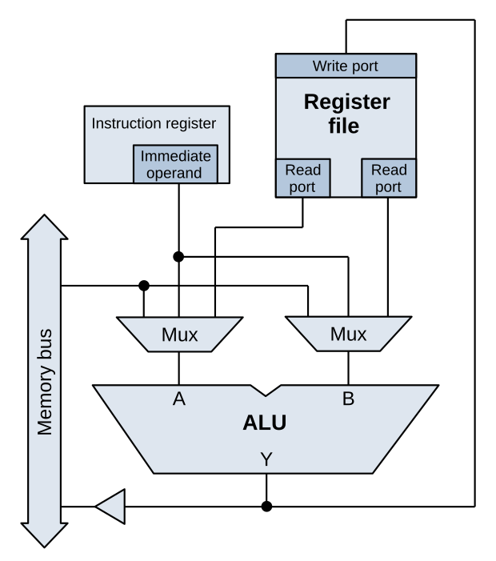
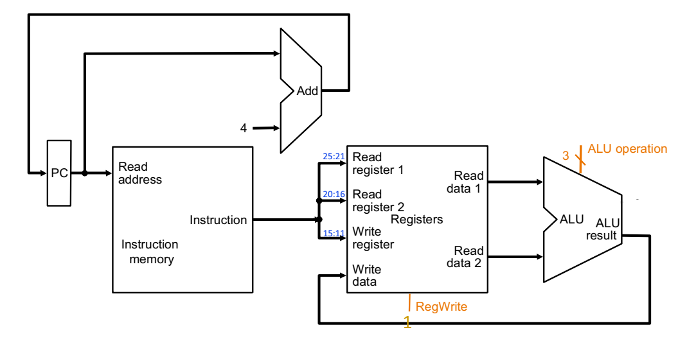
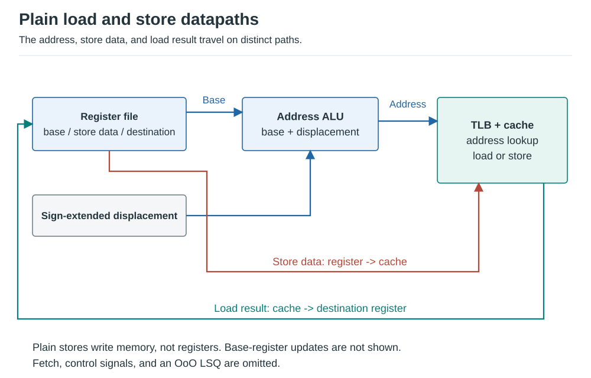

# ISA and Microarchitecture

## Instruction Set Architecture

An ISA is the programmer/compiler-visible interface between software and hardware.

### ISA Scope

Where supported, this contract includes:

- **Instructions and state:** opcodes, formats, addressing modes, data types, registers, and condition codes.
- **Memory and access control:** address space, addressability, alignment, virtual-memory translation controls,
  page permissions, and privilege rules.
- **Control transfers:** calls/returns, exception and interrupt entry/return, and interrupt priority/masking controls.
- **Tasks and concurrency:** state used for OS context switches, hardware-thread contexts, atomics, synchronization,
  and shared-memory ordering for multiprocessors.
- **Power and thermal management:** architecturally exposed status/control registers or instructions, where defined.

The ISA specifies the visible interfaces and behavior, not the OS scheduling algorithm or hidden hardware policies.
An embedded ISA need not provide every facility above; privilege levels and extensions determine what is supported.

### Instruction

An instruction typically contains:

- **opcode:** operation to perform;
- **source operands:** register, immediate, or memory inputs;
- **destination:** where the result is written;
- **control fields:** size, addressing mode, predicate, rounding mode, and similar metadata.

Instruction encoding trades code density against decode simplicity and extensibility.

#### Worked instruction encoding

RISC-V RV32I makes the fields concrete. Its R-type format encodes `ADD x1, x2, x3` as:

| Bits | Field | Encoded value | Meaning |
| --- | --- | --- | --- |
| 31-25 | `funct7` | `0000000` | ADD rather than SUB |
| 24-20 | `rs2` | `00011` | Source register x3 |
| 19-15 | `rs1` | `00010` | Source register x2 |
| 14-12 | `funct3` | `000` | ADD/SUB operation group |
| 11-7 | `rd` | `00001` | Destination register x1 |
| 6-0 | `opcode` | `0110011` | Register-register integer operation |

```text
0000000 | 00011 | 00010 | 000 | 00001 | 0110011 = 0x003100B3
```

Decode obtains two register indices, selects addition, and enables the x1 write. The opcode alone is not the
whole operation: `funct3` and `funct7` refine it. An I-type load instead uses bits 31-20 for a signed immediate;
`LW x1, 12(x2)` adds that immediate to x2 and loads the destination. Store and branch immediates are split across
fields, so a decoder reconstructs them rather than treating every instruction as the R-type layout.
[RISC-V instruction listings][isa-encodings]

### Instruction processing style

| Style | Typical meaning | Example |
| --- | --- | --- |
| 0-address | Operands implicit on a stack | stack machines |
| 1-address | One explicit operand, accumulator implicit | historical accumulators |
| 2-address | One operand is both source and destination | many x86 forms |
| 3-address | Two sources plus independent destination | RISC ALU instructions |

### Memory Organization

Important ISA properties:

- **address space:** number of distinct addresses;
- **addressability:** amount of data per addressable location;
- **alignment:** legal or preferred placement of multi-byte objects;
- **endianness:** byte ordering within multi-byte values.

Most current general-purpose ISAs are byte-addressed. The architectural register width does not by itself determine
physical memory size.

Addressability is distinct from the number of bits used to encode an address:

- **Bit-addressable:** each location identifies one bit.
- **Byte-addressable:** each location identifies one eight-bit byte.
- **Word-addressable:** each location identifies a word, e.g., 32 or 64 bits, depending on the machine.

For a 32-bit-word-addressable memory, addresses `A` and `A+1` identify successive four-byte words, not adjacent bytes.
Byte addressing does not require byte-sized operations: a 64-bit load can read eight consecutive byte locations.

### Registers

Registers exploit temporal locality: recently produced values are likely to be reused. Key design choices include:

- number and width of architectural registers;
- general-purpose vs. special-purpose registers;
- scalar, vector, predicate, and control-register classes.

More architectural registers reduce spills but increase instruction-encoding pressure.

### Programmer-Visible State

Typical visible state:

- PC / instruction pointer;
- architectural registers;
- memory address space;
- flags or condition state where the ISA exposes them;
- privilege and control state.

Microarchitectural structures such as the ROB, physical registers, predictor tables, and cache replacement state
are not part of normal ISA-visible state.

### Instruction Classes

- **Compute:** integer, floating-point, logical, vector, tensor, crypto.
- **Data movement:** load, store, move, gather, scatter.
- **Control flow:** conditional branch, jump, call, return, indirect branch.
- **System:** fences, atomics, privilege, TLB/cache maintenance, exception return.

### Load-Store vs. Register-Memory vs. Memory-Memory

**Load-store architecture:** arithmetic operates on registers; memory is accessed with explicit loads/stores.
RISC-V and classic RISC designs follow this model.

**Register-memory architecture:** an ALU instruction may use one memory operand. x86 is best described this way
for most ordinary integer and floating-point instructions.

**Memory-memory architecture:** an operation can directly use multiple memory operands. VAX is a classic example;
x86 string instructions provide limited memory-to-memory behavior but do not make x86 a pure memory-memory ISA.

**Correction from the source:** treating x86 simply as a memory-memory architecture is too coarse.

### Addressing Modes

Common modes:

- immediate: constant encoded in the instruction;
- register: operand held in a register;
- absolute/direct: an instruction field supplies the memory address, e.g., operand `M[1000]`;
- register indirect: a register supplies the memory address, e.g., operand `M[R1]`;
- memory indirect: a memory location holds the address of the operand, e.g., `M[M[R1]]`;
- base + displacement: `addr = base + offset`;
- indexed: `addr = base + index * scale + offset`;
- PC-relative: target relative to the current instruction address;
- auto-increment/decrement: address use also updates the pointer.

Here `M[a]` denotes the contents of memory at address `a`; these are conceptual modes, not universal ISA syntax.
If `R1=1000`, `M[1000]=2000`, and `M[2000]=42`, the distinction is:

| Operand form | Result |
| --- | --- |
| Immediate `1000` | Constant `1000`, no data-memory access |
| Register `R1` | Register value `1000`, no data-memory access |
| Absolute `M[1000]` | Value `2000` from a fixed address |
| Register indirect `M[R1]` | Value `2000` from the address held in `R1` |
| Memory indirect `M[M[R1]]` | Fetch pointer `2000`, then fetch value `42` |

Register-indirect is base-plus-zero-displacement. Memory-indirect adds a dependent memory lookup, not merely an
address addition; an ISA without that mode implements it with separate loads.

More addressing modes can improve code density but increase decode and address-generation complexity.

They also match different data structures: base + displacement addresses a structure field or stack slot;
scaled indexing addresses `array[i]`; register indirect follows a pointer; auto-increment suits a sequential stream.
Memory indirect can express a pointer stored in memory, at the cost of an extra dependent fetch.
The compiler chooses among legal modes, weighing instruction count/code size against address-generation cost,
register pressure, and scheduling opportunities. More modes create more selection choices, not automatically
better execution on every implementation.

### I/O Interface

Two common architectural mechanisms:

1. **Memory-mapped I/O:** device registers occupy addresses in the memory map. Normal load/store instructions
   access them, subject to device-memory ordering rules.
2. **Port-mapped I/O:** special I/O instructions access a separate I/O space. x86 retains `IN` and `OUT`.

MMIO dominates modern SoCs because it integrates naturally with load/store datapaths and interconnects.

### Simple vs. Complex Instructions

The old RISC/CISC split is useful historically but less useful as a modern binary classification.

Complex instructions may improve code density and reduce frontend bandwidth, but they can require more elaborate
decode and sequencing. Modern x86 CPUs commonly decode complex instructions into simpler internal micro-ops.

Modern RISC ISAs also contain sophisticated vector, matrix, crypto, and compressed-instruction extensions.

String copy is a concrete complex operation, e.g., x86 `REP MOVSB`; simple ADD/XOR primitives expose smaller steps.
The source also illustrates hypothetical linked-list insertion and FFT instructions as more extreme design points,
not claims that every CISC ISA implements them. A complex instruction can simplify compiler sequencing, but hides
internal steps from instruction scheduling: the compiler cannot freely interleave or optimize those steps as it
could with a sequence of simpler operations. Density and optimization granularity pull in different directions.

### Instruction Length

**Fixed-length encoding:**

- simpler fetch alignment and parallel decode;
- predictable instruction boundaries;
- potentially lower code density.
- finite opcode/operand/immediate space; extensions must find spare encodings, repurpose fields, or add formats.

**Variable-length encoding:**

- better code density;
- more complicated boundary detection and decode.

x86 instructions are variable length from 1 to 15 bytes. RISC-V combines fixed 32-bit base instructions with
optional compressed 16-bit instructions, demonstrating that modern ISAs mix design points.

### Uniform Decode

Uniform field positions simplify parallel decode and early register-file access. Non-uniform encodings trade that
simplicity for denser or more flexible instruction formats.

Fixed register-field positions let register reads begin while opcode decode proceeds. A known PC-relative
immediate layout also allows sign extension and candidate target addition in parallel with branch identification;
the target is selected only if decode/control says it is needed. Uniform layouts simplify that parallel work but
may leave unused bits or limit compact encoding choices. Split immediates still need reconstruction.

### RISC vs. CISC

| Traditional RISC tendency | Traditional CISC tendency |
| --- | --- |
| load-store execution | register-memory operations |
| simpler, regular encodings | variable and richer encodings |
| many general registers | historically fewer registers |
| simpler addressing modes | many addressing modes |

**Modern reality:** performance is determined far more by implementation than by the historical label. High-end
RISC and x86 cores both use deep speculation, wide decode/issue, OoO execution, and large memory hierarchies.

### Big Endian vs. Little Endian

For a multi-byte value:

- **little endian:** least-significant byte is stored at the lowest address;
- **big endian:** most-significant byte is stored at the lowest address.

Example: `0x12345678` at address `A`:

```text
Little endian: A:78  A+1:56  A+2:34  A+3:12
Big endian:    A:12  A+1:34  A+2:56  A+3:78
```

Endianness changes byte layout, not the numeric value held in a register.
It does not reverse the order of successive words: if two 32-bit words start at `A` and `A+4`, both endian layouts
keep them at those starting addresses; only the bytes within each word change order.

## Microarchitecture

Microarchitecture implements the ISA under performance, power, area, reliability, and verification constraints.

Major choices include:

- pipeline organization;
- issue width and execution units;
- register renaming and scheduling;
- speculation and branch prediction;
- cache hierarchy and prefetchers;
- memory-controller policy;
- voltage/frequency and power management.
- clock gating to suppress switching in idle units;
- parity/ECC and other fault detection/recovery choices in internal storage.

These are implementation choices unless their controls or effects are explicitly exposed by the ISA/platform.

### Single-Cycle vs. Multi-Cycle Machines

**Single-cycle:** every instruction completes in one long clock cycle. The slowest instruction sets the clock
period, wasting time for short instructions.

**Multi-cycle:** an instruction uses several shorter cycles and can reuse hardware across phases. Different
instructions can take different numbers of cycles.

For the simple multi-cycle design, the clock period must cover the slowest stage, rather than the slowest
whole instruction. Fetch can update an IR and execution can update temporary registers before the final
architectural destination is written. Internal progress is not an additional programmer-visible instruction.
Both elementary designs process one instruction at a time; precise state-update details depend on the design.

Pipelining goes further by overlapping stages from different instructions.

### Datapath and Control

- **Datapath:** registers, ALUs, muxes, shifters, address generators, buses, and memories that transform data.
- **Control:** signals that steer the datapath for the current instruction and machine state.

Hardwired control is fast; microcoded control can simplify implementation of complex instruction sequences.

### Performance Analysis

CPU execution time:

\[
T = \text{Instruction Count} \times \text{CPI} \times \text{Cycle Time}
\]

Equivalent forms:

\[
T = \frac{\text{Instruction Count}}{\text{IPC} \times \text{Clock Frequency}}
\]

Performance optimizations trade among all three terms. A deeper pipeline may improve frequency while increasing
branch-mispredict cost. Wider issue may improve IPC while increasing power and critical-path complexity.

### Instruction Processing

A canonical teaching pipeline uses five stages:

1. `IF`: instruction fetch;
2. `ID/RF`: decode and register read;
3. `EX`: ALU work or effective-address generation;
4. `MEM`: data-memory access;
5. `WB`: writeback.

Real cores have more stages and often split frontend, rename, scheduling, execution, memory, and retirement.

### ALU Datapath



*Figure: Register-file ports, operand multiplexers, ALU, and result writeback; instruction fetch is not shown.*
Source: [ALU data paths.svg][figure-alu] by Lambtron, [CC BY-SA 4.0][figure-license].
White background and display sizing; original drawing retained.

A simple ALU instruction follows the core path:

```text
PC -> instruction fetch -> decode/register read -> ALU -> destination register
```

The next sequential PC is normally `PC + instruction_length`, unless control flow chooses another target.



*Figure: Complete teaching ALU path, including PC + 4 and instruction-selected source/destination registers.*

For the diagram's 32-bit MIPS-style `ADD rd, rs, rt`, the PC addresses instruction memory; fields select `rs`,
`rt`, and `rd`; the control unit selects addition; and `RegWrite=1` writes the sum through the register-file port.
The upper adder computes PC + 4 independently. Source fields select read ports; the destination field selects
the write port. This is a single-instruction teaching datapath, not an OoO core or a requirement that all ISAs
advance their PC by four bytes.

### Load-Store Datapath



*Figure: Plain loads/stores without base-register writeback, with separate address, store-data, and load-result paths.*
*Fetch, control signals, and OoO ordering structures are omitted.*

A load/store adds address generation and a memory access:

```text
base register + displacement -> effective address -> cache/TLB -> load or store data
```

A load writes its fetched value to a destination register. A plain store such as MIPS `SW` or RISC-V `SW` writes
memory without writing a register. This is not universal: pre/post-indexed stores can also update their base register.
For example, AArch64 `STR X0, [X1], #8` stores X0 at the old X1 address, then sets `X1 = X1 + 8`.
With `X0=42` and a valid eight-byte destination at `X1=1000`, memory receives 42 and X1 becomes 1008; X0 is unchanged.
That base-register update needs a writeback path not shown in the plain-store diagram. [Arm store behavior][arm-stores]

Modern OoO cores place memory operations in an LSQ to enforce ordering and support store-to-load forwarding.

#### Worked control choices

For a conventional MIPS-style teaching datapath, `RegDst` selects `rd` versus `rt`, `ALUSrc` selects the second
register operand versus a sign-extended immediate, and `MemToReg` selects ALU versus memory writeback.
Control names and polarities are illustrative; they are not the RISC-V encoding fields above.

| Instruction | RegDst | RegWrite | ALUSrc | MemRead | MemWrite | MemToReg | ALU operation |
| --- | --- | --- | --- | --- | --- | --- | --- |
| `ADD rd, rs, rt` | rd | 1 | Register rt | 0 | 0 | ALU | Add operands |
| `LW rt, offset(rs)` | rt | 1 | Immediate | 1 | 0 | Memory | Add base + offset |
| `SW rt, offset(rs)` | Unused | 0 | Immediate | 0 | 1 | Unused | Add base + offset |

With `rs=1000`, `offset=12`, and `rt=42`, a store computes address `1012` but sends **42** on the separate
store-data path; it does not store the immediate 12. A load from address 1012 sends returned memory data to `rt`.
For the table's plain `SW`, disabling `RegWrite` prevents register modification; `MemWrite` is enabled only for `SW`.

## Interview traps

- ISA width, address width, register width, and physical memory capacity are different concepts.
- x86 is primarily register-memory, not a clean memory-memory architecture.
- RISC vs. CISC is not a useful proxy for modern microarchitectural complexity.
- Fixed-length instructions simplify decode, but compressed extensions can coexist with a RISC ISA.
- CPU time depends on instruction count, CPI/IPC, and clock period; optimizing one can hurt another.

## References

- RISC-V ISA: <https://docs.riscv.org/>
- Intel architecture manuals: <https://www.intel.com/content/www/us/en/developer/articles/technical/intel-sdm.html>
- Intel optimization manuals:
<https://www.intel.com/content/www/us/en/developer/articles/technical/intel64-and-ia32-architectures-optimization.html>

[figure-alu]: https://commons.wikimedia.org/wiki/File:ALU_data_paths.svg
[figure-license]: https://creativecommons.org/licenses/by-sa/4.0/

[isa-encodings]: https://docs.riscv.org/reference/isa/unpriv/rv-32-64g.html
[arm-stores]: https://documentation-service.arm.com/static/680122175b1a8c5a27aa1aa7#page=18
