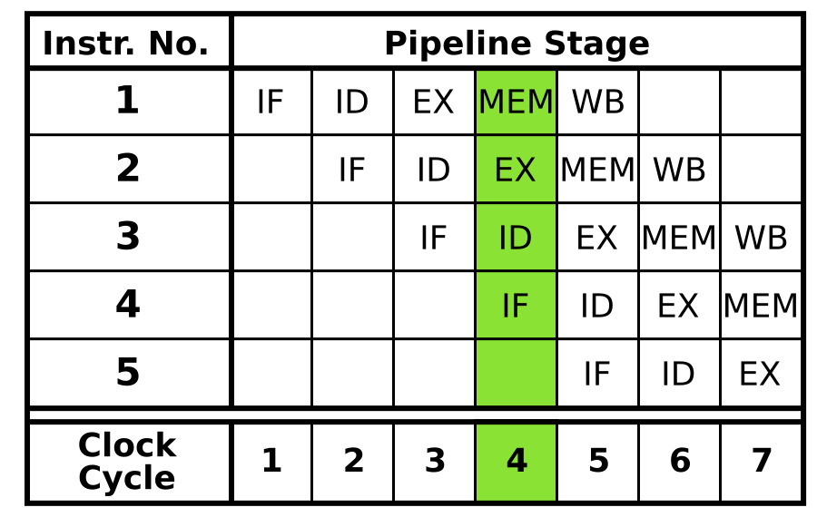
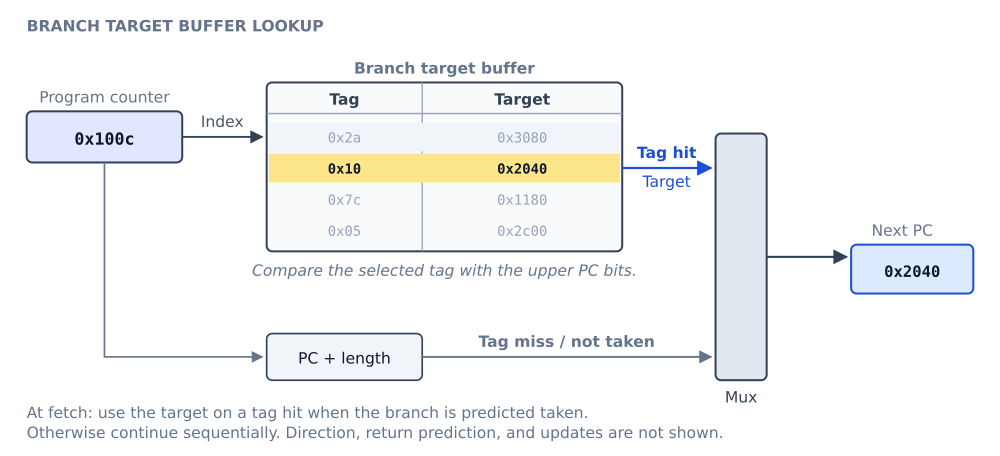
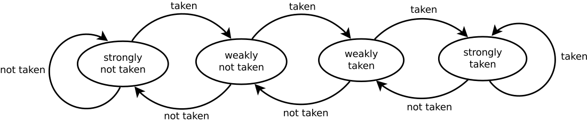
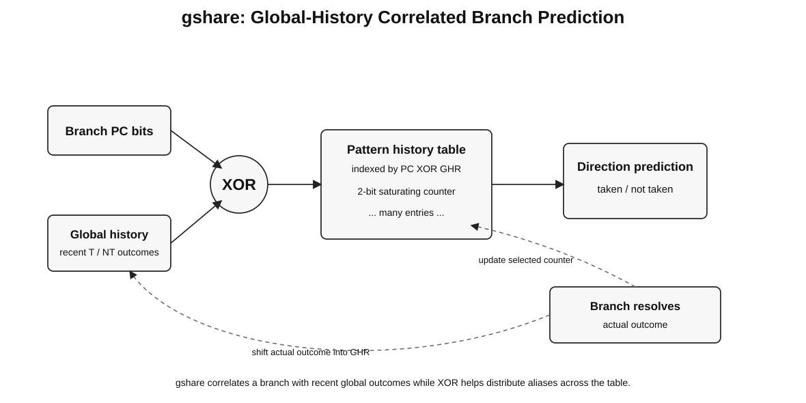
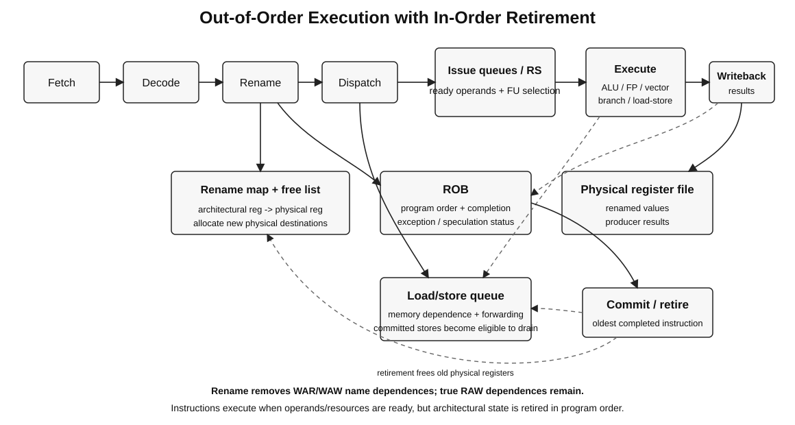

# 02 - Pipelining, Branch Prediction, and Out-of-Order Execution

Source mapping: Chapter 3, sections 3.7-3.7.24.

## 3.7 Instruction Pipelining

Pipelining overlaps different phases of multiple instructions. It primarily improves **throughput**, not the latency
of a single instruction.



*Figure: Original reconstruction of the five-stage teaching pipeline used throughout the source chapter.*

### 3.7.1 Basic Idea

Partition instruction processing into stages and place registers between stages. In the ideal steady state, every
stage works on a different instruction each cycle.

Ideal speedup approaches the number of balanced stages only when hazards, stalls, and register overhead are small.

### 3.7.2 Instruction Processing Cycle

Classic stages:

- `IF`: fetch instruction;
- `ID/RF`: decode and read registers;
- `EX`: execute or generate an address;
- `MEM`: access data memory;
- `WB`: write result.

Real designs frequently separate fetch, decode, rename, dispatch, schedule, execute, writeback, and retirement.

## Data Dependences and Hazards

A **dependence** is a program relationship. A **hazard** is a pipeline situation in which that relationship could
cause incorrect execution if the machine did not stall, forward, rename, or otherwise enforce it.

### 3.7.3 Read After Write - RAW

```text
I1: R2 = R1 + R3
I2: R4 = R2 + R5
```

`I2` needs the value produced by `I1`. RAW is a **true data dependence**.

### 3.7.4 Write After Read - WAR

```text
I1: R4 = R1 + R5
I2: R5 = R2 + R3
```

`I2` must not overwrite the old `R5` before `I1` reads it. WAR is an **anti-dependence** caused by register-name
reuse, not by a true value flow.

### 3.7.5 Write After Write - WAW

```text
I1: R2 = R4 + R7
I2: R2 = R1 + R3
```

The final architectural value must be from `I2`. WAW is an **output dependence**, also caused by name reuse.

**Important:** a simple in-order five-stage pipeline normally encounters RAW hazards but not WAR/WAW hazards.
WAR and WAW become relevant when instructions can read/write or complete out of program order.

### 3.7.6 Handling Data Dependences

Main techniques:

1. stall until the value is available;
2. forward/bypass a produced value directly to a consumer;
3. dynamically schedule independent instructions around the delay;
4. rename registers to eliminate WAR/WAW name dependences;
5. use compiler scheduling where the ISA/compiler contract permits it;
6. overlap latency with another hardware thread.

### 3.7.7 Scoreboarding

The source slide reduces scoreboarding to register valid bits. That is useful as a basic readiness model but is not
classical scoreboarding.

A **scoreboard** centrally tracks:

- functional-unit availability;
- source-operand readiness;
- destination conflicts;
- RAW, WAR, and WAW hazards.

The CDC 6600 scoreboard allowed out-of-order execution while preserving correctness without register renaming.

### 3.7.8 Data Forwarding

A consumer does not always need to wait for a producer to write the register file.

Example in a five-stage pipeline:

```text
I1: ADD R2, R1, R3   # result produced near end of EX
I2: SUB R4, R2, R5   # can receive R2 through EX-to-EX forwarding
```

Forwarding reduces stalls but adds bypass networks, muxes, timing pressure, and dependency-check logic.

A load-use dependence can still require a bubble if load data arrives too late for the next instruction's EX stage.

## Control Dependences

### 3.7.9 Control Dependence

The frontend must choose a next fetch PC before many branches are resolved. Waiting for every branch would destroy
pipeline utilization, so processors predict control flow and execute speculatively.

### 3.7.10 Branch Types

| Type | Direction | Target source |
| --- | --- | --- |
| Conditional branch | taken or not taken | usually PC-relative immediate |
| Direct jump | taken | encoded target / PC-relative offset |
| Direct call | taken | encoded target / PC-relative offset |
| Return | taken | predicted with return-address stack |
| Indirect jump/call | taken | register or memory-derived target |

A frontend must predict both **direction** and **target** early enough to keep instruction fetch supplied.

### 3.7.11 Handling Control Dependences

From simplest to most aggressive:

- stall until resolution;
- static prediction;
- compiler-filled delay slots;
- dynamic branch prediction;
- predication for short control-flow regions;
- multipath execution, rarely used broadly because of cost.

### 3.7.12 Branch Delay Slots

A delay-slot ISA defines one or more instructions after a branch that execute regardless of branch direction.
This exposed pipeline timing to software.

Historical examples include classic MIPS and SPARC. Modern high-performance ISAs generally avoid architectural
branch delay slots because pipeline depth and implementation vary across generations.

### 3.7.13 Fine-Grained Multithreading

Fine-grained multithreading switches the issuing thread frequently, often every cycle, so one thread's latency can
be hidden by useful work from others.

Benefits:

- tolerates branch and memory latency;
- reduces the need for aggressive single-thread speculation.

Costs:

- each thread needs architectural context;
- single-thread latency may worsen;
- there must be enough runnable threads.

GPUs use a related idea at warp granularity: the scheduler selects among many ready warps.

## Branch Prediction

### 3.7.14 What Must Be Predicted?



*Figure: Original reconstruction of the source BTB/direction-predictor concept, expanded with a return stack.*

At fetch time, the machine wants to know:

1. whether the fetched bytes contain control flow;
2. the direction of a conditional branch;
3. the target of a taken branch;
4. the target of a return.

Common structures:

- **BTB:** caches branch PCs and target addresses;
- **direction predictor:** predicts conditional taken/not-taken;
- **RAS/RSB:** predicts return targets using call/return nesting;
- **indirect-target predictor:** predicts one of multiple possible indirect targets.

A misprediction flushes wrong-path work and redirects fetch. The performance penalty grows with the time from
prediction to resolution and with frontend/backend width.

### 3.7.15 Branch Prediction Schemes

**Static:**

- always taken / always not taken;
- backward taken, forward not taken;
- compiler or profile-guided hints.

**Dynamic:**

- last-outcome predictor;
- two-bit saturating counters;
- local-history predictors;
- global-history predictors;
- gshare-like predictors;
- hybrid/tournament predictors;
- TAGE-family predictors;
- neural/perceptron-style predictors.

### 3.7.16 Two-Bit Counter Predictor



*Figure: Original reconstruction of the source four-state machine.*

A two-bit saturating counter provides hysteresis. Strong states usually require two opposite outcomes before the
predicted direction changes.

**Correction from the source:** "changes prediction after two consecutive mistakes" is only an intuition. The
exact state transition depends on the starting state.

### 3.7.17 Correlated Branch Prediction



*Figure: Reconstruction of the source global-history/XOR predictor, labeled explicitly as gshare.*

A two-level predictor uses branch history to select a prediction counter.

- **Local history:** history of one branch.
- **Global history:** outcomes of recent branches across the program.
- **gshare:** indexes a pattern table with `PC XOR global_history` to reduce destructive aliasing.

The source slides combine correlated prediction and gshare. They are related but distinct concepts.

#### Worked example: one branch helps predict another

Consider the source's two consecutive conditions:

```text
if (d == 0): d = 1
if (d == 1): execute the second if-body
```

The compiled branches **skip** their respective if-bodies: `b1` branches when `d != 0`; `b2` branches when
`d != 1`. Taken/not-taken therefore refers to the machine branch, not the truth of the source-level condition.

| Initial `d` | `b1` | `d` before `b2` | `b2` |
| --- | --- | --- | --- |
| 0 | Not taken | 1 | Not taken |
| 1 | Taken | 1 | Not taken |
| 2 | Taken | 2 | Taken |

If `b1` is not taken, `b2` is always not taken: the first if-body has just set `d = 1`. If `b1` is taken, either
outcome is possible for `b2`. Global history exposes this correlation; it does not make every prediction certain.

An **`(m, n)` correlating predictor** uses the last `m` branch outcomes to select among `2^m` banks of `n`-bit
counters, with branch-address bits selecting an entry within a bank. A `(2, 2)` predictor has four history banks
(`00`, `01`, `10`, `11`), each holding two-bit counters. The selected counter is trained on the actual outcome,
which is also shifted into history. This banked design is distinct from gshare's XOR indexing.

#### Modern interview note: TAGE

TAGE uses multiple tagged predictor tables indexed with different geometric history lengths. It chooses the
longest-history matching entry and falls back to shorter-history/base predictors when needed.

Why it matters:

- captures both short- and long-range correlations;
- controls aliasing with tags;
- is a useful mental model for modern high-accuracy conditional prediction.

Do not assume a commercial CPU implements the academic TAGE design exactly unless the vendor documents it.

### Branch target prediction

Direction accuracy alone is insufficient. Frontends also need low-latency target prediction for:

- direct taken branches;
- indirect jumps and calls;
- returns.

Modern indirect predictors may use branch history. Returns are commonly handled by a hardware return stack.

## 3.7.18 Multi-Cycle Execution

Different operations have different latencies:

- integer ALU: often short;
- multiply/divide: longer;
- floating-point/vector: multi-cycle and frequently pipelined;
- loads: variable because of the memory hierarchy.

Multiple independent functional units let unrelated instructions execute while a long-latency operation remains
in flight.

## Exceptions, Precise State, and Retirement

### 3.7.19 Exceptions vs. Interrupts

**Exception:** synchronous with an instruction, such as page fault, illegal instruction, divide fault, or breakpoint.

**Interrupt:** asynchronous external or timer/device event delivered between architectural instructions.

Some architectures use broader terminology, but synchronous vs. asynchronous is the useful interview distinction.

### 3.7.20 Precise Exceptions

At the architectural exception boundary:

1. all older instructions appear completed;
2. the faulting instruction is identified precisely;
3. no younger instruction has modified architectural state.

Precise state enables restart, debugging, virtual memory, and robust OS exception handling.

### 3.7.21 Reorder Buffer - ROB



*Figure: Original reconstruction of a modern OoO pipeline, preserving the source's ROB/renaming intent.*

The ROB tracks instructions in program order while execution may complete out of order.

Typical ROB metadata:

- destination mapping or completion information;
- exception status;
- branch/speculation state;
- age/order information.

Instructions **retire/commit in order** when the oldest instruction has completed without an unresolved exception.

### 3.7.22 Register Renaming

Architectural registers are names. False dependences occur when unrelated values reuse the same name.

Rename maps architectural names to a larger pool of physical destinations:

```text
Architectural R5 -> Physical P37
later write R5   -> Physical P82
```

Effects:

- removes WAR anti-dependences;
- removes WAW output dependences;
- preserves RAW true dependences by linking consumers to the producer's physical register or tag.

The source describes renaming directly to ROB entries, which is historically valid. Many modern OoO cores instead
use a separate physical register file while the ROB primarily provides ordering and retirement.

### 3.7.23 In-Order Pipeline with ROB

An ROB does **not** by itself imply out-of-order issue. In this teaching design, instructions start execution in
program order, but different functional-unit latencies allow them to **finish out of order**.

```text
fetch -> decode / dispatch -> execution units -> completion / ROB -> retire
         in program order     variable latency   may be unordered   in order
```

| Phase | What happens |
| --- | --- |
| Decode / dispatch | Allocate an ROB entry; wait for operands and an available execution unit. |
| Execute | Start instructions in order; operations of different latencies may overlap. |
| Complete | Write the result and exception status to the instruction's ROB entry. |
| Retire | At the ROB head, commit a completed, non-faulting instruction; handle faults precisely. |

An independent short add can finish before an older long multiply, but must wait behind it in the ROB to retire.
If the next instruction cannot start, younger instructions cannot bypass it at dispatch in this design.
The dynamically scheduled design below removes that issue-order restriction. Stores become architecturally
committed at retirement; their data may drain from a store buffer later under the memory-ordering rules.

### 3.7.24 Dynamic Instruction Scheduling - Tomasulo

Tomasulo-style scheduling tracks operand readiness with producer tags and wakes consumers when values become
available.

Core concepts:

- reservation stations or issue queues buffer waiting operations;
- rename tags identify producers;
- completed results wake dependent consumers;
- independent operations may bypass stalled older operations;
- a load/store queue handles memory dependences and ordering.

A classic common-data bus broadcasts results. Modern designs use more distributed wakeup/select and bypass
networks because a single global broadcast does not scale well.

A modern ROB-based organization is:

```text
fetch -> decode -> rename -> dispatch -> issue -> execute -> writeback -> retire
                 program order          out of order            program order
```

The frontend establishes program order and renames dependencies. The scheduler chooses ready instructions based on
operand and resource availability. Retirement restores the appearance of sequential architectural execution.
Classic Tomasulo did not include an ROB; adding one supports speculation and precise in-order retirement.

#### Reservation-station walkthrough

The source's six-instruction example uses producer tags `x`, `a`, `b`, `c`, `y`, and `d`:

```text
x: R3  = R1 * R2
a: R5  = R3 + R4
b: R7  = R2 + R6
c: R10 = R8 + R9
y: R11 = R7 * R10
d: R5  = R5 + R11
```

Initially, `R1=1`, `R2=2`, `R4=4`, `R6=6`, `R8=8`, and `R9=9`. Each source operand is stored as either
a ready value or a tag naming its producer. Capture source mappings **before** changing the destination mapping.

Logical snapshot after all six instructions have been renamed, before any result broadcasts:

| Tag | Destination | First operand | Second operand | Ready to execute? |
| --- | --- | --- | --- | --- |
| `x` | `R3` | 1 | 2 | Yes |
| `a` | `R5` | Wait for `x` | 4 | No |
| `b` | `R7` | 2 | 6 | Yes |
| `c` | `R10` | 8 | 9 | Yes |
| `y` | `R11` | Wait for `b` | Wait for `c` | No |
| `d` | `R5` | Wait for `a` | Wait for `y` | No |

This is a dependency snapshot, not a cycle-accurate timing claim. It assumes enough reservation stations;
actual execution also depends on functional-unit and result-bus availability.

```text
x (1 * 2) -> a (x + 4) -----------------> d (a + y) -> final R5
b (2 + 6) ----+
              +-> y (b * c) ------------+
c (8 + 9) ----+
```

1. Allocate a free reservation station and record values/tags; stall allocation if none is free.
2. Operations `x`, `b`, and `c` are ready; `b` and `c` may bypass the older blocked operation `a`.
3. Broadcast `(x, 2)`: `a` captures `2`, becomes ready, and can produce `6`.
4. Broadcasts `(b, 8)` and `(c, 17)` supply both operands of `y`, which can produce `136`.
5. Broadcasts `(a, 6)` and `(y, 136)` wake `d`, which produces the final `R5 = 142`.

Steps 3 and 4 may interleave; dependencies, not this list's order, determine readiness. Each result must win
result-bus arbitration before it broadcasts, and a tag must not be reused while consumers still need its result.

**Why renaming matters:** after allocating `d`, the latest producer for `R5` is `d`, but `d`'s first source still
refers to `a`. In classic Tomasulo, broadcasting `(a, 6)` updates waiting consumers but not architectural `R5`,
whose current tag no longer matches `a`. Broadcasting `(d, 142)` finally updates `R5`. Thus the two writes do not
create a WAW hazard, and the true RAW dependence from `a` to `d` remains intact.

With an ROB, results instead update their assigned speculative destinations and retire in program order.
Load/store buffers similarly hold memory operations until their addresses and required data are ready;
memory-dependence checks still apply, and speculative stores cannot become visible before commitment.

## Interview checklist

Be able to explain, without notes:

- why pipelining increases throughput but introduces hazards;
- why RAW is real while WAR/WAW are name dependences;
- forwarding vs. stalling;
- BTB vs. direction predictor vs. return stack;
- two-bit counter and gshare;
- why deeper pipelines make branch prediction more important;
- ROB vs. rename map vs. PRF vs. reservation stations;
- how OoO execution still delivers precise exceptions;
- why loads/stores need an LSQ even after register renaming.

## References

- Intel optimization manuals:
<https://www.intel.com/content/www/us/en/developer/articles/technical/intel64-and-ia32-architectures-optimization.html>
- Intel architecture manuals: <https://www.intel.com/content/www/us/en/developer/articles/technical/intel-sdm.html>
- A. Seznec, *A New Case for the TAGE Branch Predictor*:
  <https://www.cs.cmu.edu/~18742/papers/Seznec2011.pdf>
- D. Jimenez and C. Lin, *Dynamic Branch Prediction with Perceptrons*:
  <https://www.cs.utexas.edu/~lin/papers/hpca01.pdf>
