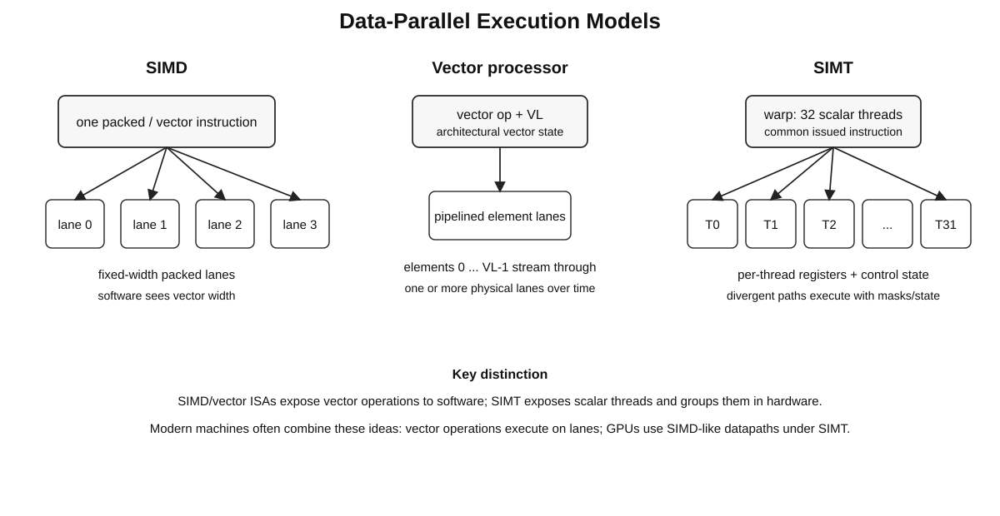
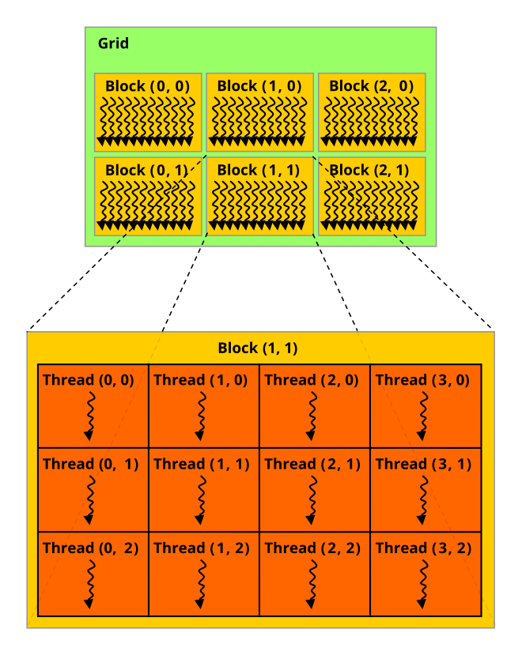

# 03 - Dataflow, SIMD, Vector Processing, and GPUs

Source mapping: Chapter 3, sections 3.8-3.9.7.

## 3.8 Data Flow

A dataflow representation makes dependencies explicit: operations are nodes and values are edges. A node may fire
when all required inputs are ready.

Compared with a control-flow machine:

- no single sequential instruction stream is required conceptually;
- execution order is constrained mainly by dependencies;
- independent nodes can execute asynchronously;
- synchronization is represented explicitly.

Advantages:

- exposes irregular parallelism;
- naturally expresses producer/consumer relationships.

Disadvantages of a pure dataflow machine:

- precise state and debugging are difficult;
- tag matching and token storage add overhead;
- dynamic data structures and side effects complicate execution;
- locality can be poor unless the implementation actively manages it.

Modern OoO cores use a **local dataflow engine** inside a conventional ISA: the scheduler wakes instructions when
operands become ready while the ROB preserves architectural order.

## 3.9 Data Parallelism

Data parallelism applies the same operation to many independent elements.



*Figure: Original reconstruction contrasting SIMD, vector, and SIMT execution.*

### Flynn taxonomy

| Class | Meaning | Typical example |
| --- | --- | --- |
| SISD | single instruction, single data | scalar sequential core |
| SIMD | single instruction, multiple data | vector/SIMD engine |
| MISD | multiple instruction, single data | rare as a general model |
| MIMD | multiple instruction, multiple data | multicore CPU |

SIMT is not a separate Flynn category. It is a programming/execution abstraction implemented with SIMD-like
hardware scheduling across groups of threads.

## 3.9.1 SIMD Processing

A SIMD instruction performs one operation over multiple data elements.

Examples:

```text
scalar:  C0 = A0 + B0
SIMD:    [C0 C1 C2 C3] = [A0 A1 A2 A3] + [B0 B1 B2 B3]
```

SIMD benefits workloads with regular, independent element operations. Efficiency drops when masks leave lanes
inactive or when memory access is irregular.

### Array vs. vector interpretation

The original notes distinguish time-space duals:

- **array processor:** multiple processing elements operate in parallel in space;
- **vector processor:** pipelined functional units process vector elements over time.

Modern implementations often combine both ideas.

## 3.9.2 Vector Processor

A vector processor exposes vector instructions and vector state directly to software.

Typical architectural state:

- vector registers;
- vector length (`VL`);
- vector masks/predicates;
- vector element width and grouping state;
- optional restart state such as `VSTART`.

A vector add conceptually does:

```text
for i in active_elements:
    V3[i] = V1[i] + V2[i]
```

Why vectors are efficient:

- one instruction represents many operations;
- fewer instruction fetch/decode operations;
- regular memory access supports banking and prefetching;
- element pipelines can sustain high throughput;
- masks replace many short branches.

## 3.9.3 Vector Processing Deep Dive

### Vector length and strip mining

If the dataset is longer than the hardware vector capacity, process it in chunks:

```text
while remaining > 0:
    VL = min(remaining, max_vector_length)
    operate on VL elements
    advance pointers
```

This is **strip mining**.

Vector-length-agnostic ISAs such as RISC-V V and Arm SVE encourage code that does not assume one fixed physical
vector width.

### Masked execution

A predicate/mask register controls which elements participate:

```text
mask[i] = (V0[i] != 0)
V1[i] = mask[i] ? V0[i] * V2[i] : V1[i]
```

Masking is a form of predicated execution and avoids some control-flow branches.

### Stride, gather, and scatter

- **unit stride:** consecutive elements;
- **constant stride:** fixed distance between elements;
- **gather:** load vector elements from indexed addresses;
- **scatter:** store vector elements to indexed addresses.

Gather/scatter support irregular structures but is usually less efficient than unit-stride access.

### Memory banking

Vector processors need enough memory bandwidth to feed many element operations. Interleaved banks let successive
addresses map to independent banks so several accesses can overlap.

Bank conflicts occur when multiple accesses in the same cycle target the same bank.

### Chaining

A producer vector pipeline can forward element results directly to a dependent consumer pipeline before the full
vector completes. This is analogous to scalar forwarding at vector-element granularity.

## 3.9.4 Graphics Processing Unit

The original statement "a GPU is a SIMD (SIMT) machine" is directionally useful but too compressed.

A modern GPU presents a **threaded SIMT programming model**. Hardware groups threads into execution groups and
issues their instructions over SIMD-like datapaths.

For NVIDIA CUDA:

- thread = programmer-visible scalar execution context;
- block = cooperating group of threads;
- grid = collection of blocks for a kernel launch;
- warp = hardware execution group of 32 threads.



*Figure: Original reconstruction based on the current CUDA programming model.*

### SIMT vs. SIMD

SIMD exposes a vector operation explicitly to software. SIMT exposes scalar threads; hardware dynamically groups
threads and executes them together.

Each SIMT thread has its own logical registers and control flow, but threads in a warp share execution resources.

### Branch divergence

If threads in one warp take different control-flow paths, the hardware must execute the required paths while
masking threads that are inactive on each path.

Divergence is a performance concern, not normally a correctness problem.

### Independent Thread Scheduling

Since NVIDIA Volta, threads in a warp have more independent scheduling state than older lockstep models exposed.
Code must not assume implicit warp-wide synchronization where explicit synchronization is required.

### Latency hiding

GPUs tolerate long memory and execution latency by maintaining many resident warps and switching issue to ready
warps.

This differs from a CPU's emphasis on minimizing latency for a smaller number of threads with speculation and OoO
execution.

### Memory coalescing

A warp's memory references are most efficient when thread addresses can be combined into a small number of memory
transactions.

Good data layout therefore matters as much as arithmetic parallelism.

### Worked example: CPU vs. CUDA matrix addition

For two row-major `n x n` matrices, compute `C[row, col] = A[row, col] + B[row, col]`.
The CPU loops over elements; CUDA assigns one element to each thread. These teaching snippets assume positive
dimensions, index arithmetic that fits in `int`, and separate, sufficiently sized input/output arrays.

CPU baseline:

```cpp
void matrix_add_cpu(const float* a, const float* b, float* c, int n) {
    for (int row = 0; row < n; ++row) {
        for (int col = 0; col < n; ++col) {
            int index = row * n + col;
            c[index] = a[index] + b[index];
        }
    }
}
```

CUDA kernel:

```cpp
__global__ void matrix_add(const float* a, const float* b, float* c, int n) {
    int col = blockIdx.x * blockDim.x + threadIdx.x;
    int row = blockIdx.y * blockDim.y + threadIdx.y;
    if (row < n && col < n) {
        int index = row * n + col;
        c[index] = a[index] + b[index];
    }
}
```

Host launch, with `a`, `b`, and `c` pointing to allocated device-accessible arrays and inputs already initialized:

```cpp
dim3 block(16, 16);
dim3 grid((n + 15) / 16, (n + 15) / 16);
matrix_add<<<grid, block>>>(a, b, c, n);
cudaDeviceSynchronize();
```

Each block covers a `16 x 16` tile. For `n = 17`, the grid is `2 x 2`; bounds checks discard excess threads.
For block `(1, 0)`, thread `(0, 3)` writes row `3`, column `16`, at offset `3 * 17 + 16 = 67`.
Adjacent x-lanes access adjacent columns. No inter-thread synchronization is needed because outputs are disjoint.

### Worked example: SAXPY with a grid-stride loop

SAXPY means **single-precision `a * x + y`**: update every `y[i] = a * x[i] + y[i]`.
Unlike the matrix example, each thread can process several elements, separated by the grid's total thread count.

```cpp
__global__ void saxpy(int n, float a, const float* x, float* y) {
    int index = blockIdx.x * blockDim.x + threadIdx.x;
    int stride = blockDim.x * gridDim.x;
    for (int i = index; i < n; i += stride) {
        y[i] = a * x[i] + y[i];
    }
}
```

With eight total threads and `n = 20`, thread `0` handles indices `0, 8, 16`; thread `3` handles `3, 11, 19`.
Different threads never update the same element, and neighboring threads access neighboring elements each iteration.

Host-side lifecycle using managed memory:

```cpp
constexpr int n = 1000;
constexpr int threads = 256;
float* x = nullptr;
float* y = nullptr;
cudaMallocManaged(&x, n * sizeof(float));
cudaMallocManaged(&y, n * sizeof(float));
for (int i = 0; i < n; ++i) {
    x[i] = 1.0f;
    y[i] = 2.0f;
}
int blocks = (n + threads - 1) / threads;
saxpy<<<blocks, threads>>>(n, 2.0f, x, y);
cudaDeviceSynchronize();
// Each y[i] is now 4.0f; inspect it on the CPU before freeing the arrays.
cudaFree(y);
cudaFree(x);
```

These are CUDA C++ fragments, not standalone programs; host fragments belong inside a function and require
`<cuda_runtime.h>`. They assume successful CUDA calls to keep the execution model visible. Real code must check
allocation results before dereferencing pointers, `cudaGetLastError()` after each launch, and synchronization/free
return values. Synchronize successfully before the CPU reads managed-memory results or releases the arrays.
No CPU-side loop over GPU threads is needed: the CUDA runtime launches them.

## 3.9.5 From GTX 285 to Modern GPU Architecture

The GTX 285 material in the source is historically useful but obsolete for current interview preparation. Its main
lessons remain valid:

- threads are grouped into warps;
- many warps reside on an SM to hide latency;
- register capacity limits resident thread contexts;
- execution resources are shared by threads in a warp.

For modern NVIDIA architecture, use the **Streaming Multiprocessor (SM)** as the unit of reasoning:

```text
GPU
  -> many SMs
       -> warp schedulers / issue logic
       -> scalar and vector ALUs
       -> Tensor Cores
       -> load/store units
       -> large register file
       -> shared memory + L1/texture cache
  -> shared L2
  -> HBM
```

The exact SM resource counts vary by compute capability. Do not memorize one generation's counts as universal.

### Current NVIDIA interview note - Rubin era

As of 2026, NVIDIA Vera Rubin is in production. The CUDA programming model still uses 32-thread warps and the
same core SIMT concepts above. Current platform changes worth knowing are:

- Rubin uses HBM4 and sixth-generation NVLink;
- Blackwell remains highly relevant as the previous deployed generation, using HBM3E and NVLink 5;
- thread-block clusters, shared memory, Tensor Cores, and asynchronous data movement remain important concepts;
- exact SM counts, cache sizes, and throughput numbers are product-specific and should not be treated as invariants.

For interviews, know the execution model first; memorize product numbers only when the role specifically demands it.

## 3.9.6 Very Long Instruction Word - VLIW

VLIW moves scheduling responsibility toward the compiler. One wide instruction encodes several independent
operations intended for different functional units.

Advantages:

- simpler dynamic scheduling hardware;
- predictable issue structure;
- attractive when parallelism is statically visible.

Disadvantages:

- compiler must find enough independent work;
- code can be tied to a particular machine width/latency model;
- NOPs waste instruction bandwidth when slots cannot be filled;
- variable-latency operations and cache misses are difficult to schedule statically.

VLIW ideas remain important in DSPs and accelerator architectures, even though high-end CPUs usually prefer
dynamic scheduling.

## 3.9.7 Loop Unrolling

Loop unrolling replicates a loop body several times per iteration.

Benefits:

- fewer branch and loop-control instructions;
- more independent operations visible to the scheduler/compiler;
- better software pipelining and vectorization opportunities.

Costs:

- larger code footprint and instruction-cache pressure;
- cleanup code for iteration counts not divisible by the unroll factor;
- excessive unrolling can increase register pressure.

Example:

```c
for (int i = 0; i < n; i += 4) {
    c[i + 0] = a[i + 0] + b[i + 0];
    c[i + 1] = a[i + 1] + b[i + 1];
    c[i + 2] = a[i + 2] + b[i + 2];
    c[i + 3] = a[i + 3] + b[i + 3];
}
```

## Interview checklist

Be able to explain:

- control-flow execution vs. dataflow scheduling;
- SIMD vs. vectors vs. SIMT;
- strip mining, masks, gather/scatter, and banking;
- why GPUs use many resident warps;
- divergence and memory coalescing;
- programming model vs. execution model;
- why VLIW shifts complexity from hardware to the compiler;
- how loop unrolling exposes ILP but can hurt code size and register pressure.

## References

- CUDA Programming Guide: <https://docs.nvidia.com/cuda/cuda-programming-guide/>
- Blackwell Tuning Guide: <https://docs.nvidia.com/cuda/blackwell-tuning-guide/>
- NVIDIA Rubin architecture:
  <https://developer.nvidia.com/blog/inside-nvidia-rubin-gpu-architecture-powering-the-era-of-agentic-ai/>
- NVIDIA Vera Rubin production announcement:
  <https://nvidianews.nvidia.com/news/vera-rubin-full-production-agentic-ai-factory>
- RISC-V Ratified Specifications: <https://docs.riscv.org/>
