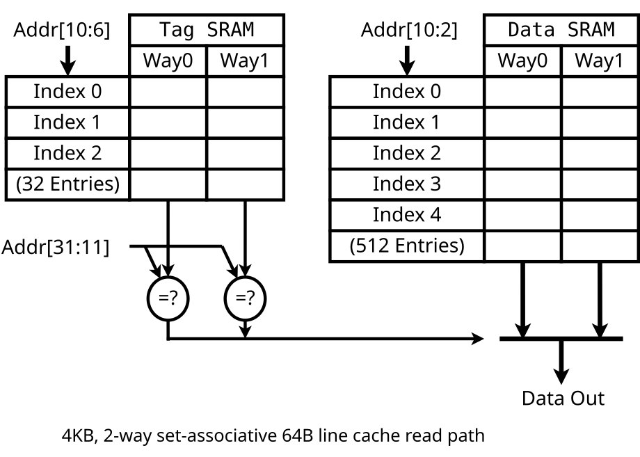
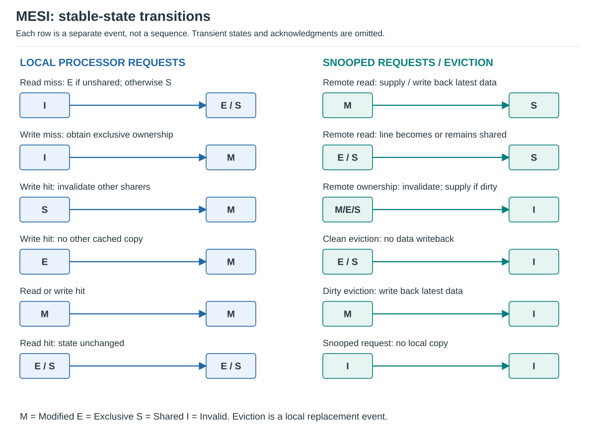
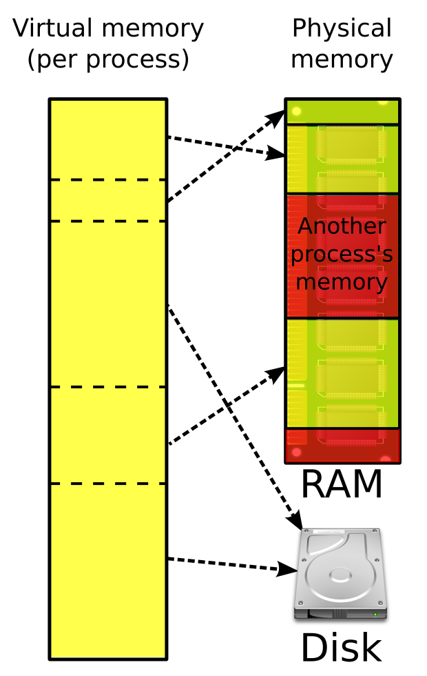

# Caches, Coherence, and Virtual Memory

## Caches

A cache exploits **temporal locality** and **spatial locality** to reduce average memory-access latency and reduce
traffic to lower memory levels.

For an L1 lookup followed by lower-level service on a miss:

\[
AMAT = H_1 + m_1 \times P_1
\]

`H1` is L1 hit/lookup time, `m1` is the L1 miss fraction, and `P1` is the **additional miss penalty after**
the L1 lookup, not total end-to-end miss latency. For `H1=1 ns`, `m1=0.1`, and `P1=10 ns`, AMAT is
`1 + 0.1*10 = 2 ns`. Equivalently, `0.9*1 + 0.1*11 = 2 ns`; do not add the L1 time twice.

For a serial hierarchy, expand `P1 = H2 + m2*P2`, where `m2` is the **local** L2 miss rate conditional on
reaching L2. Thus `AMAT = H1 + m1*(H2 + m2*P2)`. Overlapping accesses, queueing, and nonblocking behavior require
a more detailed model; this is the basic average service-time convention.

### Set Associativity



*Figure: A 4 KiB, two-way cache with 64-byte lines and 32-bit addresses; tag and data arrays are read together.*
*The data array selects four-byte words. Valid-bit checks and miss handling are omitted.*
Source: [Cache,associative-read.svg][figure-cache] by A5b, [CC BY-SA 3.0][figure-license].
White background and display sizing; original drawing retained.

An address is split into:

- **block offset:** byte within a cache line;
- **set index:** selects a set;
- **tag:** identifies which memory block occupies a way.

For a cache with capacity `C`, line size `B`, and associativity `A`:

\[
\text{sets} = \frac{C}{B \times A}
\]

Higher associativity reduces conflict misses but increases hit latency, tag checks, area, and replacement complexity.

### Direct-Mapped and Fully Associative

- **Direct mapped:** one possible location per block; one way per set.
- **N-way set associative:** block can occupy any of `N` ways in its indexed set.
- **Fully associative:** any block can occupy any line; effectively one set.

Direct-mapped caches are simple and fast but vulnerable to pathological conflicts.

#### Worked address and placement example

Use the chapter's byte-addressed 256-byte memory and a 64-byte cache with 8-byte lines, ignoring metadata capacity.
Addresses are 8 bits wide; the cache holds eight lines.

| Organization | Sets x ways | Address fields, high to low | Placement of memory blocks 0 and 8 |
| --- | --- | --- | --- |
| Direct mapped | 8 x 1 | 2 tag + 3 index + 3 offset bits | Both need set 0's only way |
| Two-way | 4 x 2 | 3 tag + 2 index + 3 offset bits | Both fit in different ways of set 0 |
| Fully associative | 1 x 8 | 5 tag + 0 index + 3 offset bits | Any two cache lines |

Memory **block** 8 starts at byte address `64`, not byte address `8`. For direct mapping:

```text
byte address  0 = 00000000 -> tag 00, index 000, offset 000
byte address 64 = 01000000 -> tag 01, index 000, offset 000
byte address 77 = 01001101 -> tag 01, index 001, offset 101
```

Address `77` selects set 1, matches tag 1, and reads byte 5 of that line. Alternating addresses `0` and `64`
thrashes a direct-mapped cache; the two-way cache retains both after their compulsory fills.

### Cache Address Translation

#### PIPT - physically indexed, physically tagged

Translation completes before cache lookup. It avoids virtual alias problems but places TLB translation on the hit
path unless other optimizations are used.

#### VIVT - virtually indexed, virtually tagged

Fast lookup, but difficult because of:

- **synonyms:** different virtual addresses map to the same physical address;
- **homonyms:** the same virtual address in different address spaces maps to different physical addresses;
- coherence and context-switch complexity.

ASIDs help with homonyms but not the fundamental synonym problem.

A VIVT cache without address-space tags may need a flush on a context switch so the incoming process cannot
reuse another process's same-VA line. Even with ASIDs, changing a VA-to-PA mapping requires appropriate cache
maintenance: an old virtually tagged line must not supply data from the former physical page. Dirty lines may
need cleaning before invalidation. TLB invalidation alone does not remove stale virtual cache data; exact
maintenance and synonym handling are architecture-specific.

#### VIPT - virtually indexed, physically tagged

The set lookup begins using virtual-address bits while the TLB translates the virtual page number. The physical tag
is compared after translation.

A common design constraint is to keep all index bits within the page offset so virtual and physical indexing agree:

\[
\text{cache size} \leq \text{page size} \times \text{associativity}
\]

This is a design rule for straightforward synonym-safe VIPT L1 caches, not a universal law for every implementation.

### Inclusive, Exclusive, and Non-Inclusive Caches

- **Inclusive:** every line in an upper cache is also present in the lower inclusive level.
- **Exclusive:** a line resides in only one selected level at a time.
- **Non-inclusive/non-exclusive:** neither relationship is guaranteed.

Inclusion can simplify snoop filtering because a lower-level directory or tag array can represent upper-level
presence. Exclusivity increases effective capacity but complicates movement and coherence.

### Cache Writes

**Write-through:** update the next level on each write.

- simpler recovery and some coherence designs;
- high lower-level bandwidth demand;
- usually paired with a write buffer.

**Write-back:** modify only the cache line and write it to the next level on eviction or coherence action.

- lower write traffic;
- requires dirty state and more complex coherence/recovery.

### Allocation on a Write Miss

- **Write allocate:** fetch/allocate the line, then update it.
- **No-write allocate:** send the write downward without filling this cache.

Common pairings:

- write-back + write-allocate;
- write-through + no-write-allocate.

They are conventions, not mandatory combinations.

Allocating usually fetches a whole line even for one small store, adding transfer/ownership cost but enabling
later accesses and combining subsequent writes. No-write-allocate can avoid that fill and pollution when a
stream writes each location only once and will not reread it soon. Future reuse favors allocation. Full-line
stores and specialized write-combining paths can avoid unnecessary reads; ordinary allocation is not a universal
requirement to transfer old data in every implementation.

### Classification of Cache Misses

Classify **actual cache misses**, handling first references before the other categories. One explicit classic
3C convention uses an equal-capacity, equal-line-size fully associative **LRU** shadow cache on the same trace:

- **compulsory:** first access to a block;
- **capacity:** a non-first reference that also misses in that fully associative reference cache;
- **conflict:** a remaining miss where the reference cache hits, exposing restricted-placement effects.

This is a stated reference-model convention, not a replacement-policy-independent classification. The source
instead uses fully associative **optimal replacement** to define an ideal capacity baseline. To isolate
replacement quality, compare the chosen fully associative real policy with that optimal baseline; do not call
every residual miss pure placement conflict when replacement policies differ. [Cache reference models][cache-models]

For a two-line cache, trace `A,B,C,A` makes the last A a capacity miss under the LRU reference. If A and C collide
in a two-line direct-mapped cache, `A,C,A` makes the last A a conflict miss: a two-line fully associative cache
retains both. The first references in either trace are compulsory, not also capacity misses.

In multiprocessors, add a practical fourth category:

- **coherence miss:** another agent's write or ownership request invalidated the line.

### Improving Cache Performance

Reduce miss rate:

- larger capacity;
- greater associativity;
- better indexing/skewing/hash functions;
- better replacement/insertion policy;
- software blocking/tiling and layout changes;
- prefetching.

**Pseudo-associativity:** probe the normal direct-mapped location first; on a miss, probe an alternate location.
This preserves a fast first probe while recovering some conflict misses, at the cost of a slower alternate hit
and more complex placement/replacement. It differs from checking all ways in parallel.

Reduce miss latency:

- multilevel caches;
- critical-word first / early restart;
- non-blocking caches with multiple outstanding misses;
- banked caches and parallel tag/data access;
- hit-under-miss and miss-under-miss support.

**Subblocking/sectoring:** several independently valid subblocks share one larger sector tag. Fetching only the
needed subblock can reduce transfer cost and tag overhead relative to separately tagged small blocks, but adds
validity bookkeeping. Finding the sector tag is not a hit if the requested subblock is absent.

### Victim Cache and Hashing

A **victim cache** is a small fully associative buffer that holds recently evicted lines. It is especially effective
against conflict thrashing in low-associativity caches.

A victim-cache hit avoids a lower-level access, often by swapping the requested and displaced lines. On a miss,
a serial victim-cache probe before L2 adds lookup latency; parallel lookup trades that delay for hardware/energy.

Hashing or skewed indexing changes the mapping from addresses to sets so repeated stride patterns are less likely to
collide systematically.

The hash computation itself can lengthen the cache lookup's critical path, so fewer misses need not mean lower
hit latency.

### Software Approaches for Higher Hit Rate

#### Loop interchange

Traverse the contiguous dimension in the inner loop.

For a row-major array, varying the row index fastest is the unfavorable order:

```c
// Row-major array: poor spatial locality when the row stride is large
for (int j = 0; j < cols; ++j)
    for (int i = 0; i < rows; ++i)
        sum += a[i][j];
```

```c
// Row-major array: good locality
for (int i = 0; i < rows; ++i)
    for (int j = 0; j < cols; ++j)
        sum += a[i][j];
```

#### Blocking / tiling

Partition work so the active working set fits in a cache level. Matrix multiplication is the canonical example.

Other transformations:

- loop fusion;
- array-of-structures vs. structure-of-arrays changes;
- padding to reduce conflicts;
- data-layout changes to improve spatial locality.

### Memory Interleaving / Banking

Split a storage structure into independently accessible banks so accesses can overlap.

Performance depends on the address-to-bank mapping. A poor mapping can send a regular stride repeatedly to one bank
and serialize traffic.

Banking appears in:

- caches;
- vector register files;
- DRAM;
- scratchpad/shared memory;
- NoC buffers and distributed SRAMs.

## Cache Coherence

**Cache coherence** is the single-address problem: all processors must observe writes to one memory location in a
legal, serialized way.

It is different from **memory consistency**, which constrains ordering across different addresses.

A useful coherence invariant is **single-writer, multiple-reader (SWMR)**:

- one core may hold writable ownership; or
- multiple cores may hold read-only copies.

### Snooping vs. Directory Coherence

**Snooping:** coherence requests are observed by all relevant caches, traditionally over a broadcast medium.

- simple conceptually;
- low lookup latency in small systems;
- broadcast bandwidth and tag-lookup cost limit scaling.

**Directory:** a directory tracks sharers/owner and sends targeted messages.

- avoids global broadcast;
- scales to many nodes;
- needs directory storage and more complex request/response sequencing.

### Snoopy Coherence

A snooping cache controller watches coherence traffic and updates its local state when another requester reads or
writes a line.

Common actions:

- invalidate local copies on another core's ownership request;
- supply data if this cache owns the newest version;
- downgrade from writable to shared state when another reader appears.

### MESI



*Figure: MESI transitions separated by event type. Each row stands alone; transient protocol states are omitted.*

Stable MESI states:

- **M - Modified:** valid, dirty, writable, and present only here;
- **E - Exclusive:** valid, clean, writable, and present only here;
- **S - Shared:** valid, clean, potentially present in multiple caches;
- **I - Invalid:** no valid local copy.

Important transitions:

- read miss with no other cached copy -> `E`;
- read miss with another copy -> `S`;
- local write in `E` -> `M` silently;
- local write in `S` -> ownership request + invalidations -> `M`;
- another core reads a line in `M` -> owner supplies/flushes data and downgrades.

#### Request For Ownership - RFO

An RFO or ownership request obtains writable ownership. On a miss it fetches the line and invalidates competing
shared copies. If the requester already holds `S`, an upgrade can obtain ownership without refetching the data.

#### MOESI

MOESI adds **Owned (O)**: a dirty line may be shared, with one cache designated as the owner responsible for supplying
the latest data and eventually writing it back.

**Correction from the source:** `O` does not mean the owner can freely modify while sharers remain valid. A write still
requires invalidating shared copies first.

#### MESIF

MESIF adds **Forward (F)** to select one clean sharer as the preferred responder, avoiding multiple redundant shared
responses.

In the source's MESIF policy, when an F holder supplies a new reader, the old holder becomes S and the reader
becomes F. For example, `C0:F -> supplies C1 -> C0:S, C1:F`. This makes a recent requester the designated responder.
F is a clean shared copy, not permission to write; writable ownership still requires invalidating other sharers.

### False Sharing

Two threads can update different words that occupy the same cache line. Coherence then moves ownership of the entire
line back and forth even though the logical variables are independent.

Symptoms:

- high invalidation traffic;
- poor multicore scaling;
- performance improves after padding or per-thread partitioning.

False sharing is a critical interview concept missing from the original chapter.

### Directory-Based Coherence

A directory entry commonly tracks:

- stable coherence state;
- current owner if writable/dirty;
- set or vector of sharers.

Typical messages:

```text
GetS / Read       request shared copy
GetM / ReadEx     request writable ownership
Upgrade           already have data; request invalidation of other sharers
Inv               invalidate a sharer
Data / Ack        response and completion
```

The directory is logically centralized per line but physically distributed across slices/nodes in scalable systems.

#### Worked ownership transaction

Initially C0 and C1 hold clean S copies; C2 has no copy. A simplified directory protocol handles C2's write miss:

1. C2 sends `GetM` to the line's home directory.
2. The directory serializes this request and sends `Inv` to C0 and C1.
3. C0 and C1 invalidate their copies and acknowledge; the directory waits for **both** acknowledgments.
4. The directory supplies clean data and grants C2 exclusive write permission, then records C2 as owner.
5. C2 performs the store and holds M; C0 and C1 are I.

Data transfer may overlap invalidations in real protocols, but write permission must wait for their completion.
A dirty owner must supply the current data instead of stale memory. An S-holder's `Upgrade` needs invalidations
but not another data fetch. Transient states handle these in-flight transactions and competing requests.

### Snoop Filters

A snoop filter avoids unnecessary coherence probes.

- **source-side filter:** predicts which destinations need a probe, reducing network traffic;
- **destination-side filter:** receives the probe but may avoid an expensive local tag lookup.

An inclusive last-level directory/tag structure can naturally act as a presence filter for private caches.

Presence versus absence tracking is a separate choice from the filter's placement:

- **Inclusive/presence filter:** records caches that may hold a line; proven absence can suppress probes.
- **Exclusive/absence filter:** records that a line is absent from particular caches or the whole tracked domain;
  an absence-record hit can suppress those probes. This does not mean an exclusive data-cache hierarchy.

A filter must never discard a probe to a possible holder without another correctness mechanism. Uncertain or
stale information must conservatively trigger probes; false-positive probes waste work but do not lose coherence.

## Virtual Memory

Virtual memory separates the address space used by software from physical memory placement.

Benefits:

- isolation and protection;
- sparse address spaces;
- relocation;
- sharing;
- paging and oversubscription;
- memory-mapped files and copy-on-write.



*Figure: Virtual pages can map to noncontiguous physical frames; a page may also have backing storage.*
*This is an address-space illustration, not a TLB or page-walker diagram. Not every page fault involves disk I/O.*
Source: [Virtual memory.svg][figure-vm] by Ehamberg, [CC BY-SA 3.0][figure-license].
Unmodified 3840-pixel-wide Wikimedia rendering embedded in SVG on white.

### Page Fault

A page fault is an architectural exception raised because translation or permissions cannot satisfy the access.
Examples include:

- valid virtual page not currently resident;
- unmapped address;
- protection violation;
- copy-on-write page requiring OS handling.

**Correction from the source:** a page fault is not limited to "page is on disk." Some faults are resolved without
storage I/O, and protection faults may terminate the access rather than fetch a page.

### Address Translation

For page size `2^p`:

```text
virtual address  = virtual page number | page offset
physical address = physical frame      | page offset
```

The page offset does not change during translation.

For an `n`-bit virtual address and `m`-bit physical address, the VPN has `n-p` bits and the physical frame
number has `m-p` bits. Address spaces contain at most `2^n` virtual bytes and `2^m` physical bytes in this
byte-addressed model; implemented/canonical address limits can be smaller. With 32-bit VA, 36-bit PA, and
4 KiB pages (`p=12`), VPN is 20 bits and PFN is 24 bits. Virtual space need not fit in physical RAM at once.

### Page Table Entry - PTE

A PTE commonly contains:

- physical frame number;
- valid/present state;
- read/write/execute permissions;
- user/supervisor permission;
- accessed/reference bit;
- dirty/modified bit;
- cacheability or memory-type attributes;
- architecture-specific metadata.

The active process has a page-table root/base selected by privileged state, possibly tagged by an ASID/PCID.
In a flat table with `E`-byte entries, the walker reads `PTE_address = table_base + VPN*E`.
For base `0x8000`, VPN `3`, and eight-byte entries, that address is `0x8018`; it is the **entry's** address,
not the requested data address. A hierarchical table uses the root plus successive indices instead.

### Page Hit

Here, **page hit** means the virtual page is resident in physical memory and the mapping permits the access.
It is not the same as a TLB hit. The source's diagram shows a successful page-table lookup:

1. The processor sends a virtual address to the MMU.
2. If the translation is not cached in the TLB, the MMU obtains the PTE through a page-table walk.
3. A valid, present mapping with sufficient permissions identifies the physical frame.
4. The MMU combines the frame number with the unchanged page offset and accesses the data cache/memory.
5. The data returns to the processor without a page-fault handler or paging I/O.

```text
virtual address -> TLB miss -> page-table walk -> resident, permitted page
                -> physical address -> data cache / memory -> data
```

For a 4 KiB page, virtual address `0x1234` has page number `1` and offset `0x234`. If its PTE maps to physical
frame `0xA`, the physical address is `0xA234`. A TLB miss may require discovering this mapping, but no page-in
is necessary while that mapping remains present and permits the access.

A **TLB hit** skips the walk; a **data-cache hit** avoids fetching the requested data from a lower memory level.
Neither is required for this resident-page access to succeed. Residency alone does not override permissions:
an access to a resident page can still raise a protection fault.

### Page Fault Flow

Simplified demand-paging path:

1. instruction issues a virtual access;
2. TLB miss triggers a page-table walk;
3. PTE indicates the page is not resident;
4. processor raises a page-fault exception;
5. OS selects/allocates a physical frame; if occupied, revoke the victim mapping and invalidate stale translations;
6. preserve a dirty victim's contents by writing them to backing storage before reusing its frame;
7. obtain/initialize the requested page as needed and update its PTE;
8. update or invalidate TLB state as required, then restart the faulting instruction.

Clean pages with a valid backing copy may be discarded without writeback. While paging I/O completes, the OS can
run other ready processes rather than keep the CPU idle. This is the demand-paging case, not every page-fault cause.

### TLB Miss vs. Page Fault

This distinction is frequently tested:

- **TLB miss:** translation is not in the TLB; hardware/software walks the page tables.
- **Page fault:** page-table state says the access cannot currently proceed architecturally.

Most ordinary TLB misses are satisfied without an OS page-fault handler.

### CLOCK Page Replacement

CLOCK approximates LRU with a circular pointer and a reference bit:

Every page access sets its reference bit to `1`. When a replacement is needed:

1. inspect the frame at the clock hand;
2. if its reference bit is `1`, clear it, advance the hand, and repeat;
3. if its reference bit is `0`, choose that frame as the victim;
4. advance the hand past the victim so the next search starts at the following frame.

Dirty victims may require writeback before reuse.

### Multi-Level Page Tables

Multi-level tables avoid allocating page-table storage for unused regions of a sparse virtual address space.

A virtual page number is split into multiple indices. Each level selects the next table until the leaf PTE yields the
physical frame.

Tradeoff:

- saves page-table memory;
- increases translation latency on a TLB miss.

Page-walk caches and normal CPU caches reduce that cost.

#### Worked two-level walk

Use a teaching layout with 32-bit virtual addresses, 4 KiB pages, and four-byte entries:

```text
VA bits: [31:22 directory index | 21:12 table index | 11:0 offset]
0x00403234 -> directory 1, table 3, offset 0x234
```

1. Root base `0x1000`: read directory entry at `0x1000 + 1*4 = 0x1004`.
2. Suppose it identifies a next-level table at `0x9000`; read its entry at `0x9000 + 3*4 = 0x900C`.
3. Suppose that permitted, present leaf maps to frame `0xA`; form PA `(0xA << 12) | 0x234 = 0xA234`.

Each table holds 1024 entries and occupies 4 KiB. A flat table for all `2^20` VPNs would occupy 4 MiB per
address space; the hierarchy allocates a directory plus tables only for populated regions. Missing intermediate
tables cannot be walked as if they existed; invalid entries/permissions trigger the relevant fault handling.
This illustrates root/directory/table/offset mechanics, not one universal current ISA page-table format.

### Translation Lookaside Buffer - TLB

A TLB is a cache of virtual-to-physical translations and associated permissions.

Key design points:

- instruction vs. data TLBs;
- multilevel TLBs;
- associativity and reach;
- page size support;
- ASIDs/PCIDs to reduce flushes across context switches.

**TLB reach** for a single page size = number of entries x page size. With multiple page sizes, effective reach
depends on how entries are distributed across sizes. Huge pages increase reach but also increase allocation
granularity and can waste memory.

## Interview checklist

Be able to explain:

- direct mapped vs. set associative vs. fully associative;
- tag/index/offset and the associativity equation;
- VIPT and why page-offset indexing matters;
- write-back vs. write-through and write-allocate vs. no-write-allocate;
- compulsory/capacity/conflict/coherence misses;
- victim cache, banking, and software blocking;
- coherence vs. consistency;
- snoop vs. directory;
- MESI, RFO, MOESI Owned, false sharing;
- virtual page, physical frame, PTE, TLB, page walk, page fault;
- why TLB miss != page fault.

## References

- Intel architecture manuals: <https://www.intel.com/content/www/us/en/developer/articles/technical/intel-sdm.html>
- Arm architecture and AMBA coherence material: <https://developer.arm.com/>
- Stanford CS149 cache coherence:
<https://gfxcourses.stanford.edu/cs149/fall24content/media/cachecoherence/13_coherence.pdf>
- N. Jouppi, victim caches and stream buffers:
  <https://www.cs.cmu.edu/afs/cs/academic/class/15740-s18/www/papers/jouppi90.pdf>
- Intel page-fault overview:
<https://www.intel.com/content/www/us/en/docs/vtune-profiler/cookbook/2024-0/page-faults.html>

[figure-cache]: https://commons.wikimedia.org/wiki/File:Cache,associative-read.svg
[figure-vm]: https://commons.wikimedia.org/wiki/File:Virtual_memory.svg
[figure-license]: https://creativecommons.org/licenses/by-sa/3.0/
[cache-models]: https://www.cs.cmu.edu/afs/cs/academic/class/15740-s18/www/lectures/03-04-memory-hierarchy.pdf
