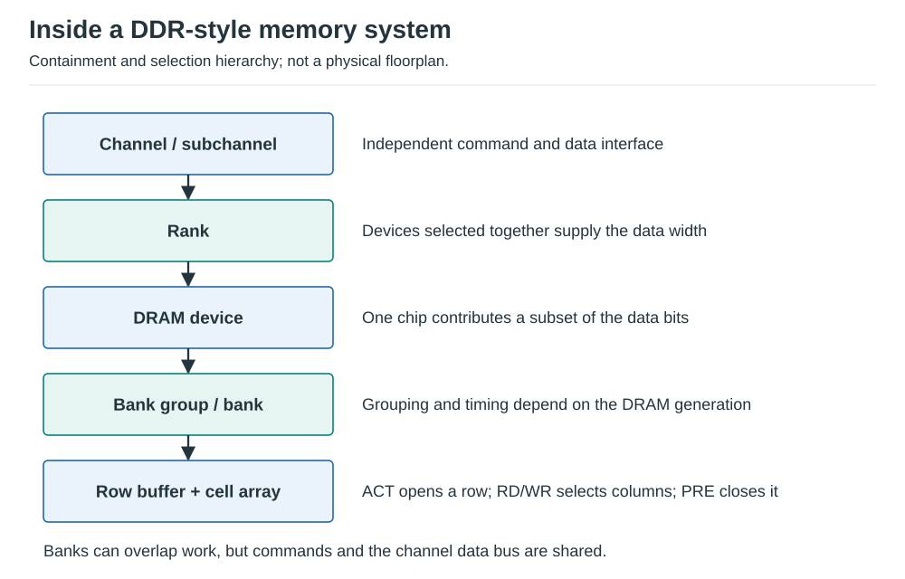
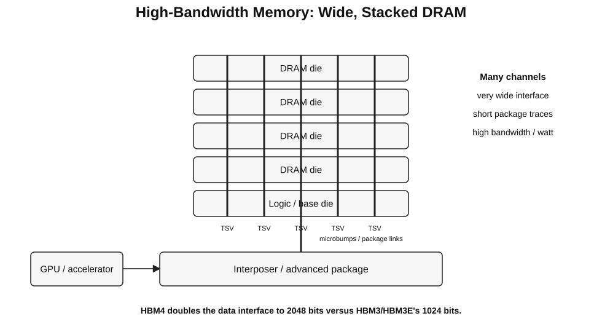
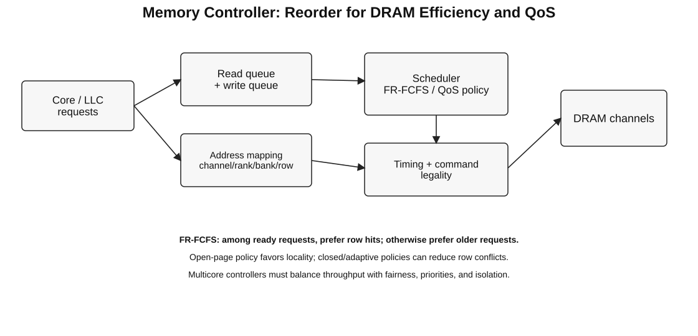
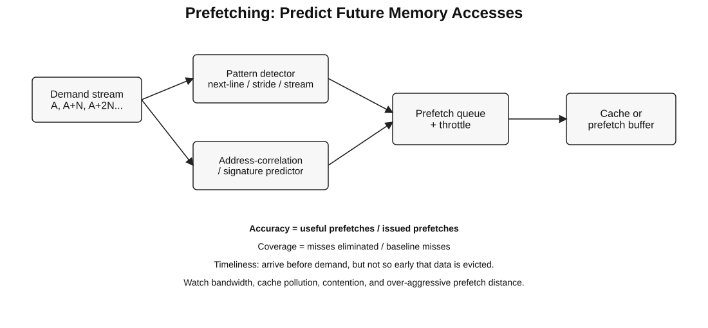

# 05 - DRAM, HBM, Memory Controllers, and Prefetching

Source mapping: Chapter 3, sections 3.12-3.16.9.

## 3.12 DRAM Memory Subsystem

DRAM stores each bit as charge in a tiny capacitor. The cell is dense but destructive reads, leakage, refresh, and
long internal wires make access slower and more structured than SRAM.



*Figure: Original reconstruction of a DDR-style channel/subchannel -> rank -> device -> bank hierarchy.*

### Hierarchy

A useful mental model:

```text
memory controller
  -> channel / subchannel
      -> DIMM / package
          -> rank
              -> DRAM devices operating in parallel
                  -> bank group (where defined)
                      -> bank
                          -> row buffer
                              -> rows x columns of cells
```

A memory request is mapped to channel/subchannel, rank, bank, row, and column fields; exact fields vary by memory
technology and controller mapping.

### Row-buffer operation

Typical bank sequence:

1. `ACTIVATE`: open a row into the row buffer / sense amplifiers;
2. `READ` or `WRITE`: access selected columns from that open row;
3. `PRECHARGE`: close the row and prepare the bank for another row;
4. `REFRESH`: periodically restore cell charge.

Terminology:

- **row hit:** requested row is already open;
- **row closed:** no row is open;
- **row conflict:** a different row is open and must be precharged first.

Row hits are faster and use less command bandwidth than row conflicts.

### Important timing terms

| Timing | Meaning |
| --- | --- |
| `tRCD` | activate-to-read/write delay |
| `tCL` | column/read latency after read command |
| `tRP` | precharge time |
| `tRAS` | minimum active-row time |
| `tRC` | row-cycle time, roughly active-to-next-active in one bank |

Exact definitions and values depend on the DRAM standard and device speed grade.

### Bank-level parallelism

Different banks can often serve independent operations concurrently, subject to shared command/data buses and power
timing constraints.

Good address mapping exposes bank-level parallelism. Bad mapping can send a regular access stream to one bank and
serialize it.

### DDR5 interview note

DDR5 increases bank count and subdivides a DIMM into independent subchannels relative to DDR4. This improves
parallelism and lets a 64-byte cache line be transferred using one subchannel's burst organization.

Do not memorize desktop-DIMM organization as universal; LPDDR, GDDR, HBM, server DIMMs, and accelerator memory use
different interfaces and packaging.

## 3.13 High-Bandwidth Memory - HBM

HBM trades a very wide, short package-level interface for high bandwidth and good energy efficiency.



*Figure: Original reconstruction. Updated from the source's HBM2-era figure to the current stacked-memory model.*

Core ideas:

- multiple DRAM dies are vertically stacked;
- TSVs and fine-pitch interconnect connect layers;
- a base/logic die provides interface and control functions;
- stacks sit close to the GPU/accelerator on advanced packaging;
- many independent channels provide high concurrency;
- the wide interface runs at lower signaling rate per pin than narrow off-package memory for comparable bandwidth.

### HBM generations - what to remember

| Generation | Interview-level takeaway |
| --- | --- |
| HBM2/HBM2E | historical foundation; 1024-bit-wide stack interface |
| HBM3/HBM3E | widely deployed AI/HPC generation with higher rate/capacity |
| HBM4 | 2048-bit interface, more channels, current production generation |

As of 2026, HBM4 products are in commercial production and HBM4E sampling has begun. Vendor products may exceed
JEDEC baseline signaling rates, so separate **standard limits** from **vendor implementation numbers**.

### Why HBM matters for ML accelerators

Many kernels are limited by bytes moved rather than arithmetic capability. HBM increases the sustainable bandwidth
available to feed matrix/vector units and reduces energy per transferred bit relative to long narrow interfaces.

HBM does not eliminate memory bottlenecks:

- capacity remains finite;
- random access latency is still DRAM-like;
- bandwidth must be shared across requesters;
- locality, coalescing, tiling, and cache behavior still matter.

## 3.14 STREAM Benchmark

STREAM measures sustainable memory bandwidth using long vector operations on arrays larger than cache.

Official kernels:

```text
Copy:   a[i] = b[i]
Scale:  a[i] = q * b[i]
Add:    a[i] = b[i] + c[i]
Triad:  a[i] = b[i] + q * c[i]
```

**Correction from the source:** the official kernel name is **Add**, not "Sum."

STREAM is useful because the data is intentionally not reused from cache. It measures sustained bandwidth under a
simple streaming access pattern rather than peak pin bandwidth.

Be careful comparing results:

- array size must exceed relevant caches;
- thread placement and NUMA policy matter;
- compiler vectorization and write-allocate traffic can affect measured bytes;
- a GPU or accelerator may use different benchmark variants and memory paths.

## 3.15 Memory Controller

The memory controller converts cache-line requests into legal, timed DRAM command sequences and schedules requests
for performance, fairness, power, and QoS.



*Figure: Original reconstruction of the source memory-controller pipeline and scheduling concepts.*

### 3.15.1 DRAM Types

Different memories optimize different points:

| Type | Primary goal |
| --- | --- |
| DDR5 | general-purpose CPU capacity and bandwidth |
| LPDDR5X-class | low power for mobile/embedded systems |
| GDDR7-class | high graphics/accelerator bandwidth over narrow packages |
| HBM3E/HBM4 | very high package-local bandwidth and bandwidth/watt |

Legacy DRAM names in the source are useful historically but are not worth memorizing for modern interviews.

### 3.15.2 Memory-Controller Functions

A controller typically handles:

- address mapping to channel/rank/bank/row/column;
- request buffering and reordering;
- DRAM timing constraints;
- read/write turnaround;
- row-buffer management;
- refresh scheduling;
- ECC/RAS integration;
- power-management state transitions;
- fairness, priority, and QoS.

### 3.15.3 Placement

Modern high-performance CPUs and accelerators generally integrate memory controllers on-die or within the same
package.

Benefits:

- lower controller latency;
- high-bandwidth private interfaces to the cores/LLC/fabric;
- power and traffic management can be coordinated with the processor.

A disaggregated or chiplet system may distribute memory controllers across I/O dies or compute tiles.

### 3.15.4 Scheduling Policies

#### FCFS

First request in arrival order is served first when legal. Simple, but ignores row-buffer locality and bank
parallelism.

#### FR-FCFS

**First Ready - First Come First Served:**

1. prefer requests whose DRAM commands are ready now, commonly row hits;
2. among similarly ready requests, prefer older requests.

This improves throughput but can starve requesters whose traffic has poor row locality.

### 3.15.5 Row-Buffer Management

**Open-page policy:** keep a row open after access, betting on another row hit.

**Closed-page policy:** precharge after access, betting the next request targets another row.

**Adaptive policy:** predict whether keeping the row open is profitable.

Open-page is best with strong row locality; closed-page can reduce conflict cost for random or highly interleaved
traffic.

### 3.15.6 Single-Core Scheduling

For one request stream, FR-FCFS often improves bandwidth by exploiting row-buffer hits while allowing independent
banks to overlap.

The basic tradeoff:

- maximize row locality -> higher throughput;
- preserve age ordering -> lower starvation and more predictable latency.

### 3.15.7 Multicore Memory Interference

Cores share:

- memory-controller queues;
- command and data buses;
- channels/ranks/banks;
- DRAM power and timing budgets.

One thread can delay another through row conflicts, bank conflicts, bus contention, and queue occupancy.

### 3.15.8 Effects of Uncontrolled Interference

Potential outcomes:

- unfair slowdown;
- loss of system throughput;
- destruction of another thread's memory-level parallelism;
- unpredictable tail latency;
- priority inversion;
- poor performance isolation.

### 3.15.9 QoS-Aware Scheduling

A QoS-aware controller should balance:

- system throughput;
- fairness / maximum slowdown;
- latency-critical priorities;
- starvation freedom;
- software-specified service classes.

PAR-BS is a classic example: batch requests, preserve per-thread parallelism, and schedule batches to improve
fairness and throughput.

Modern systems use many variants of thread-aware, deadline-aware, and bandwidth-aware policies. Interviewers care
more about the **tradeoff** than a specific policy name.

## 3.16 Memory Prefetching

Prefetching predicts future demand and moves data closer to the requester before the demand access arrives.



*Figure: Original reconstruction combining the source next-line, stride, stream, and correlation concepts.*

### 3.16.1 Prefetching Basics

Goals:

- reduce demand-miss latency;
- convert latency into background bandwidth;
- sometimes eliminate compulsory and capacity misses from the demand path.

A bad prefetch normally does not change correctness, but it can hurt performance by consuming bandwidth or evicting
useful data.

### 3.16.2 What Addresses to Prefetch?

Common predictors:

- next-line / adjacent-line;
- constant stride;
- multiple-stream detection;
- PC-correlated stride;
- spatial/signature predictors;
- address-correlation / Markov predictors;
- software/compiler-specified addresses.

There is no universally best predictor. Access regularity, table budget, and bandwidth determine the right design.

### 3.16.3 When to Initiate a Prefetch?

**Too late:** demand still stalls.

**Too early:** prefetched line may be evicted before use and consumes resources for longer.

Prefetch **distance** is often expressed as how far ahead in the stream to request data.

A good distance roughly covers memory latency without outrunning cache capacity and bandwidth.

### 3.16.4 Where to Place Prefetched Data?

Possible targets:

- L1 cache;
- L2/LLC;
- dedicated prefetch buffer / stream buffer;
- scratchpad or software-managed memory.

Tradeoff:

- closer placement reduces future hit latency;
- farther placement reduces cache pollution and contention.

### 3.16.5 How to Prefetch?

- explicit software prefetch instruction;
- compiler-inserted prefetch;
- hardware engine observing accesses;
- execution-based mechanisms that run ahead of demand;
- cooperative software/hardware schemes.

### 3.16.6 Software Prefetching

Software knows algorithm semantics and can prefetch irregular structures when it can compute future addresses.

Weaknesses:

- instruction overhead;
- hard to choose a portable distance across machines;
- pointer chasing may not reveal the next address early enough;
- excessive prefetches consume execution and memory bandwidth.

### 3.16.7 Hardware Prefetching

Hardware observes recent memory accesses and generates requests without explicit program instructions.

Advantages:

- transparent to software;
- can adapt at runtime;
- consumes no instruction slots.

Costs:

- predictor tables and queues;
- possible cache pollution and bandwidth waste;
- harder to understand/debug performance interactions.

### 3.16.7.1 Stride Prefetchers

For a load PC or cache-block stream, track recent addresses:

```text
A, A+N, A+2N, A+3N ...
```

After sufficient confidence that stride `N` is stable, prefetch future addresses such as `A+4N`.

PC-based stride prediction is often more robust than tracking one global address stream because different load
instructions may have different strides.

### 3.16.7.2 Stream Buffers

A stream buffer holds sequential prefetched lines outside the main cache. On a miss or stream detection, it fetches
future lines ahead of the demand stream.

Benefits:

- avoids polluting the cache with every prefetched line;
- decouples prefetch depth from normal cache replacement.

Multi-stream designs track several simultaneous access streams.

### 3.16.8 Address-Correlation Prefetching

Correlation predictors learn transitions such as:

```text
A -> B -> C
A -> D -> E
```

After observing `A`, the predictor prefetches likely successors based on past sequences.

This can capture irregular patterns that stride predictors miss, but correlation tables are storage-intensive and
can generate inaccurate requests when behavior changes.

### 3.16.9 Prefetcher Performance

Four primary metrics:

- **accuracy:** useful prefetches / issued prefetches;
- **coverage:** demand misses eliminated / baseline demand misses;
- **timeliness:** useful data arrives before demand but not excessively early;
- **overhead:** bandwidth, cache pollution, queue pressure, power, and interference.

Aggressiveness controls:

- degree: how many requests to issue;
- distance: how far ahead to fetch;
- confidence threshold;
- destination cache level.

A good adaptive prefetcher throttles itself when accuracy drops or memory bandwidth becomes constrained.

## Interview checklist

Be able to explain:

- channel/rank/chip/bank/row/column hierarchy;
- ACT, READ/WRITE, PRECHARGE, REFRESH;
- row hit vs. row conflict and bank-level parallelism;
- why HBM gets bandwidth from width, channels, and short package interconnect;
- sustainable STREAM bandwidth vs. peak pin bandwidth;
- FCFS vs. FR-FCFS;
- open-page vs. closed-page policy;
- multicore memory interference and QoS;
- next-line, stride, stream-buffer, and correlation prefetching;
- accuracy, coverage, timeliness, pollution, and bandwidth overhead.

## References

- Micron DDR5 overview: <https://www.micron.com/products/memory/dram-components/ddr5-sdram>
- Samsung HBM4: <https://semiconductor.samsung.com/dram/hbm/hbm4/>
- Samsung HBM4E sampling announcement:
  <https://news.samsung.com/global/tag/hbm4e>
- Micron HBM4: <https://www.micron.com/products/memory/hbm/hbm4>
- STREAM benchmark: <https://www.cs.virginia.edu/stream/>
- S. Rixner et al., *Memory Access Scheduling*: <https://www.cs.rice.edu/CS/Architecture/docs/rixner-isca00.pdf>
- O. Mutlu and T. Moscibroda, PAR-BS: <https://users.ece.cmu.edu/~omutlu/pub/parbs_isca08.pdf>
- N. Jouppi, victim caches and stream buffers:
  <https://www.cs.cmu.edu/afs/cs/academic/class/15740-s18/www/papers/jouppi90.pdf>
