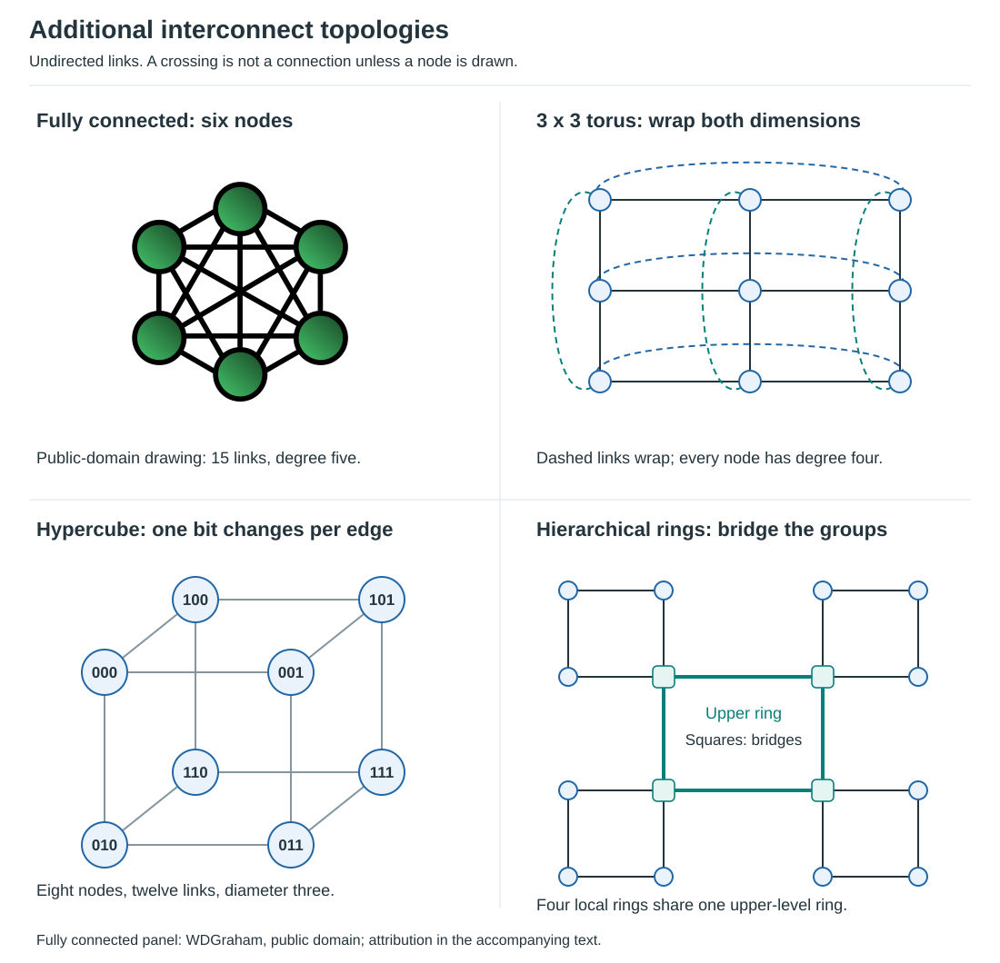
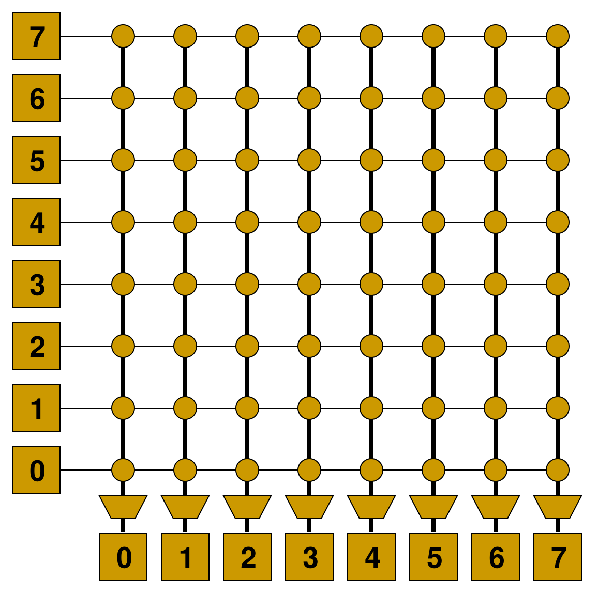
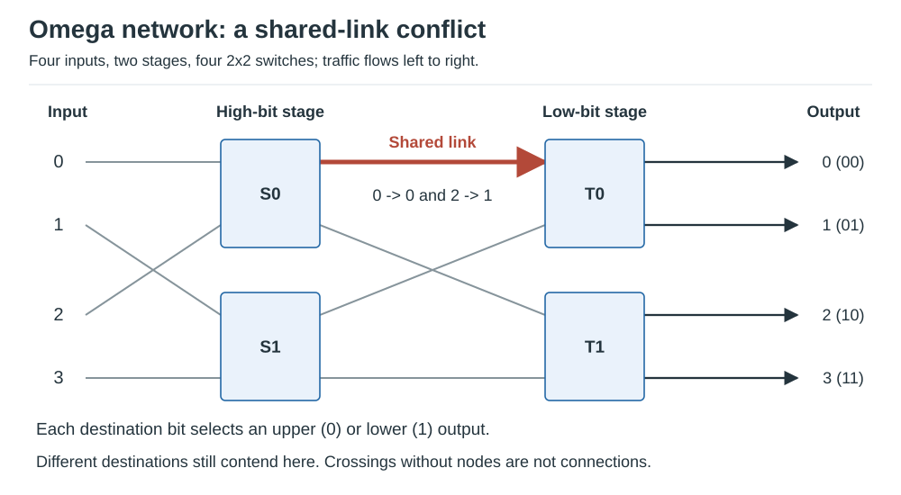
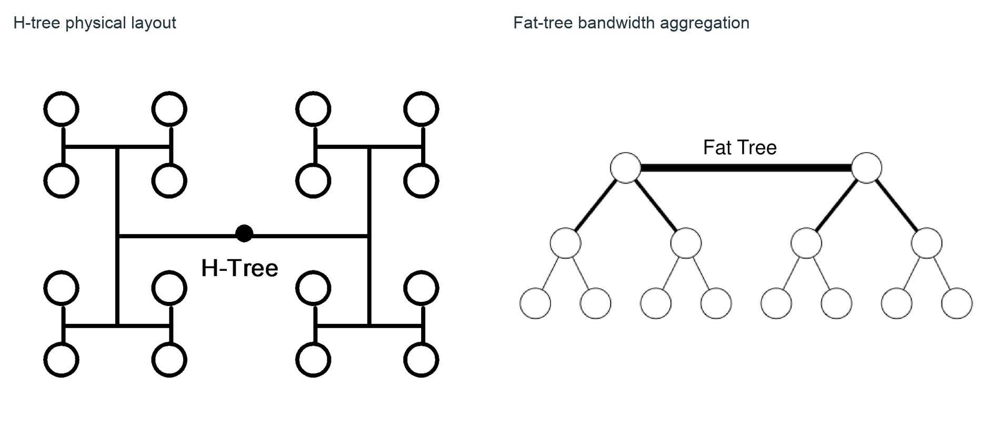
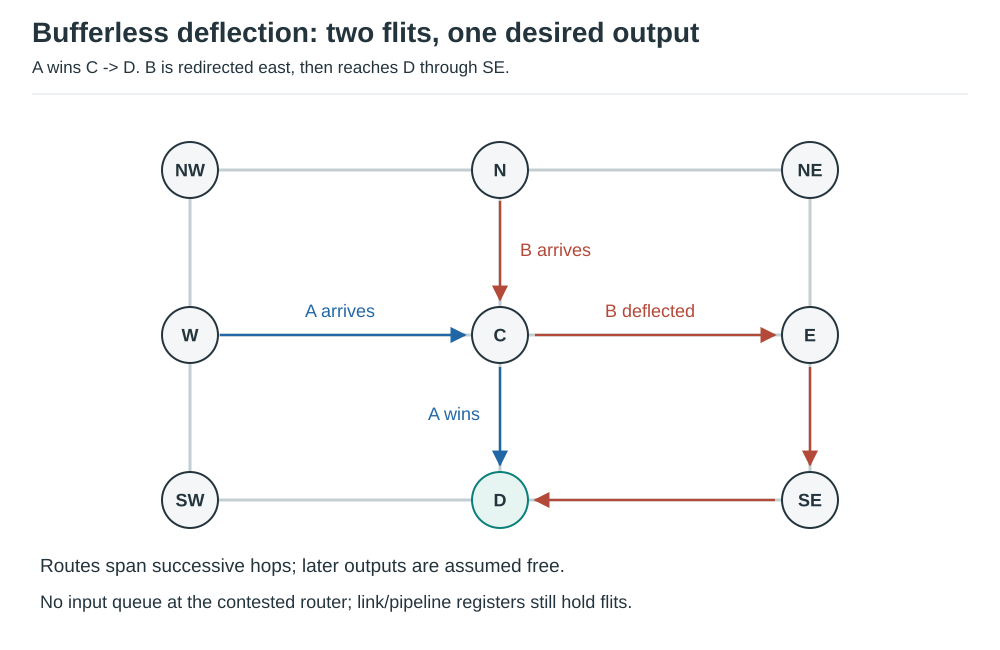
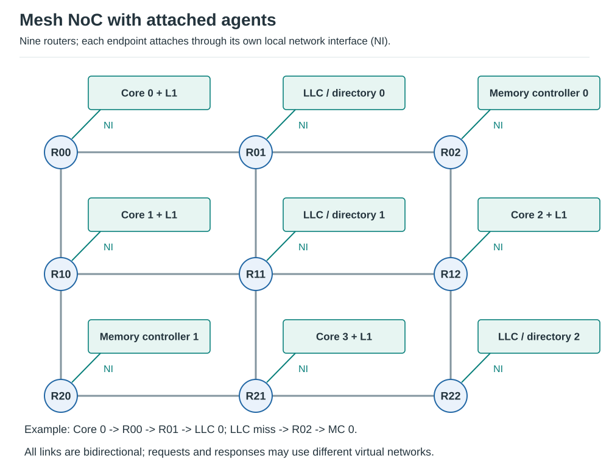

# Multiprocessors, Memory Consistency, and Interconnection Networks

## Multiprocessors

### Loosely vs. Tightly Coupled

**Loosely coupled:** processors have private address spaces and communicate explicitly, usually with messages.

**Tightly coupled:** processors share an address space and communicate through ordinary memory operations plus
synchronization.

Modern systems often mix both styles: coherent shared memory within a node and explicit communication across nodes.

### Design Issues in Tightly Coupled Multiprocessors

Key architecture problems:

- cache coherence;
- memory consistency;
- synchronization and atomic operations;
- shared-cache and memory-controller contention;
- interconnect scalability;
- NUMA placement and locality;
- fairness and quality of service.

### Programming Issues

Software must manage:

- task decomposition;
- load balance;
- synchronization;
- communication and data sharing;
- locality;
- contention;
- races and deadlocks.

Parallel speedup requires both hardware parallelism and enough independent useful work.

### Bottlenecks in Parallelization

Common limits:

- serial sections - Amdahl's Law;
- synchronization overhead;
- communication latency/bandwidth;
- load imbalance;
- shared-resource contention;
- false sharing;
- memory bandwidth saturation;
- insufficient problem size.

Superlinear speedup is possible in special cases, often because the parallel decomposition fits caches better, but
it should not be treated as the expected scaling law.

### Challenges in Parallel Programming

Correctness and performance are both difficult because execution interleavings are enormous.

Typical failure modes:

- data race;
- deadlock;
- livelock;
- starvation;
- barrier imbalance;
- lock contention;
- cache-line ping-pong;
- non-deterministic performance.

## Memory Consistency

**Coherence** answers: what values may processors observe for **one memory location**?

**Consistency** answers: what ordering constraints apply across **different memory locations**?


*Figure: Store buffering can preserve per-address coherence while violating sequential consistency.*
*The example uses abstract atomic accesses, not unsynchronized ordinary C/C++ variables.*

A system can be perfectly coherent and still permit surprising cross-address reorderings.

### Ordering of Operations

At least three orders matter:

- **program order:** order in one thread's instruction stream;
- **execution order:** internal microarchitectural order;
- **global/observed memory order:** order in which memory effects become visible.

A high-performance processor may reorder internally as long as the ISA memory model's externally visible behavior
is preserved.

### Single-Processor Ordering

A sequential ISA view does **not** require physical in-order execution. Modern CPUs commonly execute instructions
out of order and speculate.

The key requirement is that one thread's architectural behavior matches the ISA contract, including its memory
ordering rules.

### Dataflow Ordering

In a dataflow processor, dependencies determine when operations can fire. Independent memory operations therefore
need an additional ordering mechanism if the language/ISA requires a particular memory order.

This illustrates an important point: **data dependence alone does not define a shared-memory consistency model.**

### MIMD Ordering

Multiple processors generate memory operations concurrently. The memory model defines which interleavings and
observations are legal.

The implementation may use:

- store buffers;
- speculative loads;
- non-blocking caches;
- distributed coherence;
- network reordering.

Fences and atomics constrain those mechanisms when software requires stronger ordering.

## Protecting Shared Data

### Locks

A lock creates mutual exclusion around a critical section.

```text
lock(L)
critical section
unlock(L)
```

Hardware support commonly includes atomic read-modify-write operations such as:

- compare-and-swap;
- fetch-and-add;
- atomic exchange;
- load-reserved/store-conditional.

If four threads arrive together and each critical section takes three time units, an idealized lock serializes
them into `[0,3)`, `[3,6)`, `[6,9)`, and `[9,12)`. Ignoring lock overhead, their waits are 0, 3, 6, and 9 units.
Extra processors cannot execute this mutually exclusive work simultaneously. Real contention adds atomic retries,
cache-line transfers, spinning or blocking, and wakeup overhead; short critical sections are not free under load.

### Barriers

A barrier stops each participant until all required participants arrive.

Use barriers for phase synchronization, not for protecting one shared variable.

If three workers reach a barrier at times 3, 5, and 9, an idealized release occurs at 9:

| Worker | Arrival | Waiting time | Next phase can begin |
| --- | --- | --- | --- |
| A | 3 | 6 | 9 |
| B | 5 | 4 | 9 |
| C | 9 | 0 | 9 |

The slowest arrival lies on the phase's critical path. Faster workers cannot compensate by crossing early;
load balance, communication, and barrier implementation overhead all affect actual phase time.

### Atomics

An atomic operation appears indivisible with respect to competing accesses. Atomicity alone is not enough for every
synchronization pattern; ordering semantics such as acquire/release also matter.

### Why two ordinary flags are not a lock

The chapter's failed mutual-exclusion attempt is the store-buffer example below, interpreted as intent flags:

```text
Initially F0 = F1 = 0
Thread 0: F0 = 1; if F1 == 0: enter critical section; afterward clear F0
Thread 1: F1 = 1; if F0 == 0: enter critical section; afterward clear F1
```

If each store remains buffered while its following load reads the other flag's old zero, **both threads enter**.
Per-location coherence does not by itself order each store before the subsequent load of the other address.
Under SC, simultaneous entry from both zero reads is impossible; both may instead observe one and decline entry,
so these flags still do not provide a complete progress-guaranteeing lock algorithm.

This is memory-model pseudocode, not valid concurrent C++ with plain shared integers. Use a proper mutex or a
proven atomic locking algorithm. Merely using `volatile`, or release stores and acquire loads that both read
initial zeros, does not establish the synchronization needed here.

## Sequential Consistency - SC

Lamport's sequential consistency can be summarized as:

> The result is as if operations from all processors occurred in one global sequential order, and each processor's
> operations appear in that order in program order.

SC is easy to reason about but restricts implementation freedom.

### Consequences of SC

Under SC:

- each processor's memory operations preserve program order globally;
- all processors agree on one interleaving;
- many hardware reorderings must be hidden or prevented.

SC does not require the same interleaving across runs. For `T0: A then B` and `T1: C then D`, both
`A, B, C, D` and `A, C, B, D` are legal global orders. SC preserves each thread's order within an execution;
it does not make concurrent programs deterministic or automatically free of races and deadlocks.

Cost:

- reduced store-buffer freedom;
- fewer speculative memory optimizations;
- more ordering constraints on the cache/memory system.

### Weaker Memory Consistency

Weaker models preserve only the orderings required for correctness, especially around synchronization.

Useful primitives:

- **release:** orders earlier accesses before publishing/releasing synchronization state;
- **acquire:** orders later accesses after acquiring/observing synchronization state;
- **fence/barrier:** explicitly orders selected classes of memory operations;
- **atomic RMW:** combines atomicity with specified ordering semantics.

At the language level, a release store and an acquire load that **reads from that store** establish the
publication relation. Conceptual example, initially `ready=0`, with an atomic flag and stable payload:

```text
producer: payload = 42; store_release(ready, 1)
consumer: if load_acquire(ready) == 1: read payload  # observes 42
```

The release does not force every unsynchronized reader to see all prior writes immediately. An acquire that
reads the initial zero has not observed this publication. Programmers must arrange matching synchronization;
weak ordering gives hardware more freedom but makes those obligations explicit. ISA fences order their defined
access classes; they are not interchangeable with every language-level synchronization operation.

### Current ISA mental model

| ISA family | Interview-level view |
| --- | --- |
| x86-64 | relatively strong, commonly described with TSO-like behavior |
| Arm | weakly ordered; explicit acquire/release and barriers are important |
| RISC-V | RVWMO by default; `FENCE`, atomics, and optional `Ztso` strengthen ordering |

Do not infer a complete formal memory model from this table. Use it only as a high-level interview anchor.

### Store buffer example

Two threads:

```text
Initially X = 0, Y = 0

Core 0: X = 1; r0 = Y
Core 1: Y = 1; r1 = X
```

Under sequential consistency, `r0 = 0` and `r1 = 0` cannot both result from a single global order that preserves each
thread's program order. Weaker models may permit outcomes that SC forbids unless synchronization is used.

## Interconnection Networks

Interconnects move requests, data, coherence messages, and synchronization traffic among processors, caches, memory
controllers, accelerators, and I/O.


*Figure: Generic network topologies. Its irregular partial mesh is not the regular 2D NoC mesh below.*
*The pictured tree is an ordinary tree, not a fat tree; no crossbar is shown.*
Source: [NetworkTopologies.svg][figure-topologies] by Maksim / Malyszkz, public domain.
Unmodified 3840-pixel-wide Wikimedia rendering embedded in SVG on white.

### Basics

Network design has four separable questions:

1. **Topology:** which physical paths exist?
2. **Routing:** which path may a packet take?
3. **Flow control:** when may a packet/flit advance?
4. **Switching/arbitration:** how are links and buffers allocated?

### Topology

Common topologies:

- bus;
- point-to-point / fully connected;
- crossbar;
- multistage networks;
- ring;
- mesh;
- torus;
- tree/fat tree;
- hypercube.

No topology is best for all scales. Wiring cost, radix, bisection bandwidth, physical layout, and traffic pattern all
matter.

### Metrics

Important network metrics:

- latency;
- throughput;
- hop count / diameter;
- bisection bandwidth;
- contention and hotspot behavior;
- router/link radix;
- wire cost and area;
- energy per bit;
- fault tolerance;
- scalability.

**Bisection bandwidth:** minimum total bandwidth crossing a partition that divides the network into two similarly
sized halves. It is a useful measure of global communication capacity.

### Bus

All nodes share one communication medium.

Advantages:

- simple;
- easy broadcast/snoop behavior;
- low cost for small node counts.

Disadvantages:

- one shared bandwidth resource;
- electrical and arbitration limits;
- does not scale to large systems.

### Point-to-Point / Fully Connected

A point-to-point network uses dedicated links between pairs of nodes rather than one shared bus. A **fully connected**
point-to-point network directly links every pair, minimizing hop count but requiring `O(N^2)` links/ports.

Full connectivity becomes physically and logically expensive as node count grows, so larger systems use sparse or
hierarchical point-to-point topologies.

For bidirectional pairwise links, full connectivity needs `N * (N - 1) / 2` links and `N - 1` ports per node.
The six nodes in the fully connected panel below therefore need `6 * 5 / 2 = 15` links and five ports per node:



*Figure: Fully connected, torus, hypercube, and hierarchical-ring examples. Crossings without nodes are not joins.*
The fully connected panel uses [FullMeshNetwork.svg][figure-full-mesh] by WDGraham, public domain,
with white background and display sizing. The torus, hypercube, and hierarchical-ring panels are original drawings.

### Crossbar

An `N x M` crossbar can connect multiple non-conflicting input/output pairs concurrently.

Benefits:

- low hop count;
- high concurrency;
- simple route choice.

Costs:

- wiring, switch area, and arbitration grow rapidly;
- practical only for modest radix or hierarchical use.



*Figure: Existing CMU crossbar illustration; each marked crossing is a selectable input/output connection.*
Source: [CMU interconnection networks, Crossbar slide][network-lecture].

An `N x M` crossbar has `N*M` crosspoints; the pictured `8 x 8` has 64. Different output requests can proceed
concurrently, e.g., `input 0 -> output 2` and `input 1 -> output 3`. If input 4 also wants output 2, its transfer
must wait or take another time slot even though the fabric can connect every input/output pair.

Queues and arbiters determine how that contention is managed:

- **Input FIFO:** hold traffic before the fabric; a blocked head may also delay later packets for free outputs.
- **Virtual output queues:** separate each input's traffic by destination, up to `N*M` logical queues;
  scheduling selects a compatible input/output matching and avoids that particular head-of-line blockage.
- **Output queues:** buffer after the fabric; accepting several packets for one output in a time slot requires
  enough internal speedup/parallel writes and storage, not just the external output bandwidth.
- **Buffered crosspoints:** store data inside the fabric in a queue for each input/output pair, up to `N*M` queues.
  Each input steers data to its chosen crosspoint; each output arbiter selects among its nonempty crosspoint queues.
  Credits stop an input filling a queue with no remaining space. This decouples input admission from output service,
  but still cannot serve two transfers simultaneously on one ordinary output link.

Credits/backpressure prevent overrunning finite queues. The quadratic **crosspoint** count is a topology cost;
`N*M` queues are one buffering organization, not a universal requirement for every crossbar.

### Multistage Logarithmic Networks

Butterfly, omega, and banyan networks use multiple stages of smaller switches, commonly with `O(log N)` stages.
Clos networks are also multistage, but their stage count and blocking properties depend on the chosen construction.

Typical properties:

- much lower cost than a full crossbar;
- potential path conflicts depending on topology;
- blocking, rearrangeably non-blocking, and strictly non-blocking variants exist.

A binary omega network with `N = 2^k` terminals uses `k` stages of `N/2` two-input/two-output switches:
`(N/2) * log2(N)` switches, with `O(N log N)` wires and `log2(N)` switch traversals. This is hop-count scaling,
not a constant wall-clock latency independent of contention or wire length.



*Figure: Smaller omega example illustrating the source's internal-link conflict, not its exact eight-input drawing.*

Here the input shuffle groups inputs 0/2 at S0 and 1/3 at S1. Route by destination bits, most significant first:
0 selects a switch's upper output; 1 selects its lower output. Transfers `0 -> 0` (`00`) and `2 -> 1` (`01`)
both require S0's upper output to T0. They conflict on that internal link despite distinct final destinations.
They need different time slots or buffering; an ordinary single-path omega is blocking.

### Circuit vs. Packet Switching

**Circuit switching:** establish a path before data transfer and reserve resources along it.

- predictable once established;
- efficient for long transfers;
- setup overhead and poor utilization when traffic is bursty.

**Packet switching:** each packet/flit competes for links dynamically.

- flexible and high utilization;
- queueing latency and contention;
- requires flow control and arbitration.

On-chip networks are predominantly packet switched.

### Ring

Each node connects to two neighbors.

Advantages:

- low router radix;
- simple layout and arbitration;
- useful for moderate node counts.

Disadvantages:

- average hop count grows with ring size;
- one congested region can limit throughput.

Bidirectional and hierarchical rings reduce average distance and improve scalability.

At fixed per-link bandwidth, a simple ring has `O(N)` links and `O(N)` average hop count under uniform traffic.
A balanced cut crosses only a constant number of links, so bisection bandwidth does not grow with node count.
Bidirectionality reduces distance but does not change these asymptotic limits.

In the [hierarchical-ring example](assets/topology_details.svg), local traffic stays on a small ring. Cross-group
traffic transfers through a bridge to the upper ring, then through the destination bridge to its local ring.
Bridges need transfer/arbitration rules and can become bottlenecks; hierarchy is not free bandwidth.

### Mesh

A 2D mesh connects each interior router to north, south, east, and west neighbors.

Advantages:

- regular layout;
- short local wires;
- scalable physical implementation;
- natural fit to 2D chip floorplans.

Disadvantages:

- edge/corner nodes are not topologically symmetric;
- diameter and latency grow with chip dimension;
- central links can become hotspots.

Mesh is one of the most common on-chip topologies.

For a square `k x k` mesh with `N = k^2`, there are `2k(k-1)` bidirectional neighbor links and diameter `2(k-1)`.
Uniform random source/destination traffic has `O(sqrt(N))` average hops; a balanced cut crosses `k` links for
even `k`. Local traffic may travel much less, and queueing can dominate hop-count latency at high load.

### Torus

A torus adds wraparound links to a mesh.

Benefits:

- lower diameter;
- higher path diversity;
- more uniform node position;
- higher bisection bandwidth.

Costs:

- long wraparound wires;
- more difficult physical layout.

The [torus drawing](assets/topology_details.svg) connects the first and last nodes of **each row and column**.
For a square `k x k` torus with `k >= 3`, all nodes have degree four and the diameter is `2 * floor(k/2)`.
For even `k`, a balanced cut crosses `2k` links versus `k` in the mesh, assuming equal per-link bandwidth.

### Trees and Fat Trees

A tree is hierarchical and works well when traffic naturally aggregates upward and downward.

A naive tree bottlenecks near the root. A **fat tree** increases bandwidth toward upper levels to avoid that
oversubscription.

For a full balanced binary tree with `N` leaf endpoints, there are `N-1` internal nodes and `2N-2` links:
linear structural cost. Depth is `log2(N)` for power-of-two N, and a leaf-to-leaf route crosses at most
`2*log2(N)` links. Nearby leaves meet at a low common ancestor, so local traffic avoids upper levels.
These are hop bounds, not queueing-independent wall-clock latency guarantees.



*Figure: Existing CMU H-tree and fat-tree illustrations, arranged side by side; thicker links indicate bandwidth.*
Source: [CMU interconnection networks, Trees slide][network-lecture].

The H-tree panel embeds a hierarchy as repeating H-shaped branches for a regular physical layout; spatially
near endpoints can communicate through lower branches. It does not automatically provide fat-tree bandwidth.
The fat-tree panel increases link capacity where subtree traffic aggregates. For example, merging two child
links of capacity `b` into one parent link of `b` creates 2:1 oversubscription; a parent of `2b` removes that
specific bottleneck. Practical fat-tree/Clos fabrics may instead use several equal-rate links and switches.

### Hypercube

An `n`-dimensional hypercube has:

- `N = 2^n` nodes;
- node degree `n = log2(N)`;
- diameter `log2(N)`.

It provides low logical diameter but becomes difficult to lay out physically as `N` grows.

Label each node with an `n`-bit binary number; neighbors differ in exactly one bit. The total number of
bidirectional links is `N * log2(N) / 2` because counting degree at every node counts each link twice.
The [three-dimensional cube](assets/topology_details.svg) has eight nodes and twelve links. The route
`000 -> 001 -> 011 -> 111` changes one bit per hop and reaches the opposite corner in three hops.

### Buffering and Flow Control

When two packets need the same output link, the router must:

- buffer one;
- apply backpressure;
- drop/retry in some systems;
- or deflect one to another path.

Common flow-control ideas:

- store-and-forward;
- virtual cut-through;
- wormhole routing;
- credits;
- virtual channels.

Virtual channels share one physical link among several logical queues. They reduce head-of-line blocking and,
with a correct allocation discipline, can break channel-dependency cycles that would otherwise deadlock.

### Bufferless Deflection Routing

A bufferless router forwards contending flits onto alternative productive or non-productive links instead of
storing them.



*Figure: Illustrative mesh trace reproducing the source's direct-route versus detour lesson.*

At center router C, flits A and B both want the south link toward destination D. A wins; B is sent east to E,
then south to SE and west to D: three hops instead of one from C, assuming those subsequent outputs are free.
The detour moves B farther from its destination initially but keeps it moving instead of queueing it at C.

"Bufferless" removes input queues, not every storage element: pipeline latches and link registers still hold
flits. Injection must wait when forwarding transit traffic consumes the available outputs. Arbitration needs a
livelock-avoidance rule, such as eventual priority for the oldest flit, so repeated deflections cannot last forever.

Pros:

- saves input-buffer area and energy;
- simple storage requirements.

Cons:

- increases path length under contention;
- complicates livelock avoidance and packet reassembly;
- performance can degrade sharply at high load.

### Routing Algorithms

Routing may be:

- **deterministic:** one path per source/destination pair;
- **oblivious:** several possible paths chosen without current network state;
- **adaptive:** path depends on congestion/fault state.

Routing must also avoid or recover from deadlock and livelock.

### Deterministic Routing

Dimension-order routing in a 2D mesh is the standard example:

```text
XY: move in X until destination column, then move in Y
```

Advantages:

- simple;
- easy to make deadlock-free;
- minimal path length.

Disadvantage:

- cannot route around congestion or faults unless the design adds escape mechanisms.

### Oblivious Routing

Oblivious routing chooses among legal paths without observing current congestion.

Valiant routing is a classic example:

1. route to a random intermediate node;
2. then route to the true destination.

It can balance adversarial traffic but may increase path length.

The extra detour is most attractive under high load or concentrated traffic, when spreading contention can
outweigh extra hops. Under light load, a direct minimal path is usually faster. Some variants restrict the
random intermediate to nearby nodes to reduce path inflation, trading away part of the global load spreading.
Those restrictions are optimizations, not the unrestricted Valiant rule or a guarantee for every traffic pattern.
[CMU oblivious routing discussion][routing-lecture]

### Adaptive Routing

Adaptive routing observes network state such as queue occupancy or output availability and chooses among paths.

**Minimal adaptive:** choose among minimal-length paths.

**Non-minimal adaptive:** allow detours when that improves load balance or fault tolerance.

The challenge is gaining adaptivity without introducing deadlock, excessive complexity, or unstable oscillation.

### On-Chip Networks - NoCs

A NoC is an interconnect integrated on a chip or package for processors, caches, accelerators, memory controllers,
and other agents. Most scalable NoCs use packet/flit switching, although the term itself does not require one
specific switching discipline.



*Figure: End-to-end teaching mesh with explicit agents, complementing the single-router diagram below.*

Each agent attaches through a network interface to a router. A core's cache-miss request can traverse routers
to the home LLC/directory slice; a miss there causes a request to a memory controller and a data response back.
Coherence invalidations and acknowledgments also travel through the network. Exact home placement and response
routing are protocol choices; routers forward messages, while endpoints perform cache, coherence, or DRAM work.


*Figure: Separate flit datapath and routing/allocation control. Logical functions are not fixed pipeline stages.*

Typical router pipeline:

```text
input buffer -> route compute -> virtual-channel allocation
             -> switch allocation -> crossbar -> output link
```

Packets are commonly split into **flits** so long packets do not require whole-packet buffering at every router.

### Modern interview note: chiplets, UCIe, and CXL

The original chapter stops at on-chip networks. Current systems increasingly extend these ideas across packages and
memory fabrics.

**UCIe:** standardized die-to-die chiplet interconnect. UCIe 3.0 supports 48 and 64 GT/s data rates and extends
manageability while remaining backward compatible with earlier UCIe generations.

**CXL:** cache-coherent connectivity over PCIe physical infrastructure for accelerators, memory expansion, pooling,
and fabrics. CXL 4.0 is the current consortium specification as of 2026 and raises the link rate to 128 GT/s.

Interview distinction:

- NoC: usually internal chip/package network architecture;
- UCIe: die-to-die physical/protocol standard for chiplets;
- CXL: coherent system interconnect for CPUs, accelerators, and memory devices.

## Interview checklist

Be able to explain:

- coherence vs. consistency;
- program order vs. observed memory order;
- SC vs. weak ordering;
- acquire, release, fence, and atomic RMW;
- why store buffers improve performance but affect memory ordering;
- bus, ring, mesh, torus, tree, crossbar, and multistage tradeoffs;
- bisection bandwidth, diameter, and contention;
- circuit vs. packet switching;
- wormhole routing and virtual channels;
- deterministic vs. oblivious vs. adaptive routing;
- why mesh is common for NoCs;
- NoC vs. UCIe vs. CXL.

## References

- RISC-V RVWMO: <https://docs.riscv.org/reference/isa/unpriv/rvwmo.html>
- Arm memory-model material: <https://developer.arm.com/>
- Stanford CS149 coherence and consistency: <https://gfxcourses.stanford.edu/cs149/fall19/>
- CMU interconnection networks:
  <https://www.cs.cmu.edu/afs/cs/academic/class/15418-s12/www/lectures/18_interconnects.pdf>
- UCIe specifications: <https://www.uciexpress.org/specifications>
- CXL specification: <https://computeexpresslink.org/cxl-specification/>

[figure-topologies]: https://commons.wikimedia.org/wiki/File:NetworkTopologies.svg
[figure-full-mesh]: https://commons.wikimedia.org/wiki/File:FullMeshNetwork.svg
[network-lecture]: https://www.cs.cmu.edu/afs/cs/academic/class/15418-s12/www/lectures/18_interconnects.pdf
[routing-lecture]: https://www.cs.cmu.edu/afs/cs/academic/class/15740-f14/www/lectures/08-interconnect.pdf
