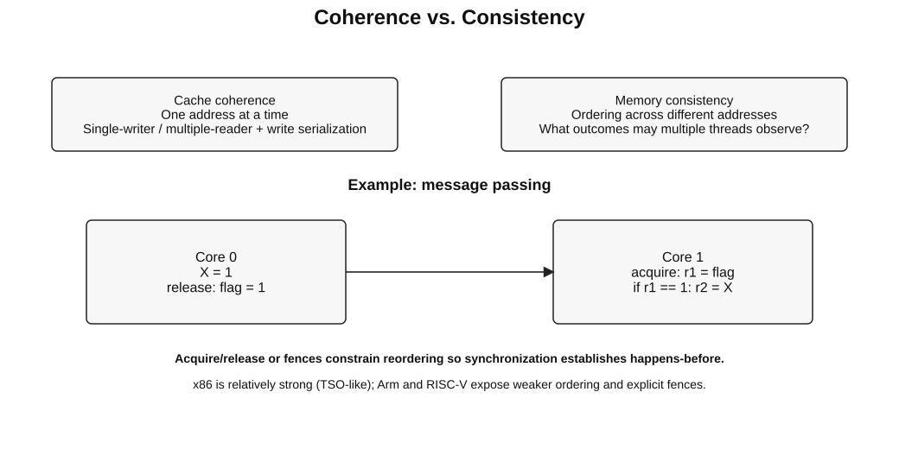
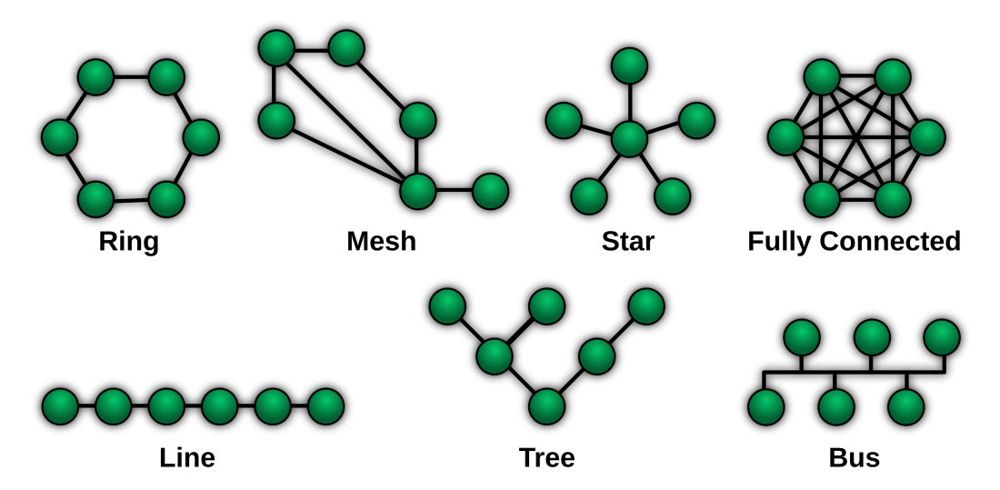
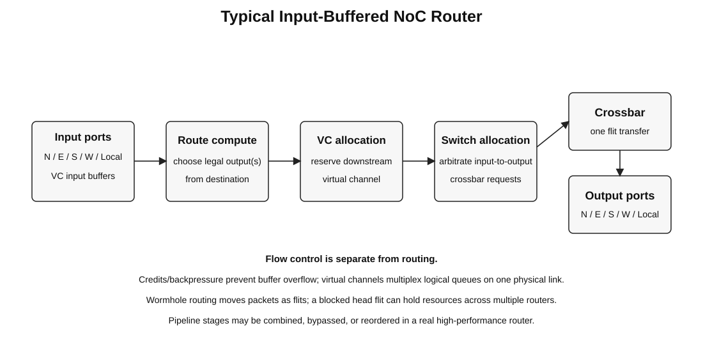

# 06 - Multiprocessors, Memory Consistency, and Interconnection Networks

Source mapping: Chapter 3, sections 3.17-3.18.20.

## 3.17 Multiprocessors

### Loosely vs. Tightly Coupled

**Loosely coupled:** processors have private address spaces and communicate explicitly, usually with messages.

**Tightly coupled:** processors share an address space and communicate through ordinary memory operations plus
synchronization.

Modern systems often mix both styles: coherent shared memory within a node and explicit communication across nodes.

### 3.17.1 Design Issues in Tightly Coupled Multiprocessors

Key architecture problems:

- cache coherence;
- memory consistency;
- synchronization and atomic operations;
- shared-cache and memory-controller contention;
- interconnect scalability;
- NUMA placement and locality;
- fairness and quality of service.

### 3.17.2 Programming Issues

Software must manage:

- task decomposition;
- load balance;
- synchronization;
- communication and data sharing;
- locality;
- contention;
- races and deadlocks.

Parallel speedup requires both hardware parallelism and enough independent useful work.

### 3.17.3 Bottlenecks in Parallelization

Common limits:

- serial sections - Amdahl's Law;
- synchronization overhead;
- communication latency/bandwidth;
- load imbalance;
- shared-resource contention;
- false sharing;
- memory bandwidth saturation;
- insufficient problem size.

Superlinear speedup is possible in special cases, often because the parallel decomposition fits caches better, but
it should not be treated as the expected scaling law.

### 3.17.4 Challenges in Parallel Programming

Correctness and performance are both difficult because execution interleavings are enormous.

Typical failure modes:

- data race;
- deadlock;
- livelock;
- starvation;
- barrier imbalance;
- lock contention;
- cache-line ping-pong;
- non-deterministic performance.

## 3.17.5 Memory Consistency

**Coherence** answers: what values may processors observe for **one memory location**?

**Consistency** answers: what ordering constraints apply across **different memory locations**?



*Figure: Original reconstruction emphasizing acquire/release message passing.*

A system can be perfectly coherent and still permit surprising cross-address reorderings.

### 3.17.6 Ordering of Operations

At least three orders matter:

- **program order:** order in one thread's instruction stream;
- **execution order:** internal microarchitectural order;
- **global/observed memory order:** order in which memory effects become visible.

A high-performance processor may reorder internally as long as the ISA memory model's externally visible behavior
is preserved.

### 3.17.7 Single-Processor Ordering

A sequential ISA view does **not** require physical in-order execution. Modern CPUs commonly execute instructions
out of order and speculate.

The key requirement is that one thread's architectural behavior matches the ISA contract, including its memory
ordering rules.

### 3.17.8 Dataflow Ordering

In a dataflow processor, dependencies determine when operations can fire. Independent memory operations therefore
need an additional ordering mechanism if the language/ISA requires a particular memory order.

This illustrates an important point: **data dependence alone does not define a shared-memory consistency model.**

### 3.17.9 MIMD Ordering

Multiple processors generate memory operations concurrently. The memory model defines which interleavings and
observations are legal.

The implementation may use:

- store buffers;
- speculative loads;
- non-blocking caches;
- distributed coherence;
- network reordering.

Fences and atomics constrain those mechanisms when software requires stronger ordering.

## 3.17.10 Protecting Shared Data

### Locks

A lock creates mutual exclusion around a critical section.

```text
lock(L)
critical section
unlock(L)
```

Hardware support commonly includes atomic read-modify-write operations such as:

- compare-and-swap;
- fetch-and-add;
- atomic exchange;
- load-reserved/store-conditional.

### Barriers

A barrier stops each participant until all required participants arrive.

Use barriers for phase synchronization, not for protecting one shared variable.

### Atomics

An atomic operation appears indivisible with respect to competing accesses. Atomicity alone is not enough for every
synchronization pattern; ordering semantics such as acquire/release also matter.

## 3.17.11 Sequential Consistency - SC

Lamport's sequential consistency can be summarized as:

> The result is as if operations from all processors occurred in one global sequential order, and each processor's
> operations appear in that order in program order.

SC is easy to reason about but restricts implementation freedom.

### 3.17.12 Consequences of SC

Under SC:

- each processor's memory operations preserve program order globally;
- all processors agree on one interleaving;
- many hardware reorderings must be hidden or prevented.

Cost:

- reduced store-buffer freedom;
- fewer speculative memory optimizations;
- more ordering constraints on the cache/memory system.

### 3.17.13 Weaker Memory Consistency

Weaker models preserve only the orderings required for correctness, especially around synchronization.

Useful primitives:

- **release:** earlier memory operations become visible before the release;
- **acquire:** later memory operations cannot move before the acquire in the prohibited ways;
- **fence/barrier:** explicitly orders selected classes of memory operations;
- **atomic RMW:** combines atomicity with specified ordering semantics.

### Current ISA mental model

| ISA family | Interview-level view |
| --- | --- |
| x86-64 | relatively strong, commonly described with TSO-like behavior |
| Arm | weakly ordered; explicit acquire/release and barriers are important |
| RISC-V | RVWMO by default; `FENCE`, atomics, and optional `Ztso` strengthen ordering |

Do not infer a complete formal memory model from this table. Use it only as a high-level interview anchor.

### Store buffer example

Two threads:

```text
Initially X = 0, Y = 0

Core 0: X = 1; r0 = Y
Core 1: Y = 1; r1 = X
```

Under sequential consistency, `r0 = 0` and `r1 = 0` cannot both result from a single global order that preserves each
thread's program order. Weaker models may permit outcomes that SC forbids unless synchronization is used.

## 3.18 Interconnection Networks

Interconnects move requests, data, coherence messages, and synchronization traffic among processors, caches, memory
controllers, accelerators, and I/O.



*Figure: Original reconstruction of the source topology survey, with modern package-scale fabrics added.*

### 3.18.1 Basics

Network design has four separable questions:

1. **Topology:** which physical paths exist?
2. **Routing:** which path may a packet take?
3. **Flow control:** when may a packet/flit advance?
4. **Switching/arbitration:** how are links and buffers allocated?

### 3.18.2 Topology

Common topologies:

- bus;
- point-to-point / fully connected;
- crossbar;
- multistage networks;
- ring;
- mesh;
- torus;
- tree/fat tree;
- hypercube.

No topology is best for all scales. Wiring cost, radix, bisection bandwidth, physical layout, and traffic pattern all
matter.

### 3.18.3 Metrics

Important network metrics:

- latency;
- throughput;
- hop count / diameter;
- bisection bandwidth;
- contention and hotspot behavior;
- router/link radix;
- wire cost and area;
- energy per bit;
- fault tolerance;
- scalability.

**Bisection bandwidth:** minimum total bandwidth crossing a partition that divides the network into two similarly
sized halves. It is a useful measure of global communication capacity.

### 3.18.4 Bus

All nodes share one communication medium.

Advantages:

- simple;
- easy broadcast/snoop behavior;
- low cost for small node counts.

Disadvantages:

- one shared bandwidth resource;
- electrical and arbitration limits;
- does not scale to large systems.

### 3.18.5 Point-to-Point / Fully Connected

A point-to-point network uses dedicated links between pairs of nodes rather than one shared bus. A **fully connected**
point-to-point network directly links every pair, minimizing hop count but requiring `O(N^2)` links/ports.

Full connectivity becomes physically and logically expensive as node count grows, so larger systems use sparse or
hierarchical point-to-point topologies.

### 3.18.6 Crossbar

An `N x M` crossbar can connect multiple non-conflicting input/output pairs concurrently.

Benefits:

- low hop count;
- high concurrency;
- simple route choice.

Costs:

- wiring, switch area, and arbitration grow rapidly;
- practical only for modest radix or hierarchical use.

### 3.18.7 Multistage Logarithmic Networks

Butterfly, omega, and banyan networks use multiple stages of smaller switches, commonly with `O(log N)` stages.
Clos networks are also multistage, but their stage count and blocking properties depend on the chosen construction.

Typical properties:

- much lower cost than a full crossbar;
- potential path conflicts depending on topology;
- blocking, rearrangeably non-blocking, and strictly non-blocking variants exist.

### 3.18.8 Circuit vs. Packet Switching

**Circuit switching:** establish a path before data transfer and reserve resources along it.

- predictable once established;
- efficient for long transfers;
- setup overhead and poor utilization when traffic is bursty.

**Packet switching:** each packet/flit competes for links dynamically.

- flexible and high utilization;
- queueing latency and contention;
- requires flow control and arbitration.

On-chip networks are predominantly packet switched.

### 3.18.9 Ring

Each node connects to two neighbors.

Advantages:

- low router radix;
- simple layout and arbitration;
- useful for moderate node counts.

Disadvantages:

- average hop count grows with ring size;
- one congested region can limit throughput.

Bidirectional and hierarchical rings reduce average distance and improve scalability.

### 3.18.10 Mesh

A 2D mesh connects each interior router to north, south, east, and west neighbors.

Advantages:

- regular layout;
- short local wires;
- scalable physical implementation;
- natural fit to 2D chip floorplans.

Disadvantages:

- edge/corner nodes are not topologically symmetric;
- diameter and latency grow with chip dimension;
- central links can become hotspots.

Mesh is one of the most common on-chip topologies.

### 3.18.11 Torus

A torus adds wraparound links to a mesh.

Benefits:

- lower diameter;
- higher path diversity;
- more uniform node position;
- higher bisection bandwidth.

Costs:

- long wraparound wires;
- more difficult physical layout.

### 3.18.12 Trees and Fat Trees

A tree is hierarchical and works well when traffic naturally aggregates upward and downward.

A naive tree bottlenecks near the root. A **fat tree** increases bandwidth toward upper levels to avoid that
oversubscription.

### 3.18.13 Hypercube

An `n`-dimensional hypercube has:

- `N = 2^n` nodes;
- node degree `n = log2(N)`;
- diameter `log2(N)`.

It provides low logical diameter but becomes difficult to lay out physically as `N` grows.

### 3.18.14 Buffering and Flow Control

When two packets need the same output link, the router must:

- buffer one;
- apply backpressure;
- drop/retry in some systems;
- or deflect one to another path.

Common flow-control ideas:

- store-and-forward;
- virtual cut-through;
- wormhole routing;
- credits;
- virtual channels.

Virtual channels share one physical link among several logical queues. They reduce head-of-line blocking and,
with a correct allocation discipline, can break channel-dependency cycles that would otherwise deadlock.

### 3.18.15 Bufferless Deflection Routing

A bufferless router forwards contending flits onto alternative productive or non-productive links instead of
storing them.

Pros:

- saves input-buffer area and energy;
- simple storage requirements.

Cons:

- increases path length under contention;
- complicates livelock avoidance and packet reassembly;
- performance can degrade sharply at high load.

### 3.18.16 Routing Algorithms

Routing may be:

- **deterministic:** one path per source/destination pair;
- **oblivious:** several possible paths chosen without current network state;
- **adaptive:** path depends on congestion/fault state.

Routing must also avoid or recover from deadlock and livelock.

### 3.18.17 Deterministic Routing

Dimension-order routing in a 2D mesh is the standard example:

```text
XY: move in X until destination column, then move in Y
```

Advantages:

- simple;
- easy to make deadlock-free;
- minimal path length.

Disadvantage:

- cannot route around congestion or faults unless the design adds escape mechanisms.

### 3.18.18 Oblivious Routing

Oblivious routing chooses among legal paths without observing current congestion.

Valiant routing is a classic example:

1. route to a random intermediate node;
2. then route to the true destination.

It can balance adversarial traffic but may increase path length.

### 3.18.19 Adaptive Routing

Adaptive routing observes network state such as queue occupancy or output availability and chooses among paths.

**Minimal adaptive:** choose among minimal-length paths.

**Non-minimal adaptive:** allow detours when that improves load balance or fault tolerance.

The challenge is gaining adaptivity without introducing deadlock, excessive complexity, or unstable oscillation.

### 3.18.20 On-Chip Networks - NoCs

A NoC is an interconnect integrated on a chip or package for processors, caches, accelerators, memory controllers,
and other agents. Most scalable NoCs use packet/flit switching, although the term itself does not require one
specific switching discipline.



*Figure: Original reconstruction of a typical input-buffered NoC router.*

Typical router pipeline:

```text
input buffer -> route compute -> virtual-channel allocation
             -> switch allocation -> crossbar -> output link
```

Packets are commonly split into **flits** so long packets do not require whole-packet buffering at every router.

### Modern interview note: chiplets, UCIe, and CXL

The original chapter stops at on-chip networks. Current systems increasingly extend these ideas across packages and
memory fabrics.

**UCIe:** standardized die-to-die chiplet interconnect. UCIe 3.0 supports 48 and 64 GT/s data rates and extends
manageability while remaining backward compatible with earlier UCIe generations.

**CXL:** cache-coherent connectivity over PCIe physical infrastructure for accelerators, memory expansion, pooling,
and fabrics. CXL 4.0 is the current consortium specification as of 2026 and raises the link rate to 128 GT/s.

Interview distinction:

- NoC: usually internal chip/package network architecture;
- UCIe: die-to-die physical/protocol standard for chiplets;
- CXL: coherent system interconnect for CPUs, accelerators, and memory devices.

## Interview checklist

Be able to explain:

- coherence vs. consistency;
- program order vs. observed memory order;
- SC vs. weak ordering;
- acquire, release, fence, and atomic RMW;
- why store buffers improve performance but affect memory ordering;
- bus, ring, mesh, torus, tree, crossbar, and multistage tradeoffs;
- bisection bandwidth, diameter, and contention;
- circuit vs. packet switching;
- wormhole routing and virtual channels;
- deterministic vs. oblivious vs. adaptive routing;
- why mesh is common for NoCs;
- NoC vs. UCIe vs. CXL.

## References

- RISC-V RVWMO: <https://docs.riscv.org/reference/isa/unpriv/rvwmo.html>
- Arm memory-model material: <https://developer.arm.com/>
- Stanford CS149 coherence and consistency: <https://gfxcourses.stanford.edu/cs149/fall19/>
- CMU interconnection networks:
  <https://www.cs.cmu.edu/afs/cs/academic/class/15418-s12/www/lectures/18_interconnects.pdf>
- UCIe specifications: <https://www.uciexpress.org/specifications>
- CXL specification: <https://computeexpresslink.org/cxl-specification/>
