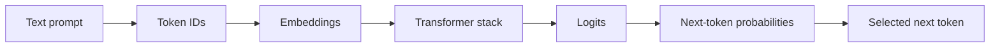

# Week 1: LLM Fundamentals

This module gives the minimum LLM foundation needed to begin senior/principal ML systems
interview prep. It assumes strong hardware architecture intuition, but little prior LLM
terminology.

## Learning Goals

- Explain what an LLM is in one precise paragraph.
- Describe tokens, token IDs, embeddings, logits, and next-token prediction.
- Understand autoregressive generation as a repeated loop, not as database lookup.
- Explain why Transformers became the dominant architecture family.
- Connect LLM basics to compute, memory, bandwidth, and production bottlenecks.

## Why This Matters For NVIDIA, OpenAI, And Anthropic Interviews

At NVIDIA, you may need to connect model structure to GPU, memory, interconnect, and
software platform choices. At OpenAI and Anthropic, you may need to reason about model
behavior, inference cost, safety, reliability, and infrastructure tradeoffs.

For senior and principal roles, interviewers rarely want a textbook definition alone.
They want to know whether you can turn model terminology into system constraints and
architectural decisions.

## What An LLM Is

A large language model maps a sequence of input tokens to probability distributions over
possible next tokens. The model is "language" because its input and output are symbolic
sequences, and it is a "model" because it has learned statistical structure from training
data rather than storing rows like a database.

In the common decoder-only mental model, the model reads a prompt, produces scores over
the vocabulary for the next token, samples or selects one token, appends it, and repeats
the process. OpenAI's API documentation describes generation as returning predicted
completions and token probabilities for a prompt (Source 3).

## What "Large" Means In LLM

"Large" is not one single threshold. In interviews, use it as shorthand for several
scaling pressures:

- Many parameters, usually far beyond what fits in CPU cache or a single small device.
- Large activation tensors and intermediate states during training and inference.
- Large context windows, which increase memory and scheduling pressure.
- Large serving fleets, where latency, throughput, reliability, and cost matter.

For hardware reasoning, "large" usually means the workload is shaped by tensor math,
memory capacity, bandwidth, communication, and software orchestration.

## Tokens, Token IDs, Embeddings, And Logits

Tokens are discrete symbols that a model processes. They may correspond to a character,
part of a word, a full word, punctuation, whitespace, or another learned text fragment.
OpenAI's public token documentation describes tokens as chunks of text processed by text
generation and embedding models (Sources 2 and 3).

A tokenizer maps text to token IDs. Token IDs are integers from a fixed vocabulary. The
model does not directly operate on raw characters or words; it operates on these IDs.

Embeddings are learned dense vectors associated with tokens or positions. You can think of
an embedding lookup as turning a sparse symbol into a dense numeric representation that
the accelerator can process as tensor data.

Logits are unnormalized scores over the output vocabulary. A later probability conversion,
commonly a softmax, turns those scores into a distribution used for token selection.
In system terms, the model's final hidden state is projected into a vocabulary-sized score
vector before sampling or decoding policy is applied.

This is an original schematic based on the Week 1 sources. It intentionally hides
attention math, KV cache mechanics, and serving details.

## The Simplest Mental Model Of Generation

Autoregressive generation is repeated next-token prediction:

1. Convert the prompt into token IDs.
2. Run the model on the current token sequence.
3. Produce logits for the next token.
4. Convert logits into probabilities.
5. Select or sample the next token.
6. Append that token and repeat until a stop condition is reached.

This is why generation latency often has a loop shape. It is also why memory and
scheduling become central: the system is not just doing one large batch computation and
returning a finished answer.

## Why Transformers Became Dominant

The Transformer architecture replaced recurrence and convolution in the original paper's
sequence transduction setting with an attention-based design that was more parallelizable
for training (Source 1). That parallelism was a major systems advantage: more of the work
could be expressed as tensor operations that map well onto accelerators.

For Week 1, the key point is not the attention equation. The key point is that Transformers
made sequence modeling look more like a dense tensor workload with explicit data movement,
memory growth, and communication patterns.

## Transformer Purpose, Without Deep Math

A Transformer stack repeatedly updates token representations so each position can carry
more context about the sequence. At the output, the model uses the final representation to
score the next token.

From a hardware architect's perspective, the Transformer stack is a pipeline of:

- Tensor contractions and matrix multiplies.
- Data reshaping and movement.
- Intermediate activations.
- Memory reads and writes.
- Later, communication when the model or batch spans multiple devices.

The attention math, KV cache, fine-tuning, RLHF, and serving internals are later modules.
Week 1 is only building the vocabulary and the system mental model.

## Training Versus Inference, Preview Only

Training updates model weights using data and an optimization procedure. It usually cares
about throughput, parallel scaling, checkpointing, optimizer state, and failure recovery.

Inference uses already-trained weights to generate outputs for user or application
requests. It usually cares about latency, throughput, memory footprint, scheduling, and
cost per token.

Both use accelerator tensor math, but the bottlenecks can feel different. Training often
has large parallel batches and optimizer state. Inference can be dominated by request
shape, decode loops, KV cache memory, and serving policy.

## Production Intuition For A Hardware Architect

Translate every new LLM term into one of four system questions:

- What tensor operation is being performed?
- What data must stay resident in memory?
- What bandwidth is required to feed compute?
- What communication appears when scaling beyond one device?

This keeps the topic grounded. The model may seem abstract, but production LLM systems are
still constrained by familiar architecture forces: arithmetic intensity, locality,
capacity, bandwidth, synchronization, scheduling, and utilization.

## Common Misconceptions

- An LLM is not a database. It does not look up answers in weights the way a database
  queries rows.
- Tokens are not always words. They can be word pieces, spaces, punctuation, or other text
  fragments.
- Embeddings are not a magic meaning store. They are learned vectors used by the model.
- Logits are not probabilities yet. They are scores before probability conversion.
- "Transformer" does not mean "all details are attention." MLPs, normalization, residuals,
  memory layout, and serving policy also matter.
- "Large" is not just parameter count. Context length, batch shape, memory, software, and
  cluster topology matter too.

## Interviewer Questions You Should Be Ready For

- What is an LLM, precisely?
- What is the difference between a token, token ID, embedding, logit, and probability?
- Why did Transformers become attractive for accelerator-based systems?
- Why is generation a loop instead of a single fixed computation?
- Why is an LLM not equivalent to a database?
- What hardware bottlenecks would you expect before studying the details?

## Senior/Principal-Level Answer Patterns

- Start simple, then connect to systems: "An LLM predicts next-token distributions; at
  scale this becomes a tensor, memory, and serving problem."
- Be precise about abstractions: tokens are discrete, embeddings are dense vectors, and
  logits are scores.
- Avoid anthropomorphic language when the interviewer asks for mechanisms.
- Tie model behavior to hardware bottlenecks without overclaiming details not yet covered.
- Name what you do not know yet, then state the likely system axis to investigate.

## Week 1 Self-Check

- Can you explain next-token prediction without saying the model "knows" the answer?
- Can you draw the token-to-logit pipeline from memory?
- Can you explain why parallelism helped Transformers become accelerator-friendly?
- Can you give one compute, one memory, and one communication question for any LLM topic?
- Can you clearly separate training and inference at a preview level?

## Sources

Source 1: Vaswani et al., "Attention Is All You Need."
https://arxiv.org/abs/1706.03762

Source 2: OpenAI Help Center, "What are tokens and how to count them?"
https://help.openai.com/en/articles/4936856-what-are-tokens-and-how-to-count-them

Source 3: OpenAI API docs, "Key concepts."
https://developers.openai.com/api/docs/concepts

Source 4: OpenAI API reference, "Completions."
https://developers.openai.com/api/reference/resources/completions
