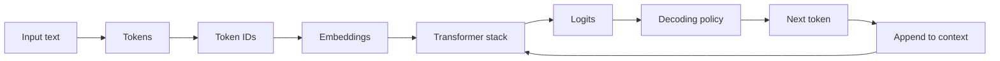
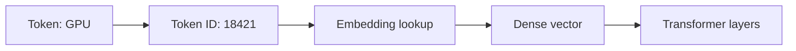
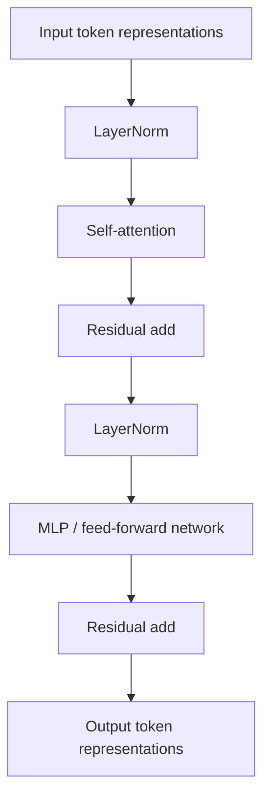
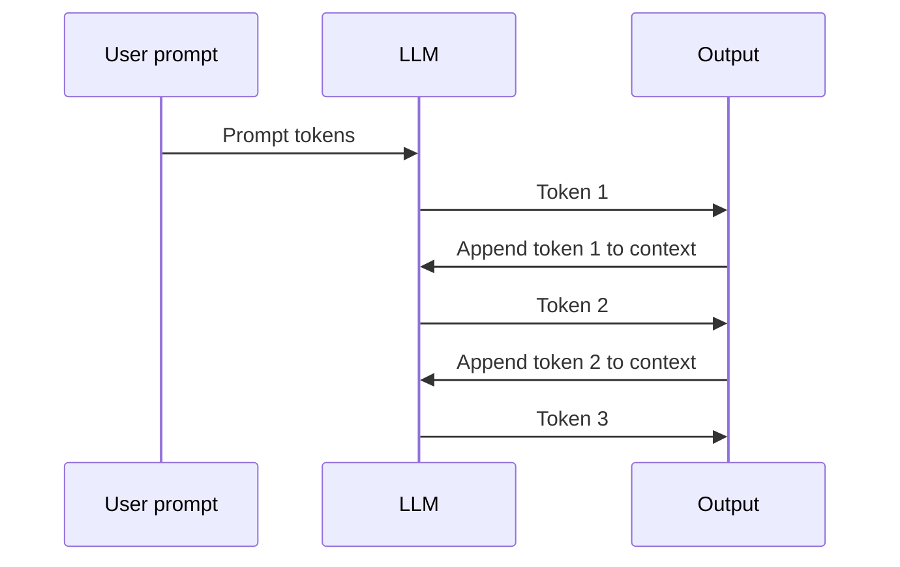

# LLM Fundamentals

This module introduces large language models from first principles and frames
them for a senior hardware architect preparing for NVIDIA, OpenAI, and
Anthropic interviews.

The goal is not to become an ML researcher in Week 1. The goal is to build a
correct mental model that supports later modules on attention, KV cache,
training, inference serving, quantization, GPU architecture, and cluster-scale
systems.

## Table of contents

- [Learning goals](#learning-goals)
- [Why this matters for interviews](#why-this-matters-for-interviews)
- [What an LLM is](#what-an-llm-is)
- [What large means](#what-large-means)
- [Tokens versus words](#tokens-versus-words)
- [Token IDs](#token-ids)
- [Embeddings](#embeddings)
- [Transformer purpose](#transformer-purpose)
- [Why Transformers became dominant](#why-transformers-became-dominant)
- [Logits and probabilities](#logits-and-probabilities)
- [Autoregressive generation](#autoregressive-generation)
- [Training versus inference preview](#training-versus-inference-preview)
- [Production intuition for a hardware architect](#production-intuition-for-a-hardware-architect)
- [Why LLMs are not databases](#why-llms-are-not-databases)
- [Where the simple mental model breaks](#where-the-simple-mental-model-breaks)
- [Common misconceptions](#common-misconceptions)
- [What can go wrong in interviews](#what-can-go-wrong-in-interviews)
- [Interviewer questions to expect](#interviewer-questions-to-expect)
- [Senior/principal answer patterns](#seniorprincipal-answer-patterns)
- [Week 1 self-check](#week-1-self-check)
- [Sources](#sources)

## Learning goals

By the end of this module, you should be able to:

- Explain what an LLM is without hand-waving.
- Distinguish text, tokens, token IDs, embeddings, logits, and probabilities.
- Explain autoregressive generation as repeated next-token prediction.
- Explain why Transformers became the dominant LLM architecture family.
- Connect LLM concepts to hardware bottlenecks.
- Answer basic LLM interview questions at senior/principal level.
- Avoid common misconceptions that lead to weak interview answers.

## Why this matters for interviews

For NVIDIA, OpenAI, and Anthropic interviews, LLM fundamentals are not trivia.
They are the vocabulary that lets you discuss system design, accelerator
architecture, inference, training, and performance tradeoffs.

An interviewer may begin with a simple question:

> What is an LLM?

A weak answer stays at product level:

> It is a chatbot that predicts words.

A stronger answer uses the right abstraction:

> An autoregressive LLM maps a sequence of tokens to logits over the next token.
> A decoding policy converts logits into a token choice. At system level, the
> model is a stack of dense tensor operations with memory, communication, and
> latency bottlenecks.

That second answer is the target.

## What an LLM is

A large language model is a neural network trained on large collections of
tokenized data to model sequences.

For a standard autoregressive LLM, the core task is:

```text
P(next_token | previous_tokens)
```

The model receives a sequence of previous tokens and produces a probability
distribution over the next token. Generation repeats this step many times.



The user sees language. The hardware sees tensors, memory movement, and
communication.

## What large means

The word "large" usually refers to a combination of:

- Many parameters.
- Large training datasets.
- Long training runs.
- Large activation and KV-cache footprints.
- Large serving fleets.
- Large communication requirements.
- Large cost sensitivity.

A parameter is a learned number in the model. Model weights are the learned
parameters used during inference and updated during training.

For systems interviews, "large" should immediately raise questions about HBM
capacity, memory bandwidth, interconnect bandwidth, scheduling, cost, and
latency.

## Tokens versus words

LLMs usually do not operate directly on words or characters. They operate on
tokens.

A token is a discrete symbol produced by a tokenizer. A token may correspond to:

- A full word.
- Part of a word.
- Punctuation.
- Whitespace.
- A common character sequence.
- A special control symbol.

For example, the text below:

```text
GPUs accelerate LLMs.
```

might be split into illustrative token-like chunks:

```text
["GPU", "s", " accelerate", " LLM", "s", "."]
```

The exact split depends on the tokenizer. The example is only for intuition.

Tokens matter because sequence length is counted in tokens. Long contexts
increase compute, memory traffic, and KV-cache capacity pressure.

## Token IDs

A tokenizer maps each token to an integer ID from a fixed vocabulary.

| Token | Illustrative token ID |
| --- | ---: |
| `GPU` | 18421 |
| `s` | 82 |
| ` accelerate` | 39210 |
| ` LLM` | 51007 |
| `.` | 13 |

The numbers above are illustrative. They are not real tokenizer output.

The model does not treat token ID 18421 as a meaningful scalar magnitude. The ID
is an index into an embedding table.

## Embeddings

An embedding is a learned dense vector associated with a token ID.

Conceptually:

```text
token_id -> embedding_table[token_id] -> dense vector
```

If the model hidden size is 8192, each token embedding is an 8192-element
vector. The exact size depends on the model.



Hardware intuition:

- Token IDs are small discrete indices.
- Embeddings are dense vectors.
- Transformer layers operate on dense tensors.
- The expensive work is the computation and memory traffic after embedding
  lookup.

## Transformer purpose

Modern LLMs are usually based on the Transformer architecture. The original
Transformer paper introduced an architecture based on attention mechanisms and
dispensed with recurrence and convolution for the sequence transduction model.

For Week 1, use this mental model:

> A Transformer block repeatedly mixes information across token positions and
> transforms each token representation through learned linear operations.

A simplified decoder-only Transformer block:



This is a conceptual diagram. Later modules cover attention, causal masking,
MLPs, normalization, residuals, and KV cache in detail.

## Why Transformers became dominant

Transformers fit both the modeling problem and the hardware problem.

From a modeling perspective, attention lets the model condition token
representations on other tokens in the sequence.

From a systems perspective, Transformer layers rely heavily on dense linear
algebra. Dense matrix operations map well to GPUs, Tensor Cores, and custom
accelerators.

The original Transformer paper also emphasized improved parallelization compared
with recurrent sequence models.

A weak interview answer is:

> Transformers are good because attention is powerful.

A stronger answer is:

> Transformers became dominant because attention and feed-forward layers provide
> strong sequence modeling capacity while exposing large dense tensor operations.
> That combination supports scaling on modern accelerator systems.

## Logits and probabilities

The final model layer produces logits.

Logits are unnormalized scores over the vocabulary. If the vocabulary has
100,000 tokens, the model produces roughly one score per possible next token.

| Candidate token | Illustrative logit |
| --- | ---: |
| `GPU` | 7.2 |
| `CPU` | 4.1 |
| `memory` | 3.8 |
| `banana` | -2.5 |

A decoding step converts logits into a next-token choice. The system may use
softmax, temperature, top-k sampling, nucleus sampling, greedy decoding, or
other strategies.

At Week 1 level:

- Logits are scores.
- Probabilities are derived from scores.
- Decoding policy affects output behavior.
- Generation repeats this process one token at a time.

## Autoregressive generation

Autoregressive generation means generating one token at a time, where each new
token depends on the previous context.



This loop creates two important inference phases:

- Prefill: process the input prompt.
- Decode: generate output tokens step by step.

Week 1 only previews this distinction. Later modules connect it to KV cache,
batching, latency, throughput, and GPU utilization.

## Training versus inference preview

Training and inference use the same model weights but stress systems
differently.

| Dimension | Training | Inference |
| --- | --- | --- |
| Goal | Learn weights | Generate outputs |
| Weight update | Yes | No |
| Main phases | Forward, backward, optimizer | Prefill, decode |
| Memory pressure | Weights, activations, gradients, optimizer state | Weights and KV cache |
| Cluster need | Often very large | Ranges from one GPU to fleets |
| User-visible metric | Training time and cost | Latency, throughput, quality, cost |

A common interview mistake is to discuss "LLM performance" without saying
whether the context is training or inference.

## Production intuition for a hardware architect

For a hardware architect, an LLM is a workload with recurring pressure points.

| LLM concept | Hardware or system implication |
| --- | --- |
| Parameters | HBM capacity and weight bandwidth |
| Hidden size | Matrix dimensions and activation footprint |
| Sequence length | Attention cost and KV-cache growth |
| Batch size | Utilization, latency, and memory tradeoff |
| Decode loop | Sequential dependency and latency sensitivity |
| Tensor parallelism | Scale-up communication pressure |
| Data parallelism | Scale-out communication pressure during training |
| Quantization | Accuracy, throughput, memory, and hardware support |

A senior answer connects model vocabulary to bottleneck analysis.

## Why LLMs are not databases

An LLM is not a database.

A database stores explicit records and retrieves them using queries. An LLM
stores learned statistical structure in weights and generates outputs from
context and learned parameters.

This distinction matters because:

- LLMs can hallucinate.
- LLMs may produce plausible but false text.
- LLMs do not guarantee factual retrieval.
- Retrieval-augmented generation adds an external retrieval path.
- The base model is still not a database.

Avoid both extremes:

- Do not describe LLMs as magic reasoning engines.
- Do not describe them as simple lookup tables.

## Where the simple mental model breaks

"Next-token predictor" is useful, but incomplete.

It does not fully explain:

- Emergent behavior from scale.
- Instruction following.
- Tool use.
- Chain-of-thought style reasoning behavior.
- Multimodal extensions.
- Alignment and preference tuning.
- Retrieval-augmented generation.
- Agentic workflows.
- Production safety and evaluation.

Use next-token prediction as the base mechanism. Later modules add the missing
production concepts.

## Common misconceptions

| Misconception | Better view |
| --- | --- |
| LLMs predict words | They predict tokens. |
| Token IDs have numeric meaning | Token IDs are vocabulary indices. |
| Embeddings are fixed semantic labels | Embeddings are learned dense vectors. |
| Logits are probabilities | Logits are scores before probability conversion. |
| LLMs retrieve facts from weights | They generate from parameters and context. |
| Training and inference are the same workload | They stress systems differently. |
| Bigger always means better | Bigger changes quality, cost, latency, and risk. |

## What can go wrong in interviews

Watch for these failure modes:

- Using product language instead of technical language.
- Saying "word" when the precise term is "token."
- Treating token IDs as meaningful numeric values.
- Confusing embeddings with one-hot vectors.
- Confusing logits with probabilities.
- Explaining Transformers only as "attention."
- Ignoring MLPs and dense linear algebra.
- Ignoring the training versus inference distinction.
- Failing to connect LLM concepts to hardware bottlenecks.

## Interviewer questions to expect

You should be ready to answer:

1. What is an LLM?
2. What is a token?
3. What is an embedding?
4. What are logits?
5. How does an LLM generate text?
6. Why did Transformers become dominant?
7. Why are LLMs good workloads for GPUs?
8. How is training different from inference?
9. Why is an LLM not a database?
10. What are the main bottlenecks in LLM inference?

## Senior/principal answer patterns

### Question: What is an LLM?

Weak answer:

> It is an AI model that understands language and answers questions.

Acceptable answer:

> It is a neural network trained on text to predict the next token in a sequence.

Strong senior/principal answer:

> An autoregressive LLM maps a sequence of tokens to logits over the next token.
> A decoding policy converts logits into a next-token choice. At system level,
> the model is a stack of dense tensor operations with memory and communication
> bottlenecks that differ between training, prefill, and decode.

### Question: Why do GPUs work well for LLMs?

Weak answer:

> GPUs are faster than CPUs.

Acceptable answer:

> LLMs use many matrix multiplications, and GPUs are good at parallel matrix
> math.

Strong senior/principal answer:

> Transformer layers expose large dense linear algebra that maps well to GPU
> Tensor Cores and high-bandwidth memory systems. But the full answer also
> depends on memory capacity, KV cache, interconnect, collectives, batching,
> kernels, libraries, and serving software. The GPU chip is only one layer of the
> platform.

### Question: What is the difference between training and inference?

Weak answer:

> Training is creating the model, and inference is using it.

Acceptable answer:

> Training updates weights. Inference uses fixed weights to generate outputs.

Strong senior/principal answer:

> Training includes forward, backward, and optimizer steps, so the system must
> handle weights, activations, gradients, optimizer state, and large-scale
> synchronization. Inference uses fixed weights and is often dominated by
> latency, throughput, batching, memory bandwidth, and KV-cache capacity.

## Week 1 self-check

You are ready to move on when you can explain the following without notes:

- Text becomes tokens.
- Tokens become token IDs.
- Token IDs index learned embeddings.
- Transformer layers transform token representations.
- The output layer produces logits.
- Decoding turns logits into next-token choices.
- Generation repeats this loop.
- Transformers expose dense tensor workloads.
- Training and inference have different system bottlenecks.
- LLMs are not databases.

## Sources

- Vaswani et al., "Attention Is All You Need."
  <https://arxiv.org/abs/1706.03762>

- NVIDIA, CUDA C++ Programming Guide.
  <https://docs.nvidia.com/cuda/cuda-c-programming-guide/>

- NVIDIA, TensorRT-LLM documentation.
  <https://docs.nvidia.com/tensorrt-llm/>

- Kwon et al., "Efficient Memory Management for Large Language Model Serving
  with PagedAttention."
  <https://arxiv.org/abs/2309.06180>
