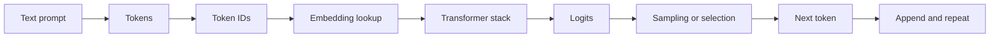
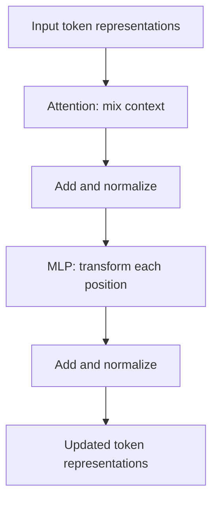

# Week 1: LLM Fundamentals

This module gives the minimum LLM foundation needed for senior and principal ML systems
interviews. It is beginner-accessible on LLM terminology, but assumes strong intuition for
hardware architecture, performance modeling, bandwidth, locality, and PPA tradeoffs.

## Learning Goals

- Explain what an LLM is with accurate, interview-safe wording.
- Distinguish tokens, token IDs, embeddings, logits, probabilities, and generated text.
- Explain autoregressive generation as a repeated next-token loop.
- Use the "next-token predictor" view without reducing the system to a toy model.
- Connect model vocabulary to compute, memory, bandwidth, and serving bottlenecks.
- Identify which Week 1 topics are foundations and which topics are intentionally deferred.

## Sourced Facts Versus Interview Synthesis

Sourced facts in this file include the Transformer origin and parallelism motivation,
OpenAI's public token descriptions, and OpenAI API behavior around completions and token
probabilities. Interview synthesis is marked as such by framing facts into senior-level
answer patterns and hardware intuition.

## Why This Matters For NVIDIA, OpenAI, And Anthropic Interviews

At NVIDIA, the value is translating model structure into GPU, memory, interconnect, and
software requirements. At OpenAI and Anthropic, the value is connecting model behavior to
serving cost, latency, reliability, safety, and infrastructure choices.

For senior and principal roles, interviewers usually do not want a textbook definition by
itself. They want to know whether you can turn a model concept into a system constraint,
a measurement plan, and a defensible architecture tradeoff.

## What An LLM Is

A large language model maps a sequence of input tokens to probability distributions over
possible next tokens. The model is "language" because it operates over symbolic sequences,
and it is a "model" because it learns statistical structure from data rather than storing
answers as database rows.

In a common decoder-only mental model, the model reads a prompt, produces scores over the
vocabulary for the next token, selects or samples a token, appends it to the sequence, and
repeats. OpenAI's public API reference describes a completion as output predicted from a
prompt and can expose token probabilities for generated choices (Source 4).

## What "Large" Means In LLM

"Large" is not one fixed threshold. In interviews, use it as shorthand for multiple
systems pressures:

- Many parameters, often too large to treat as a small local data structure.
- Large activation tensors and intermediate states.
- Large context windows that increase memory and scheduling pressure.
- Large serving fleets where latency, throughput, reliability, and cost matter.
- Large training or inference clusters where communication and failures are first order.

For hardware reasoning, "large" usually means the workload is shaped by tensor math,
memory capacity, bandwidth, communication, and software orchestration.

## Tokens Versus Words

Tokens are discrete symbols processed by the model. They may be characters, word pieces,
whole words, punctuation, spaces, or other text fragments. OpenAI's public documentation
states that tokenization varies by model and encoding, and that text models process text
in chunks called tokens (Sources 2 and 3).

This matters because a prompt's apparent word count is not the same as the sequence length
the model sees. That sequence length affects compute, memory, latency, and context-window
limits.

## Token IDs Versus Embeddings

A tokenizer maps text into token IDs. Token IDs are integer labels in a vocabulary; they
are not dense semantic vectors. The model then uses embedding tables to map those IDs into
learned dense vectors.

Hardware translation:

- Token IDs are compact symbolic indices.
- Embeddings are dense numeric tensors.
- The embedding lookup turns sparse symbolic input into accelerator-friendly data.
- The rest of the model mostly manipulates dense tensors.

## Logits Versus Probabilities

Logits are unnormalized scores over the vocabulary. They are not probabilities yet. A
probability conversion, commonly softmax plus a decoding policy, turns logits into a
distribution or selection rule for the next token.

That distinction matters in interviews. Logits are model outputs before sampling policy;
probabilities and final text are downstream of model scores plus serving-time choices such
as temperature, top-k, top-p, constraints, or deterministic selection.

## Visible Pipeline Diagram



This is an original schematic based on OpenAI token documentation and the common
Transformer generation pipeline (Sources 1, 2, 3, and 4).

## Small Worked Example

The numbers below are illustrative. They are not real tokenizer output and do not come
from a specific production model.

Input text:

```text
AI chips are fast
```

| Step | Example value | Meaning |
| --- | --- | --- |
| Token-like chunks | `AI`, ` chips`, ` are`, ` fast` | Text pieces after tokenization. |
| Token IDs | `812`, `4310`, `527`, `4021` | Integer vocabulary labels. |
| Embedding lookup | `E[812] -> vector` | Learned dense vector for a token ID. |
| Transformer state | `hidden vector` | Contextual representation after layers. |
| Logits | `fast: 4.1`, `useful: 2.8` | Illustrative scores, not probabilities. |
| Selection | choose `fast` or sample | Decoding policy chooses the next token. |

The interview-safe point is that the model does not manipulate English words directly.
It manipulates token IDs, dense vectors, tensor operations, and output scores.

## Autoregressive Generation

Autoregressive generation is repeated next-token prediction:

1. Convert the prompt into token IDs.
2. Run the model on the current token sequence.
3. Produce logits for the next token.
4. Convert logits into a usable selection distribution or ranking.
5. Select or sample the next token.
6. Append that token and repeat until a stop condition is reached.

This is why generation latency often has a loop shape. It is also why memory and
scheduling become central: the system is not just doing one large fixed computation and
returning a finished answer.

## Why The "Next-Token Predictor" View Is Useful But Incomplete

The next-token view is useful because it is mechanistic. It explains why prompts are token
sequences, why logits matter, why generation loops, and why serving systems track tokens.

It is incomplete if it is used to dismiss the system as trivial. The model's next-token
distribution is conditioned on a high-dimensional representation of the prompt, training
data, weights, context, and decoding policy. In interviews, use the view as a mechanism,
not as a claim that the model has no meaningful internal structure or system complexity.

## Why Transformers Became Dominant

The original Transformer paper proposed an attention-based architecture that dispensed
with recurrence and convolution for its sequence transduction setting. The authors argued
that the design was more parallelizable and required less training time for their machine
translation experiments (Source 1).

For Week 1, the key point is not the attention equation. The key point is that Transformers
made sequence modeling look more like a dense tensor workload with explicit memory,
parallelism, and communication implications.

## Transformer Block Mental Model



This is an original Week 1 mental model derived from the Transformer architecture in
Attention Is All You Need (Source 1). It hides multi-head attention math, residual details,
and implementation choices until later weeks.

## Training Versus Inference, Preview Only

Training updates model weights using data and an optimization procedure. It usually cares
about throughput, parallel scaling, checkpointing, optimizer state, and failure recovery.

Inference uses already-trained weights to generate outputs for user or application
requests. It usually cares about latency, throughput, memory footprint, scheduling, and
cost per token.

Both use accelerator tensor math, but the bottlenecks can feel different. Training often
has large parallel batches and optimizer state. Inference can be dominated by request
shape, decode loops, KV-cache memory, and serving policy.

## Future Topics, Not Week 1 Topics

Week 1 does not yet cover:

- Attention math.
- KV-cache layout and capacity planning.
- Fine-tuning, RLHF, or preference optimization.
- Production serving frameworks in detail.
- Distributed training parallelism.
- Quantization and low-precision formats.

These topics need deeper treatment and more careful source work in later modules.

## Production Intuition For A Hardware Architect

Translate each LLM term into one of four system questions:

- What tensor operation is being performed?
- What state must stay resident in memory?
- What bandwidth is required to feed compute?
- What communication appears when scaling beyond one device?

This keeps the topic grounded. The model may seem abstract, but production LLM systems are
still constrained by arithmetic intensity, locality, capacity, bandwidth, synchronization,
scheduling, utilization, and software maturity.

## Common Misconceptions

- An LLM is not a database. It does not look up answers in weights the way a database
  queries rows.
- Tokens are not always words. They can be word pieces, spaces, punctuation, or fragments.
- Token IDs are not embeddings. IDs are symbolic labels; embeddings are learned vectors.
- Logits are not probabilities yet. They are scores before probability conversion.
- "Transformer" does not mean "all details are attention." MLPs, normalization, residuals,
  memory layout, and serving policy also matter.
- "Large" is not just parameter count. Context, batch shape, memory, software, and cluster
  topology matter too.

## What Can Go Wrong In Interviews

- Defining an LLM as "a chatbot" instead of a sequence model.
- Saying tokens are words and then failing when asked about whitespace or word pieces.
- Treating embeddings as a database of meanings.
- Treating logits, probabilities, and generated text as the same thing.
- Overusing "just next-token prediction" in a way that sounds dismissive.
- Jumping into attention math before showing basic system understanding.
- Making unsupported claims about model internals, training data, or company systems.

## Interviewer Questions You Should Be Ready For

- What is an LLM, precisely?
- What is the difference between a token, token ID, embedding, logit, and probability?
- Why did Transformers become attractive for accelerator-based systems?
- Why is generation a loop instead of a single fixed computation?
- Why is an LLM not equivalent to a database?
- What hardware bottlenecks would you expect before studying the details?

## Senior/Principal-Level Answer Patterns

Weak answer:

- Pattern: "An LLM predicts words."
- Interview signal: misses tokens and distributions.

Acceptable answer:

- Pattern: "It predicts the next token."
- Interview signal: mechanically useful, but not yet system-aware.

Strong senior/principal answer:

- Pattern: "It maps tokens to next-token distributions."
- Interview signal: precise, then ready for systems depth.

Use the strong form when interviewing for senior/principal roles. Start simple, then add
hardware consequences and measurement questions.

## Week 1 Self-Check

- Can you explain next-token prediction without saying the model "knows" the answer?
- Can you draw the token-to-logit pipeline from memory?
- Can you explain why the next-token view is useful but incomplete?
- Can you describe a Transformer block without attention math?
- Can you give one compute, one memory, and one communication question for any LLM topic?
- Can you clearly separate training and inference at a preview level?

## Sources

- Source 1: Vaswani et al., "Attention Is All You Need."
  https://arxiv.org/abs/1706.03762

- Source 2: OpenAI Help Center, "What are tokens and how to count them?"
  https://help.openai.com/en/articles/4936856-what-are-tokens-and-how-to-count-them

- Source 3: OpenAI API docs, "Key concepts."
  https://developers.openai.com/api/docs/concepts

- Source 4: OpenAI API reference, "Completions."
  https://developers.openai.com/api/reference/resources/completions
