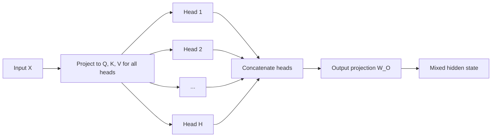
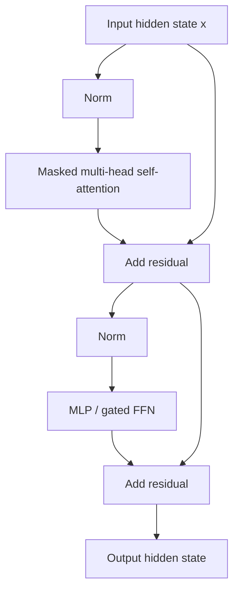
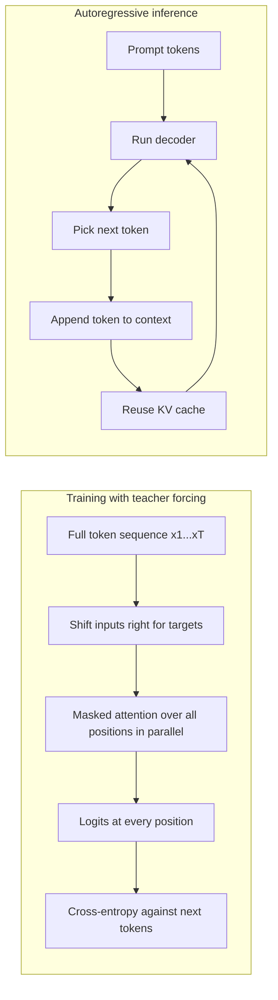

# Transformer Architecture

## Table of contents

- [Introduction](#introduction)
- [Visual roadmap](#visual-roadmap)
- [First-principles vocabulary](#first-principles-vocabulary)
- [Decoder-only Transformer from input to logits](#decoder-only-transformer-from-input-to-logits)
- [Tokenization, embeddings, and hidden states](#tokenization-embeddings-and-hidden-states)
- [Positional information](#positional-information)
- [Original Transformer vs. GPT-style decoder-only models](#original-transformer-versus-gpt-style-decoder-only-models)
- [Self-attention mechanics](#self-attention-mechanics)
- [Multi-head attention](#multi-head-attention)
- [Transformer block anatomy](#transformer-block-anatomy)
- [MLP, FFN, and gated FFN](#mlp-ffn-and-gated-ffn)
- [Residuals and normalization](#residuals-and-normalization)
- [Training versus inference](#training-versus-inference)
- [Systems intuition](#systems-intuition)
- [Interview answer patterns](#interview-answer-patterns)
- [Whiteboard explanation](#whiteboard-explanation)
- [Self-check questions](#self-check-questions)
- [Sources and visual references](#sources-and-visual-references)

## Introduction

Week 1 established the language-modeling boundary conditions: text is turned into tokens, the model
produces logits, and decoding turns logits into the next token. Week 2 answers the architectural
question in between: **what computation turns a stream of token IDs into contextual hidden states and
then into logits?** For senior ML systems and ML hardware interviews, that answer must be clear at
three levels at once: algorithmic, numerical, and systems-facing.

For interview purposes, the cleanest mental model is this: a decoder-only Transformer alternates
**token mixing** and **feature mixing**. Masked self-attention mixes information across token
positions that are allowed to see one another. The MLP mixes features within each token position.
Residual paths and normalization make the stack trainable at depth. A final normalization and an LM
head project hidden states into vocabulary logits. That decomposition is simple enough to whiteboard,
but deep enough to carry into discussions about throughput, memory traffic, KV cache behavior, and
sequence-length scaling.

This file is written for a senior candidate preparing for NVIDIA, OpenAI, and Anthropic interviews.
It therefore emphasizes first principles, tensor-shape literacy, common traps, architectural
variants that matter in modern LLMs, and the hardware consequences of each major operation. The
focus is the **standard decoder-only Transformer path from input text to logits**, while still
contrasting it with the original encoder-decoder Transformer and modern LLaMA-style block choices.

*Section source note:* Vaswani et al., *Attention Is All You Need*, Introduction, §3, and §4
[Vaswani2017]; Radford et al., *Improving Language Understanding by Generative Pre-Training*, §3.1
[GPT2018]; Radford et al., *Language Models are Unsupervised Multitask Learners*, §2.2-§2.3
[GPT22019]; Brown et al., *Language Models are Few-Shot Learners*, abstract [GPT32020]; Touvron et
al., *Llama 2*, §2.2 [Llama22023].

## Visual roadmap

This file includes the following architecture visuals. Where a stable public figure is available,
it is embedded inline directly. Otherwise, the file uses a faithful original study diagram with the
exact source basis named directly below it.

<table>
  <thead>
    <tr>
      <th>Visual</th>
      <th>What it covers</th>
      <th>Where it appears</th>
    </tr>
  </thead>
  <tbody>
    <tr>
      <td>End-to-end decoder-only pipeline</td>
      <td>
        Prompt → tokenizer → token IDs → embeddings → positions → blocks → norm → LM head → logits
      </td>
      <td>Decoder-only Transformer from input to logits</td>
    </tr>
    <tr>
      <td>Tokenization and embedding visual</td>
      <td>Text pieces, token IDs, embedding lookup, embedding matrix intuition</td>
      <td>Tokenization, embeddings, and hidden states</td>
    </tr>
    <tr>
      <td>Encoder-decoder versus decoder-only comparison</td>
      <td>Original Transformer, decoder-only stack, causal self-attention, missing cross-attention</td>
      <td>Original Transformer versus GPT-style decoder-only models</td>
    </tr>
    <tr>
      <td>Q/K/V attention pipeline</td>
      <td>Projection to Q/K/V, score computation, scaling, masking, softmax, value aggregation</td>
      <td>Self-attention mechanics</td>
    </tr>
    <tr>
      <td>Causal mask visual</td>
      <td>Lower-triangular visibility and contrast with bidirectional attention</td>
      <td>Causal masking subsection inside self-attention mechanics</td>
    </tr>
    <tr>
      <td>Multi-head attention visual</td>
      <td>Multiple heads, per-head subspaces, concatenation, output projection</td>
      <td>Multi-head attention</td>
    </tr>
    <tr>
      <td>Modern decoder block visual</td>
      <td>Pre-norm, masked self-attention, residuals, MLP, residuals, output hidden state</td>
      <td>Transformer block anatomy</td>
    </tr>
    <tr>
      <td>MLP / FFN visual</td>
      <td>Per-token feature mixing, up projection, activation or gate, down projection</td>
      <td>MLP, FFN, and gated FFN</td>
    </tr>
    <tr>
      <td>Positional information visual</td>
      <td>Sinusoidal, learned absolute, and RoPE intuition</td>
      <td>Positional information</td>
    </tr>
    <tr>
      <td>Training versus inference visual</td>
      <td>Teacher forcing, parallel training, autoregressive generation, KV-cache intuition</td>
      <td>Training versus inference</td>
    </tr>
    <tr>
      <td>Systems-cost visual</td>
      <td>T × T score matrix, GEMM-heavy projections, memory-heavy softmax/norm/residual paths</td>
      <td>Systems intuition</td>
    </tr>
    <tr>
      <td>Whiteboard-ready visual</td>
      <td>A two-minute diagram a candidate can reproduce under interview pressure</td>
      <td>Whiteboard explanation</td>
    </tr>
  </tbody>
</table>

## First-principles vocabulary

Read this section before diving into the block diagrams. In interviews, many mistakes come from
using a familiar word too loosely. The goal here is to make each term precise enough that you can
say it out loud on a whiteboard without backtracking.

### Core definitions

<table>
  <thead>
    <tr>
      <th>Term</th>
      <th>Plain definition</th>
    </tr>
  </thead>
  <tbody>
    <tr>
      <td><strong>token</strong></td>
      <td>A discrete symbol from the tokenizer vocabulary. It may be a whole word, part of a word,
      punctuation, whitespace pattern, or a byte-derived piece.</td>
    </tr>
    <tr>
      <td><strong>tokenizer</strong></td>
      <td>The preprocessing system that maps raw text into tokens or token IDs and maps them back at
      decode time.</td>
    </tr>
    <tr>
      <td><strong>vocabulary</strong></td>
      <td>The finite set of token symbols the model can represent directly.</td>
    </tr>
    <tr>
      <td><strong>token ID</strong></td>
      <td>An integer index for a token in the vocabulary. It is an address, not a semantic vector.</td>
    </tr>
    <tr>
      <td><strong>embedding</strong></td>
      <td>A learned dense vector associated with a token ID or position.</td>
    </tr>
    <tr>
      <td><strong>embedding matrix</strong></td>
      <td>A table of learned vectors with one row per vocabulary item. Looking up a token means
      gathering its row.</td>
    </tr>
    <tr>
      <td><strong>hidden state</strong></td>
      <td>The model's current vector representation for one token position at one layer. Unlike an
      embedding, it is contextual and changes from layer to layer.</td>
    </tr>
    <tr>
      <td><strong>sequence length</strong></td>
      <td>The number of token positions processed together in one forward pass. Often denoted <code>T</code>.</td>
    </tr>
    <tr>
      <td><strong>batch size</strong></td>
      <td>The number of sequences processed together. Often denoted <code>B</code>.</td>
    </tr>
    <tr>
      <td><strong>model width</strong></td>
      <td>The hidden dimension of the model, often written <code>d_model</code> or just <code>d</code>.</td>
    </tr>
    <tr>
      <td><strong>layer</strong></td>
      <td>One repeated stage of computation in the stack.</td>
    </tr>
    <tr>
      <td><strong>decoder block</strong></td>
      <td>One repeated decoder layer containing masked self-attention, an MLP, residual connections,
      and normalization.</td>
    </tr>
    <tr>
      <td><strong>attention</strong></td>
      <td>A weighted aggregation mechanism that forms an output by weighting value vectors according to
      query-key compatibility.</td>
    </tr>
    <tr>
      <td><strong>self-attention</strong></td>
      <td>Attention where queries, keys, and values all come from the same sequence of hidden states.</td>
    </tr>
    <tr>
      <td><strong>masked self-attention</strong></td>
      <td>Self-attention with an added mask that forbids certain query-key connections, usually future
      positions in decoder-only language models.</td>
    </tr>
    <tr>
      <td><strong>causal mask</strong></td>
      <td>A mask that prevents position <code>i</code> from attending to positions greater than <code>i</code>.</td>
    </tr>
    <tr>
      <td><strong>padding mask</strong></td>
      <td>A mask that prevents real tokens from attending to padding tokens that exist only for batching
      convenience.</td>
    </tr>
    <tr>
      <td><strong>query</strong></td>
      <td>A learned projection of a hidden state representing what a position is looking for.</td>
    </tr>
    <tr>
      <td><strong>key</strong></td>
      <td>A learned projection representing what a position offers for matching.</td>
    </tr>
    <tr>
      <td><strong>value</strong></td>
      <td>A learned projection carrying the content that is actually mixed into the output.</td>
    </tr>
    <tr>
      <td><strong>attention score</strong></td>
      <td>The pre-softmax compatibility number between a query and a key, usually a scaled dot product.</td>
    </tr>
    <tr>
      <td><strong>attention weight</strong></td>
      <td>The post-softmax normalized attention coefficient used to weight value vectors.</td>
    </tr>
    <tr>
      <td><strong>softmax</strong></td>
      <td>A function that turns a vector of scores into positive weights that sum to one.</td>
    </tr>
    <tr>
      <td><strong>attention head</strong></td>
      <td>One independent set of Q/K/V projections and one attention computation over a subspace of the
      model width.</td>
    </tr>
    <tr>
      <td><strong>multi-head attention</strong></td>
      <td>Several attention heads run in parallel, followed by concatenation and an output projection.</td>
    </tr>
    <tr>
      <td><strong>MLP / FFN</strong></td>
      <td>The position-wise feed-forward network applied independently at each token position after
      attention.</td>
    </tr>
    <tr>
      <td><strong>activation function</strong></td>
      <td>The nonlinearity inside the MLP, such as ReLU, GELU, or a gate such as SwiGLU.</td>
    </tr>
    <tr>
      <td><strong>GELU</strong></td>
      <td>A smooth nonlinear activation often used in GPT-family MLPs.</td>
    </tr>
    <tr>
      <td><strong>SwiGLU</strong></td>
      <td>A gated feed-forward variant that multiplies one projection by a swish-activated second
      projection before projecting back down.</td>
    </tr>
    <tr>
      <td><strong>residual connection</strong></td>
      <td>An additive skip path that adds a sublayer input back to the sublayer output.</td>
    </tr>
    <tr>
      <td><strong>LayerNorm</strong></td>
      <td>A per-token normalization that subtracts mean, scales by standard deviation, then applies
      learned gain and bias.</td>
    </tr>
    <tr>
      <td><strong>RMSNorm</strong></td>
      <td>A per-token normalization that rescales by root-mean-square without explicit mean-centering.</td>
    </tr>
    <tr>
      <td><strong>pre-norm</strong></td>
      <td>A block layout in which normalization happens before the attention or MLP sublayer.</td>
    </tr>
    <tr>
      <td><strong>post-norm</strong></td>
      <td>A block layout in which normalization happens after adding the residual output.</td>
    </tr>
    <tr>
      <td><strong>positional encoding</strong></td>
      <td>Any mechanism that injects token order information into an otherwise order-agnostic attention
      stack.</td>
    </tr>
    <tr>
      <td><strong>RoPE</strong></td>
      <td>Rotary positional embedding, which rotates Q and K by position-dependent phases so relative
      position affects attention scores.</td>
    </tr>
    <tr>
      <td><strong>logits</strong></td>
      <td>Unnormalized scores over the vocabulary before softmax.</td>
    </tr>
    <tr>
      <td><strong>LM head</strong></td>
      <td>The final linear projection from hidden width to vocabulary size.</td>
    </tr>
    <tr>
      <td><strong>next-token prediction</strong></td>
      <td>The objective of predicting token <code>t+1</code> from tokens up to <code>t</code>.</td>
    </tr>
    <tr>
      <td><strong>teacher forcing</strong></td>
      <td>Training with the ground-truth prefix supplied as input, rather than feeding the model's own
      sampled outputs back in.</td>
    </tr>
    <tr>
      <td><strong>autoregressive inference</strong></td>
      <td>Generation that appends one newly predicted token at a time and re-runs the model on the
      growing prefix.</td>
    </tr>
    <tr>
      <td><strong>KV cache</strong></td>
      <td>Stored past keys and values for each layer during autoregressive decoding so they do not need
      to be recomputed from scratch every step.</td>
    </tr>
  </tbody>
</table>

### Minimum interview vocabulary

<table>
  <thead>
    <tr>
      <th>Term</th>
      <th>One-line definition</th>
      <th>Why it matters</th>
      <th>Common mistake</th>
    </tr>
  </thead>
  <tbody>
    <tr>
      <td>token</td>
      <td>The model's discrete text symbol.</td>
      <td>Everything starts as a token sequence.</td>
      <td>Equating token with word.</td>
    </tr>
    <tr>
      <td>embedding</td>
      <td>A learned dense vector for a token ID.</td>
      <td>It is the first continuous representation.</td>
      <td>Confusing it with the token ID.</td>
    </tr>
    <tr>
      <td>hidden state</td>
      <td>A contextual representation at one layer and position.</td>
      <td>It is what flows through the stack.</td>
      <td>Using it as a synonym for embedding.</td>
    </tr>
    <tr>
      <td>Q/K/V</td>
      <td>Learned projections used to score and aggregate attention.</td>
      <td>They define how attention works mechanically.</td>
      <td>Treating them as fixed semantic objects.</td>
    </tr>
    <tr>
      <td>head</td>
      <td>One parallel attention subspace.</td>
      <td>Heads let attention run in parallel over multiple subspaces.</td>
      <td>Confusing a head with a whole layer.</td>
    </tr>
    <tr>
      <td>causal mask</td>
      <td>A future-blocking attention mask.</td>
      <td>It enforces autoregressive generation.</td>
      <td>Mixing it up with padding masks.</td>
    </tr>
    <tr>
      <td>softmax</td>
      <td>A row-wise normalization from scores to weights.</td>
      <td>It turns raw compatibility scores into a convex weighting.</td>
      <td>Calling the pre-softmax scores probabilities.</td>
    </tr>
    <tr>
      <td>MLP</td>
      <td>The per-token feed-forward sublayer.</td>
      <td>It supplies major capacity and compute, not an optional extra.</td>
      <td>Saying the block is “just attention.”</td>
    </tr>
    <tr>
      <td>residual</td>
      <td>An additive skip connection around a sublayer.</td>
      <td>It stabilizes deep training and preserves signal paths.</td>
      <td>Confusing residual add with concatenation.</td>
    </tr>
    <tr>
      <td>LayerNorm</td>
      <td>Per-token mean-and-variance normalization.</td>
      <td>It stabilizes hidden-state scale.</td>
      <td>Saying it normalizes across the batch.</td>
    </tr>
    <tr>
      <td>RMSNorm</td>
      <td>Per-token RMS rescaling without mean-centering.</td>
      <td>It is common in modern decoder-only LLMs.</td>
      <td>Saying it is just LayerNorm with a new name.</td>
    </tr>
    <tr>
      <td>RoPE</td>
      <td>A positional method that rotates Q and K by position.</td>
      <td>It is standard in many modern open LLMs.</td>
      <td>Calling it an additive absolute embedding.</td>
    </tr>
    <tr>
      <td>logits</td>
      <td>Vocabulary scores before softmax.</td>
      <td>They are the direct model output used for decoding.</td>
      <td>Calling logits probabilities.</td>
    </tr>
    <tr>
      <td>KV cache</td>
      <td>Saved past keys and values for decoding.</td>
      <td>It is central to inference latency and memory footprint.</td>
      <td>Thinking it removes sequential generation.</td>
    </tr>
  </tbody>
</table>

### Common beginner traps

<table>
  <thead>
    <tr>
      <th>Trap</th>
      <th>Correction</th>
      <th>Why it matters in interviews</th>
    </tr>
  </thead>
  <tbody>
    <tr>
      <td>token vs. word</td>
      <td>A token may be a full word, subword, punctuation pattern, or byte-derived piece.</td>
      <td>Interviewers use “token” precisely because context length and vocabulary are token-based.</td>
    </tr>
    <tr>
      <td>token ID vs. embedding</td>
      <td>The ID is an integer index; the embedding is a learned vector looked up by that index.</td>
      <td>This separates discrete preprocessing from neural computation.</td>
    </tr>
    <tr>
      <td>embedding vs. hidden state</td>
      <td>An embedding is the starting vector; a hidden state is the contextualized
      vector after one or more layers.</td>
      <td>The distinction matters when explaining Q/K/V sources and layer outputs.</td>
    </tr>
    <tr>
      <td>logits vs. probabilities</td>
      <td>Logits are unnormalized scores; probabilities appear only after softmax.</td>
      <td>This is one of the most common verbal mistakes in LLM interviews.</td>
    </tr>
    <tr>
      <td>attention score vs. attention weight</td>
      <td>Scores are pre-softmax; weights are post-softmax normalized coefficients.</td>
      <td>It matters when describing masking and scaling.</td>
    </tr>
    <tr>
      <td>attention head vs. layer</td>
      <td>A layer contains many heads plus an output projection and an MLP.</td>
      <td>Confusing these makes tensor-shape explanations fall apart.</td>
    </tr>
    <tr>
      <td>self-attention vs. cross-attention</td>
      <td>Self-attention uses one sequence for Q/K/V; cross-attention takes Q from one stream and K/V
      from another.</td>
      <td>This is the core architecture difference between decoder-only and encoder-decoder designs.</td>
    </tr>
    <tr>
      <td>causal mask vs. padding mask</td>
      <td>Causal masks block future tokens; padding masks block fake batch-padding positions.</td>
      <td>They often coexist, and interviewers notice if you merge them conceptually.</td>
    </tr>
    <tr>
      <td>encoder-decoder vs. decoder-only</td>
      <td>Decoder-only drops the encoder stack and cross-attention for plain next-token prediction.</td>
      <td>Important when comparing GPT-style models with the original Transformer.</td>
    </tr>
    <tr>
      <td>MLP as optional or minor</td>
      <td>The MLP is a major source of parameters, nonlinearity, and FLOPs.</td>
      <td>Senior answers should never describe the block as only attention.</td>
    </tr>
    <tr>
      <td>residual connection vs. concatenation</td>
      <td>Residuals add tensors of the same shape; they do not append channels.</td>
      <td>This matters for both tensor shapes and optimization intuition.</td>
    </tr>
    <tr>
      <td>LayerNorm vs. RMSNorm</td>
      <td>LayerNorm centers and rescales; RMSNorm rescales without explicit mean-centering.</td>
      <td>Modern LLM architecture discussions often hinge on this distinction.</td>
    </tr>
    <tr>
      <td>pre-norm vs. post-norm</td>
      <td>Pre-norm normalizes before the sublayer; post-norm normalizes after residual addition.</td>
      <td>It changes training behavior, not just notation.</td>
    </tr>
    <tr>
      <td>RoPE vs. learned absolute embeddings</td>
      <td>RoPE acts inside attention by rotating Q and K; learned absolute
      embeddings are additive position vectors.</td>
      <td>Modern decoder stacks often use RoPE, so this is a practical interview distinction.</td>
    </tr>
    <tr>
      <td>training parallelism vs. inference sequentiality</td>
      <td>Causal masking allows parallel training over all known positions, but generation is still
      token-by-token.</td>
      <td>This is a standard systems-and-algorithms interview question.</td>
    </tr>
    <tr>
      <td>attention cost vs. total Transformer cost</td>
      <td>Attention is the source of quadratic sequence-length scaling, but
      projections and MLPs are also major compute terms.</td>
      <td>A senior answer distinguishes FLOP-heavy GEMMs from sequence-length-sensitive score tensors.</td>
    </tr>
    <tr>
      <td>attention-map interpretability overclaim</td>
      <td>Heads can show useful patterns, but attention alone is not a complete explanation of model
      reasoning.</td>
      <td>Good candidates show caution rather than overclaiming semantic certainty.</td>
    </tr>
  </tbody>
</table>

*Section source note:* Vaswani et al., §3.2-§3.5 [Vaswani2017]; Radford et al., §3.1 and §4.1
[GPT2018]; Radford et al., §2.2-§2.3 [GPT22019]; Ba et al., abstract [LayerNorm2016]; Zhang and
Sennrich, abstract [RMSNorm2019]; Su et al., abstract [RoFormer2021]; Xiong et al., abstract and
Figure 1 discussion [Xiong2020]; Hugging Face, “Caching” [HFCache].

## Decoder-only Transformer from input to logits

A decoder-only Transformer is easiest to understand as a dataflow pipeline with one repeated block.
The tokenizer produces token IDs. The model looks up token embeddings, injects positional
information, applies the same decoder block many times, normalizes the final hidden states, and
projects them into vocabulary logits. Those logits can be turned into a probability distribution by
softmax, and the distribution over the **last visible position** is what drives next-token decoding.
During training, the model produces logits for every position in parallel. During generation, it
still computes logits at every visible position internally, but only the newest position matters for
the next emitted token.

```mermaid
flowchart LR
    A["Text prompt"] --> B["Tokenizer"]
    B --> C["Token pieces"]
    C --> D["Token IDs"]
    D --> E["Token embedding lookup"]
    E --> F["Add or apply positional information"]
    F --> G["Decoder block × L"]
    G --> H["Final norm"]
    H --> I["LM head"]
    I --> J["Logits over vocabulary"]
    J --> K["Softmax for analysis or sampling"]
    K --> L["Next-token distribution"]
```



*Inline visual note:* No single stable public figure cleanly shows this full decoder-only
prompt-to-logits pipeline at the exact level of detail needed here, so this study diagram remains a
faithful original.

*Source basis:* Faithful original decoder-only study diagram synthesized from Vaswani et al.,
Figure 1 and §3.1 [Vaswani2017]; Radford et al., §3.1 [GPT2018]; Radford et al., §2.3 [GPT22019];
Touvron et al., §2.2 [Llama22023].

> **What it shows:** the full forward path a senior candidate should be able to narrate from memory.
>
> **Why it matters:** it is the fastest route from “I know the terms” to “I can explain the model.”
>
> **Interviewer may ask:** “Walk me from raw prompt to next-token logits without skipping any major
> component.”

A useful shape summary for the forward pass is below.

<table>
  <thead>
    <tr>
      <th>Symbol</th>
      <th>Meaning</th>
      <th>Typical shape intuition</th>
    </tr>
  </thead>
  <tbody>
    <tr>
      <td><code>B</code></td>
      <td>batch size</td>
      <td>number of sequences processed together</td>
    </tr>
    <tr>
      <td><code>T</code></td>
      <td>sequence length</td>
      <td>number of token positions in the current context</td>
    </tr>
    <tr>
      <td><code>d</code></td>
      <td>model width</td>
      <td>hidden-state dimension per token</td>
    </tr>
    <tr>
      <td><code>V</code></td>
      <td>vocabulary size</td>
      <td>number of possible output tokens</td>
    </tr>
    <tr>
      <td><code>X_0</code></td>
      <td>input hidden states after embedding and position</td>
      <td><code>[B, T, d]</code></td>
    </tr>
    <tr>
      <td><code>X_l</code></td>
      <td>hidden states after layer <code>l</code></td>
      <td><code>[B, T, d]</code></td>
    </tr>
    <tr>
      <td><code>H</code></td>
      <td>final normalized hidden states</td>
      <td><code>[B, T, d]</code></td>
    </tr>
    <tr>
      <td><code>logits</code></td>
      <td>vocabulary scores</td>
      <td><code>[B, T, V]</code></td>
    </tr>
  </tbody>
</table>

At high level, the repeated block does two things over and over. Attention lets each position look
leftward into the visible context and pull in relevant information from other tokens. The MLP then
transforms the resulting per-token features with a nonlinear channel-mixing update. If you keep
that token-mixing versus feature-mixing split in mind, most of the architecture becomes easier to
explain.

## Tokenization, embeddings, and hidden states

The neural network does **not** ingest raw text characters directly. A tokenizer first segments text
into model symbols. Exact pieces depend on the tokenizer family and trained merges, so the example
below is illustrative rather than tied to one specific released model.

```text
Text prompt
    "Transformers love GPUs"

Illustrative token pieces
    ["Transform", "ers", " love", " GPU", "s"]

Illustrative token IDs
    [14523, 419, 1842, 9876, 82]

Embedding lookup
    E ∈ R^(V × d)

    row 14523 -> e_1
    row   419 -> e_2
    row  1842 -> e_3
    row  9876 -> e_4
    row    82 -> e_5

Initial token-state matrix
    X_token = [e_1; e_2; e_3; e_4; e_5] ∈ R^(T × d)
```

*Source basis:* Faithful original tokenization-and-embedding study diagram grounded in Vaswani et
al., §3.4 “Embeddings and Softmax” [Vaswani2017]; Radford et al., §3.1 and §4.1 [GPT2018];
Radford et al., §2.2-§2.3 [GPT22019]; Touvron et al., §2.2 “Tokenizer” [Llama22023].

> **What it shows:** tokenization happens before the neural stack, and embeddings are row lookups,
> not mysterious semantic clouds.
>
> **Why it matters:** many interview mistakes come from skipping the discrete-to-continuous boundary.
>
> **Interviewer may ask:** “What exactly is the difference between a token ID, an embedding, and a
> hidden state?”

A few distinctions must stay crisp:

- A **token** is a discrete symbol.
- A **token ID** is the integer address for that symbol.
- An **embedding** is the learned dense vector retrieved from the embedding matrix using that ID.
- A **hidden state** is the contextual vector at some later layer after attention and MLP updates.

The original Transformer uses learned token embeddings of dimension <code>d_model</code> and adds
positional information to them before the encoder or decoder stack [Vaswani2017]. The original GPT
paper explicitly writes the autoregressive decoder input as token embeddings plus a learned position
embedding matrix <code>W_p</code>, with the hidden stack then transformed by repeated decoder blocks
[GPT2018]. GPT-2 keeps the decoder-only framing but changes the tokenizer choice to byte-level BPE,
making the input representation more robust to unrestricted Unicode text while still retaining the
benefits of subword compression [GPT22019]. Llama 2 uses a BPE tokenizer implemented through
SentencePiece and a 32k-token vocabulary [Llama22023].

An embedding matrix is often best understood as a learned table:

```text
Embedding matrix E

    token ID   token piece     learned row vector in R^d
    ----------------------------------------------------
       42      "the"           E[42]
      419      "ers"           E[419]
    14523      "Transform"     E[14523]
```

Looking up embeddings is therefore closer to a **gather** than to a standard dense matrix multiply.
That matters later when we map operations to systems behavior.

## Positional information

Self-attention alone does not know that one token came before another. If you permute the input
sequence and permute the outputs the same way, the attention mechanism itself is still valid. The
model therefore needs some additional mechanism that injects order.

```text
Three common positional strategies

    Sinusoidal absolute positions
        x_i = e_i + p_i
        p_i is fixed, deterministic, and built from sin/cos waves.

    Learned absolute positions
        x_i = e_i + p_i
        p_i is a learned row from a position table P.

    Rotary positional embedding (RoPE)
        q_i = R(i) q̂_i
        k_j = R(j) k̂_j
        score(i,j) = q_i · k_j
        Relative offset (i - j) changes the attention score through rotation.
```

*Source basis:* Faithful original positional-information study diagram grounded in Vaswani et al.,
§3.5 “Positional Encoding” [Vaswani2017]; Radford et al., Eq. (2) and §4.1 [GPT2018]; Su et al.,
abstract [RoFormer2021]; Touvron et al., §2.2 [Llama22023].

> **What it shows:** sinusoidal and learned absolute schemes add position vectors at input, whereas
> RoPE changes the attention computation itself by rotating Q and K.
>
> **Why it matters:** positional design is one of the clearest differences between early GPT-family
> models and many modern decoder-only LLMs.
>
> **Interviewer may ask:** “How does RoPE differ from just adding position embeddings?”

The original Transformer adds sinusoidal positional encodings to token embeddings and reports that
learned positional embeddings gave nearly identical translation quality in their setting, while the
sinusoidal version was chosen because it might extrapolate better to longer unseen sequence lengths
[Vaswani2017]. The original GPT paper instead uses learned position embeddings added to token
embeddings inside a decoder-only language model [GPT2018].

RoPE changes the picture in a more modern way. RoFormer describes RoPE as encoding absolute
position with a rotation matrix while introducing explicit relative-position dependency into the
self-attention formulation [RoFormer2021]. In practice, this gives a concise interview intuition:
**absolute token index determines the rotation, but the attention score depends on the relative phase
between positions.** Llama 2 explicitly adopts RoPE in its standard decoder architecture
[Llama22023].

For interviews, the simplest contrast is:

<table>
  <thead>
    <tr>
      <th>Scheme</th>
      <th>Where it acts</th>
      <th>Interview intuition</th>
    </tr>
  </thead>
  <tbody>
    <tr>
      <td>Sinusoidal absolute</td>
      <td>Added to token embeddings</td>
      <td>Fixed coordinate system for token order</td>
    </tr>
    <tr>
      <td>Learned absolute</td>
      <td>Added to token embeddings</td>
      <td>Model learns a position table directly</td>
    </tr>
    <tr>
      <td>RoPE</td>
      <td>Applied to Q and K inside attention</td>
      <td>Relative distance modifies dot-product structure</td>
    </tr>
  </tbody>
</table>

## Original Transformer versus GPT-style decoder-only models

The original Transformer is an **encoder-decoder** architecture. The encoder reads the source
sequence with unmasked self-attention. The decoder generates the target sequence autoregressively,
using masked self-attention over prior target tokens and a separate cross-attention sublayer that
reads encoder outputs. GPT-style language models simplify that setup when the objective is plain
next-token prediction over one running text stream: they keep the masked decoder behavior and remove
the encoder and cross-attention path.

![Original Transformer encoder-decoder architecture][img-jalammar-encdec]

*Public visual source:* Jay Alammar, *The Illustrated Transformer*.
Exact image URL: <https://jalammar.github.io/images/xlnet/transformer-encoder-decoder.png>

*Why this public image is used:* it is a stable, high-quality visual for the original
encoder-decoder architecture and shows the encoder stack, decoder stack, and cross-stack flow more
faithfully than a generic block-and-arrow sketch.

To connect that original architecture to modern LLM interview language, keep the comparison below
in mind.

| Family | Core stack | Attention pattern | Typical use |
| --- | --- | --- | --- |
| Encoder-decoder | Encoder + decoder | Encoder self-attn; decoder masked attn; cross-attn | Translation, seq2seq |
| Decoder-only | Decoder only | Masked self-attn only | GPT-style next-token prediction |
| Encoder-only | Encoder only | Bidirectional self-attn | Representation / classification style tasks |

*Source basis:* Faithful original comparison diagram synthesized from Vaswani et al., Figure 1,
§3.1, and §3.2.3 [Vaswani2017]; Radford et al., §3.1 [GPT2018]; Radford et al., §2.3 [GPT22019];
Touvron et al., §2.2 [Llama22023].

> **What it shows:** standard encoder-decoder models have a cross-attention path from decoder to
> encoder outputs; decoder-only models do not.
>
> **Why it matters:** this is the cleanest architecture distinction between the original Transformer
> and GPT-style LLMs.
>
> **Interviewer may ask:** “What exactly disappeared when the field moved from the original
> Transformer to GPT-style decoder-only language models?”

The original Transformer paper makes the encoder-decoder layout explicit in Figure 1 and §3.1, with
six encoder layers and six decoder layers in the reported base design [Vaswani2017]. The original
GPT paper then uses a **multi-layer Transformer decoder** for language modeling, with masked
self-attention and position-wise feed-forward layers producing an output distribution over next
tokens [GPT2018]. GPT-2 says its language models are Transformer-based and largely follow the OpenAI
GPT model with a few modifications, including moving layer normalization to the input of each
sub-block and adding an extra final layer normalization [GPT22019]. GPT-3 is then an even larger
autoregressive language model built by scaling that decoder-only family [GPT32020]. Llama 2 retains
the decoder-only autoregressive structure while updating the internal block choices with RMSNorm,
SwiGLU, RoPE, and grouped-query attention in larger models [Llama22023].

## Self-attention mechanics

Self-attention is the sublayer that lets each token position update itself by looking at other token
positions in the visible context. In self-attention, the same hidden-state tensor supplies queries,
keys, and values through three learned projections.

![Q/K/V projections from token representations][img-jalammar-qkv]

*Public visual source:* Jay Alammar, *The Illustrated Transformer*.
Exact image URL: <https://jalammar.github.io/images/t/transformer_self_attention_vectors.png>

![Scaled dot-product attention scoring and weighted value aggregation][img-jalammar-self-attn]

*Public visual source:* Jay Alammar, *The Illustrated Transformer*.
Exact image URL: <https://jalammar.github.io/images/t/self-attention-output.png>

```text
Input hidden states
    X ∈ R^(B × T × d)

Per-head projections
    Q = X W_Q
    K = X W_K
    V = X W_V

Scaled dot-product attention
    Scores      S = Q K^T                 shape: [B, H, T, T]
    Scaled       S̃ = S / sqrt(d_h)
    Masked       Ŝ = S̃ + M
    Weights      A = softmax_rowwise(Ŝ)
    Output       Z = A V                  shape: [B, H, T, d_h]
```

*Source basis:* Faithful original Q/K/V study diagram grounded in Vaswani et al., Figure 2 left and
§3.2.1 [Vaswani2017]; Vig, “A Multiscale Visualization of Attention in the Transformer Model,”
§2.3 [BertViz].

> **What it shows:** exactly how hidden states become queries, keys, and values, and how scores turn
> into weighted value aggregation.
>
> **Why it matters:** this is the core equation behind the entire architecture.
>
> **Interviewer may ask:** “Write the self-attention equation and define each tensor in words.”

The original paper defines attention as a weighted sum of values, where weights come from a
compatibility function between the query and the associated keys [Vaswani2017]. In the scaled
variant used by Transformers, the compatibility is a dot product, and the scaling by
<code>1 / sqrt(d_h)</code> is there because large dot products push the softmax into regions with very
small gradients [Vaswani2017]. That is the interview-safe explanation: **scaling keeps scores in a
numerically friendlier range before softmax**.

A clean word-level intuition is:

- the **query** says what the current token is looking for,
- the **key** says what each visible token offers for matching,
- the **value** carries the content that gets mixed into the output.

The distinction between **attention score** and **attention weight** matters. The score is the raw,
possibly masked, pre-softmax number. The weight is the post-softmax normalized coefficient actually
used in the weighted sum with <code>V</code>. Senior candidates usually make that distinction without being
prompted.

### Causal masking

Decoder-only language models must prevent future-token leakage. That is what the causal mask does.
It creates a lower-triangular visibility pattern so query position <code>i</code> can attend only to tokens at
positions <code>≤ i</code>.

```text
Causal self-attention visibility

            keys →     t1   t2   t3   t4   t5
queries ↓
               t1      ✓    ×    ×    ×    ×
               t2      ✓    ✓    ×    ×    ×
               t3      ✓    ✓    ✓    ×    ×
               t4      ✓    ✓    ✓    ✓    ×
               t5      ✓    ✓    ✓    ✓    ✓

Bidirectional self-attention visibility

            keys →     t1   t2   t3   t4   t5
queries ↓
               t3      ✓    ✓    ✓    ✓    ✓
```

*Source basis:* Faithful original mask diagram grounded in Vaswani et al., §3.1 “Decoder” and
§3.2.3 [Vaswani2017]; Harvard NLP, *The Annotated Transformer*, masking and
<code>subsequent_mask</code> discussion [AnnotatedTransformer].

> **What it shows:** lower-triangular visibility is what makes decoder-only attention causal.
>
> **Why it matters:** without the mask, training would leak future information and break next-token
> prediction.
>
> **Interviewer may ask:** “What is the difference between a causal mask and a padding mask?”

Vaswani et al. describe modifying decoder self-attention so that prediction at position <code>i</code> can only
depend on known outputs at positions less than <code>i</code> [Vaswani2017]. In practical implementations, this
is usually done by adding a very large negative number, conceptually <code>-∞</code>, to illegal score entries
before softmax. A padding mask is different: it blocks fake positions inserted only to make batches
rectangular.

## Multi-head attention

Multi-head attention repeats the scaled dot-product attention computation several times in parallel
on lower-dimensional subspaces, then concatenates the results and projects them back into the model
width.



*Source basis:* Faithful original multi-head attention study diagram grounded in Vaswani et al.,
Figure 2 right and §3.2.2 [Vaswani2017]; Jay Alammar, *The Illustrated Transformer*, “The Beast
with Many Heads” [IllustratedTransformer].

> **What it shows:** parallel heads attend in different learned subspaces, then their outputs are
> concatenated and remixed by <code>W_O</code>.
>
> **Why it matters:** this is the reason a single attention layer can represent several patterns at
> once without collapsing everything into one score matrix.
>
> **Interviewer may ask:** “Why not just use one big head?”

The original paper motivates multi-head attention as a way for the model to jointly attend to
information from different representation subspaces at different positions [Vaswani2017]. If the
model width is <code>d</code>, the number of heads is <code>H</code>, and the per-head size is
<code>d_h = d / H</code>, the usual flow is:

1. project <code>X ∈ R^(B × T × d)</code> to packed Q/K/V tensors,
2. reshape to <code>[B, H, T, d_h]</code>,
3. run attention independently per head,
4. transpose and concatenate back to <code>[B, T, H d_h] = [B, T, d]</code>,
5. apply the output projection <code>W_O</code>.

One important caution belongs in senior notes: some heads do show interpretable recurring patterns,
but attention maps should not be overclaimed as the model's full reasoning trace. The visualization
literature is useful precisely because the multi-layer, multi-head structure is difficult to reduce
to one simple story [BertViz].

## Transformer block anatomy

A modern decoder block is usually drawn as a **pre-norm** stack: normalize, run masked
self-attention, add the residual, normalize again, run the MLP, add the residual again. That is the
block you should expect to whiteboard for a GPT-style or LLaMA-style model unless the interviewer
explicitly asks for the original 2017 formulation.



*Source basis:* Faithful original modern decoder-block study diagram synthesized from Vaswani et
al., §3.1 [Vaswani2017]; Xiong et al., Figure 1 and Introduction [Xiong2020]; Radford et al.,
§2.3 [GPT22019]; Touvron et al., §2.2 [Llama22023].

> **What it shows:** the canonical modern decoder block for GPT-style LLM study and interviews.
>
> **Why it matters:** this is the most important single architecture diagram in the file.
>
> **Interviewer may ask:** “Draw one decoder block and explain exactly where normalization and
> residuals sit.”

The original Transformer paper presents each sublayer in post-norm form,
<code>LayerNorm(x + Sublayer(x))</code> [Vaswani2017]. GPT-2 then moved layer normalization to the input of
each sub-block and added an extra final layer normalization after the last self-attention block
[GPT22019]. Xiong et al. describe this as the difference between Post-LN and Pre-LN, and show that
Pre-LN gives better-behaved gradients at initialization [Xiong2020]. Llama 2 keeps the pre-norm
idea but uses RMSNorm instead of LayerNorm [Llama22023].

The safe interview summary is:

<table>
  <thead>
    <tr>
      <th>Layout</th>
      <th>Compact formula</th>
      <th>Use this answer when</th>
    </tr>
  </thead>
  <tbody>
    <tr>
      <td>Post-norm</td>
      <td><code>y = LN(x + F(x))</code></td>
      <td>You are describing the original 2017 Transformer paper.</td>
    </tr>
    <tr>
      <td>Pre-norm</td>
      <td><code>y = x + F(Norm(x))</code></td>
      <td>You are describing most modern decoder-only LLMs.</td>
    </tr>
  </tbody>
</table>

## MLP, FFN, and gated FFN

The MLP sublayer is the part of the block that mixes **features within a token position**. Unlike
attention, which mixes information across positions, the MLP is applied independently to each token.
That is why the original paper calls it a **position-wise feed-forward network** [Vaswani2017].

```text
Per-token FFN / MLP

    h_t ∈ R^d
      │
      ├─ up projection      W_up:   d  → d_ff
      │
      ├─ activation or gate
      │      GELU:    φ(W_up h_t)
      │      SwiGLU:  swish(W_gate h_t) ⊙ (W_up h_t)
      │
      └─ down projection    W_down: d_ff → d

Result: one updated vector for the same token position t
```

*Source basis:* Faithful original FFN study diagram grounded in Vaswani et al., §3.3 Eq. (2)
[Vaswani2017]; Radford et al., §4.1 [GPT2018]; Shazeer, abstract [Shazeer2020]; Touvron et al.,
§2.2 [Llama22023].

> **What it shows:** the MLP does not mix tokens; it expands features, applies nonlinearity or a
> gate, then projects back.
>
> **Why it matters:** it explains why a Transformer block is not “only attention.”
>
> **Interviewer may ask:** “What does the MLP give the model that attention alone does not?”

The original Transformer FFN is exactly two linear transformations with a ReLU between them,

a position-wise network of width <code>d_model → d_ff → d_model</code> [Vaswani2017]. In the canonical example
from the paper, <code>d_model = 512</code> and <code>d_ff = 2048</code>, making the hidden expansion four times wider
[Vaswani2017]. The original GPT paper switches the activation to GELU [GPT2018]. Later work shows
that gated variants can improve quality over the more typical ReLU or GELU activations, and Llama 2
adopts SwiGLU explicitly [Shazeer2020; Llama22023].

The interview-ready contrast is simple:

- **attention** mixes information across token positions,
- **the MLP** mixes channels within one token position.

That distinction also matters for systems intuition. At moderate sequence lengths, the MLP often
accounts for a major fraction of layer FLOPs and parameters because its dense up and down
projections are large GEMMs. At long sequence lengths, attention's <code>T × T</code> score and weight tensors
become far more painful.

## Residuals and normalization

Residual connections make it easier to train deep stacks by giving the network an additive identity
path around each sublayer. The Transformer inherits this idea from residual networks, where layers
learn an update on top of an existing signal rather than having to rewrite the whole representation
from scratch [ResNet2015]. In formula form, the residual idea is simply:

```text
y = x + F(x)
```

The important interview correction is that residuals are **adds**, not concatenations.
Concatenation changes shape. Residual addition preserves shape and creates a short path for signal
and gradient flow.

Normalization controls activation scale within each token representation. LayerNorm computes mean and
variance across the feature dimension of one token representation, then applies learned affine
parameters [LayerNorm2016]. RMSNorm removes the explicit mean-centering step and rescales by the
root mean square instead; its original paper argues that LayerNorm's re-centering invariance is not
essential and reports comparable performance with lower runtime on the tested models [RMSNorm2019].

```text
LayerNorm (conceptually)
    LN(x) = γ ⊙ (x - mean(x)) / sqrt(var(x) + ε) + β

RMSNorm (conceptually)
    RMSNorm(x) = γ ⊙ x / RMS(x)
```

The original Transformer uses post-norm LayerNorm after each residual addition [Vaswani2017].
GPT-2 moves the norm to the input of each sub-block and adds a final norm [GPT22019]. Xiong et al.
show why this matters: Post-LN tends to create large gradients near the output layer at
initialization, which helps explain the heavy reliance on warm-up, while Pre-LN makes gradients much
better behaved at initialization [Xiong2020]. Llama 2 takes the modern route with pre-normalization
using RMSNorm [Llama22023].

For interviews, a concise answer is:

- residuals keep deep stacks trainable by preserving an identity path,
- normalization keeps activation scales controlled,
- pre-norm is the common modern decoder layout,
- RMSNorm is a common modern simplification of LayerNorm.

## Training versus inference

A decoder-only Transformer behaves very differently at the workflow level in training and inference,
even though the block equations are the same.



*Source basis:* Faithful original training-versus-inference study diagram synthesized from Vaswani
et al., §3.1 and decoder masking discussion [Vaswani2017]; Brown et al., §2 “Approach”
[GPT32020]; Hugging Face, “Caching,” attention-matrix and cache sections [HFCache].

> **What it shows:** training predicts every next token in parallel, while inference must still grow
> the context one token at a time.
>
> **Why it matters:** this is the key reason autoregressive serving looks different from training.
>
> **Interviewer may ask:** “If training is parallel, why can't generation be parallel too?”

During **teacher forcing**, the ground-truth prefix is already known, so the model can compute
attention for all positions of the sequence in parallel as long as the causal mask blocks the
future. That is one of the Transformer's biggest advantages over recurrent models [Vaswani2017].
During **autoregressive inference**, the future tokens do not exist yet, so generation still has an
unavoidable sequential outer loop even though each step internally uses highly parallel matrix
operations.

The KV cache makes that loop cheaper but not non-sequential. Hugging Face's cache documentation
explains the key idea clearly: past keys and values can be stored and reused because once a token is
processed in a causal decoder, its K and V representations do not need to be recomputed from scratch
for later decoding steps [HFCache]. At inference time, you mainly need a fresh query for the newest
token, plus the cached past K and V tensors from each layer. This reduces repeated work, but the
cache itself grows with decoded length and layer count [HFCache].

A senior interview answer should therefore say two things at once:

1. causal masking enables **parallel training over known positions**, and
2. autoregressive decoding remains **sequential across newly generated positions**.

## Systems intuition

When a hardware or systems interviewer asks about Transformer cost, do not stop at “attention is
quadratic.” That statement is only part of the real performance picture.

```text
One attention head at sequence length T

    Q, K ∈ R^(T × d_h)
    Scores S = Q K^T ∈ R^(T × T)

              k1   k2   k3   ...   kT
        q1    •    •    •          •
        q2    •    •    •          •
        q3    •    •    •          •
        ...
        qT    •    •    •          •

Dense attention touches O(T^2) score elements per head.
```

*Source basis:* Faithful original systems-cost study diagram grounded in Vaswani et al., Table 1 and
§3.2-§4 [Vaswani2017]; Hugging Face, “Caching” [HFCache]; Dao et al., *FlashAttention*, abstract
[FlashAttention].

> **What it shows:** the pairwise score matrix is the source of quadratic sequence-length growth.
>
> **Why it matters:** long-context cost is dominated not just by parameter count, but by how many
> token-token interactions the layer must score and move through memory.
>
> **Interviewer may ask:** “Which parts of a Transformer are GEMM-friendly, and which parts become
> memory-bound or reduction-heavy?”

A good systems breakdown is:

- **GEMM-heavy and accelerator-friendly:** Q/K/V projections, score matmul <code>QK^T</code>, attention-value
  matmul <code>AV</code>, output projection, MLP up projection, MLP down projection, and the final LM-head
  projection.
- **Reduction and elementwise heavy:** mask application, softmax, LayerNorm or RMSNorm, residual
  adds, and activation or gating functions.
- **Sequence-length-sensitive:** the dense score and weight tensors scale with <code>T × T</code> per head.
- **Inference-memory-sensitive:** the KV cache grows with context length, layer count, and the number
  of stored KV heads [HFCache].

Vaswani et al. explicitly compare self-attention with recurrent and convolutional layers and give
self-attention a per-layer complexity of <code>O(n^2 d)</code> with constant sequential depth, which is the
classic source for the statement that attention is quadratic in sequence length [Vaswani2017]. That
is the correct first answer. But a senior answer should add the second layer of truth: **the full
Transformer layer is not only the score matrix.** The projections and especially the MLP also matter
substantially, and at moderate sequence lengths they can dominate FLOPs even though they are only
linear in <code>T</code>.

FlashAttention adds another important systems intuition. Its abstract argues that standard attention
is not only compute-heavy but also IO-heavy, and that reducing HBM reads and writes can matter more
than asymptotic math alone for wall-clock performance [FlashAttention]. For interview purposes, that
supports this phrasing: **attention is expensive because of both quadratic token-token interactions
and the memory movement around score, mask, softmax, and value aggregation.**

### Transformer operation mapping

<table>
  <thead>
    <tr>
      <th>Operation</th>
      <th>Tensor shape intuition</th>
      <th>Core math</th>
      <th>Compute pattern</th>
      <th>Sequence-length sensitivity</th>
      <th>Systems note</th>
      <th>Common interview mistake</th>
    </tr>
  </thead>
  <tbody>
    <tr>
      <td>Embedding lookup</td>
      <td><code>[B, T]</code> IDs → <code>[B, T, d]</code></td>
      <td>row gather from <code>E</code></td>
      <td>memory gather</td>
      <td>linear in <code>T</code></td>
      <td>Bandwidth-sensitive, not the main GEMM.</td>
      <td>Calling it a matrix multiply.</td>
    </tr>
    <tr>
      <td>Q/K/V projection</td>
      <td><code>[B, T, d]</code> → <code>[B, T, H d_h]</code></td>
      <td>dense linear projections</td>
      <td>large GEMMs</td>
      <td>linear in <code>T</code></td>
      <td>Highly accelerator-friendly.</td>
      <td>Ignoring projection cost and focusing only on <code>QK^T</code>.</td>
    </tr>
    <tr>
      <td>Attention score matmul</td>
      <td><code>[B, H, T, d_h]</code> × <code>[B, H, d_h, T]</code></td>
      <td><code>QK^T</code></td>
      <td>batched GEMM</td>
      <td>quadratic in <code>T</code></td>
      <td>Creates the dense score matrix.</td>
      <td>Thinking this already mixes in values.</td>
    </tr>
    <tr>
      <td>Causal mask</td>
      <td><code>[B, H, T, T]</code></td>
      <td>add <code>-∞</code> to illegal positions</td>
      <td>broadcast elementwise</td>
      <td>quadratic to touch a dense score tensor</td>
      <td>Often fused with attention kernels.</td>
      <td>Saying the mask is applied after softmax.</td>
    </tr>
    <tr>
      <td>Softmax</td>
      <td><code>[B, H, T, T]</code> row-wise</td>
      <td>exp / sum normalization</td>
      <td>reduction + elementwise</td>
      <td>quadratic in <code>T</code></td>
      <td>Less compute-dense than GEMM, often memory-sensitive.</td>
      <td>Calling the output “scores” instead of “weights.”</td>
    </tr>
    <tr>
      <td>Attention-value matmul</td>
      <td><code>[B, H, T, T]</code> × <code>[B, H, T, d_h]</code></td>
      <td><code>AV</code></td>
      <td>batched GEMM</td>
      <td>quadratic in <code>T</code></td>
      <td>Another major dense linear algebra step.</td>
      <td>Forgetting that values, not keys, are aggregated.</td>
    </tr>
    <tr>
      <td>Output projection</td>
      <td><code>[B, T, H d_h]</code> → <code>[B, T, d]</code></td>
      <td><code>Concat(heads) W_O</code></td>
      <td>GEMM</td>
      <td>linear in <code>T</code></td>
      <td>Re-mixes head outputs into model space.</td>
      <td>Forgetting the post-concatenation projection.</td>
    </tr>
    <tr>
      <td>MLP up projection</td>
      <td><code>[B, T, d]</code> → <code>[B, T, d_ff]</code></td>
      <td><code>x W_up</code></td>
      <td>GEMM</td>
      <td>linear in <code>T</code></td>
      <td>Often a major FLOP contributor.</td>
      <td>Underestimating MLP cost and capacity.</td>
    </tr>
    <tr>
      <td>Activation / gate</td>
      <td><code>[B, T, d_ff]</code></td>
      <td>GELU, ReLU, or gate product</td>
      <td>elementwise</td>
      <td>linear in <code>T</code></td>
      <td>Low arithmetic intensity but touches large tensors.</td>
      <td>Treating it as a negligible implementation detail.</td>
    </tr>
    <tr>
      <td>MLP down projection</td>
      <td><code>[B, T, d_ff]</code> → <code>[B, T, d]</code></td>
      <td><code>x W_down</code></td>
      <td>GEMM</td>
      <td>linear in <code>T</code></td>
      <td>Pairs with the up projection as the second large dense MLP step.</td>
      <td>Forgetting that the FFN returns to model width.</td>
    </tr>
    <tr>
      <td>Residual add</td>
      <td><code>[B, T, d]</code> + <code>[B, T, d]</code></td>
      <td><code>x + F(x)</code></td>
      <td>elementwise add</td>
      <td>linear in <code>T</code></td>
      <td>Cheap in FLOPs, but still a full tensor read/write.</td>
      <td>Confusing residual adds with concatenation.</td>
    </tr>
    <tr>
      <td>LayerNorm / RMSNorm</td>
      <td><code>[B, T, d]</code></td>
      <td>per-token feature normalization</td>
      <td>reduction + elementwise</td>
      <td>linear in <code>T</code></td>
      <td>Common fusion target because it is latency-sensitive and bandwidth-heavy.</td>
      <td>Saying it normalizes across the batch dimension.</td>
    </tr>
    <tr>
      <td>LM head / logits projection</td>
      <td><code>[B, T, d]</code> → <code>[B, T, V]</code></td>
      <td><code>H W_vocab</code></td>
      <td>GEMM</td>
      <td>linear in <code>T</code></td>
      <td>Large-vocabulary projection can be sizeable at the output edge.</td>
      <td>Calling logits probabilities.</td>
    </tr>
  </tbody>
</table>

## Interview answer patterns

### Explain a decoder-only Transformer in one answer

“A tokenizer turns the prompt into token IDs, the model looks up token embeddings, injects
positional information, then runs many identical decoder blocks. Each block has masked self-
attention for token mixing and an MLP for feature mixing, both inside residual structure with
normalization. A final norm and LM head project hidden states to vocabulary logits, and the last
position's logits define the next-token distribution.”

### Explain Q, K, and V without hand waving

“Queries say what the current token is looking for, keys say what each visible token offers for
matching, and values are the content that gets aggregated after softmax. In self-attention, all
three are learned linear projections of the same hidden-state tensor.”

### Explain why the scale factor is there

“The dot products grow with head dimension, which can push softmax into saturated regimes with tiny
gradients. Dividing by <code>sqrt(d_h)</code> keeps the score scale better behaved.”

### Explain why decoder-only models need masking

“If future tokens were visible during training, the model could cheat by directly looking at the
answer. The causal mask preserves the autoregressive constraint so position <code>i</code> only depends on the
visible prefix.”

### Explain why multi-head attention exists

“One head gives one learned compatibility pattern. Multiple heads let the model attend in parallel
across several learned subspaces, then combine those views with an output projection.”

### Explain what the MLP does

“Attention mixes information across token positions. The MLP mixes channels within one token
position and supplies a large share of the model's nonlinear capacity and compute.”

### Explain pre-norm versus post-norm

“The original Transformer is post-norm: normalize after adding the residual. Most modern
decoder-only LLMs are pre-norm: normalize before the attention or MLP sublayer. Pre-norm generally
improves training stability in deep stacks.”

### Explain LayerNorm versus RMSNorm

“LayerNorm mean-centers and rescales each token representation. RMSNorm drops the mean-centering and
rescales by RMS only. It is simpler and common in modern LLaMA-style blocks.”

### Explain training versus inference parallelism

“Training is parallel across positions because all ground-truth prefix tokens are already known and
the causal mask blocks only the future. Inference is still sequential across generated tokens because
those future tokens do not exist yet.”

### Explain what the KV cache saves and what it does not save

“It saves recomputation of past keys and values at each layer during decoding. It reduces repeated
work per step, but it does not remove the token-by-token outer loop and it increases memory usage
with context length.”

### Explain why long context is expensive

“Standard dense attention forms score and weight tensors with shape <code>T × T</code> per head, so the
attention part grows quadratically with sequence length. At the same time, the cache and other
activation tensors also grow, so latency and memory pressure both rise.”

## Whiteboard explanation

If you have ninety seconds and a marker, draw this.

```text
prompt text
    │
    ▼
tokenizer → token IDs → embedding lookup → + position
                                   │
                                   ▼
                     ┌─────────────────────────┐
                     │  Norm → masked MHA → +        │
                     │  Norm → MLP / FFN  → +        │   × L
                     └─────────────────────────┘
                                   │
                                   ▼
                              final norm
                                   │
                                   ▼
                                 LM head
                                   │
                                   ▼
                             logits over vocab
                                   │
                                   ▼
                               next token
```

*Source basis:* Faithful original whiteboard diagram synthesized from Vaswani et al., Figure 1 and
§3.1-§3.5 [Vaswani2017]; Radford et al., §3.1 [GPT2018]; Radford et al., §2.3 [GPT22019];
Touvron et al., §2.2 [Llama22023].

> **What it shows:** the shortest correct decoder-only Transformer story you can reproduce under
> pressure.
>
> **Why it matters:** interview performance often depends on whether you can organize the model in a
> small amount of board space.
>
> **Interviewer may ask:** “Give me the two-minute version with enough detail that I know you really
> understand it.”

A strong two-minute narration is:

“Text is tokenized into token IDs. IDs index into a learned embedding table, and the model injects
position information because self-attention alone has no order. Then the sequence passes through
many decoder blocks. Each block has masked multi-head self-attention, which lets each token attend
only to visible earlier tokens, and an MLP, which transforms token features position-wise. Residual
adds and normalization make deep stacking trainable. After the last block, a final norm and LM head
project hidden states into vocabulary logits. The last position's logits produce the next-token
distribution. Training predicts all next tokens in parallel under a causal mask; inference still
emits one token at a time, usually with a KV cache.”

## Self-check questions

1. Why is a token not the same thing as a word?
2. What is the difference between a token ID and an embedding?
3. What is a hidden state, and how is it different from an embedding?
4. Why does a Transformer need positional information at all?
5. What is the difference between sinusoidal, learned absolute, and RoPE-style position handling?
6. What does a decoder-only Transformer remove relative to the original encoder-decoder Transformer?
7. What exactly makes self-attention “self” attention?
8. In one sentence each, what do Q, K, and V do?
9. Why do we divide attention scores by <code>sqrt(d_h)</code>?
10. What is the difference between an attention score and an attention weight?
11. What is the difference between a causal mask and a padding mask?
12. Why can training be parallel across positions even in an autoregressive model?
13. Why is autoregressive inference still sequential?
14. What does one attention head compute that a whole layer does not?
15. Why do multiple heads exist instead of one giant head?
16. What does the MLP contribute that attention does not?
17. Why is it wrong to describe the MLP as optional?
18. What is the difference between a residual add and concatenation?
19. What is the difference between LayerNorm and RMSNorm?
20. What is the difference between pre-norm and post-norm?
21. Which operations in a Transformer block are the big GEMMs?
22. Which operations are reduction-heavy or memory-heavy rather than GEMM-heavy?
23. Why does attention have <code>O(T^2)</code> sequence-length behavior in its dense form?
24. What does the KV cache save, and what cost does it introduce?
25. Why should you be cautious about over-interpreting attention maps?

## Sources and visual references

### Visual references by diagram

<table>
  <thead>
    <tr>
      <th>Diagram in this file</th>
      <th>Exact source basis</th>
      <th>What to inspect if you open the source</th>
    </tr>
  </thead>
  <tbody>
    <tr>
      <td>End-to-end decoder-only pipeline</td>
      <td>Vaswani et al., Figure 1 and §3.1 [Vaswani2017]; GPT decoder
      language-model equations in Radford et al., §3.1 [GPT2018]</td>
      <td>The original encoder-decoder stack and the decoder-only adaptation used for language modeling.</td>
    </tr>
    <tr>
      <td>Tokenization and embedding visual</td>
      <td>Vaswani et al., §3.4 [Vaswani2017]; GPT-2 input representation and BPE
      discussion in §2.2 [GPT22019]; Llama 2 tokenizer note in §2.2
      [Llama22023]</td>
      <td>Where token IDs become vectors, and how vocabulary choices differ across model families.</td>
    </tr>
    <tr>
      <td>Encoder-decoder versus decoder-only comparison</td>
      <td>Vaswani et al., Figure 1 and §3.2.3 [Vaswani2017]; GPT decoder description in §3.1 [GPT2018]</td>
      <td>The presence or absence of cross-attention.</td>
    </tr>
    <tr>
      <td>Q/K/V attention pipeline</td>
      <td>Vaswani et al., Figure 2 left and §3.2.1 [Vaswani2017]</td>
      <td>The exact scaled dot-product attention equation.</td>
    </tr>
    <tr>
      <td>Causal mask visual</td>
      <td>Vaswani et al., §3.1 decoder masking and §3.2.3 [Vaswani2017];
      Harvard NLP mask implementation [AnnotatedTransformer]</td>
      <td>The future-blocking rule inside decoder self-attention.</td>
    </tr>
    <tr>
      <td>Multi-head attention visual</td>
      <td>Vaswani et al., Figure 2 right and §3.2.2 [Vaswani2017]</td>
      <td>Per-head projections, concatenation, and output projection.</td>
    </tr>
    <tr>
      <td>Modern decoder block visual</td>
      <td>Vaswani et al., §3.1 [Vaswani2017]; Xiong et al., Figure 1
      [Xiong2020]; GPT-2 §2.3 [GPT22019]; Llama 2 §2.2 [Llama22023]</td>
      <td>The shift from original post-norm to modern pre-norm decoder blocks.</td>
    </tr>
    <tr>
      <td>MLP / FFN visual</td>
      <td>Vaswani et al., §3.3 Eq. (2) [Vaswani2017]; Shazeer abstract [Shazeer2020]; Llama 2 §2.2 [Llama22023]</td>
      <td>How feature mixing works per token, and how gated FFNs differ from plain ReLU/GELU FFNs.</td>
    </tr>
    <tr>
      <td>Positional information visual</td>
      <td>Vaswani et al., §3.5 [Vaswani2017]; GPT learned position embeddings in
      Eq. (2) [GPT2018]; RoFormer abstract [RoFormer2021]</td>
      <td>Additive position vectors versus rotary position handling.</td>
    </tr>
    <tr>
      <td>Training versus inference visual</td>
      <td>Vaswani et al., decoder masking discussion [Vaswani2017]; Hugging Face cache explanation [HFCache]</td>
      <td>Why teacher forcing parallelizes training but decoding remains sequential.</td>
    </tr>
    <tr>
      <td>Systems-cost visual</td>
      <td>Vaswani et al., Table 1 [Vaswani2017]; FlashAttention abstract [FlashAttention]</td>
      <td>The dense <code>T × T</code> score matrix and the importance of memory movement.</td>
    </tr>
    <tr>
      <td>Whiteboard visual</td>
      <td>Consolidated from the same block-level sources above</td>
      <td>The minimal reproducible decoder-only Transformer explanation.</td>
    </tr>
  </tbody>
</table>

### Primary papers

- Vaswani et al., *Attention Is All You Need* [Vaswani2017]
- Radford et al., *Improving Language Understanding by Generative Pre-Training* [GPT2018]
- Radford et al., *Language Models are Unsupervised Multitask Learners* [GPT22019]
- Brown et al., *Language Models are Few-Shot Learners* [GPT32020]
- Touvron et al., *Llama 2: Open Foundation and Fine-Tuned Chat Models* [Llama22023]

### Normalization, activation, and positional references

- Ba, Kiros, and Hinton, *Layer Normalization* [LayerNorm2016]
- Zhang and Sennrich, *Root Mean Square Layer Normalization* [RMSNorm2019]
- Su et al., *RoFormer: Enhanced Transformer with Rotary Position Embedding* [RoFormer2021]
- Shazeer, *GLU Variants Improve Transformer* [Shazeer2020]
- Xiong et al., *On Layer Normalization in the Transformer Architecture* [Xiong2020]
- He et al., *Deep Residual Learning for Image Recognition* [ResNet2015]

### Implementation tutorials and faithful explainers

- Harvard NLP, *The Annotated Transformer* [AnnotatedTransformer]
- Dive into Deep Learning, *The Transformer Architecture* [D2LTransformer]
- Hugging Face, *Caching* [HFCache]

### Visual explainers

- Jay Alammar, *The Illustrated Transformer* [IllustratedTransformer]
- Jesse Vig, *A Multiscale Visualization of Attention in the Transformer Model* [BertViz]

### Systems context references

- Dao et al., *FlashAttention: Fast and Memory-Efficient Exact Attention with IO-Awareness*
  [FlashAttention]

[Vaswani2017]: https://arxiv.org/abs/1706.03762
[GPT2018]: https://cdn.openai.com/research-covers/language-unsupervised/language_understanding_paper.pdf
[GPT22019]: https://cdn.openai.com/better-language-models/language_models_are_unsupervised_multitask_learners.pdf
[GPT32020]: https://arxiv.org/abs/2005.14165
[Llama22023]: https://arxiv.org/abs/2307.09288
[LayerNorm2016]: https://arxiv.org/abs/1607.06450
[RMSNorm2019]: https://arxiv.org/abs/1910.07467
[RoFormer2021]: https://arxiv.org/abs/2104.09864
[Shazeer2020]: https://arxiv.org/abs/2002.05202
[Xiong2020]: https://arxiv.org/abs/2002.04745
[ResNet2015]: https://arxiv.org/abs/1512.03385
[AnnotatedTransformer]: https://nlp.seas.harvard.edu/annotated-transformer/
[IllustratedTransformer]: https://jalammar.github.io/illustrated-transformer/
[D2LTransformer]: https://d2l.ai/chapter_attention-mechanisms-and-transformers/transformer.html
[HFCache]: https://huggingface.co/docs/transformers/cache_explanation
[FlashAttention]: https://arxiv.org/abs/2205.14135
[BertViz]: https://arxiv.org/abs/1906.05714

[img-jalammar-encdec]: https://jalammar.github.io/images/xlnet/transformer-encoder-decoder.png
[img-jalammar-qkv]: https://jalammar.github.io/images/t/transformer_self_attention_vectors.png
[img-jalammar-self-attn]: https://jalammar.github.io/images/t/self-attention-output.png
