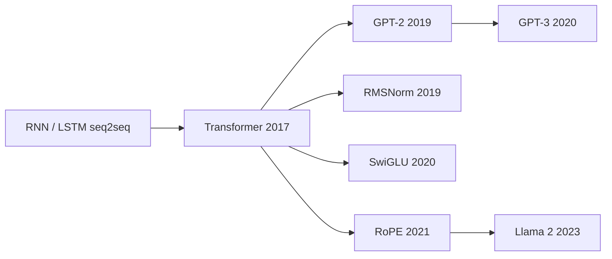
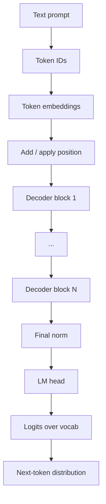
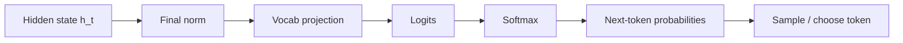
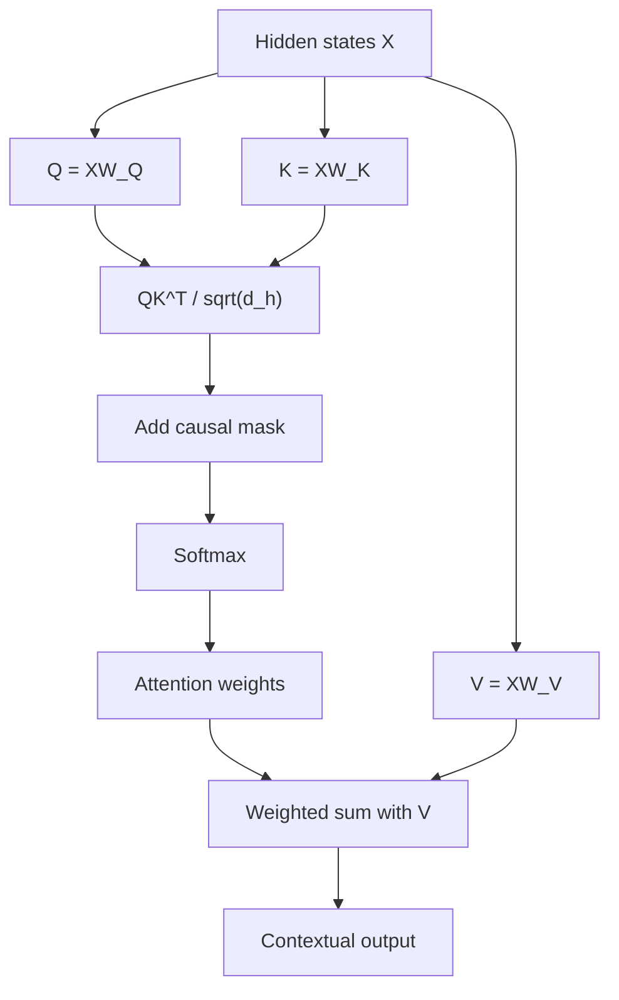
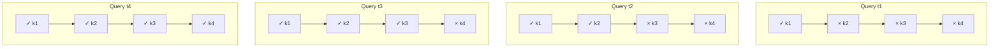
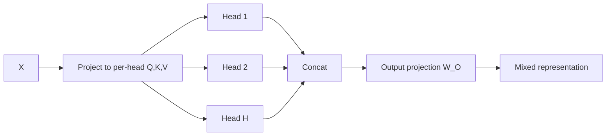
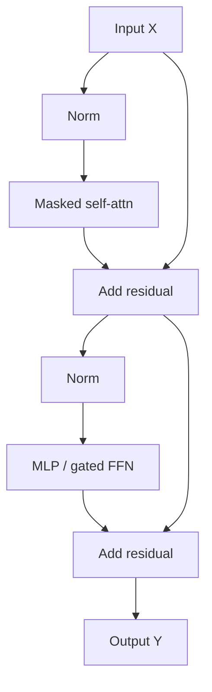

# Transformer Architecture

## Executive summary

This module is a deep dive into the decoder-only Transformer block used by GPT-style large
language models. It builds directly on Week 1 concepts such as tokens, embeddings, logits,
and autoregressive generation, and it stays focused on the architectural mental model that
senior ML systems interviews usually expect. The scope follows the Week 2 curriculum plan.

The core picture is simple but powerful: token IDs become embeddings, positional information is
added or applied, the sequence passes through many identical decoder blocks, a final
normalization is applied, and a vocabulary projection turns the last hidden states into logits
for next-token prediction. Inside each block, masked self-attention mixes information across
visible tokens, while the MLP mixes and transforms features within each token position.
Residual paths and normalization make deep stacks trainable.

If you remember only one sentence, remember this: a decoder-only Transformer alternates
**token-to-token mixing** via masked attention with **feature mixing** via an MLP, while
residual connections and normalization keep the stack stable enough to scale. That mental model
explains most of the architecture, most of the systems cost, and most interview questions.

A practical study path for this week is: learn the full block diagram, derive Q/K/V and masking
shapes once by hand, explain pre-norm versus post-norm cleanly, and be able to connect the
architecture to GPU-friendly matrix multiplies and sequence-length scaling.

## Study goals and source strategy

**What this module covers.**  
This file explains why Transformers displaced recurrence, how the original
encoder-decoder Transformer differs from modern decoder-only LLMs, what each major subcomponent
does, why the architecture trains and scales, and which parts matter most in systems and
interview settings. It intentionally does **not** go deep on KV-cache internals, FlashAttention,
MoE routing, or distributed training kernels, because those are later-week topics in the
curriculum plan.

**Research goals.**  
The practical objective is not just to recognize parts of the diagram, but to explain
cause-and-effect: why self-attention enables parallel training, why positional information is
necessary, why decoder-only models need causal masking, why the MLP is not optional, why norms
moved inside blocks in many modern models, and why sequence length changes runtime so sharply.

**Method and source priority.**  
This module prioritizes original papers and official sources first, then faithful
implementation notes, then university tutorials, and finally high-quality visual explainers.
Where modern practice differs from the 2017 paper, this file says so explicitly instead of
treating all Transformer variants as identical.



This timeline highlights the highest-value lineage for this module: the original Transformer,
GPT-style autoregressive scaling, and the LLaMA-style block updates that now dominate many open
decoder-only LLMs.

| Architecture pattern | What it keeps | What it sees | Best fit |
| --- | --- | --- | --- |
| Encoder-only | Encoder stack | Bidirectional context | Understanding tasks |
| Encoder-decoder | Both stacks + cross-attn | Source sequence and generated target | Conditional generation |
| Decoder-only | Masked decoder stack | Left context only | Autoregressive text generation |

Table note: BERT is encoder-only and explicitly bidirectional, the original Transformer is
encoder-decoder, and GPT-3 is an autoregressive language model built on the GPT-2 architecture.
Decoder-only is the natural simplification when the task is next-token prediction rather than
source-to-target transduction.

**Why Transformers won.**  
Before Transformers, strong sequence models were mostly recurrent or convolutional. The
Transformer removed recurrence and convolutions entirely, used attention to connect tokens more
directly, parallelized training across positions, and achieved strong translation results, such
as 28.4 BLEU on WMT 2014 English-to-German and 41.8 BLEU on English-to-French, with the big
model trained in 3.5 days on eight P100 GPUs. The original paper also argued that self-attention
shortens path length for long-range dependencies compared with recurrence or convolution.

**Encoder-decoder versus decoder-only.**  
The original Transformer has an encoder that builds representations of the input sequence and a
decoder that generates outputs autoregressively while also attending to encoder outputs through
cross-attention. GPT-style LLMs are trained for plain next-token prediction on a single running
context, so they keep the masked decoder behavior and drop encoder/cross-attention machinery.
That is an architectural adaptation for autoregressive language modeling, not a claim that
encoder-decoder models are obsolete for all tasks.

## The decoder-only Transformer from input to logits

**Full decoder-only overview.**  
A modern decoder-only LLM takes token IDs, converts them to vectors, injects positional
information, repeatedly applies the same masked self-attention-plus-MLP block, normalizes the
final hidden states, and projects them into vocabulary-sized logits. During training, the model
predicts the next token at every position using a one-token shift; during generation, it uses
the newest visible context to predict one more token.



This is the simplest correct mental model for a GPT-like stack. The details that vary between
families are mostly inside the repeated block: normalization placement, positional scheme, MLP
activation, and attention variants such as grouped-query attention.

| Symbol | Meaning | Typical shape |
| --- | --- | --- |
| `B` | Batch size | scalar |
| `T` | Sequence length | scalar |
| `d` | Model width | scalar |
| `H` | Number of heads | scalar |
| `d_h` | Per-head width | `d / H` |
| `X` | Hidden states | `[B, T, d]` |
| `Q, K, V` | Query, key, value tensors | `[B, H, T, d_h]` |
| `A` | Attention weights | `[B, H, T, T]` |
| `Y` | Block output | `[B, T, d]` |
| `logits` | Vocabulary scores | `[B, T, V]` |

These shapes follow directly from the attention and multi-head definitions in the original paper
and in faithful tutorial implementations. The original Transformer used `d_model = 512`,
`h = 8`, and `d_k = d_v = 64`, which is the classic example to keep in mind.

**Token embeddings.**  
Token embeddings map discrete token IDs into learned dense vectors. Those vectors are the
initial hidden states of the model, so every later representation is a transformed,
contextualized version of the original embedding plus whatever positional information has been
injected. In the original Transformer, embeddings had dimension `d_model`, and the model also
shared weights with the pre-softmax output projection.

**Positional information.**  
Self-attention by itself is permutation-equivariant: if you reorder the inputs, the output
reorders with them, but attention alone has no built-in notion of “before” or “after.” That is
why positional information is essential for language. The original Transformer added sinusoidal
positional encodings to token embeddings and reported that learned positional embeddings gave
nearly identical results on the benchmark they studied.

The modern decoder-only story is broader. Many current LLMs use rotary positional embeddings
instead of plain additive absolute encodings. RoPE rotates representations by position and builds
relative position information directly into self-attention; the RoFormer paper highlights
sequence-length flexibility and explicit relative-position behavior, and Llama 2 adopts RoPE in
its standard decoder architecture.

| Positional scheme | Mechanism | Useful intuition | Example in this module |
| --- | --- | --- | --- |
| Sinusoidal absolute | Add fixed sin/cos vector | Order is injected at input | Original Transformer |
| Learned absolute | Add learned position vector | Simple, task-specific | Also viable in original study |
| RoPE | Rotate attention representations by position | Relative distance appears in attention | LLaMA-style models |

Table note: the original Transformer compared sinusoidal and learned absolute encodings, while
RoPE is the later positional scheme explicitly adopted in Llama 2.

**Output projection and logits.**  
At the end of the stack, each token position has a contextual hidden state. A final linear layer
maps that hidden state from width `d` to vocabulary size `V`, producing logits. Softmax then
turns logits into a probability distribution over the next token. In training, you compute this
for every position; in autoregressive inference, you usually use the last visible position to
sample or select the next token.



A good interview explanation is: “the model never emits words directly; it emits logits over the
token vocabulary, then decoding turns those scores into the next token.” That cleanly connects
architecture back to Week 1.

## Self-attention mechanics

**Self-attention intuition.**  
Self-attention lets each token build a new representation by looking at other visible tokens and
taking a weighted combination of their value vectors. The famous practical intuition is that a
token like “it” can look back toward the token that best resolves its meaning, rather than
depending only on a short local window or a long recurrent chain. Jay Alammar’s explainer uses
this style of intuition repeatedly, and it matches the formal attention definition in the
original paper.

**Queries, keys, and values.**  
The cleanest mental model is: the query asks what the current token is looking for, the keys say
what each visible token can offer, and the values carry the content that may get mixed into the
new representation. In self-attention, all three come from the same current hidden states after
learned linear projections.

```text
Q = X W_Q
K = X W_K
V = X W_V

Attention(Q, K, V) = softmax((Q K^T) / sqrt(d_h) + mask) V
```

The scale factor `1 / sqrt(d_h)` matters because large dot products can push softmax into regions
with tiny gradients; the original paper introduced the scale specifically to counter that effect.
The mask is what turns generic self-attention into causal self-attention for decoder-only
language modeling.



A systems-friendly translation of the same math is: project once to Q/K/V, compute attention
scores with a batched matrix multiply, run masked softmax, then do another batched matrix
multiply with `V`. That is why attention maps naturally to dense linear algebra operations.

**Causal masking.**  
Decoder-only LLMs must not look at future tokens during next-token prediction. The original
Transformer paper explicitly modified decoder self-attention so that position `i` can depend only
on positions up to `i`, and the Harvard Annotated Transformer shows the usual implementation:
future positions are masked before softmax.



This upper-triangular mask is a small detail with huge consequences. It is what turns the same
attention machinery into an autoregressive generator instead of a bidirectional contextualizer.
If you can explain that clearly, you already sound much more senior.

**Multi-head attention.**  
A single attention head gives one weighted combination pattern. Multi-head attention first
projects Q/K/V into several lower-dimensional subspaces, computes attention in parallel in each
head, then concatenates and projects the results back. The original paper’s motivation was that
multiple heads let the model attend to information from different representation subspaces and
different positions at once.



Do not overclaim interpretability here. Individual heads often show recognizable patterns, but
attention maps are not a complete or reliable explanation of model reasoning. A good interview
answer says heads can specialize **somewhat**, while also noting that attention weights should be
interpreted cautiously.

## The Transformer block and why it trains

**The MLP or feed-forward block.**  
Attention is only half of the block. The original Transformer puts a position-wise feed-forward
network after attention in every layer, applying the same two-layer MLP independently to each
position. In the 2017 paper that MLP expanded `d_model = 512` to `d_ff = 2048`, used ReLU, and
projected back down. This is a big clue for intuition: attention mixes information **across**
tokens, while the MLP transforms information **within** each token’s feature channels.

Many later LLMs modernized the MLP. Llama 2 keeps the standard Transformer skeleton but uses
SwiGLU rather than a plain ReLU MLP, and Shazeer’s GLU-variants paper argues that gated FFN
variants can improve Transformer quality relative to the more typical ReLU or GELU choices.
At a high level, think of GELU-like activations as smooth nonlinear filters and gated FFNs as
letting one projection modulate another.

**Residual connections.**  
Each sublayer sits inside a skip connection. The original Transformer used a residual connection
around every attention and feed-forward sublayer, and the residual-learning idea comes from the
ResNet tradition, where learning residual functions made very deep networks easier to optimize.
For intuition, the residual path gives information and gradients a short fallback route even when
the sublayer update is poor early in training.

**Normalization.**  
Normalization keeps activations numerically well-behaved enough for deep stacks to train. Layer
Normalization computes normalization statistics within a single example rather than across the
batch, making it suitable for sequence models and stable across training and test time.
The original Transformer used LayerNorm together with residual connections.

There is an important interview distinction between **post-norm** and **pre-norm** blocks.
The 2017 paper presents the sublayer output as `LayerNorm(x + Sublayer(x))`, which is post-norm.
The Harvard Annotated Transformer explicitly notes that its code puts the norm first for code
simplicity, yielding a pre-norm style `x + Sublayer(LayerNorm(x))`. GPT-2 also moved layer
normalization to the input of each sub-block, and later analysis showed that Pre-LN yields
better-behaved gradients at initialization and can reduce warm-up dependence.

Modern open LLMs often go one step further and replace LayerNorm with RMSNorm. RMSNorm keeps the
rescaling behavior but drops mean-centering, making it computationally simpler; the original
RMSNorm paper reported comparable performance to LayerNorm with runtime reductions between 7%
and 64% on the tasks they studied, and Llama 2 explicitly adopts pre-normalization with
RMSNorm.

| Choice | Core idea | Why it matters |
| --- | --- | --- |
| Post-norm | `LN(x + F(x))` | Original paper formulation |
| Pre-norm | `x + F(LN(x))` | More stable gradients in deep stacks |
| LayerNorm | Center + scale per example | Standard Transformer normalization |
| RMSNorm | Scale by RMS only | Simpler and often faster in modern LLMs |

Table note: post-norm is the original 2017 presentation, pre-norm appears in the Harvard
implementation and GPT-2-style updates, and RMSNorm is the explicit choice in Llama 2.



That is the one block diagram you should be able to reproduce from memory. If you remember only
two phrases, remember **masked attention for token mixing** and **MLP for feature mixing**. The
rest of the block exists largely to make those updates trainable at depth.

**Stacking blocks.**  
A Transformer is powerful because one block is repeated many times. The original paper used
stacks of identical layers; GPT-2 scaled this pattern from 12 to 48 layers across model sizes,
and GPT-3 scaled a GPT-2-like architecture up to 96 layers and 175B parameters. Llama 2 keeps
the same broad stacked-decoder template but updates the internals with RMSNorm, SwiGLU, RoPE,
and GQA in larger models.

| Family | Stack type | Notable block choices in source |
| --- | --- | --- |
| Transformer 2017 | Encoder-decoder | LayerNorm, residuals, MH-attn, ReLU FFN |
| GPT-2 / GPT-3 | Decoder-style autoregressive LM | Pre-norm-style LayerNorm, final norm, scale-up |
| Llama 2 | Decoder-only autoregressive LM | RMSNorm, SwiGLU, RoPE, GQA on larger models |

Table note: GPT-3 explicitly states it uses the same model and architecture as GPT-2, with sparse
attention-pattern changes; Llama 2 explicitly lists RMSNorm, SwiGLU, RoPE, and GQA.

## Training, inference, and systems intuition

**Training versus inference.**  
The same decoder block behaves differently operationally in training and inference. In training,
teacher-forced tokens are already available, so the model can compute masked self-attention for
all positions in parallel despite the causal constraint. In autoregressive inference, however,
new tokens must still be generated one at a time, so there is an unavoidable sequential outer
loop over generated positions even though the inner linear algebra at each step remains highly
parallel.

For this week, that distinction is enough. You do not need a deep KV-cache treatment yet.
What matters is that masked attention enables parallel training over a visible prefix, while
generation still advances token by token because future tokens do not exist yet.

**Systems intuition.**  
Most of the heavy work in a Transformer comes from dense linear projections and batched matrix
multiplies. The attention equation itself contains two large multiplies, `QK^T` and `Attention *
V`, and the MLP is typically two more large linear layers. This is one major reason the
architecture fits GPUs and tensor accelerators so well.

| Component | Core math | Systems intuition |
| --- | --- | --- |
| Embedding lookup | gather rows from embedding table | Memory-heavy, not the main GEMM |
| Q/K/V projections | linear layers | Large GEMMs |
| Attention scores | `QK^T` | Batched GEMM, grows with `T^2` |
| Mask + softmax | row-wise normalize scores | Reduction + elementwise ops |
| Weighted sum | `A V` | Another batched GEMM |
| MLP / FFN | two linear layers + nonlinearity | Usually a major FLOP share |

Table note: this mapping is a direct readout of the attention formula and tutorial
implementations that use `torch.matmul` for score and value aggregation.

**Why sequence length matters so much.**  
Standard self-attention compares each visible token to every other visible token, so the
attention matrix per head has shape `T x T`. The original Transformer paper’s complexity table
makes the quadratic dependence on sequence length explicit, and later efficiency papers such as
Linformer describe standard self-attention as `O(n^2)` in both time and space with respect to
sequence length. That is why long context windows are expensive even when parameter count stays
fixed.

**Common misconceptions to avoid.**

- **“A Transformer block is just attention.”**  
  False. Every block also contains an MLP, residual structure, and normalization, and those
  components are central to performance and trainability.

- **“Positional encoding is optional.”**  
  False for language modeling. Self-attention is permutation-equivariant without position
  information, so order must be injected somehow.

- **“Heads always correspond to neat human concepts.”**  
  Overstated. Heads can specialize, but attention maps are not a complete explanation of model
  behavior.

- **“Decoder-only replaced everything.”**  
  Too broad. Decoder-only dominates open-ended text generation, but encoder-only and
  encoder-decoder models remain important for other workloads.

- **“Normalization placement is a cosmetic detail.”**  
  Not really. Pre-LN versus post-LN materially affects gradient behavior and training stability.

**Open questions and limits for this week.**  
This module does not settle every modern design choice. Production LLMs also vary in attention
variants, tokenization details, parallel residual layouts, weighting schemes, and inference
optimizations. For Week 2, the important thing is to master the common denominator: the repeated
masked-attention-plus-MLP block.

## Interview toolkit

**Senior interview answer patterns.**  
Use these as concise answer skeletons, not scripts.

- **Explain a decoder-only Transformer block.**  
  “Each block has masked multi-head self-attention for token mixing, then an MLP for feature
  mixing, with residual connections and normalization around both. Repeat that many times,
  then project the final hidden states to vocabulary logits.”

- **Why decoder-only for LLMs?**  
  “The original Transformer was encoder-decoder for source-to-target tasks. GPT-style LMs only
  need next-token prediction over a running context, so they keep the masked decoder behavior
  and drop cross-attention to an external source sequence.”

- **What do queries, keys, and values mean?**  
  “Queries express what a position wants, keys express what each visible position offers, and
  values carry the information that gets mixed in after softmax weighting.”

- **What does the MLP do that attention does not?**  
  “Attention mixes information across tokens; the MLP transforms channels within each token
  position. That is why the block alternates both.”

- **Why do residuals and norms matter?**  
  “Residual paths help information and gradients flow through deep stacks, and norm placement
  strongly affects stability. That is why many modern LLMs use pre-norm and often RMSNorm.”

- **Why does context length hurt so much?**  
  “Because attention scores are pairwise over visible tokens, so per-head attention grows with
  the square of sequence length.”

**A clean whiteboard explanation.**  
If you need to explain the whole model in under two minutes, use this order:

1. Start with token IDs becoming embeddings.  
2. Say that attention alone has no order, so position must be injected.  
3. Draw one decoder block with masked self-attention.  
4. Explain Q, K, V and the causal mask.  
5. Add multi-head attention and say heads attend in different subspaces.  
6. Add the MLP and say it mixes channels per token.  
7. Add residuals and normalization so the stack trains deeply.  
8. End with final norm plus vocabulary projection to logits.

**Week 2 self-check.**  
Try answering these without notes.

- Why did Transformers outperform recurrent seq2seq models conceptually?
- What exactly is different between encoder-decoder and decoder-only stacks?
- Why is positional information necessary in self-attention?
- What do Q, K, and V each represent?
- Why divide by `sqrt(d_h)`?
- What does the causal mask block?
- Why are multiple heads better than one head in principle?
- What is the job of the MLP in a Transformer block?
- Why do residual connections help optimization?
- What is the difference between post-norm and pre-norm?
- Why might a modern LLM choose RMSNorm over LayerNorm?
- What does RoPE change compared with plain additive position vectors?
- Why can training be parallel across positions but generation cannot?
- Which operations in the block are the big matrix multiplies?
- Why does runtime grow so sharply with sequence length?

**Conclusion.**  
A decoder-only Transformer is not mysterious once you hold onto the right decomposition:
embeddings plus position, then repeated blocks that alternate masked attention and MLP updates,
stabilized by residuals and normalization, and finally a vocabulary projection to logits.
If you can explain that structure, its tensor shapes, and its sequence-length cost cleanly, you
have the Week 2 architecture story at the level most interviews actually reward.

## Sources and visual references

### Primary papers and official sources

- Vaswani et al., "Attention Is All You Need."
  https://arxiv.org/abs/1706.03762

- Radford et al., "Language Models are Unsupervised Multitask Learners."
  https://cdn.openai.com/better-language-models/language_models_are_unsupervised_multitask_learners.pdf

- Brown et al., "Language Models are Few-Shot Learners."
  https://arxiv.org/abs/2005.14165

- Touvron et al., "Llama 2: Open Foundation and Fine-Tuned Chat Models."
  https://arxiv.org/abs/2307.09288

- Ba, Kiros, and Hinton, "Layer Normalization."
  https://arxiv.org/abs/1607.06450

- Zhang and Sennrich, "Root Mean Square Layer Normalization."
  https://arxiv.org/abs/1910.07467

- Shazeer, "GLU Variants Improve Transformer."
  https://arxiv.org/abs/2002.05202

- Su et al., "RoFormer: Enhanced Transformer with Rotary Position Embedding."
  https://arxiv.org/abs/2104.09864

- Xiong et al., "On Layer Normalization in the Transformer Architecture."
  https://arxiv.org/abs/2002.04745

- He et al., "Deep Residual Learning for Image Recognition."
  https://arxiv.org/abs/1512.03385

### Course notes, tutorials, and faithful implementations

- Harvard NLP, "The Annotated Transformer."
  https://nlp.seas.harvard.edu/annotated-transformer/

- Jay Alammar, "The Illustrated Transformer."
  https://jalammar.github.io/illustrated-transformer/

- University of Amsterdam, "Transformers and Multi-Head Attention."
  https://uvadlc-notebooks.readthedocs.io/en/latest/tutorial_notebooks/tutorial6/Transformers_and_MHAttention.html

- Dive into Deep Learning, "The Transformer Architecture."
  https://d2l.ai/chapter_attention-mechanisms-and-transformers/transformer.html

- Andrej Karpathy, "Neural Networks: Zero to Hero."
  https://karpathy.ai/zero-to-hero.html

### Prioritized reading order

1. Start with "Attention Is All You Need."
2. Read "The Illustrated Transformer" for visual intuition.
3. Read "The Annotated Transformer" for architecture plus code.
4. Skim GPT-2 and GPT-3 for decoder-only evolution.
5. Finish with Llama 2, RMSNorm, RoPE, and SwiGLU for modern LLM practice.
