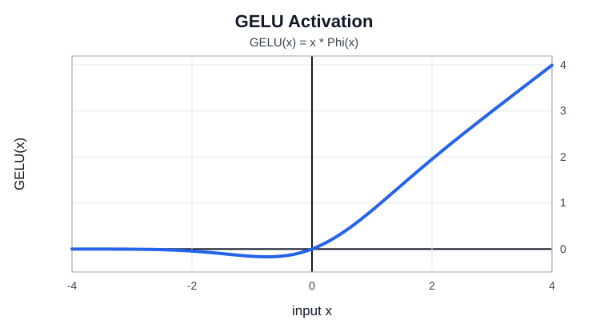
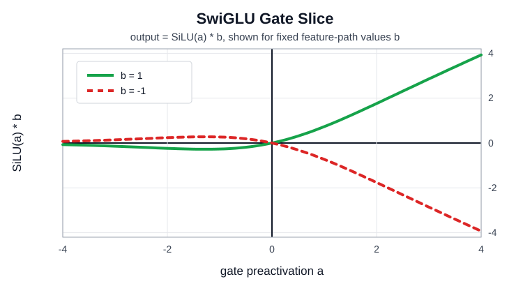

# Transformer Concept Notes

## Table of contents

- [Token-to-token mixing](#token-to-token-mixing)
- [Feature mixing](#feature-mixing)
- [Causal masking during training](#causal-masking-during-training)
- [Batched matrix multiply in attention](#batched-matrix-multiply-in-attention)
- [Nonlinear activations in the decoder](#nonlinear-activations-in-the-decoder)
- [GELU](#gelu)
- [SwiGLU](#swiglu)
- [Normalization](#normalization)
- [Sinusoidal absolute positional embeddings](#sinusoidal-absolute-positional-embeddings)
- [RoPE](#rope)
- [Positional embedding formula examples](#positional-embedding-formula-examples)
- [PE(pos) derivation for pos = 1](#pepos-derivation-for-pos--1)
- [BPE](#bpe)

## Token-to-token mixing

Token-to-token mixing means each token position can gather information from other token positions.
In a decoder-only Transformer, masked self-attention does this mixing.

Example:

```text
"the" can attend to earlier visible tokens
"cat" can attend to "the"
"sat" can attend to "the" and "cat"
```

The causal mask prevents a position from using future tokens.

## Feature mixing

Feature mixing means changing the feature vector inside one token position.

Attention mixes across positions. The MLP mixes across hidden dimensions within the same position.

Example:

```text
token hidden state: [feature_1, feature_2, feature_3, ...]
MLP output:         [new_feature_1, new_feature_2, new_feature_3, ...]
```

The MLP does not move information between token positions by itself. It transforms each token's
current representation.

## Causal masking during training

Yes, causal masking is used during training.

During training, the full sequence is available, but each position is only allowed to attend to
itself and earlier positions. This lets the model compute all positions in parallel while preserving
the next-token prediction rule.

Example:

```text
tokens:      [A, B, C, D]
position A:  can see A
position B:  can see A, B
position C:  can see A, B, C
position D:  can see A, B, C, D
```

The model is not allowed to let `B` see `C` or `D` during training.

## Batched matrix multiply in attention

Attention uses matrix multiplication across many independent attention problems at once.

After projecting hidden states into `Q`, `K`, and `V`, the model computes:

```text
scores = Q * K^T
output = softmax(masked_scores) * V
```

With batches and heads, the same pattern runs for many sequences and many heads together:

```text
batch_size * num_heads independent attention matrices
```

The "batched" part means the hardware runs many matrix multiplies as one grouped operation instead
of launching each one separately.

## Nonlinear activations in the decoder

The MLP part of each decoder block contains the nonlinear activation.

Without nonlinear activations, stacking linear layers would still collapse into one larger linear
operation. The activation lets the network represent more complex functions.

Typical location:

```text
hidden state -> linear projection -> activation -> linear projection -> output
```

Modern LLMs often use gated variants such as SwiGLU instead of a plain single activation path.

## GELU

GELU is a smooth activation function often used in Transformer MLPs.

One common definition is:

```text
GELU(x) = x * Phi(x)
```

`Phi(x)` is the standard normal cumulative distribution function. Intuitively, GELU keeps more of a
positive value and suppresses more of a negative value, but it does this smoothly instead of with a
hard cutoff.

Useful approximation:

```text
GELU(x) ~= 0.5 * x * (1 + tanh(sqrt(2/pi) * (x + 0.044715 * x^3)))
```



## SwiGLU

SwiGLU is a gated MLP activation used in many modern decoder-only models.

A simplified form is:

```text
a = x * W_gate
b = x * W_up
SwiGLU(x) = SiLU(a) * b
```

Then the result is usually projected back down:

```text
output = SwiGLU(x) * W_down
```

The multiplication lets one projected path control how much of another projected path passes
through.



The plot shows one-dimensional slices with fixed feature-path values because full SwiGLU depends on
both the gate projection `a` and the feature projection `b`.

## Normalization

Normalization keeps hidden-state scale stable across many Transformer layers.

In a Transformer, normalization is applied independently to each token's hidden vector. It does not
normalize across the sequence.

### LayerNorm

LayerNorm subtracts the mean and divides by the standard deviation of one token's hidden vector.

For hidden vector `x`:

```text
mean = average(x)
var  = average((x - mean)^2)
y    = (x - mean) / sqrt(var + eps)
out  = gamma * y + beta
```

Example with `x = [1, 2, 3]`, ignoring `eps`, with `gamma = 1` and `beta = 0`:

```text
mean = (1 + 2 + 3) / 3 = 2
var  = ((1 - 2)^2 + (2 - 2)^2 + (3 - 2)^2) / 3
     = (1 + 0 + 1) / 3
     = 2 / 3
std  = sqrt(2 / 3) ~= 0.816

LayerNorm(x) = [
  (1 - 2) / 0.816,
  (2 - 2) / 0.816,
  (3 - 2) / 0.816
]
~= [-1.225, 0, 1.225]
```

### RMSNorm

RMSNorm divides by the root mean square of the hidden vector. It does not subtract the mean.

For hidden vector `x`:

```text
rms = sqrt(average(x^2) + eps)
y   = x / rms
out = gamma * y
```

Example with `x = [1, 2, 3]`, ignoring `eps`, with `gamma = 1`:

```text
rms = sqrt((1^2 + 2^2 + 3^2) / 3)
    = sqrt((1 + 4 + 9) / 3)
    = sqrt(14 / 3)
    ~= 2.160

RMSNorm(x) = [
  1 / 2.160,
  2 / 2.160,
  3 / 2.160
]
~= [0.463, 0.926, 1.389]
```

Key difference:

- LayerNorm recenters the vector around zero, then rescales it.
- RMSNorm only rescales the vector.

In modern decoder-only models, normalization is often placed before attention and before the MLP:

```text
x -> norm -> attention -> residual add
x -> norm -> MLP       -> residual add
```

This is called pre-norm. It tends to make deep Transformer stacks easier to train.

## Sinusoidal absolute positional embeddings

Sinusoidal absolute positional embeddings assign each position a deterministic vector made of sine
and cosine waves.

The original Transformer uses:

```text
PE(pos, 2i)     = sin(pos / 10000^(2i / d_model))
PE(pos, 2i + 1) = cos(pos / 10000^(2i / d_model))
```

Meaning:

- `pos` is the token position.
- `i` chooses the frequency pair.
- `d_model` is the embedding width.
- Each position gets a unique pattern of sine and cosine values.

Lower-frequency dimensions change slowly. Higher-frequency dimensions change quickly.

## RoPE

Placeholder for Rotary Position Embeddings.

Add a short explanation of how RoPE injects position information by rotating query and key vectors
instead of adding a separate absolute position vector.

## Positional embedding formula examples

A tiny four-dimensional example can be written as:

```text
PE(pos) = [
  sin(pos),
  cos(pos),
  sin(pos / 100),
  cos(pos / 100)
]
```

This is not the full original formula. It is a simplified example showing the same idea:

- The first sine/cosine pair changes quickly.
- The second sine/cosine pair changes slowly because `pos` is divided by `100`.

## PE(pos) derivation for pos = 1

Using the simplified example:

```text
PE(pos) = [
  sin(pos),
  cos(pos),
  sin(pos / 100),
  cos(pos / 100)
]
```

Substitute `pos = 1`:

```text
PE(1) = [
  sin(1),
  cos(1),
  sin(1 / 100),
  cos(1 / 100)
]
```

Compute the divided terms:

```text
1 / 100 = 0.01
```

So:

```text
PE(1) = [
  sin(1),
  cos(1),
  sin(0.01),
  cos(0.01)
]
```

Approximate numeric values:

```text
sin(1)    ~= 0.84147
cos(1)    ~= 0.54030
sin(0.01) ~= 0.0099998
cos(0.01) ~= 0.99995
```

Final vector:

```text
PE(1) ~= [0.84147, 0.54030, 0.0099998, 0.99995]
```

## BPE

Placeholder for Byte Pair Encoding.

Add a short explanation of how BPE builds a tokenizer vocabulary by repeatedly merging frequent
symbol pairs, producing subword tokens rather than only whole words or raw characters.
