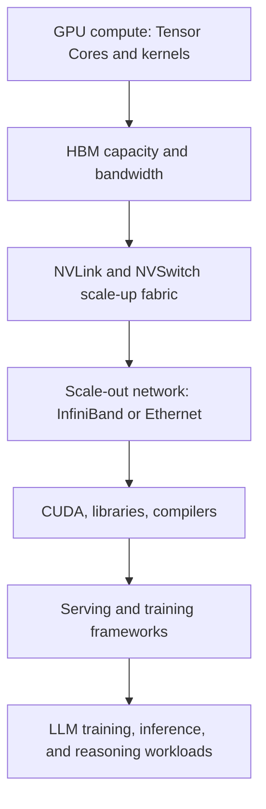
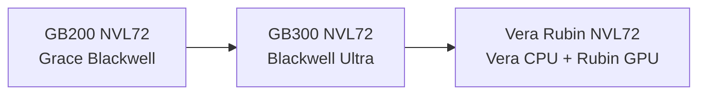

# Week 1: Latest NVIDIA Platform Landscape

This module gives the Week 1 platform map for modern NVIDIA systems used in LLM training,
inference, post-training, and reasoning workloads. It is a high-level map, not a
microarchitecture lesson.

## Learning Goals

- Treat "latest NVIDIA hardware" as a moving public platform landscape.
- Place Blackwell, Grace Blackwell, Blackwell Ultra, GB200, GB300, and Vera Rubin.
- Explain why GB200 NVL72 remains an important recent anchor.
- Explain why GB300 NVL72 is the current public reasoning-platform anchor.
- Explain why Vera Rubin is the forward-looking public roadmap anchor.
- Reason from compute, memory, communication, and software rather than reciting SKUs.

## Sourced Facts Versus Interview Synthesis

Sourced facts in this file come from public NVIDIA product pages, NVIDIA developer blogs,
NVIDIA documentation, and NVIDIA investor news. Interview synthesis appears in the
"what to reason from" and answer-pattern sections, where the facts are translated into
interview guidance.

Platform facts in this file were checked against public NVIDIA sources on May 17,
2026.

## Why This Matters For Interviews

NVIDIA interviews may test whether you can reason across GPU architecture, rack-scale
systems, networking, software, and customer workloads. OpenAI and Anthropic interviews may
care less about product naming, but they will care whether you can connect model scale to
accelerator supply, serving cost, reliability, and cluster design.

For senior/principal roles, do not sound like a spec sheet. Use platform facts as inputs
to bottleneck analysis and hardware/software co-design.

## What "Latest NVIDIA Hardware" Means For This Curriculum

"Latest" is not a single product. For this curriculum, it is a public platform landscape:
- Blackwell and Grace Blackwell remain important current-generation anchors.
- GB200 NVL72 remains a recent rack-scale anchor for Grace Blackwell systems.
- Blackwell Ultra and GB300 NVL72 are the current public reasoning-platform anchor.
- Vera Rubin and Vera Rubin NVL72 are the forward-looking public roadmap anchor.

This framing avoids implying that GB200 is the only "latest" system. It also protects
interview accuracy as NVIDIA's public platform story evolves.

## Platform Landscape Table

| Platform | Status | Public NVIDIA positioning | Key visible components | LLM role | Week |
| ---
| ---
| ---
| ---
| ---
| --- |
| GB200 NVL72 | Recent | Grace Blackwell rack | 36 Grace; 72 Blackwell GPUs | Scale-up LLMs | 6, 12 |
| GB300 NVL72 | Current | Blackwell Ultra reasoning | 36 Grace; 72 Blackwell Ultra | Reasoning workloads | 8, 12 |
| Vera Rubin NVL72 | Roadmap | Agentic AI factories | Vera CPU; Rubin GPU; NVLink 6 | Next platform | 12 |

NVIDIA's GB200 tuning guide states that GB200 NVL72 connects 36 Grace CPUs and 72
Blackwell GPUs in a rack-scale design with a 72-GPU NVLink domain (Source 3). NVIDIA's
GB300 page states that GB300 NVL72 integrates 72 Blackwell Ultra GPUs and 36 Grace CPUs in
a liquid-cooled rack-scale platform (Source 5). NVIDIA's Vera Rubin page describes Vera
Rubin NVL72 with 72 Rubin GPUs, 36 Vera CPUs, ConnectX-9, BlueField-4, and sixth-generation
NVLink and NVLink Switch (Source 7).

## Platform Stack Diagram

This original diagram synthesizes NVIDIA platform documentation and software docs
(Sources 1, 3, 5, 7, 9, and 10).

## Public Platform Timeline

This original landscape diagram is based on current public NVIDIA platform pages and
roadmap material (Sources 2, 5, 6, 7, and 8).

## Blackwell And Grace Blackwell At A High Level

Blackwell is NVIDIA's GPU architecture generation positioned for AI factories and large
AI workloads (Source 1). Grace Blackwell combines Grace CPU capability with Blackwell GPUs
in system designs, including coherent CPU-GPU connectivity through NVLink-C2C in the GB200
Grace Blackwell Superchip context (Sources 3 and 4).

At this level, remember the system shape:
- Blackwell GPU: accelerator for dense AI math and memory-intensive execution.
- Grace CPU: host-side compute and memory participant in Grace Blackwell systems.
- NVLink-C2C: CPU-GPU connection in the Grace Blackwell Superchip context.
- NVLink and NVLink Switch: scale-up communication fabric for large GPU domains.
- CUDA and libraries: programming and software ecosystem around the hardware.

## Blackwell Ultra And GB300 NVL72

Blackwell Ultra is NVIDIA's public platform framing for AI reasoning and test-time scaling.
The NVIDIA technical blog describes GB300 NVL72 as connecting 36 Grace CPUs and 72
Blackwell Ultra GPUs in a 72-GPU NVLink domain, with rack-level memory and networking
improvements aimed at reasoning workloads (Source 6).

The GB300 product page marks GB300 NVL72 as "Available Now" and states that the platform
integrates 72 Blackwell Ultra GPUs and 36 Grace CPUs (Source 5). For interview purposes,
treat GB300 NVL72 as the current public reasoning-platform anchor, while still checking
the latest public source before making detailed claims.

## Vera Rubin And Vera Rubin NVL72

Vera Rubin is the forward-looking public roadmap anchor for this curriculum. NVIDIA's
public Vera Rubin material includes Vera CPU, Rubin GPU, sixth-generation NVLink,
ConnectX-9 SuperNIC, and BlueField-4 DPU in the platform story (Sources 7 and 8).

Use Vera Rubin in Week 1 only to show platform direction. Do not overfit to unreleased or
changing details in interviews. If a claim is product-specific, verify the current public
page before using it.

## Why NVIDIA Platforms Are Strong For LLMs

NVIDIA's advantage is not only the GPU chip. It is the combination of GPU architecture,
HBM, Tensor Cores, NVLink/NVSwitch, networking, CUDA, libraries, and serving/training
software.

That combination matters because LLM systems stress multiple layers at once:
- Compute: matrix operations, attention, and low-precision tensor execution.
- Memory: weights, activations, KV cache, long context, and serving state.
- Communication: scale-up and scale-out parallelism.
- Software: kernels, libraries, compilers, schedulers, and inference frameworks.
- Operations: management, reliability, power, cooling, and fleet utilization.

The CUDA C++ Programming Guide frames CUDA as NVIDIA's general-purpose parallel computing
platform and programming model (Source 9). TensorRT-LLM is a preview of the production
inference software layer that later modules will study in more detail (Source 10).

## What To Memorize Versus What To Reason From

Memorize:
- Broad platform names and roles: Blackwell, Grace Blackwell, Blackwell Ultra, Vera Rubin.
- GB200 NVL72 as a Grace Blackwell rack-scale anchor.
- GB300 NVL72 as a Blackwell Ultra reasoning-platform anchor.
- Vera Rubin NVL72 as a forward-looking public roadmap anchor.
- NVIDIA's platform story includes chip, memory, interconnect, network, CUDA, and software.

Reason from:
- Compute: tensor shapes, precision, attention, and utilization.
- Memory: capacity, bandwidth, KV-cache pressure, and long-context effects.
- Communication: scale-up fabric versus scale-out network.
- Software: CUDA, libraries, compilers, serving frameworks, and operational tooling.
- Product fit: latency target, batch shape, context length, reliability, and cost.

Avoid memorizing every SKU number unless the role or interview explicitly requires it.
For senior/principal interviews, the stronger signal is reasoning from workload shape and
platform constraints.

## What This File Intentionally Does Not Cover Yet

This file does not cover SMs, warps, Tensor Cores, HBM details, NVLink topology, CUDA
kernels, collectives, quantization formats, or serving frameworks in depth. Those topics
belong to later weeks.

## Interviewer Questions You Should Be Ready For

- What is the current public NVIDIA platform landscape for LLM systems?
- How would you distinguish GB200 NVL72, GB300 NVL72, and Vera Rubin NVL72?
- Why is GB300 relevant to reasoning workloads?
- Why is NVIDIA's advantage broader than a single GPU?
- Which facts should you memorize, and which should you derive from assumptions?

## Senior/Principal-Level Answer Patterns

- Begin with workload demands, then map them to the platform stack.
- Say "GPU architecture plus memory plus fabric plus software ecosystem," not just
"faster GPU."
- Treat official performance claims as context, then ask about assumptions.
- Use rack-scale facts to reason about communication and utilization.
- Separate current public product facts from forward-looking roadmap context.

## Week 1 Self-Check

- Can you explain why GB200 is still relevant but not the only latest anchor?
- Can you explain why GB300 is the Week 1 current reasoning-platform anchor?
- Can you name the visible Vera Rubin components from public NVIDIA material?
- Can you draw the NVIDIA platform stack from compute through serving software?
- Can you avoid overfitting to product names and instead reason from bottlenecks?

## Sources

- Source 1: NVIDIA, "Blackwell Architecture."
https://www.nvidia.com/en-us/data-center/technologies/blackwell-architecture/
- Source 2: NVIDIA, "GB200 NVL72."
https://www.nvidia.com/en-us/data-center/gb200-nvl72/
- Source 3: NVIDIA, "GB200 NVL Multi-Node Tuning Guide."
https://docs.nvidia.com/multi-node-nvlink-systems/multi-node-tuning-guide/overview.html
- Source 4: NVIDIA developer blog, "GB200 NVL72 Delivers Trillion-Parameter LLM Training."
https://developer.nvidia.com/blog/nvidia-gb200-nvl72-delivers-trillion-parameter-llm-training-and-real-time-inference
- Source 5: NVIDIA, "GB300 NVL72."
https://www.nvidia.com/en-us/data-center/gb300-nvl72/
- Source 6: NVIDIA developer blog, "Blackwell Ultra for the Era of AI Reasoning."
https://developer.nvidia.com/blog/nvidia-blackwell-ultra-for-the-era-of-ai-reasoning/
- Source 7: NVIDIA, "Vera Rubin Platform."
https://www.nvidia.com/en-us/data-center/technologies/rubin/
- Source 8: NVIDIA investor news, "NVIDIA Vera Rubin Opens Agentic AI Frontier."
https://investor.nvidia.com/news/press-release-details/2026/NVIDIA-Vera-Rubin-Opens-Agentic-AI-Frontier/default.aspx
- Source 9: NVIDIA, "CUDA C++ Programming Guide."
https://docs.nvidia.com/cuda/cuda-c-programming-guide/
- Source 10: NVIDIA, "TensorRT-LLM Documentation."
https://docs.nvidia.com/tensorrt-llm/
