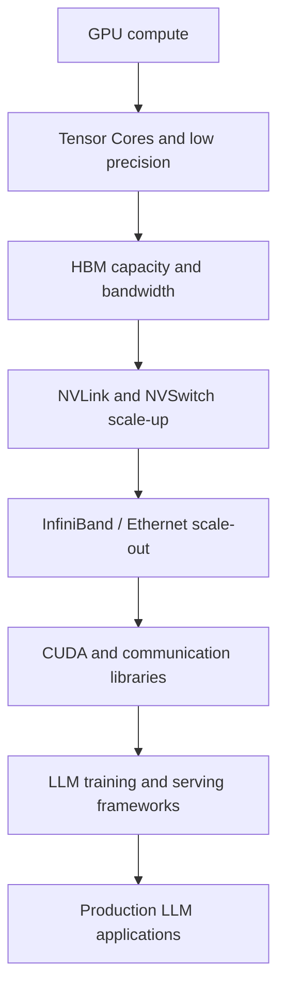
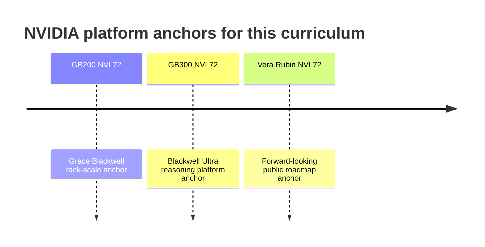

# Latest NVIDIA Platforms

This module gives a Week 1 map of the current NVIDIA platform landscape for LLM
systems interviews.

The goal is not to memorize every SKU. The goal is to understand how NVIDIA
frames modern AI infrastructure: GPU compute, HBM, scale-up interconnect,
scale-out networking, and a mature software stack.

## Learning goals

By the end of this module, you should be able to:

- Explain why NVIDIA's LLM advantage is a platform advantage, not only a GPU
  chip advantage.
- Place GB200, GB300, and Vera Rubin in the public NVIDIA platform landscape.
- Describe why compute, memory, communication, and software all matter.
- Give a high-level interview answer about why NVIDIA GPUs work well for LLMs.
- Identify which details to memorize and which details to reason from.

## Why this matters for interviews

For NVIDIA interviews, this is direct domain knowledge.

For OpenAI and Anthropic interviews, it is systems context. Even if the role is
not an NVIDIA role, production LLM infrastructure is deeply shaped by NVIDIA GPU
platforms, software, and interconnect.

A senior/principal answer should not say only:

> NVIDIA is good because its GPUs are fast.

A better answer is:

> NVIDIA is strong because the GPU, HBM, Tensor Cores, NVLink, NVSwitch,
> networking, CUDA, libraries, and model-serving software form an integrated
> platform for training and inference.

## What latest means in this curriculum

"Latest NVIDIA hardware" is a moving public platform landscape.

For this curriculum, use three anchors:

| Platform | Status in this curriculum | Public NVIDIA positioning |
| --- | --- | --- |
| GB200 NVL72 | Important Grace Blackwell anchor | Rack-scale Grace Blackwell platform |
| GB300 NVL72 | Current Blackwell Ultra anchor | Platform for AI reasoning efficiency |
| Vera Rubin NVL72 | Forward-looking public roadmap anchor | Next-generation AI factory platform |

Older NVIDIA generations are not the focus. They may appear only when they help
explain a current platform decision.

## Platform comparison

| Platform | Key visible components | Why it matters for LLMs | Deep dive |
| --- | --- | --- | --- |
| GB200 NVL72 | Grace CPUs, Blackwell GPUs, NVLink domain | Grace Blackwell rack anchor | Weeks 6-8 |
| GB300 NVL72 | 72 Blackwell Ultra GPUs, 36 Grace CPUs | Blackwell Ultra reasoning anchor | Weeks 6-8 |
| Vera Rubin NVL72 | Vera CPU, Rubin GPU, NVLink 6, ConnectX-9, BlueField-4 | Public roadmap anchor | Week 12 |

NVIDIA publicly describes GB300 NVL72 as a rack-scale architecture integrating
72 Blackwell Ultra GPUs and 36 Grace CPUs into a single platform.

NVIDIA's Vera Rubin public material describes the forward-looking platform in
terms of Vera CPU, Rubin GPU, NVLink 6, ConnectX-9, and BlueField-4. Treat Vera
Rubin as public roadmap context, not as the current deployed baseline.

## Platform stack mental model

NVIDIA's LLM platform should be understood as a stack.

The stack matters because LLM bottlenecks shift across layers:

- Matrix-heavy phases stress compute.
- Decode can stress memory bandwidth and KV-cache capacity.
- Distributed training stresses collectives and interconnect.
- Serving stresses scheduling, batching, latency, and cost.
- Software determines how much hardware capability is actually usable.

## GB200 NVL72

GB200 NVL72 is an important Grace Blackwell rack-scale platform.

At Week 1 level, remember:

- It combines Grace CPUs and Blackwell GPUs.
- It is designed as a rack-scale AI system.
- It uses a large NVLink domain.
- It is an important reference point for LLM training and inference discussions.

Do not over-index on memorizing every GB200 number in Week 1. Later modules
cover scale-up, NVLink, NVSwitch, memory, and cluster design.

## GB300 NVL72

GB300 NVL72 is the current public Blackwell Ultra anchor for this curriculum.

NVIDIA describes GB300 NVL72 as integrating:

- 72 Blackwell Ultra GPUs.
- 36 Grace CPUs.
- A fully liquid-cooled rack-scale architecture.
- Networking and system integration for AI reasoning workloads.

For interviews, the key point is not only the count of GPUs and CPUs. The key
point is that NVIDIA is pushing from individual accelerators toward integrated
rack-scale systems for inference and training.

## Vera Rubin NVL72

Vera Rubin NVL72 is the forward-looking public roadmap anchor.

At Week 1 level, remember the public platform components:

- Vera CPU.
- Rubin GPU.
- NVLink 6.
- ConnectX-9.
- BlueField-4.
- Related scale-up and scale-out system pieces.

Use careful language:

> NVIDIA publicly positions Vera Rubin as a next-generation platform direction.

Do not present it as the current baseline for deployed production clusters.

## Platform timeline

## Why NVIDIA platforms work well for LLMs

LLMs need multiple kinds of capability at once.

| Need | NVIDIA platform element |
| --- | --- |
| Dense matrix throughput | Tensor Cores and low-precision formats |
| Model weight capacity | HBM capacity |
| Weight and KV-cache bandwidth | HBM bandwidth |
| Multi-GPU model partitioning | NVLink and NVSwitch |
| Multi-node scale | InfiniBand, Ethernet, RDMA, collectives |
| Programmability | CUDA |
| Library performance | cuBLAS, cuDNN, NCCL, TensorRT-LLM, related stack |
| Serving efficiency | Batching, kernels, memory management, scheduling |

The interview point is that performance emerges from system balance.

## What to memorize versus reason from

Memorize:

- GB200, GB300, and Vera Rubin as the platform anchors.
- GB300 NVL72 has 72 Blackwell Ultra GPUs and 36 Grace CPUs.
- Vera Rubin public material includes Vera CPU, Rubin GPU, NVLink 6,
  ConnectX-9, and BlueField-4.
- NVIDIA's moat is platform-level, not only chip-level.

Reason from:

- Compute versus memory versus communication.
- Training versus inference.
- Prefill versus decode.
- Batch size, latency, throughput, and utilization.
- Software maturity and kernel availability.
- Cost per token and total cost of ownership.

Avoid:

- Memorizing every SKU detail without understanding bottlenecks.
- Treating the GPU chip as the entire product.
- Discussing older architectures unless needed for context.
- Claiming roadmap systems are already the deployed baseline.

## What this file does not cover yet

This file intentionally does not yet deep dive into:

- SM microarchitecture.
- Warps and scheduling.
- Tensor Core instruction behavior.
- HBM organization.
- NVLink and NVSwitch topology.
- CUDA programming.
- NCCL collectives.
- TensorRT-LLM internals.
- Cluster-level training and serving.

Those topics appear in later weeks.

## Interviewer questions to expect

You should be ready to answer:

1. What are the current NVIDIA platform anchors for LLM systems?
2. Why is NVIDIA strong for LLM training and inference?
3. Why is GB300 important in current public NVIDIA positioning?
4. What is the difference between GB200 and GB300 at a high level?
5. How should Vera Rubin be discussed in an interview?
6. Why does NVLink matter?
7. Why is HBM important?
8. Why is CUDA part of the platform advantage?
9. What does rack-scale design change compared with single-GPU thinking?
10. What details should you memorize versus reason from?

## Senior/principal answer pattern

Weak answer:

> NVIDIA has the fastest GPUs.

Acceptable answer:

> NVIDIA GPUs are good for LLMs because they have high matrix throughput and
> high-bandwidth memory.

Strong senior/principal answer:

> NVIDIA's advantage is the full platform. Transformer workloads need dense
> matrix throughput, HBM capacity and bandwidth, low-precision Tensor Cores,
> scale-up links, scale-out networking, mature collectives, CUDA, libraries, and
> serving frameworks. GB200, GB300, and Vera Rubin show NVIDIA moving from
> accelerator chips toward integrated AI factory platforms.

## Week 1 self-check

You are ready to move on when you can explain:

- Why NVIDIA's advantage is platform-level.
- Why GB200 remains an important Grace Blackwell anchor.
- Why GB300 is the current Blackwell Ultra anchor.
- Why Vera Rubin should be framed as public roadmap context.
- Why LLMs require compute, memory, communication, and software.
- Why memorizing SKU details is less important than understanding bottlenecks.

## Sources

- NVIDIA, GB300 NVL72.
  <https://www.nvidia.com/en-us/data-center/gb300-nvl72/>

- NVIDIA, Blackwell Architecture.
  <https://www.nvidia.com/en-us/data-center/technologies/blackwell-architecture/>

- NVIDIA, GB200 NVL72.
  <https://www.nvidia.com/en-us/data-center/gb200-nvl72/>

- NVIDIA, Grace Blackwell Multi-Node Tuning Guide.
  <https://docs.nvidia.com/multi-node-nvlink-systems/multi-node-tuning-guide/overview.html>

- NVIDIA, Blackwell Ultra technical blog.
  <https://developer.nvidia.com/blog/nvidia-blackwell-ultra-for-the-era-of-ai-reasoning/>

- NVIDIA, Vera Rubin Platform.
  <https://www.nvidia.com/en-us/data-center/technologies/rubin/>

- NVIDIA, Vera Rubin investor news.
<https://investor.nvidia.com/news/press-release-details/2026/NVIDIA-Vera-Rubin-Opens-Agentic-AI-Frontier/default.aspx>
