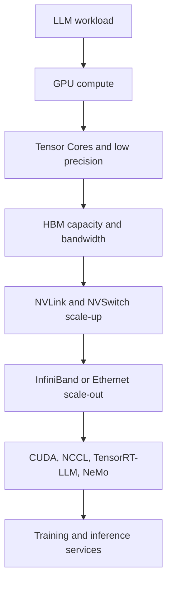
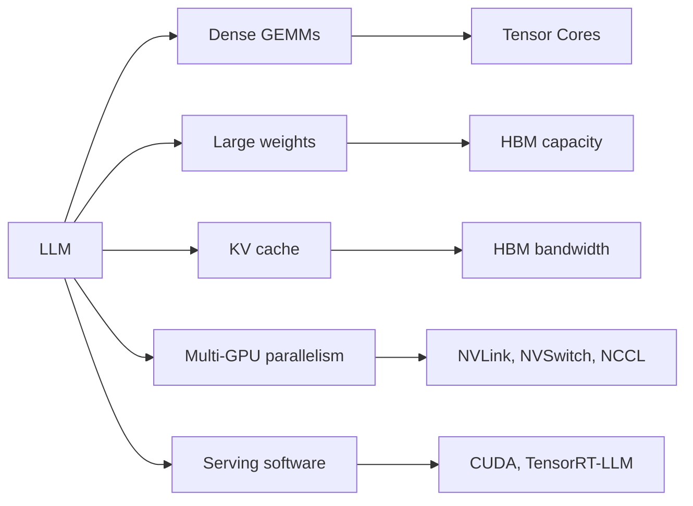
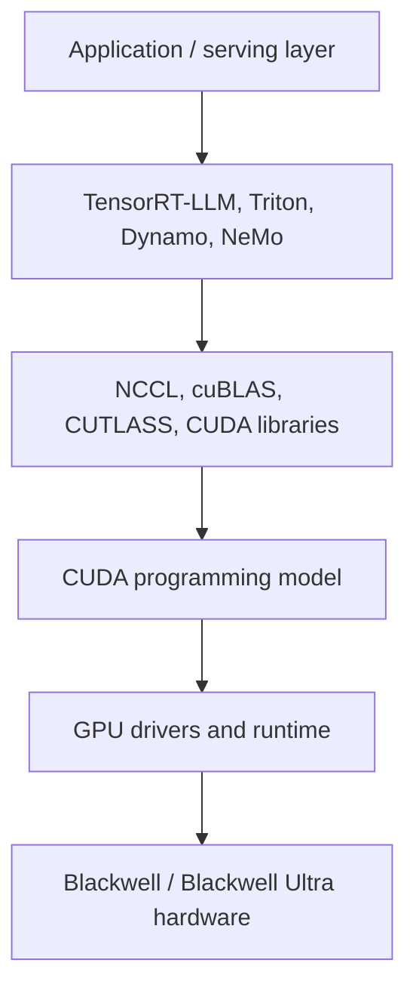

# Latest NVIDIA Platforms

This Week 1 module gives a senior hardware architect a practical map of the
latest NVIDIA AI platform landscape.

The goal is not to memorize every SKU. The goal is to understand how NVIDIA
packages GPU compute, memory, scale-up interconnect, scale-out networking, and
software into a platform for LLM training and inference.

Use this file as a Week 1 orientation. Later weeks should go deeper into SM
microarchitecture, Tensor Cores, CUDA, NCCL, TensorRT-LLM, NVLink, NVSwitch,
training parallelism, inference serving, and cluster design.

## Table of contents

- [Learning goals](#learning-goals)
- [The senior-level mental model](#the-senior-level-mental-model)
- [Platform stack](#platform-stack)
- [Current platform anchors](#current-platform-anchors)
- [GB200 NVL72](#gb200-nvl72)
- [GB300 NVL72](#gb300-nvl72)
- [Blackwell versus Blackwell Ultra](#blackwell-versus-blackwell-ultra)
- [Vera Rubin](#vera-rubin)
- [Why LLMs fit NVIDIA platforms](#why-llms-fit-nvidia-platforms)
- [Compute](#compute)
- [Memory](#memory)
- [Scale-up interconnect](#scale-up-interconnect)
- [Scale-out networking](#scale-out-networking)
- [Software stack](#software-stack)
- [Why this matters for OpenAI and Anthropic](#why-this-matters-for-openai-and-anthropic)
- [Common interview traps](#common-interview-traps)
- [Senior/principal answer patterns](#seniorprincipal-answer-patterns)
- [Whiteboard framework](#whiteboard-framework)
- [What to memorize for Week 1](#what-to-memorize-for-week-1)
- [What not to memorize yet](#what-not-to-memorize-yet)
- [Week 1 self-check](#week-1-self-check)
- [Sources](#sources)

## Learning goals

By the end of this module, you should be able to:

- Explain why NVIDIA's advantage is platform-level, not just GPU-level.
- Place GB200 NVL72, GB300 NVL72, and Vera Rubin in the current roadmap.
- Explain why Blackwell and Blackwell Ultra are important for LLM workloads.
- Explain why LLMs need compute, HBM, NVLink, networking, and software.
- Describe scale-up versus scale-out in NVIDIA AI systems.
- Explain what CUDA, NCCL, and TensorRT-LLM contribute.
- Give senior-level answers to basic NVIDIA-platform interview questions.

## The senior-level mental model

A weak answer says:

> NVIDIA wins because its GPUs are fast.

A stronger answer says:

> NVIDIA wins because the GPU is only one part of an integrated platform.
> The platform includes Tensor Cores, HBM, NVLink, NVSwitch, networking,
> CUDA, NCCL, TensorRT-LLM, orchestration software, and a large ecosystem.

For LLM systems, the recurring platform question is:

```text
Can the platform keep compute, memory, and communication balanced?
```

That question is more useful than memorizing peak FLOPS alone.

## Platform stack



The key interview point:

> NVIDIA sells and supports a full AI factory stack, not only accelerator chips.

## Current platform anchors

Use these anchors for Week 1.

| Anchor | How to think about it | Why it matters |
| --- | --- | --- |
| GB200 NVL72 | Grace Blackwell rack-scale system | Important Blackwell baseline |
| GB300 NVL72 | Blackwell Ultra rack-scale system | Current reasoning-inference anchor |
| Vera Rubin | Public next-generation roadmap | Forward-looking platform direction |

Do not overfit on exact SKU details in Week 1. Instead, understand why NVIDIA is
moving from single-GPU thinking toward rack-scale and data-center-scale design.

## GB200 NVL72

GB200 NVL72 is a Grace Blackwell rack-scale system.

At a high level:

- It connects 36 Grace CPUs and 72 Blackwell GPUs.
- It is liquid-cooled.
- It creates a 72-GPU NVLink domain.
- It is designed for large AI and HPC workloads.
- It is a useful baseline for discussing Blackwell-era LLM systems.

A single GB200 Grace Blackwell Superchip combines one Grace CPU and two
Blackwell GPUs. The rack-level system then connects many of these pieces into a
larger NVLink domain.

The important lesson is not only "72 GPUs." The important lesson is that NVIDIA
is treating the rack as a scale-up compute domain.

## GB300 NVL72

GB300 NVL72 is the Blackwell Ultra rack-scale system.

At a high level:

- It integrates 72 Blackwell Ultra GPUs and 36 Grace CPUs.
- It is fully liquid-cooled.
- It is designed for AI reasoning and test-time scaling workloads.
- It exposes a 72-GPU NVLink domain.
- It increases memory capacity and attention acceleration versus Blackwell.

Public NVIDIA material describes GB300 NVL72 as having:

| Attribute | Public NVIDIA value |
| --- | --- |
| GPUs | 72 Blackwell Ultra GPUs |
| CPUs | 36 Grace CPUs |
| NVLink bandwidth | 130 TB/s per rack |
| Fast memory | 37 TB on the product page |
| GPU memory | 20 TB per rack |
| GPU memory bandwidth | Up to 576 TB/s per rack |
| Network connectivity | 800 Gb/s per GPU through ConnectX-8 |

For Week 1, remember the product intent:

> GB300 NVL72 is positioned for reasoning inference, long-context workloads,
> and higher test-time compute.

## Blackwell versus Blackwell Ultra

Blackwell is the GPU architecture family. Blackwell Ultra is a later platform
refresh aimed at higher reasoning and long-context inference efficiency.

NVIDIA publicly emphasizes several Blackwell and Blackwell Ultra themes:

- Second-generation Transformer Engine.
- Blackwell Tensor Cores with lower-precision formats.
- NVFP4 and other microscaling formats.
- More attention-layer acceleration in Blackwell Ultra.
- Larger HBM capacity in Blackwell Ultra.
- Deeper co-design with TensorRT-LLM, Dynamo, and model frameworks.

Do not say:

> Blackwell Ultra is just a faster Blackwell.

Say:

> Blackwell Ultra should be framed as a platform step for reasoning,
> post-training, long-context, and agentic inference workloads.

## Vera Rubin

Vera Rubin is the forward-looking public roadmap anchor.

Use careful language:

> Vera Rubin is NVIDIA's next-generation public platform direction after
> Blackwell Ultra.

Do not describe it as the current deployed baseline unless the specific role or
interviewer gives that context.

For Week 1, Vera Rubin matters because it shows the direction of the platform:

- more integrated CPU and GPU platform design,
- newer NVLink generation,
- newer networking,
- more emphasis on AI factories,
- continued hardware/software co-design.

## Why LLMs fit NVIDIA platforms

LLMs stress several resources at the same time.



The best answer is balanced:

| LLM need | NVIDIA platform response |
| --- | --- |
| Matrix math | Tensor Cores and optimized kernels |
| Low precision | FP8, FP4/NVFP4, Transformer Engine |
| Model capacity | Large HBM pools |
| Decode memory pressure | HBM bandwidth and KV-cache-aware serving |
| Multi-GPU model parallelism | NVLink and NVSwitch |
| Multi-node training | InfiniBand, Ethernet, NCCL |
| Inference serving | TensorRT-LLM, Dynamo, Triton, ecosystem |
| Developer reach | CUDA and mature libraries |

## Compute

Transformer models contain many dense linear operations.

Examples include:

- Q, K, V projections.
- Attention output projection.
- MLP up-projection.
- MLP down-projection.
- Output projection to vocabulary logits.

These map naturally to GEMMs or GEMM-like kernels.

NVIDIA's advantage is not only raw peak FLOPS. It is also:

- Tensor Core support for relevant precisions,
- mature matrix libraries,
- compiler and kernel ecosystem,
- framework integration,
- profiling and tuning tools.

For interviews, connect compute to the phase:

| Phase | Compute behavior |
| --- | --- |
| Training | forward pass, backward pass, optimizer work |
| Prefill | high parallelism across prompt tokens |
| Decode | repeated small-step generation |
| Post-training | often heavy compute for customization and alignment |
| Reasoning inference | more test-time compute per user request |

## Memory

LLMs are also memory systems problems.

Important memory consumers include:

- model weights,
- activations,
- KV cache,
- temporary buffers,
- gradients during training,
- optimizer state during training.

GB300's larger HBM capacity matters because long-context and reasoning
workloads can increase memory pressure, especially during inference serving.

A strong answer says:

> More compute is useful only if the model, KV cache, and serving batch can be
> kept fed by memory capacity and bandwidth.

## Scale-up interconnect

Scale-up means connecting GPUs into a tightly coupled domain.

In NVIDIA's current AI platforms, the key scale-up technologies are:

- NVLink,
- NVSwitch,
- NVLink Switch systems,
- NVLink-C2C between Grace and Blackwell components.

Scale-up matters when one model or one serving workload needs multiple GPUs.

Examples:

- tensor parallelism,
- expert parallelism,
- pipeline parallelism,
- large-model inference,
- all-reduce and all-gather collectives,
- remote weight or activation movement.

The Week 1 mental model:

```text
NVLink/NVSwitch reduce the penalty of splitting one model across many GPUs.
```

## Scale-out networking

Scale-out means connecting racks or nodes into a larger cluster.

NVIDIA platform material commonly discusses:

- InfiniBand,
- Spectrum-X Ethernet,
- ConnectX adapters or SuperNICs,
- RDMA,
- collective communication,
- cluster management and observability.

Scale-out matters for:

- multi-node training,
- large inference fleets,
- distributed serving,
- checkpointing,
- reliability,
- congestion control,
- cost per token at fleet scale.

A good interview answer separates scale-up and scale-out.

| Concept | Typical role |
| --- | --- |
| NVLink / NVSwitch | tightly coupled GPU-to-GPU scale-up |
| InfiniBand / Ethernet | node-to-node or rack-to-rack scale-out |
| NCCL | optimized communication primitives |
| CUDA | programming model and execution substrate |
| TensorRT-LLM | inference optimization and serving path |

## Software stack

NVIDIA's software stack is part of the product.



For Week 1, know these names:

| Component | What it contributes |
| --- | --- |
| CUDA | programming model and runtime for NVIDIA GPUs |
| cuBLAS / CUTLASS | optimized matrix math building blocks |
| NCCL | multi-GPU and multi-node collectives |
| TensorRT-LLM | optimized LLM inference toolkit |
| Triton Inference Server | production inference serving |
| NeMo | model training, customization, and deployment ecosystem |
| Dynamo | inference optimization and disaggregated serving direction |

You do not need API-level detail yet. You do need to know why software is part
of NVIDIA's platform advantage.

## Why this matters for OpenAI and Anthropic

Even if the job is not at NVIDIA, this material matters.

OpenAI and Anthropic care about:

- training efficiency,
- inference cost,
- latency,
- throughput,
- reliability,
- cluster utilization,
- serving architecture,
- hardware/software co-design,
- vendor platform tradeoffs.

A strong answer at OpenAI or Anthropic should not sound like NVIDIA marketing.
It should sound like systems reasoning:

> I would evaluate the platform by workload phase, memory footprint, parallelism
> strategy, interconnect pressure, kernel maturity, software integration, and
> operational cost.

## Common interview traps

Avoid these mistakes.

| Trap | Better answer |
| --- | --- |
| "NVIDIA is fast because FLOPS" | Discuss compute, memory, communication, and software. |
| "NVLink is just networking" | Separate scale-up NVLink from scale-out networking. |
| "HBM only stores weights" | Mention weights, activations, KV cache, and training state. |
| "CUDA is only a language" | CUDA is a platform: runtime, libraries, tools, ecosystem. |
| "Blackwell Ultra is just a chip" | Frame it as a reasoning and long-context platform. |
| "One GPU comparison is enough" | LLM systems often need rack and cluster-level comparison. |
| "Peak TOPS decides inference" | Ask about batch, context, KV cache, latency, and software. |

## Senior/principal answer patterns

### Question: Why does NVIDIA do well for LLMs?

Weak answer:

> NVIDIA GPUs are fast.

Strong answer:

> NVIDIA does well because the platform is balanced for LLM workloads. Tensor
> Cores accelerate dense math and low precision. HBM capacity and bandwidth help
> weights and KV cache. NVLink and NVSwitch reduce the cost of model
> parallelism. InfiniBand or Ethernet support scale-out. CUDA, NCCL, and
> TensorRT-LLM make the hardware usable in production systems.

### Question: Why does NVLink matter?

Weak answer:

> It connects GPUs.

Strong answer:

> NVLink matters when a model or serving workload spans GPUs. Tensor
> parallelism, expert parallelism, and some inference strategies require frequent
> GPU-to-GPU communication. NVLink and NVSwitch create a high-bandwidth scale-up
> domain so multi-GPU execution behaves more like one larger accelerator.

### Question: How would you evaluate GB300 for LLM inference?

Weak answer:

> I would look at the FLOPS.

Strong answer:

> I would separate prefill, decode, long-context, and reasoning workloads. Then
> I would evaluate Tensor Core throughput, HBM capacity, HBM bandwidth, KV-cache
> pressure, NVLink bandwidth, scale-out network bandwidth, serving software,
> batching policy, latency targets, and cost per token.

### Question: What should you know about Vera Rubin?

Weak answer:

> It is NVIDIA's next GPU.

Strong answer:

> I would treat Vera Rubin as a public roadmap anchor rather than the current
> deployed baseline. It matters because it shows NVIDIA's direction: tighter
> CPU-GPU integration, newer NVLink and networking, and continued AI factory
> platform design.

## Whiteboard framework

When asked about an NVIDIA platform, draw this.

```text
LLM workload
  |
  +-- compute: GEMMs, Tensor Cores, precision
  |
  +-- memory: weights, activations, KV cache, HBM
  |
  +-- scale-up: NVLink, NVSwitch, tensor/expert parallelism
  |
  +-- scale-out: InfiniBand, Ethernet, NCCL, cluster scheduling
  |
  +-- software: CUDA, libraries, TensorRT-LLM, serving stack
```

Then ask:

```text
Which phase are we optimizing: training, prefill, decode, or reasoning?
```

That one question prevents many weak interview answers.

## What to memorize for Week 1

Memorize these anchors:

- GB200 NVL72 is the Grace Blackwell rack-scale baseline.
- GB300 NVL72 is the Blackwell Ultra reasoning-inference platform anchor.
- GB300 NVL72 integrates 72 Blackwell Ultra GPUs and 36 Grace CPUs.
- GB300 NVL72 exposes 130 TB/s of NVLink bandwidth at rack scale.
- Blackwell Ultra emphasizes reasoning, long context, and test-time scaling.
- HBM matters for weights, KV cache, batch size, and long-context inference.
- NVLink and NVSwitch are scale-up technologies.
- InfiniBand and Ethernet are scale-out technologies.
- NCCL provides optimized collectives.
- TensorRT-LLM is NVIDIA's optimized LLM inference toolkit.
- CUDA and libraries are central to NVIDIA's platform advantage.

## What not to memorize yet

Do not spend Week 1 memorizing:

- every SM-level detail,
- every Tensor Core instruction,
- every CUDA API,
- every NCCL algorithm,
- every rack SKU,
- every benchmark number.

Those belong in later weeks.

Week 1 is about the platform map and the interview vocabulary.

## Week 1 self-check

You are ready to move on when you can answer these without notes:

1. Why is NVIDIA's advantage platform-level?
2. What is GB200 NVL72?
3. What is GB300 NVL72?
4. Why is Blackwell Ultra important for reasoning inference?
5. Why does HBM matter for LLMs?
6. Why does NVLink matter for multi-GPU inference?
7. What is the difference between scale-up and scale-out?
8. What does NCCL contribute?
9. What does TensorRT-LLM contribute?
10. Why is peak FLOPS insufficient for LLM platform evaluation?

## Sources

- NVIDIA, "GB300 NVL72."
  https://www.nvidia.com/en-us/data-center/gb300-nvl72/

- NVIDIA Developer Blog, "NVIDIA Blackwell Ultra for the Era of AI Reasoning."
  https://developer.nvidia.com/blog/nvidia-blackwell-ultra-for-the-era-of-ai-reasoning/

- NVIDIA, "Blackwell Architecture."
  https://www.nvidia.com/en-us/data-center/technologies/blackwell-architecture/

- NVIDIA Docs, "NVIDIA GB200 NVL Multi-Node Tuning Guide."
  https://docs.nvidia.com/multi-node-nvlink-systems/multi-node-tuning-guide/overview.html

- NVIDIA Docs, "TensorRT-LLM."
  https://docs.nvidia.com/tensorrt-llm/

- NVIDIA Developer, "NVIDIA Collective Communications Library."
  https://developer.nvidia.com/NCCL
