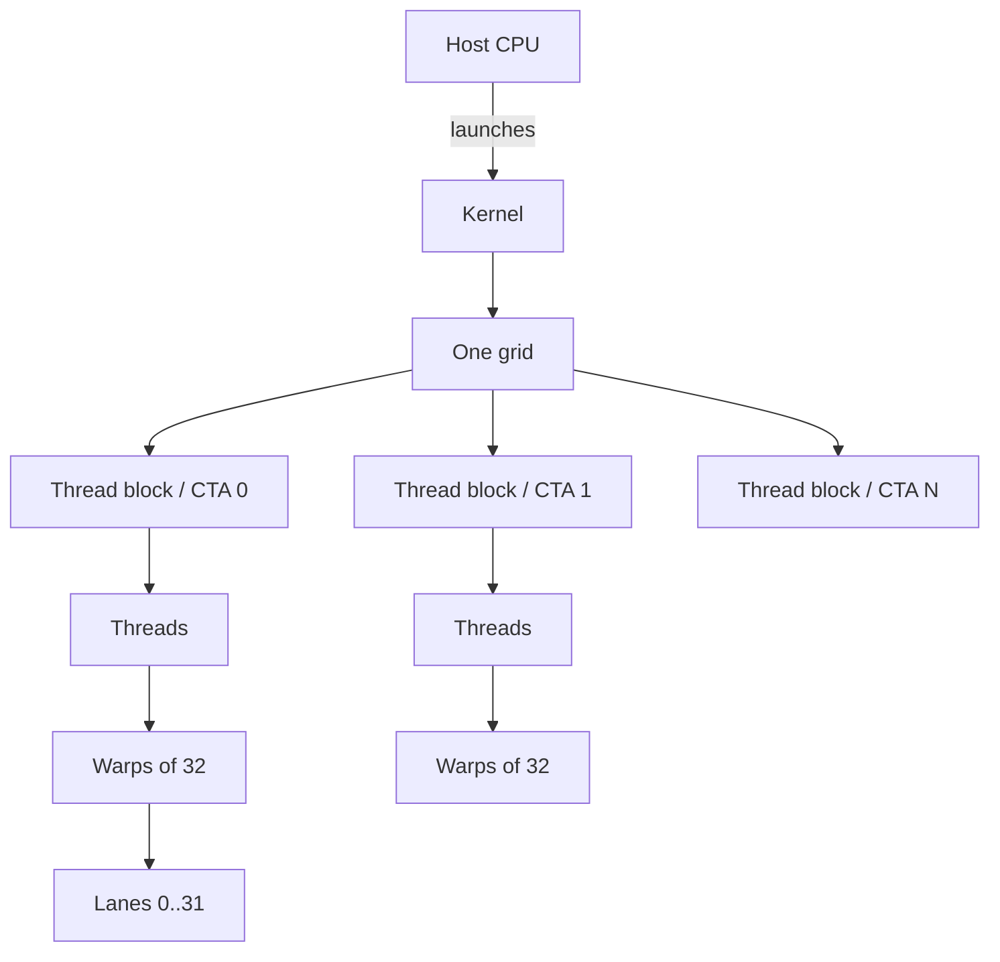
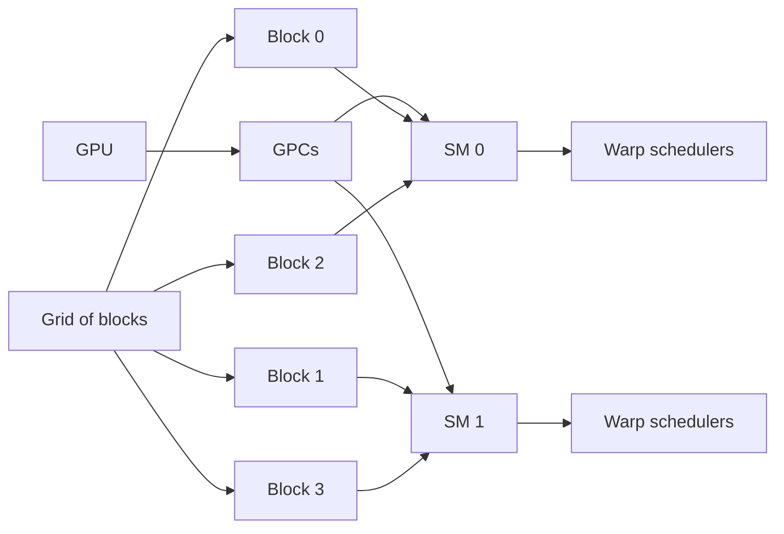
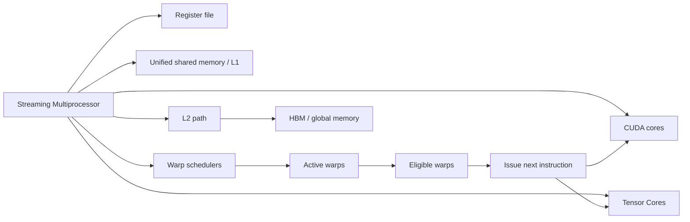
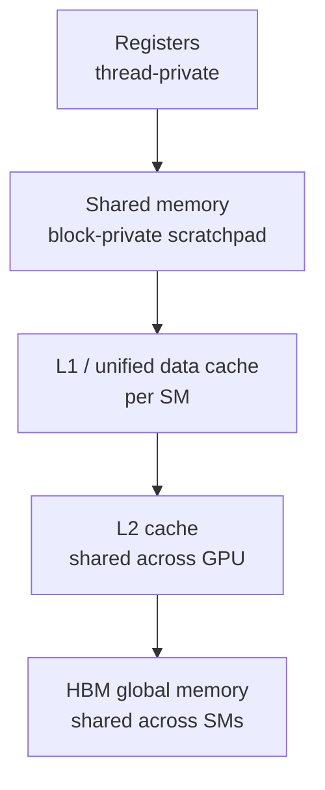
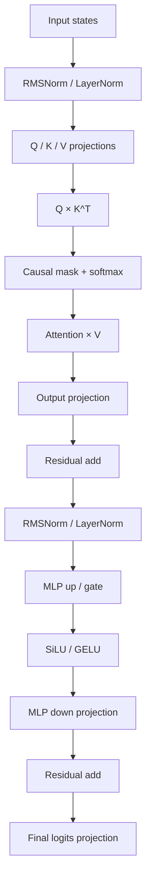
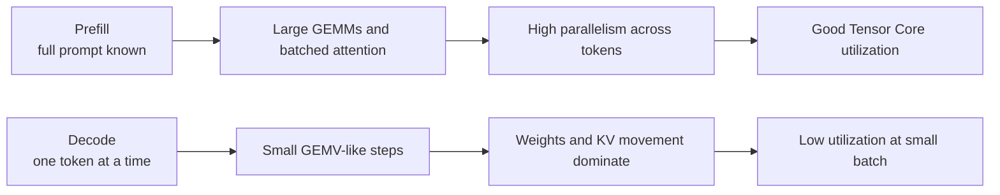
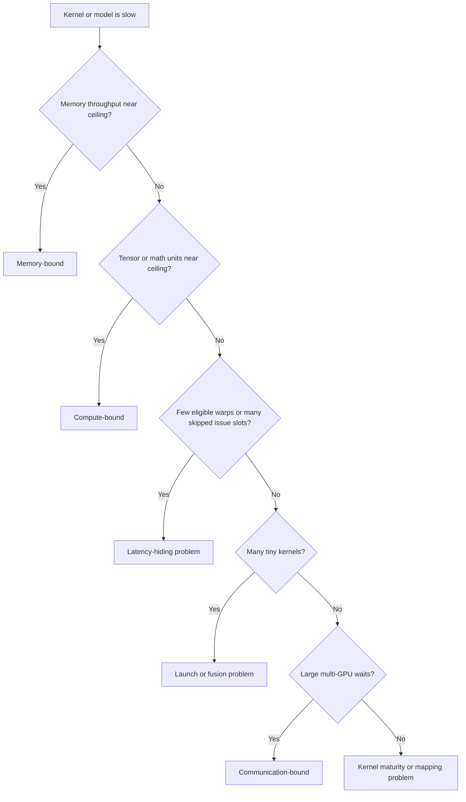

# NVIDIA GPU Execution Model

## Table of contents

- [What this module is for](#what-this-module-is-for)
- [How CUDA execution actually maps work to hardware](#how-cuda-execution-actually-maps-work-to-hardware)
- [What an SM does and why warps matter](#what-an-sm-does-and-why-warps-matter)
- [Memory hierarchy and Tensor Cores](#memory-hierarchy-tensor-cores-and-asynchronous-execution)
- [How a Transformer block becomes GPU work](#how-a-transformer-block-becomes-gpu-work)
- [Bottlenecks, profiling, and interview-ready reasoning](#bottlenecks-profiling-and-interview-ready-reasoning)
- [Self-check and sources](#self-check-and-sources)

## What this module is for

Week 1 was about the NVIDIA platform at rack and system level: GB200 NVL72, GB300 NVL72, HBM,
NVLink, NVSwitch, CUDA, NCCL, and TensorRT-LLM. Week 2 moves one layer down. The goal here is to
understand how a single NVIDIA GPU actually executes work, and then connect that execution model to
Transformer training and inference.

After this module, you should be able to explain, in interview language:

- why GPUs are good at Transformer workloads,
- how a kernel launch becomes a grid of blocks and then warps on SMs,
- what an SM does,
- why warps, occupancy, coalescing, and the memory hierarchy matter,
- why Tensor Cores help some Transformer operations much more than others,
- why prefill and decode behave differently on the same GPU,
- how to reason about compute-bound, memory-bound, and scheduling-limited behavior, and
- what to look for in Nsight Compute before guessing at an optimization.

This file stays at practical ML-systems depth. It is not a CUDA programming manual, and it is not
yet a full microarchitecture deep dive. Deeper Hopper and Blackwell microarchitecture discussion is
better left for Week 3.

**Stable vs. generation-specific note.** The core CUDA execution model is stable: kernel, grid,
thread block, thread, warp, SM, streams, shared memory, L1/L2/global memory, and occupancy are all
standard CUDA concepts. What changes by generation are capacities and details: SM counts, L2 size,
HBM capacity and bandwidth, supported datatypes, cluster features, and newer asynchronous engines
such as Hopper TMA.

**Real diagrams worth opening alongside this module.**

- CUDA programming model hierarchy and block-to-SM scheduling:
  <https://docs.nvidia.com/cuda/cuda-programming-guide/index.html>
- Hopper full-chip, GH100 SM, Tensor Core, and FP8 visuals:
  <https://developer.nvidia.com/blog/nvidia-hopper-architecture-in-depth/>
- Blackwell architecture overview and linked technical brief:
  <https://www.nvidia.com/en-us/data-center/technologies/blackwell-architecture/>
- GEMM tiling visuals:
  <https://docs.nvidia.com/deeplearning/performance/dl-performance-matrix-multiplication/index.html>
- Nsight Compute roofline and memory-chart visuals:
  <https://docs.nvidia.com/nsight-compute/ProfilingGuide/index.html>
- NVIDIA prefill/decode and KV-cache visual:
  <https://developer.nvidia.com/blog/mastering-llm-techniques-inference-optimization/>

**First-principles vocabulary**

- **Kernel**: a function invoked for execution on the GPU. Launching a kernel starts many GPU
  threads executing that function in parallel.
- **Kernel launch**: the host-side act of starting a kernel with an execution configuration such as
  grid size, block size, and optionally a stream.
- **Grid**: the full collection of thread blocks created by one kernel launch. All blocks in a grid
  have the same shape.
- **Thread block / CTA**: the unit of cooperation and shared-memory locality. All threads in a
  block execute on one SM, can synchronize efficiently, and share on-chip shared memory. In NVIDIA
  interview slang, *CTA* means *thread block*.
- **Thread**: the smallest programmer-visible execution context. A thread has its own indices and
  private register state.
- **Warp**: a group of 32 threads inside a block. Warps are the basic scheduling and issue unit
  inside an SM.
- **Warp lane**: a thread’s position from 0 to 31 inside its warp.
- **SM**: a streaming multiprocessor. It contains the per-SM register file, shared-memory/L1
  resources, functional units, and warp schedulers that issue instructions for resident warps.
- **Occupancy**: active warps per SM divided by the hardware maximum number of warps per SM.
  Occupancy helps with latency hiding, but more is not always better.
- **Eligible warp**: an active warp that is not stalled and is ready to issue its next instruction.
  This is often a better performance clue than occupancy alone.
- **Register**: the fastest storage visible to a thread. Thread-local variables normally live here
  first.
- **Register file**: the per-SM pool of registers partitioned among resident threads and warps.
  Too much register use reduces residency and occupancy.
- **Shared memory**: on-chip memory shared by threads in a block. It is very fast when access
  patterns avoid bank conflicts.
- **L1 cache**: the per-SM cache implemented inside the unified data cache. On Hopper and CC 10.0
  Blackwell server GPUs, this is coupled to the shared-memory carveout.
- **L2 cache**: the larger on-chip cache shared by all SMs in the GPU.
- **Global memory**: the GPU-attached DRAM visible to all SMs from device code.
- **HBM**: stacked high-bandwidth DRAM used as global memory on data-center Hopper and Blackwell
  GPUs. H100 supports up to 80 GB and 3 TB/s, B200 up to 180 GB, and Blackwell Ultra up to
  288 GB HBM3e per GPU.
- **Tensor Core**: specialized matrix-multiply-accumulate hardware for dense AI and HPC math.
  GEMMs and attention matmuls map here when shapes and software paths line up.
- **CUDA core**: interview shorthand for the SM’s general-purpose FP and INT execution datapaths,
  distinct from the specialized Tensor Cores. Hopper H100 exposes 128 FP32 CUDA cores and
  4 Tensor Cores per SM.
- **CUDA stream**: an in-order work queue of operations such as kernel launches and copies.
  Different streams may interleave or overlap if dependencies and hardware resources allow it.
- **Memory coalescing**: combining a warp’s global-memory accesses into as few memory transactions
  as possible.
- **Bank conflict**: multiple threads in a warp hit the same shared-memory bank, so the access is
  split into serialized requests.
- **Tiling**: partitioning a larger problem into smaller tiles that fit thread blocks, warps,
  registers, and shared memory better.
- **Arithmetic intensity**: work per byte of memory traffic. Roofline analysis uses it to reason
  about memory-bound versus compute-bound behavior.

**Minimum interview vocabulary**

| Term | One-line definition | LLM relevance | Common mistake |
|---|---|---|---|
| kernel | GPU function launched in parallel | Transformer ops become kernels | Thinking one kernel = one thread |
| grid | All blocks from one launch | Sets total GPU work | Confusing grid with GPU |
| block / CTA | Cooperative thread group on one SM | Shared-memory tiling lives here | Mixing block with warp |
| warp | 32-thread scheduling unit | Coalescing and divergence happen here | Thinking warps are programmer-sized |
| SM | Execution core that hosts blocks and warps | Work really runs on SMs | Equating one SM with one GPU |
| occupancy | Active warps / max warps per SM | Helps hide latency | Treating it as utilization |
| shared memory | Fast block-scoped scratchpad | Enables tiling and reuse | Same thing as L1 cache |
| HBM | GPU-attached high-bandwidth DRAM | Weights and KV cache live here | Focusing only on FLOPS |
| Tensor Core | Matrix MMA unit | Powers fast GEMMs and attention | Assuming all ops use it |
| coalescing | Merges warp accesses | Bad access wastes bandwidth | Thinking cache always fixes it |
| arithmetic intensity | Work per byte moved | Separates compute from memory limits | Using FLOPS alone |
| stream | In-order work queue | Helps overlap copies and kernels | Assuming streams force overlap |

## How CUDA execution actually maps work to hardware

Transformer workloads are friendly to GPUs because they contain large amounts of matrix math and
batched attention work that can be parallelized across many threads, blocks, and SMs. But
interview-grade understanding starts where the marketing slides stop: high peak FLOPS do not
guarantee high delivered performance. Real performance depends on how kernels are tiled, whether
warps stay eligible to issue, how often data is reused in shared memory and cache, and whether the
work is compute-bound or mostly moving weights and KV state through the memory hierarchy.

A useful mental model is **CPU = latency optimizer** and **GPU = throughput optimizer**. NVIDIA’s
best-practices guide explicitly contrasts CPU cores, which are designed to minimize latency for a
small number of threads, with GPUs, which are designed to handle many concurrent lightweight
threads to maximize throughput. The CUDA programming guide also notes that GPU applications start on
the CPU, which launches kernels and copies data, while CPU and GPU can execute simultaneously.

The key latency-hiding idea is hardware multithreading. When an SM has many resident warps, a warp
scheduler can choose a different ready warp when one warp is waiting on memory or dependencies.
NVIDIA states that the warp execution context is kept on-chip throughout the warp’s lifetime, so
switching between warps incurs no cost.

**Execution hierarchy in one sentence:** one kernel launch creates one grid; a grid contains thread
blocks; a block contains threads; threads are grouped into warps of 32; blocks are scheduled onto
SMs; warps are scheduled inside SMs; the programmer chooses grid and block dimensions, but the
runtime decides which SM executes which block and in what order.



This is the programmer-visible hierarchy from the CUDA programming model. NVIDIA’s guide is very
explicit that a kernel launch creates a grid, grids contain blocks, blocks contain threads, and
threads inside a block are grouped into warps of 32.



The important interview point is not the exact placement in the picture. It is the rule behind it:
blocks are assigned to available SMs in an order not guaranteed to the programmer, while all
threads of a given block stay on one SM so they can synchronize and use shared memory together.

**Why blocks matter.** Blocks are the unit of cooperation. Shared memory is allocated at block
scope, and synchronization within a block is efficient because all threads in the block execute on a
single SM. Different blocks should not rely on each other’s partial results unless you use special
mechanisms such as clusters.

**Why warps matter.** Warps are the unit the SM actually schedules and issues. If a warp diverges on
a branch or accesses memory irregularly, the hardware feels it immediately. Coalescing, divergence,
bank conflicts, and eligible-warps-per-scheduler are all warp-level concerns.

**Common beginner traps**

- **Grid vs. block**: a grid is the whole launch; a block is one cooperative workgroup inside it.
- **Block vs. warp**: a block is a programmer-chosen grouping for locality and synchronization; a
  warp is the hardware scheduling unit of 32 threads inside that block.
- **Thread vs. warp lane**: a lane is just a thread’s position inside its warp, not a separate
  execution object.
- **SM vs. GPU**: the GPU is the whole chip; the SM is the execution core that hosts blocks and
  warps.
- **Occupancy vs. utilization**: occupancy is how many warps can reside; utilization is whether
  the machine is actually doing useful work. Low eligible warps can keep utilization poor even at
  decent occupancy.
- **Shared memory vs. L1 cache**: shared memory is explicitly managed scratchpad; L1 is hardware
  cache. Hopper and Blackwell couple them through a shared carveout, but they are not the same
  thing conceptually.
- **Global memory vs. local memory**: local memory is thread-scoped by name, but physically off-chip
  and as expensive as global memory. It commonly appears when register use spills.
- **CUDA core vs. Tensor Core**: CUDA cores handle general FP and INT execution; Tensor Cores handle
  matrix MMA math. A kernel may use one, the other, or both.
- **Bandwidth vs. latency**: bandwidth is how much data per second you can move; latency is how long
  one access takes. GPUs fight latency with parallelism, but bandwidth ceilings still dominate many
  LLM decode paths.
- **Compute-bound vs. memory-bound**: compute-bound means math throughput is the ceiling;
  memory-bound means data movement is the ceiling. Arithmetic intensity is the bridge concept.

## What an SM does and why warps matter

At practical interview level, an SM is the place where your block lives while it runs. It owns the
resources that determine how much work can be resident at once: registers, shared memory, L1
resources, caches, and functional units. When an SM receives one or more blocks, it partitions each
block into warps, and those warps are then scheduled by warp schedulers.



This picture captures the interview-relevant idea: an SM is not just “some cores.” It is a
resource-limited execution island. If a kernel uses too many registers or too much shared memory per
block, fewer blocks and warps fit. If too few warps remain eligible, the schedulers skip issue
slots and the GPU stops hiding latency well.

**Warps and SIMT**

CUDA presents a **SIMT** model: single instruction, multiple threads. Within a block, threads are
grouped into warps of 32. A warp executes the same instruction stream, but different lanes may take
different control paths. When that happens, NVIDIA masks off inactive lanes while active lanes run
their branch, which is exactly why divergence hurts utilization.

If a branch is data-dependent and half the warp goes left while half goes right, the warp may
execute both paths serially with half the lanes idle on each path. This is why regular, dense
Transformer math behaves well, while irregular graph-style work behaves poorly. Transformer layers
are much closer to dense matrix math than to branchy pointer chasing.

**Memory coalescing and warp-level efficiency**

Global-memory accesses are formed at warp granularity. NVIDIA’s best-practices guide says global
loads and stores by threads of a warp are coalesced into as few transactions as possible. Adjacent,
well-aligned accesses are what you want. Strided or scattered accesses waste bandwidth and make the
same useful work cost more DRAM traffic.

**Occupancy and latency hiding**

Occupancy is the ratio of active warps per SM to the maximum possible active warps. High occupancy
usually helps when memory latency is the issue, because a scheduler has more warps to choose from
while others wait. But NVIDIA also states that higher occupancy does not always translate into
higher performance, and that low occupancy is always harmful mainly because it reduces the ability to
hide latency.

A subtle but more practical metric is **eligible warps per scheduler**. Nsight Compute defines
eligible warps as active warps that are ready to issue, and warns that many skipped issue slots mean
poor latency hiding. In other words: occupancy tells you how much warps you loaded into the hotel;
eligible-warps-per-scheduler tells you how many are actually ready to leave their rooms and do work.

**Why maximum occupancy is not always optimal**

This is one of the most common senior-interview questions. The right answer is:

- higher occupancy helps hide latency,
- but larger tiles and more register use can improve locality, reuse, and Tensor Core efficiency,
- so the fastest kernel often trades some occupancy for more work per warp and less memory traffic.

CUTLASS says efficient GEMM kernels often have relatively low occupancy because accumulator fragments
consume a large part of each thread’s register budget. CUTLASS then uses software pipelining and
double buffering to overlap memory movement with compute instead of relying only on sheer occupancy.

**Generation notes that matter in interviews**

| Item | Hopper H100 | Blackwell B200 / GB200 | Why you care |
|---|---|---|---|
| Compute capability | 9.0 | 10.0 | Feature set and tuning guide |
| Max warps per SM | 64 | 64 on CC 10.0 | Occupancy ceiling |
| Register file per SM | 64K 32-bit | 64K 32-bit | Register-limited residency |
| Shared memory per SM | 228 KB | 228 KB on CC 10.0 | Tile and fusion room |
| Max shared per block | 227 KB | 227 KB on CC 10.0 | Large CTA tiles |
| L2 cache | 50 MB on H100 SXM5 | 126 MB on GB200 | Global reuse |
| HBM capacity | up to 80 GB | up to 180 GB | Model fit and KV cache |

Blackwell Ultra is most relevant here as a serving and memory story: NVIDIA states that it offers up
to 288 GB HBM3e per GPU, 1.5x more AI compute FLOPS than Blackwell, and 2x attention-layer
acceleration relative to Blackwell. For Week 2, use that as a reminder that the same execution model
persists while capacities and special acceleration improve.

## Memory hierarchy, Tensor Cores, and asynchronous execution

The memory hierarchy is central to LLM performance because most Transformer layers repeatedly move
weights, activations, and KV state through a stack of progressively larger and slower storage. From
device code’s perspective, global memory is the GPU-attached DRAM visible to all SMs. Inside an SM,
threads get registers, blocks get shared memory, each SM has L1, and the whole GPU shares L2.



Registers are the closest storage. Shared memory is still on-chip and very fast, but it is explicit
and limited. L1 is per SM and part of the unified data cache. L2 is larger and shared across the
GPU. HBM is vastly larger and offers enormous bandwidth, but it is still much farther away than any
on-chip storage. This is why GPU performance is often a story of increasing data reuse before data
falls all the way back to HBM.

**Bandwidth and latency intuition**

- **Registers**: tiny and fastest. Great for accumulators and thread-local temporaries.
- **Shared memory**: high bandwidth and low latency when bank conflicts are avoided. Ideal for
  tiled reuse and local reordering.
- **L1**: catches per-SM locality and acts as part of the shared-memory/L1 complex.
- **L2**: catches GPU-wide reuse and can materially reduce HBM traffic. NVIDIA even exposes L2
  persistence controls for repeated accesses.
- **HBM / global memory**: huge capacity and huge bandwidth, but still the most expensive place to
  fetch frequently reused data from.

**Memory access patterns**

Coalescing is the first rule. Threads in a warp should read adjacent, aligned words whenever
possible, because the hardware coalesces those loads and stores into a small number of transactions.
This is why tensor layouts, packing, and block sizes matter even when the math is unchanged.

Shared memory helps in two ways. First, it lets a block load global data once and reuse it many
times. Second, it lets a block load data from global memory in a coalesced pattern and then
rearrange it locally for the compute phase. NVIDIA’s guide shows both patterns in matrix
multiplication examples.

Bank conflicts are the shared-memory version of a bad access pattern. Shared memory is divided into
banks; if multiple lanes in a warp hit the same bank on different addresses, the request is split
into serialized wavefronts. That reduces effective bandwidth. Padding and layout changes are common
fixes.

Tiling is the practical bridge between execution and memory. NVIDIA’s matrix-multiplication guides
describe partitioning GEMMs into thread-block tiles, then warp tiles, then instruction-level MMA
tiles. CUTLASS shows the same hierarchy and explains that bigger tiles improve reuse, while smaller
tiles improve parallelism. Interviews reward candidates who can say that this is a tradeoff, not a
rule.

**Asynchronous data movement**

Modern CUDA lets kernels overlap global-to-shared copies with compute. NVIDIA’s best-practices guide
says asynchronous copy from global memory to shared memory avoids the intermediate register-file
access used by the synchronous path. That can reduce register pressure and increase occupancy. On
Hopper, TMA generalizes this idea further for tensor-shaped transfers.

This matters for interviews because it shows the evolution of the execution model: not only more
math units, but also better ways to keep those math units fed.

**Tensor Cores**

Tensor Cores are specialized hardware for matrix multiply-accumulate math. Hopper’s architecture
blog explicitly describes them as specialized high-performance compute cores for MMA operations and
notes support for FP8, FP16, BF16, TF32, FP64, and INT8 MMA datatypes.

That is the reason dense Transformer linear algebra maps so well: Q/K/V projections, attention
matmuls, output projections, and MLP projections are all variations of dense matrix multiply. If the
problem is large enough and the kernel path is tuned, Tensor Cores deliver the bulk of the useful
math throughput.

**Precision formats at a practical level**

- **FP32**: standard high-precision floating point. Good baseline reference.
- **TF32**: Tensor Core-friendly format for matrix math that preserves FP32-like range while
  trading mantissa precision for throughput.
- **FP16 / BF16**: mainstream 16-bit training and inference formats. FP16 offers more mantissa;
  BF16 offers more exponent range.
- **FP8**: Hopper adds FP8 Tensor Core support with E4M3 and E5M2 inputs, which both reduce memory
  footprint and increase throughput relative to 16-bit formats.
- **FP4 / NVFP4**: Blackwell extends support below FP8. NVIDIA’s Blackwell page and NVFP4 blog tie
  this to second-generation Transformer Engine support and improved low-precision serving efficiency.

The interview-safe framing is: **lower precision helps twice**. It reduces bytes moved and often
increases Tensor Core throughput. But it does not eliminate memory bottlenecks by itself, and it
usually needs scaling logic or recipes to preserve model quality.

**HBM and why it matters for LLMs**

HBM matters because the main memory consumers in LLM inference are not just weights. NVIDIA’s LLM
inference optimization blog calls out model weights and the KV cache as the two main contributors to
GPU memory use. During decode, the speed of moving weights, keys, values, and activations can
dominate latency.

A useful Week 2 KV-cache formula is:

```text
KV cache bytes per token
= 2 * num_layers * (num_heads * dim_head) * bytes_per_element
```

NVIDIA uses this exact form and then notes that, for many common LLMs, `num_heads * dim_head`
equals the model hidden size. KV cache therefore grows linearly with batch size and sequence length,
which is exactly why long-context decode becomes memory-sensitive so quickly.

**CUDA streams and overlap**

A CUDA stream is an in-order queue of operations. NVIDIA says the operations in one stream execute
in the order they are enqueued, while different streams can be interleaved and, in some cases,
overlapped. Stream priority is only a hint, not a strict scheduling guarantee.

For host-to-device overlap, `cudaMemcpyAsync` requires pinned host memory. On devices that support
concurrent copy and compute, overlap also requires non-default streams for the copy and the kernel.
This is the practical serving lesson: streams are how you pipeline copies, kernels, and auxiliary
work, but they only help when dependencies and hardware copy engines allow real overlap.

## How a Transformer block becomes GPU work

At a high level, a Transformer block is not “one GPU kernel.” It is a sequence of large GEMMs,
attention kernels, reductions, elementwise operations, and data movement. Some of those operations
fit Tensor Cores beautifully. Others are dominated by memory traffic and are worth fusing to avoid
extra reads and writes.



The linear projections and MLP projections are standard “fully connected layer” style matrix
multiplications. NVIDIA’s matrix-multiplication guide uses exactly that framing when explaining why
GEMM is foundational to deep learning layers. TensorRT-LLM’s GPT-attention documentation then adds
the important attention detail: attention is a sequence of a batched matmul, a softmax, and another
batched matmul.

**Transformer op mapping**

- **Q/K/V projection**: GEMM in prefill; GEMV-ish in tiny decode. Tensor Core friendly. Usually
  compute-bound in prefill and bandwidth-sensitive in small decode. Sensitive to batch and token
  count.
- **Attention score matmul**: batched matmul. Tensor Core friendly. Compute-heavy at large sequence
  lengths, but underutilized in tiny decode. Sensitive to sequence length.
- **Causal mask + softmax**: reductions plus elementwise work. No direct Tensor Core path. Usually
  bandwidth- and latency-sensitive. Highly fusion-friendly.
- **Attention-value matmul**: batched matmul. Tensor Core friendly. Similar to score matmul and
  often fused with surrounding attention work.
- **Output projection**: GEMM or GEMV. Tensor Core friendly. Size-dependent and sensitive to batch.
- **MLP up / gate / down**: large GEMMs. Tensor Core friendly. Often the main FLOP sink. Sensitive
  to batch and token count.
- **LayerNorm / RMSNorm**: reduction plus scale. Not Tensor Core friendly. Bandwidth-sensitive and
  highly fusion-friendly.
- **Residual add**: elementwise work. Not Tensor Core friendly. Bandwidth-sensitive and
  fusion-friendly.
- **Activation**: elementwise work. Not Tensor Core friendly. Bandwidth-sensitive and often fused.
- **Logits projection**: GEMM or GEMV into the vocabulary dimension. Usually Tensor Core friendly.
  Batch-size dependent and sensitive to batch and vocabulary size.

The mapping is a synthesis of NVIDIA’s GEMM background guide, TensorRT-LLM attention docs,
CUTLASS-style and TensorRT-LLM fused attention paths, and NVIDIA’s prefill/decode inference
guidance. The main inferential step is that norms, adds, and activations usually have lower
arithmetic intensity than GEMMs, so they are typically more bandwidth-sensitive and better fusion
targets.

**Attention is where execution details become obvious**

TensorRT-LLM’s attention documentation is especially helpful because it shows what optimized software
actually tries to do:

- in the **context phase**, a fused attention path can compute the MHA/MQA block in a single kernel,
  and for large sequences it uses FlashAttention-style implementations rather than materializing the
  full `QK^T` tensor,
- in the **generation phase**, TensorRT-LLM uses a masked MHA kernel and even introduces a
  multi-block mode when occupancy would otherwise be low, especially when
  `batch_size * num_heads` is small relative to the number of SMs.

That is a real software example of execution-model reasoning:
**small decode work can underfill the GPU, so the kernel strategy changes.**

**Prefill versus decode**



NVIDIA’s LLM inference optimization blog puts this very clearly. Prefill processes known input
tokens and is “at a high level” a matrix-matrix operation that is highly parallelized and can
saturate GPU utilization. Decode generates one token at a time, behaves more like a matrix-vector
operation, underutilizes GPU compute, and is memory-bound because moving weights, keys, values, and
activations dominates latency.

**A strong interview answer sounds like this:**

- **Prefill** is usually easier to parallelize because the prompt tokens are all known.
- **Decode** is sequential across generated tokens, so parallelism often comes from batching many
  requests together rather than from a single request.
- **Small-batch decode** can underutilize Tensor Cores because the effective matrix shapes shrink
  toward GEMV territory.
- **KV cache** prevents recomputation, but it also creates large memory traffic and memory-footprint
  pressure, especially at long context and large batch.

TensorRT-LLM’s KV-cache system reinforces the same lesson. It describes KV cache as a pool of blocks
that stores previously computed key-value pairs for reuse during generation, and notes that grouped
query attention saves memory by storing fewer K/V head groups.

## Bottlenecks, profiling, and interview-ready reasoning

The best senior answers are not “this is compute-bound” or “this is memory-bound” said from memory.
They are **symptom-to-cause** explanations.



This is just roofline plus scheduler reasoning. Nsight Compute’s roofline explains how arithmetic
intensity separates memory-bound from compute-bound regions, while Scheduler Statistics explains
active, eligible, and issuing warps and warns that skipped issue slots indicate poor latency hiding.

**Practical bottleneck framework**

| Symptom | Likely bottleneck | What to check first |
|---|---|---|
| DRAM near limit, FLOPS modest | Memory-bound | coalescing, reuse, cache hit rate |
| Tensor units busy, memory not near roof | Compute-bound | tile shape, TC usage, precision path |
| Occupancy okay, eligible warps low | Latency hiding issue | warp stalls, dependencies, memory latency |
| Many tiny kernels | Launch-overhead problem | fusion, persistent kernels, graphs |
| GEMM dims small or misaligned | Tensor Core underuse | matmul shapes, batch size, alignment |
| High local memory use | Register spilling | register pressure and launch bounds |
| Shared-memory wavefront inflation | Bank conflicts | shared layout and padding |
| Multi-GPU stall time dominates | Communication-bound | NCCL / collectives / partitioning |

**Nsight Compute intuition**

Nsight Compute is the right tool when the question is “what is this kernel waiting on?” The most
useful early sections are:

- **Scheduler Statistics** for active, eligible, and issued warps.
- **Memory Workload Analysis** for L1, L2, DRAM, local, and shared activity.
- **Occupancy** for the resource-limited residency picture.
- **Roofline Chart** for compute-bound versus memory-bound placement.
- **Shared-memory table** if you suspect bank conflicts.

A practical first pass for an LLM kernel is:

1. Is it on the memory-bound or compute-bound side of the roofline?
2. Are Tensor Cores actually active for the GEMMs you expected them to accelerate?
3. Is occupancy low because of registers or shared memory?
4. Even if occupancy is okay, are eligible warps per scheduler low?
5. Are memory accesses well-coalesced?
6. Are shared-memory accesses conflict-heavy?
7. Is the kernel too small to keep the GPU busy at this batch and sequence shape?

**Common misconceptions**

- **“More CUDA cores always means faster.”** Not necessarily. A workload can still be limited by HBM
  bandwidth, cache behavior, launch overhead, or insufficient parallel work.
- **“Peak FLOPS predicts real performance.”** No. Roofline analysis exists precisely because
  performance also depends on memory bandwidth and arithmetic intensity.
- **“Maximum occupancy is always best.”** No. NVIDIA says it is not always better, and CUTLASS
  explains why fast GEMMs often spend many registers on accumulators and rely on pipelining instead.
- **“All Transformer operations are GEMMs.”** No. The projections are GEMMs, but softmax, norms,
  residual adds, masking, and sampling are not.
- **“Memory hierarchy only matters to CUDA programmers.”** No. Decode performance, KV-cache growth,
  and serving economics are directly memory-hierarchy problems.
- **“Tensor Cores solve every performance problem.”** No. Tensor Cores help dense matmuls, but they
  do not fix poor coalescing, bank conflicts, tiny decode shapes, or bandwidth-bound elementwise
  work.

**Senior interview answer patterns**

- **“Explain the NVIDIA GPU execution model.”**
  “A kernel launch creates a grid of thread blocks. Blocks are scheduled onto SMs in an order the
  programmer does not control, and all threads in a block stay on one SM so they can synchronize and
  use shared memory together. Inside an SM, threads are grouped into warps of 32, and warp
  schedulers issue instructions for ready warps. Performance then depends on whether warps stay
  eligible and whether memory traffic is well-structured.”

- **“What is a warp?”**
  “A warp is a group of 32 threads that the SM schedules together. SIMT means they conceptually
  execute the same instruction stream, but lanes can diverge on branches and be masked off. Warps
  are where divergence, coalescing, and most scheduler metrics live.”

- **“Why does memory coalescing matter?”**
  “Because global-memory accesses are formed at warp granularity. When lanes access adjacent,
  aligned addresses, the hardware can service the warp with few transactions. Strided or scattered
  patterns waste bandwidth and make a memory-bound kernel worse.”

- **“Why can decode underutilize a GPU?”**
  “Decode is sequential across output tokens, so a single request often looks more like repeated
  matrix-vector work than big batched GEMMs. NVIDIA’s own inference guidance says decode is
  memory-bound and underutilizes compute compared with prefill, which is highly parallelized.”

- **“How do Tensor Cores help Transformers?”**
  “They accelerate the dense matrix-multiply-accumulate parts of the model: projections, attention
  matmuls, and MLPs. That is why throughput jumps when shapes are big enough, alignment is good, and
  the software path actually lands on Tensor Core kernels.”

- **“How would you tell if a workload is memory-bound?”**
  “I would look at roofline placement, achieved memory throughput, and whether the kernel’s
  arithmetic intensity is low. If DRAM traffic is near the relevant boundary while FLOP utilization
  is modest, I would call it memory-bound. For decode, that is often the default hypothesis.”

- **“Why is maximum occupancy not always optimal?”**
  “Because occupancy is only a means to hide latency. Larger GEMM tiles can use more registers and
  shared memory, lowering occupancy, while still running faster because they improve reuse and Tensor
  Core efficiency. CUTLASS documents exactly this tradeoff.”

**Whiteboard explanation**

If you get a whiteboard and 90 seconds, draw this sequence:

```text
CPU
  |
  | launch kernel
  v
Grid
  |
  +--> Block --> Warp(32) --> lanes
  +--> Block --> Warp(32) --> lanes
  |
  v
SM  <--- blocks scheduled here
 |\
 | +-- registers
 | +-- shared memory / L1
 | +-- warp schedulers
 | +-- CUDA cores + Tensor Cores
 |
 v
L2
 |
 v
HBM
```

Then overlay a Transformer block:

```text
QKV GEMMs -> attention matmuls -> softmax/mask -> output GEMM -> MLP GEMMs
              ^ Tensor Core friendly            ^ bandwidth-sensitive
```

Then end with the punch line:

```text
Prefill = large parallel GEMMs
Decode  = smaller sequential steps + KV traffic
```

That sequence is usually enough to answer three interview questions at once: GPU execution model,
why memory matters, and why decode underutilizes.

## Self-check and sources

**Week 2 self-check**

Answer these without notes:

1. What is the difference between a kernel, a grid, a block, a warp, and a thread?
2. Why is a block the unit of cooperation, but a warp the unit of scheduling?
3. Why does the programmer choose grid and block size but not exact SM placement?
4. What does an SM contain that matters for performance?
5. What is occupancy, and why is it not the same as utilization?
6. What is an eligible warp, and why can it matter more than occupancy?
7. Why does branch divergence hurt throughput?
8. Why does memory coalescing matter for global-memory bandwidth?
9. What is a shared-memory bank conflict?
10. Why can a fast GEMM run well even at less than maximum occupancy?
11. What is arithmetic intensity, and how does it connect to roofline analysis?
12. Which Transformer operations are Tensor Core friendly, and which are more bandwidth-sensitive?
13. Why is prefill usually easier to utilize on a GPU than decode?
14. Why can KV cache make decode memory-sensitive?
15. What would you check first in Nsight Compute for a suspiciously slow attention kernel?

**Sources**

**Official NVIDIA CUDA documentation**

- *CUDA Programming Guide*
  <https://docs.nvidia.com/cuda/cuda-programming-guide/index.html>
  Programming model, grids, blocks, warps, SMs, memory, and streams.
- *CUDA C++ Best Practices Guide*
  <https://docs.nvidia.com/cuda/cuda-c-best-practices-guide/index.html>
  Coalescing, shared memory, bank conflicts, occupancy, async copy, and overlap with streams.
- *CUDA GPU Compute Capability*
  <https://developer.nvidia.com/cuda/gpus>
  Current compute-capability mapping for Hopper, Blackwell, and Blackwell Ultra family products.

**NVIDIA architecture references**

- *NVIDIA Hopper Tuning Guide*
  <https://docs.nvidia.com/cuda/hopper-tuning-guide/index.html>
  SM resource limits, TMA, and the H100 memory system.
- *NVIDIA Blackwell Tuning Guide*
  <https://docs.nvidia.com/cuda/blackwell-tuning-guide/index.html>
  Blackwell resource limits, distributed shared memory, and the B200/GB200 memory system.
- *NVIDIA Hopper Architecture In-Depth*
  <https://developer.nvidia.com/blog/nvidia-hopper-architecture-in-depth/>
  GH100 full-chip diagram, GH100 SM diagram, Tensor Core diagrams, HBM, and L2 details.
- *NVIDIA Blackwell Architecture*
  <https://www.nvidia.com/en-us/data-center/technologies/blackwell-architecture/>
  Blackwell architectural overview and linked technical brief.
- *NVIDIA Blackwell Ultra for the Era of AI Reasoning*
  <https://developer.nvidia.com/blog/nvidia-blackwell-ultra-for-the-era-of-ai-reasoning/>
  Blackwell Ultra memory and attention-layer acceleration data for long-context serving.

**Tensor Core, GEMM, and precision references**

- *Matrix Multiplication Background User's Guide*
  <https://docs.nvidia.com/deeplearning/performance/dl-performance-matrix-multiplication/index.html>
  Arithmetic intensity, GEMM tiling, Tensor Core alignment, and large-vs-small GEMM behavior.
- *CUTLASS Efficient GEMM in CUDA*
  <https://docs.nvidia.com/cutlass/4.2.1/media/docs/cpp/efficient_gemm.html>
  Hierarchical GEMM mapping, software pipelining, occupancy vs register pressure, and warp
  specialization.
- *Floating-Point 8: An Introduction to Efficient, Lower-Precision AI Training*
  <https://developer.nvidia.com/blog/floating-point-8-an-introduction-to-efficient-lower-precision-ai-training/>
  FP8, E4M3/E5M2, and Hopper and Blackwell low-precision context.
- *Using FP8 and FP4 with Transformer Engine*
  <https://docs.nvidia.com/deeplearning/transformer-engine/user-guide/examples/fp8_primer.html>
  Practical FP8 and FP4/NVFP4 tooling context.
- *Introducing NVFP4 for Efficient and Accurate Low-Precision Inference*
  <https://developer.nvidia.com/blog/introducing-nvfp4-for-efficient-and-accurate-low-precision-inference/>
  NVFP4 memory-efficiency framing and Blackwell inference context.

**Profiling references**

- *Nsight Compute Profiling Guide*
  <https://docs.nvidia.com/nsight-compute/ProfilingGuide/index.html>
  Scheduler statistics, eligible warps, roofline, memory chart, and shared-memory analysis.

**Transformer and LLM inference references**

- *Mastering LLM Techniques: Inference Optimization*
  <https://developer.nvidia.com/blog/mastering-llm-techniques-inference-optimization/>
  Prefill vs decode, KV cache, memory-bound decode, and long-context implications.
- *TensorRT-LLM GPT Attention*
  <https://nvidia.github.io/TensorRT-LLM/advanced/gpt-attention.html>
  Context vs generation kernels, packed mode, FMHA, and multi-block decode attention.
- *TensorRT-LLM KV Cache System*
  <https://nvidia.github.io/TensorRT-LLM/latest/features/kvcache.html>
  Block-based KV cache, reuse, memory allocation, and GQA/MQA savings.

**Supporting educational references**

- *Attention Is All You Need*
  <https://arxiv.org/abs/1706.03762>
  Supporting Transformer algorithm context.
- *FlashAttention papers*
  <https://arxiv.org/abs/2205.14135>
  Supporting attention-kernel algorithm context.
