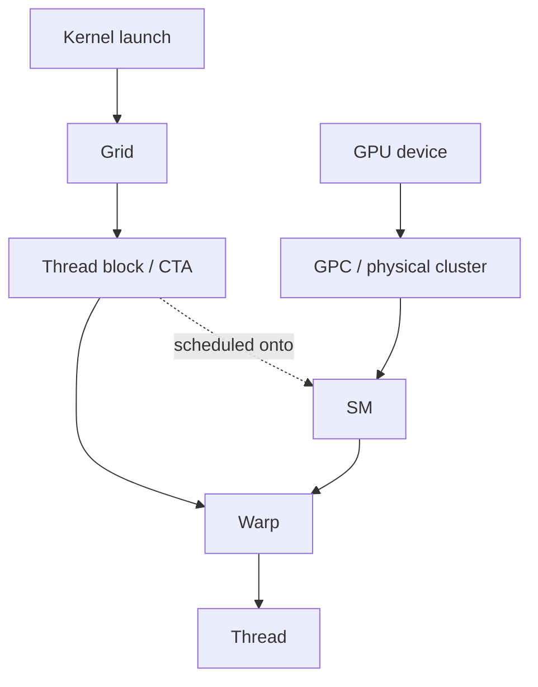
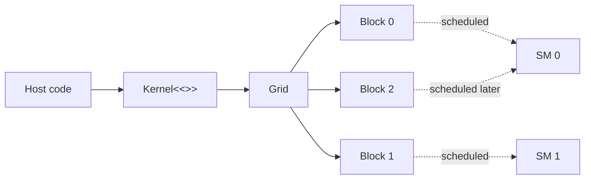
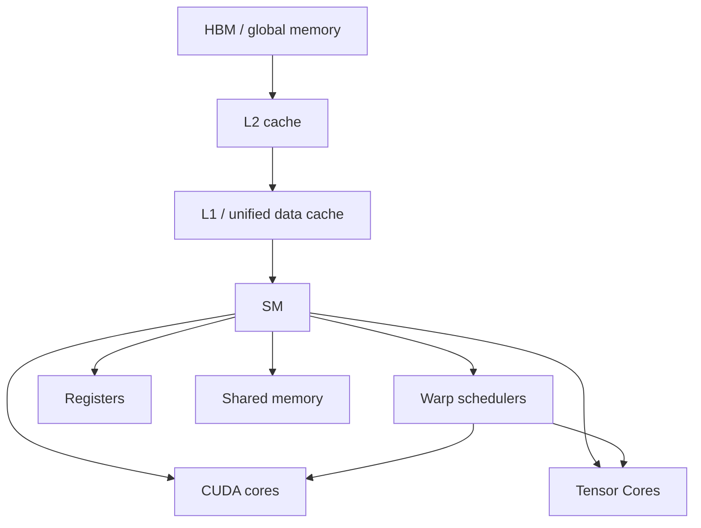
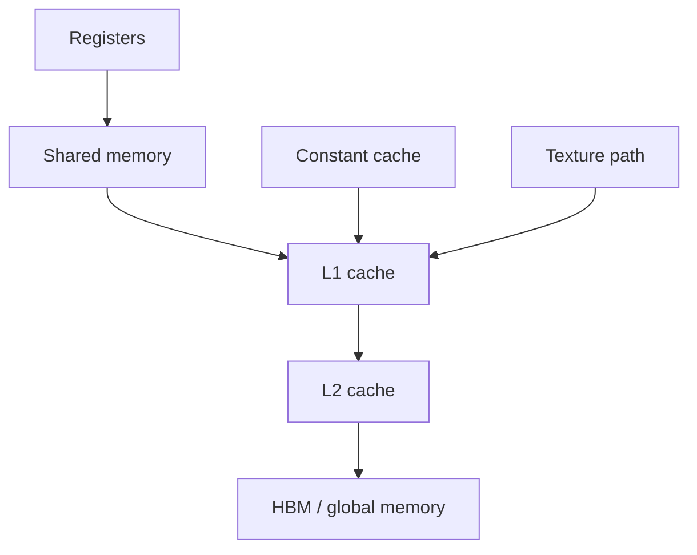
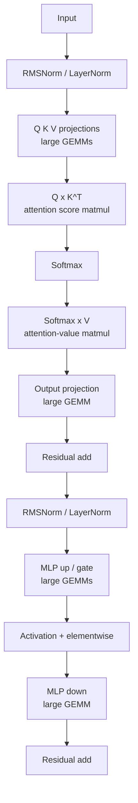
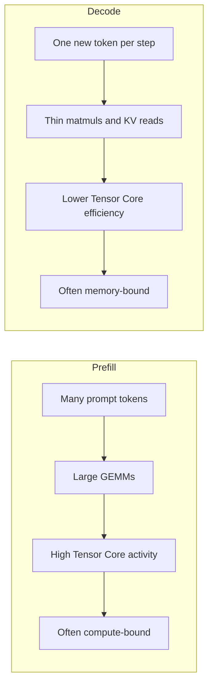
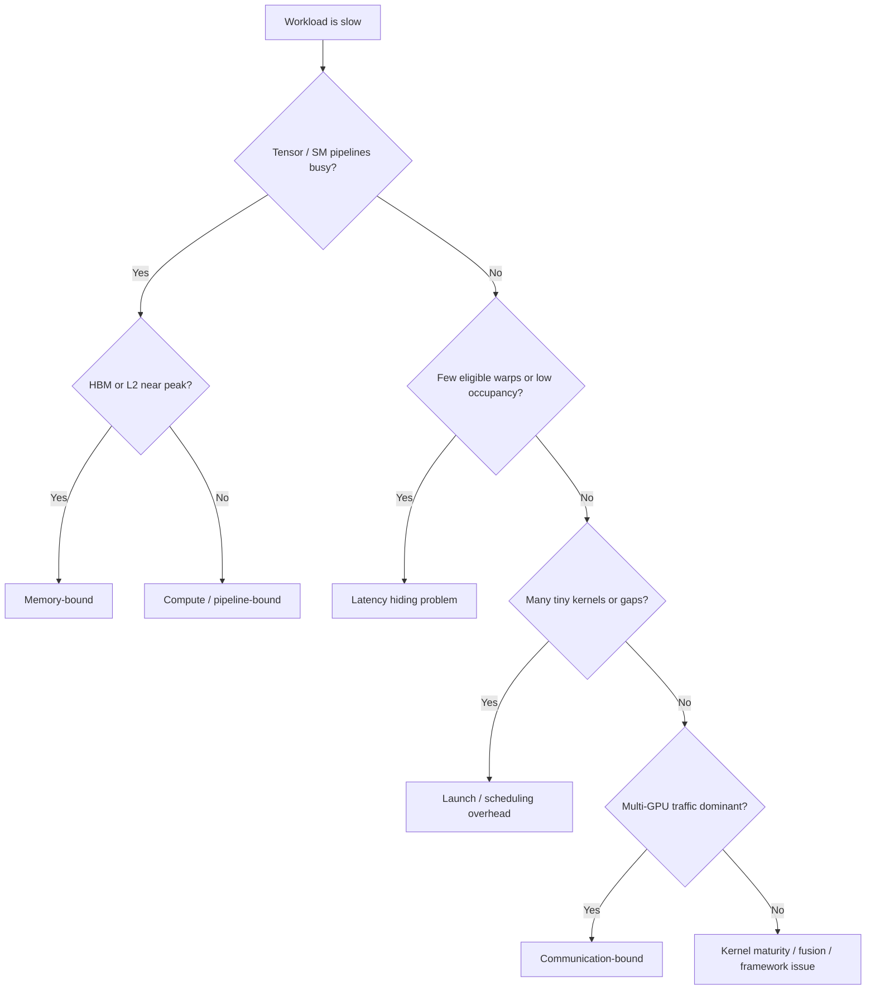

# NVIDIA GPU Execution Model

This module moves from the Week 1 platform view to the execution view: not just *what* NVIDIA sells,
but *how* NVIDIA GPUs actually execute ML work in practice. The focus is the CUDA execution model,
the streaming multiprocessor, warps, the memory hierarchy, Tensor Cores, and how these pieces map
onto real Transformer inference and training behavior. It is written for senior ML systems and
hardware interviews, not as a CUDA programming manual.

After this file, you should be able to explain, on a whiteboard, why Transformers fit GPUs so well,
why some phases are compute-bound while others are bandwidth-bound, how a kernel launch turns into
blocks and warps on SMs, why occupancy and memory access patterns matter, and why decode often
underutilizes a large GPU even when the model itself is large.

## Table of contents

- [Context and goals](#context-and-goals)
- [Execution hierarchy and scheduling](#execution-hierarchy-and-scheduling)
- [Memory, data movement, and Tensor Cores](#memory-data-movement-and-tensor-cores)
- [Transformers on the execution model](#transformers-on-the-execution-model)
- [Profiling and interview patterns](#profiling-and-interview-patterns)
- [Self-check and sources](#self-check-and-sources)

## Context and goals

### Introduction

Week 1 argued that NVIDIA's advantage is platform-level: GPU silicon, HBM, NVLink, NVSwitch, CUDA,
NCCL, and optimized inference software. Week 2 zooms into the single-GPU execution model that those
higher-level systems depend on. In interviews, this is the bridge between "NVIDIA wins because of
the platform" and "here is how the work actually flows through the chip."

A useful framing is to separate stable ideas from generation-specific details.

Stable interviewer knowledge:

- Grid, block, thread, warp, SM, registers, shared memory, L1, L2, and HBM.
- Warp size is 32.
- Blocks are scheduled to SMs; warps are scheduled inside an SM.
- Divergence, coalescing, occupancy, and latency hiding always matter.

Generation-specific details:

- SM count, L2 size, shared memory size, HBM capacity, and HBM bandwidth.
- Compute capability and supported instructions.
- Tensor Core generations and supported precisions.
- Async copy engines, clusters, distributed shared memory, and TMEM.

The CUDA abstraction has remained very stable, while hardware features evolve across Hopper,
Blackwell, and later generations. H100 and H200 are compute capability 9.0; B200 and GB200 are 10.0;
GB300 and B300 are 10.3; consumer and workstation Blackwell parts use 12.0 or 12.1.

### Why GPU execution matters for LLMs

Transformer workloads map well to GPUs because much of their work is dense linear algebra: Q/K/V
projections, output projections, and MLP layers are matrix multiplies, and matrix multiplication is
the core deep learning primitive NVIDIA has optimized very aggressively in hardware and libraries.
NVIDIA's deep learning performance guide describes GEMM as a fundamental building block for deep
learning layers, and NVIDIA's Tensor Core optimization material uses Transformer fully connected
layers as canonical examples.

But peak FLOPS alone is not a sufficient model of performance. Matrix multiply performance depends
on arithmetic intensity, tiling, Tensor Core eligibility, and how effectively data is reused from
registers, shared memory, L1, and L2 instead of being pulled repeatedly from HBM. NVIDIA's matrix
multiplication guide explicitly shows that some GEMMs are math-limited while others are memory-
limited, and that GEMV-like shapes are always memory-limited.

For LLMs, that distinction becomes operationally important. Prefill behaves more like large,
parallel matrix-matrix work and can saturate the GPU. Decode behaves more like matrix-vector or
thin-matrix work, with the GPU spending much of its time moving weights, keys, values, and
activations rather than doing math. NVIDIA's LLM inference guidance describes decode as
autoregressive, underutilizing GPU compute relative to prefill, and often dominated by memory
movement.

### CPU versus GPU mental model

A CPU is optimized for low-latency execution of relatively small numbers of complex threads. A GPU
is optimized for very high throughput across a much larger number of lighter-weight threads. The
CUDA programming guide states that GPUs provide much higher instruction throughput and memory
bandwidth than CPUs within a similar price and power envelope.

GPUs hide latency differently from CPUs. Instead of relying primarily on large caches and aggressive
single-thread machinery, an SM keeps many warps resident and switches to a different ready warp when
one warp stalls. NVIDIA states that the execution context for each warp is kept on-chip for the
warp's lifetime, so switching warp context has no cost at issue time. NVIDIA also describes GPU
latency hiding as coming from "excess warps" and overlapping concurrent threads.

A practical interview comparison:

| CPU intuition | GPU intuition |
|---|---|
| Minimize single-thread latency | Maximize throughput across many threads |
| Wide out-of-order core, complex speculation | Many lighter-weight threads and warp scheduling |
| Good for branchy, irregular control flow | Best for regular, data-parallel work |
| Cache hierarchy is central | Cache hierarchy matters, but so do warps, occupancy, and HBM bandwidth |
| Missing one cache line can stall progress | Another warp can run while one warp waits |

For Transformers, this is why GPUs love large batched GEMMs, but become less efficient on small,
sequential decode work with irregular or low-intensity memory access.

## Execution hierarchy and scheduling

### NVIDIA GPU hierarchy

The CUDA programmer's hierarchy is kernel launch -> grid -> thread blocks -> threads. The hardware
hierarchy beneath that includes the GPU, physical cluster structures such as GPCs and TPCs, then
SMs, then warps. For interview purposes, the most useful practical hierarchy is:

- GPU device
- SM
- thread block / CTA
- warp
- thread

Blocks are scheduled onto SMs. Each block is partitioned into warps of 32 threads. The application
does not control which SM gets which block, and CUDA makes no ordering guarantees about block
execution across SMs.

On recent Blackwell parts, SMs are physically organized into GPCs; for example, Blackwell Ultra
describes 160 SMs arranged into eight GPCs. That physical packaging matters in some low-level
architecture discussions and for features like block clusters, but the everyday CUDA mental model
remains grid, block, warp, thread.



Figure: interview-focused view of the CUDA and hardware hierarchy.

### CUDA execution model

A CUDA kernel launch specifies an execution configuration: how many blocks are in the grid and how
many threads are in each block. Once launched, the scheduler assigns thread blocks to SMs. CUDA is
explicit about an important practical point: the application cannot control or query which SMs get
which blocks, and it must not depend on a scheduling order for correctness.

The thread block is the key unit of placement and cooperation. Threads in a block can share on-chip
shared memory and synchronize with barriers. Threads in different blocks communicate through slower
memory, not through block-wide synchronization primitives. Nsight Compute describes thread blocks as
CUDA's cooperative thread arrays, the unit of locality that lets the architecture expose fast shared
memory and barriers.

For launch heuristics, NVIDIA's Best Practices Guide recommends making block size a multiple of the
warp size, using at least 64 threads per block when possible, and starting experimentation in the
128-256 thread range. It also notes that the grid should contain more blocks than there are
multiprocessors, ideally thousands of blocks, so the whole GPU stays busy.



Figure: a kernel launch creates a grid of blocks; blocks are placed on SMs as resources permit.

### Streaming multiprocessor intuition

The SM is the place where kernel instructions actually issue. The SM contains the warp scheduling
machinery, register file, shared memory, L1 path, and compute pipelines such as CUDA cores and
Tensor Cores. The CUDA programming guide describes each SM as having its own register file and
shared memory, plus an L1 cache that sits in the unified data cache; L2 is larger and shared across
the whole GPU.

Recent architectures add more specialized data movement and Tensor Core machinery while keeping the
same CUDA model. Hopper adds Tensor Memory Accelerator, which lets a thread issue larger tensor
copies between global memory and shared memory so the rest of the block can continue working while
data is in flight. Blackwell keeps the same basic CUDA abstraction while adding larger memory
structures and newer Tensor Core formats.

A practical SM mental model is: *warps wait in queues, the scheduler picks a ready warp, the warp
reads and writes registers, hits shared memory if it can, falls back to L1/L2/HBM if it must, and
issues either scalar/vector math or matrix-multiply work onto CUDA cores or Tensor Cores*.



Figure: simplified SM view for interviews.

### Warps and SIMT

A warp is a group of 32 threads. CUDA says threads inside a block are partitioned into warps of 32,
and warp lanes are numbered 0 through 31. This is one of the most stable facts in the CUDA model and
is a standard interview question.

NVIDIA describes the programming model as SIMT: single instruction, multiple threads. Threads in a
warp conceptually execute the same kernel code together, but each thread has its own registers and
its own data. Cornell's GPU architecture notes emphasize the practical difference from pure SIMD:
SIMT allows some lanes to be active while others are masked off.

That is exactly what happens during divergence. If some threads in a warp take one branch and others
take another, the warp executes one path while masking off the other threads, then executes the
other path. Utilization drops because not all lanes are doing useful work at the same time. NVIDIA
explicitly states that utilization is maximized when threads within a warp follow the same control
flow path.

Memory coalescing is the matching concept on the memory side. In the simple good case, the k-th
thread accesses the k-th word in an aligned array. For adjacent 4-byte words, the access can be
served in four 32-byte transactions on current devices. Misalignment and stride increase the number
of memory transactions, wasting bandwidth.

This is why branch divergence and irregular memory patterns hurt GPU efficiency so much: one wastes
execution lanes, the other wastes bandwidth and often increases stalls.

### Occupancy and latency hiding

Occupancy is the ratio of active warps on an SM to the maximum number of possible active warps on
that SM. NVIDIA's Nsight Compute guide and Best Practices Guide both define occupancy this way and
highlight the same core fact: higher occupancy can help hide latency, but higher occupancy does not
always mean higher performance.

Why occupancy matters: when one warp is waiting on memory, dependencies, or a barrier, the SM can
issue instructions from a different ready warp. If too few warps are resident, there may be no
eligible warp to issue, and the issue slot goes idle. Nsight Compute's scheduler statistics are
designed to expose exactly this: active warps, eligible warps, issued warps, and skipped issue
slots.

Why maximum occupancy is not always best: registers and shared memory are limited. If a kernel uses
many registers per thread or a large shared memory tile, fewer blocks and warps fit on the SM.
Sometimes that is a good trade because those extra registers reduce spilling to local memory, which
is off-chip and expensive. NVIDIA explicitly notes that lower-occupancy kernels can perform better
if they gain more registers and expose enough instruction-level parallelism.

For Hopper, occupancy still tops out at 64 warps per SM, with 64K 32-bit registers per SM and up to
227 KB shared memory per block. For Blackwell server parts, occupancy remains similar overall, again
limited by registers, per-block shared memory, and blocks per SM. Those exact limits vary by
generation, but the interview logic stays the same.

## Memory, data movement, and Tensor Cores

### Memory hierarchy

The execution model only makes sense if you pair it with the memory hierarchy. GPU performance is
not just about how many operations an SM can issue; it is also about where the data lives and how
often you have to leave the chip to get it. NVIDIA's CUDA programming guide emphasizes that memory
utilization is as important as maximizing functional-unit use.



Figure: practical GPU memory hierarchy. Scope gets broader and capacity gets larger as you move
down; latency usually rises and bandwidth per byte of useful work usually gets worse.

A useful interview summary:

| Level | Scope | What it is good for | Practical note |
|---|---|---|---|
| Registers | one thread | accumulators, loop state, fragments | fastest, but limited |
| Shared memory | one block | tiling, reuse, cooperation, staging | on-chip, bank conflicts matter |
| L1 | one SM | recent global/local/shared traffic | helps coalescing and reuse |
| L2 | whole GPU | cross-SM reuse, persistent data, traffic smoothing | shared by all SMs |
| HBM / global memory | whole GPU | weights, activations, KV cache | huge capacity, high bandwidth, high latency |

Registers are on-chip and per-thread. Shared memory is on-chip and per-block. L1 is per-SM. L2 is
global to the GPU. Global memory is device DRAM, which in server AI parts is HBM. Constant memory is
cached and best when threads in a warp read the same location; otherwise accesses serialize across
unique addresses. Local memory sounds close but is actually off-chip and expensive, often used when
register pressure causes spilling.

### Memory access patterns

On GPUs, *how* you access memory often matters nearly as much as *how much* you access. Coalescing
means that threads in a warp touch nearby aligned addresses so the hardware can serve the access
with a small number of memory transactions. Misalignment and stride cause the hardware to move more
data than the kernel actually uses.

NVIDIA's Best Practices Guide gives a concrete illustration. For adjacent 4-byte values, a warp can
be served with four 32-byte transactions. With a stride of 2, effective load/store efficiency drops
to 50%, because half the transferred elements are unused. As stride rises, bandwidth efficiency
continues to fall.

Shared memory helps because it lets you load from global memory in a coalesced pattern, then reuse
or rearrange those values on-chip. But shared memory has banks, and if multiple threads in a warp
hit the same bank at different offsets, the request is split into multiple conflict-free requests,
reducing effective bandwidth. NVIDIA's matrix examples show how tiling plus padding shared-memory
tiles can dramatically improve performance by fixing both global coalescing and bank conflicts.

Tiling is therefore a central GPU idea. You pull a tile of data from HBM into shared memory, then
move fragments into registers and reuse them for many operations before going back to HBM. This is
exactly how high-performance GEMM kernels work. CUTLASS describes GEMM as a hierarchy of tiles that
match thread blocks, warps, Tensor Core instructions, shared memory, and registers.

### Tensor Cores

Tensor Cores accelerate matrix multiply-accumulate work. NVIDIA describes them as operating on small
matrices and performing MMA work directly, which is why they are such a good match for neural
networks. That is the key interview-level intuition: Tensor Cores are the fast path for the dense
linear algebra that dominates Transformers.

The mapping from software to Tensor Cores is hierarchical. At a high level, a thread block computes
an output tile, multiple warps cooperate within the block, and warp-level MMA instructions execute
on Tensor Cores while data is staged through shared memory and registers. CUTLASS describes this
directly and is a very good practical bridge between CUDA abstractions and actual GEMM execution.

Precision formats matter because they determine both throughput and memory footprint.

| Format | Interview shorthand |
|---|---|
| FP32 | baseline floating-point precision |
| TF32 | Ampere+ Tensor Core path for many FP32-style training workloads |
| FP16 / BF16 | standard mixed-precision formats for training and inference |
| FP8 | Hopper and Blackwell Transformer Engine path |
| FP4 / NVFP4 | Blackwell-era low-precision inference and training path |

NVIDIA introduced TF32 on Ampere to bring Tensor Core acceleration to FP32-style DL workloads,
supports BF16 Tensor Core math at FP16-like rates on Ampere, adds FP8 Tensor Cores on Hopper, and
adds NVFP4 support in Blackwell fifth-generation Tensor Cores.

Do not over-index on the exact instruction names in interviews. The right answer is usually:
*Transformers are heavy on GEMMs; NVIDIA maps those GEMMs to Tensor Core MMA kernels; lower
precision both raises compute throughput and shrinks the bytes that must move through HBM.*

### HBM and bandwidth

HBM matters because modern LLMs are huge memory systems, not just math systems. NVIDIA's inference
optimization guidance says the two main contributors to GPU memory requirement during LLM inference
are model weights and the KV cache. Decode is especially sensitive because each step depends on
cached keys and values from earlier tokens.

HBM is therefore carrying at least four classes of traffic in real deployments:

- model weights
- activations and intermediate tensors
- KV cache
- temporary buffers and workspaces from optimized runtimes

TensorRT-LLM notes that TensorRT precomputes activation tensor memory needs at build time and reuses
memory across live ranges, precisely because device memory is constrained and runtime buffer usage
matters.

Recent NVIDIA server GPUs have kept pushing HBM and L2 upward because LLM performance depends on
that movement. Hopper H100 supports up to 80 GB of HBM3 and up to 3 TB/s of memory bandwidth, with
50 MB of L2. Blackwell server parts increase memory capacity and L2 further; the Blackwell tuning
guide notes up to 180 GB HBM3/HBM3e for B200 and 126 MB L2 in GB200. Blackwell Ultra public
architecture material describes up to 288 GB HBM3e and up to 8 TB/s bandwidth in that generation.

A good interview shorthand is:

```text
If arithmetic intensity is high and Tensor Cores stay busy, think compute-bound.
If the GPU spends its time pulling weights or KV cache through L2/HBM, think memory-bound.
```

That is exactly the prefill-vs-decode split you see in production LLM serving.

### CUDA streams and overlap

A CUDA stream is a work queue: an ordered sequence of operations such as memory copies and kernel
launches. CUDA's asynchronous execution model exists so applications can overlap host work, device
work, and memory transfers rather than forcing everything into a single serialized queue.

This matters because practical serving systems must keep the GPU fed. Kernels can be launched into
specific streams, memory transfers can be issued with `cudaMemcpyAsync`, and synchronization can be
done with stream sync, queries, or events. To get true CPU-memory async overlap, host buffers must
be pinned; otherwise the copy falls back to synchronous behavior and the overlap benefit disappears.

The default stream is a common footgun. CUDA documents that the legacy default stream synchronizes
with other blocking streams, which can accidentally serialize work that could otherwise overlap.
Using non-blocking streams and explicit event dependencies avoids a lot of silent performance loss.

At a higher level, streams matter for serving because they are one of the ways frameworks overlap
preprocessing, copies, compute, and postprocessing. They also interact with CUDA Graphs, which can
reduce repeated launch overhead by instantiating a workflow once and replaying it with little
overhead. That is especially relevant when a workload contains many small kernels.

## Transformers on the execution model

### From Transformer block to GPU work

A Transformer block is not one monolithic operation. It is a sequence of large GEMMs, attention
kernels, normalization, elementwise operations, and residual paths. The important interview skill is
knowing which parts are compute-dense and Tensor Core friendly, and which parts are more memory-
sensitive. NVIDIA's inference and Tensor Core materials use exactly these Transformer subcomponents
to explain performance behavior.



Figure: an interview-level Transformer block decomposition.

A practical mapping:

| Transformer piece | GPU view | Typical bottleneck intuition |
|---|---|---|
| Q/K/V projections | large GEMMs | compute-heavy, Tensor Core friendly |
| Attention score matmul | GEMM-like | compute-heavy in prefill |
| Softmax | reduction + elementwise | bandwidth-sensitive, often fused |
| Attention-value matmul | GEMM-like | compute-heavy, but context size matters |
| Output projection | large GEMM | compute-heavy, Tensor Core friendly |
| LayerNorm / RMSNorm | reductions + elementwise | often memory-sensitive |
| Residual / activation ops | elementwise | often memory-sensitive |
| MLP up / down | large GEMMs | major Tensor Core work |

Modern attention kernels exist largely to reduce memory movement. NVIDIA's Flash Attention material
describes the algorithm as IO-aware, tiled, and fused so it does not materialize the full attention
matrix in memory; Transformer Engine documentation similarly emphasizes lower memory and bandwidth
use from flash-style execution. NVIDIA also describes LayerNorm and related fused kernels as memory-
bound optimization targets in MLPerf work.

### Prefill versus decode on GPUs

Prefill processes the prompt. Because the whole prompt is known, much of the work can be expressed
as large, parallel matrix operations. NVIDIA's LLM inference guidance says prefill is highly
parallelized and can effectively saturate GPU utilization.

Decode generates tokens one at a time. The new token depends on all prior keys and values, so
autoregressive structure limits parallelism across generated tokens. NVIDIA describes decode as more
like a matrix-vector operation that underutilizes the GPU relative to prefill, with latency often
dominated by moving weights, keys, values, and activations from memory.

That is why small-batch decode can leave Tensor Cores underused. From the matrix multiplication
guide, GEMV-like shapes are always memory-limited. From NVIDIA's LLM serving material, decode is
often memory-bound, especially due to KV cache traffic. Put together, the right inference is:
*decode makes the GPU look smaller than it is because the work gets thinner and more bandwidth-
dominated.*



Figure: the core performance difference between prefill and decode.

KV cache is central here. NVIDIA notes that KV caching avoids recomputation, but memory grows
linearly with batch size and sequence length, which can quickly constrain throughput and long-
context serving. TensorRT-LLM therefore invests heavily in paged KV cache and KV management.

### Bottleneck framework

When an interviewer asks why a kernel or model is slow, the best answer is usually not a single
cause. You should classify the dominant bottleneck first:

- compute-bound
- memory-bound
- launch or scheduling overhead bound
- communication-bound
- software or kernel maturity bound

NVIDIA's matrix multiplication guide gives the compute-vs-memory lens through arithmetic intensity.
Nsight Compute gives the scheduler, memory, and warp-stall lenses. CUDA Graphs documentation gives
the launch-overhead lens. Multi-GPU LLM serving docs add the communication and scheduling lens.



Figure: a practical bottleneck tree for ML systems interviews.

A few symptom-to-cause examples:

| Symptom | Likely explanation |
|---|---|
| High Tensor Core activity, low DRAM pressure | compute-bound dense GEMM |
| Low Tensor Core use, high HBM traffic | memory-bound decode or elementwise-heavy work |
| Low eligible warps, many skipped issue slots | poor latency hiding, low occupancy, or heavy stalls |
| Large gaps between tiny kernels | launch overhead or missed fusion / CUDA Graph opportunity |
| Good single-GPU kernels but slow scale-out | communication or synchronization overhead |

These are not rigid rules, but they are the right interview starting points.

## Profiling and interview patterns

### Profiling intuition

Nsight Compute is the per-kernel microscope. NVIDIA recommends using it together with the CUDA
programming model and hardware implementation material because it ties launch configuration,
scheduler behavior, memory activity, and warp stalls back to the hardware.

The key metric families to understand before you ever touch the tool:

- Compute Workload Analysis for SM IPC and pipeline utilization
- Launch Statistics for grid, block, and resource usage
- Occupancy for active warps vs the theoretical maximum
- Scheduler Statistics for active, eligible, and issuing warps
- Memory Workload Analysis for shared, L1, L2, and device memory traffic
- Warp Stall Reasons for why issue slots are not being filled

Those are exactly the sections and behaviors that Nsight Compute documents.

The practical interview metric mapping is:

| What you want to know | Metrics intuition |
|---|---|
| Are SMs busy? | SM throughput, IPC, compute pipelines |
| Are Tensor Cores used? | Tensor or MMA pipeline activity |
| Is memory the limiter? | DRAM throughput, L2 throughput, cache hit rates |
| Is occupancy too low? | occupancy and launch statistics |
| Are warps stalling? | warp stall reasons and eligible warps |
| Are bank conflicts present? | shared memory table and bank conflict indicators |

Nsight Compute's memory tables explicitly expose shared memory bank conflicts, L1 and L2 tables,
device memory throughput, and throughput as percent of peak. Its scheduler statistics expose
eligible warps and skipped issue slots.

### Common misconceptions

The corrections below are synthesis of CUDA, Nsight, and NVIDIA LLM inference guidance.

- More CUDA cores do not always mean faster execution. The workload must keep them fed, and the
  memory system must not be the limiter.
- Peak FLOPS does not predict real performance by itself. Real performance depends on arithmetic
  intensity, data reuse, scheduling, and memory traffic.
- Maximum occupancy is not always best. Enough occupancy matters, but maximum occupancy may hurt if
  it increases spilling or reduces reuse.
- Not all Transformer operations are GEMMs. Norms, softmax, residuals, and scheduler overhead can be
  bandwidth-sensitive and important.
- Memory hierarchy is not only a CUDA programmer concern. It directly determines real LLM
  throughput, especially in decode.
- Tensor Cores do not solve every problem. They accelerate dense matmuls, but they do not erase
  memory, launch, or communication limits.

### Senior interview answer patterns

These answer patterns are intentionally short and reusable. They are not memorization scripts; they
are compact structures that map directly onto the execution model.

**Explain the NVIDIA GPU execution model.** "A CUDA kernel launch creates a grid of thread blocks.
Blocks are scheduled onto SMs, and each block is partitioned into warps of 32 threads. The SM
schedules ready warps, uses registers and shared memory for fast local data, and falls back to L1,
L2, and HBM for larger data. Real performance comes from keeping many warps ready and minimizing
off-chip traffic."

**What is a warp?** "A warp is the 32-thread scheduling unit inside an SM. CUDA presents a SIMT
model where threads in a warp conceptually advance together; divergence masks off inactive lanes, so
warp-level regularity is important for utilization."

**Why does memory coalescing matter?** "Because the hardware serves a warp's global memory accesses
in memory transactions. If adjacent threads read adjacent aligned addresses, you get a small number
of transactions. Strided or misaligned accesses increase transactions and waste bandwidth."

**Why can decode underutilize a GPU?** "Decode is sequential across generated tokens and often looks
more like matrix-vector work plus KV cache reads than like large GEMMs. That reduces Tensor Core
efficiency and shifts the bottleneck toward bandwidth."

**How do Tensor Cores help Transformers?** "They accelerate matrix multiply-accumulate, and
Transformers spend much of their time in QKV, projection, and MLP GEMMs. Lower-precision formats
also shrink the bytes that move through memory."

**How would you tell if a workload is memory-bound?** "I would look for high DRAM or L2 pressure,
low arithmetic intensity, low Tensor Core utilization relative to memory traffic, and warp stalls
consistent with memory dependencies. Nsight Compute is the tool for that."

**Why is maximum occupancy not always optimal?** "Because occupancy is only one way to hide latency.
If pushing occupancy higher forces register spills or reduces tile reuse, performance can go down
even though active warps go up."

### Whiteboard explanation

A concise interview drawing sequence:

```text
1. CPU launches kernel
2. Kernel -> grid of blocks
3. Blocks land on SMs
4. Each block -> warps of 32 threads
5. SM schedules ready warps
6. Data path: registers / shared -> L1 -> L2 -> HBM
7. Compute path: CUDA cores and Tensor Cores
8. Transformer mapping:
   - GEMMs: QKV, projections, MLPs
   - memory-sensitive ops: norm, softmax, elementwise
9. Prefill: parallel, compute-heavy
10. Decode: sequential, KV-cache-heavy, often bandwidth-bound
```

If you only remember one sentence, make it this: **NVIDIA GPUs win on Transformers when software
tiles work so Tensor Cores stay busy and HBM traffic is minimized; performance collapses when shapes
get thin, access gets irregular, or the scheduler runs out of ready warps.**

## Self-check and sources

### Week 2 self-check

Try to answer these without notes:

1. Why are Transformers generally GPU-friendly?
2. What is the difference between a grid, a block, a warp, and a thread?
3. What does an SM do?
4. Why does a GPU need many active warps?
5. What is occupancy, and why is low occupancy dangerous?
6. Why is maximum occupancy not automatically best?
7. Why does branch divergence hurt performance?
8. Why does memory coalescing matter?
9. When would you use shared memory conceptually?
10. What is the difference between registers, shared memory, L2, and HBM?
11. What do Tensor Cores accelerate?
12. Why are QKV and MLP layers Tensor Core friendly?
13. Why can decode be slower per FLOP than prefill?
14. Why does KV cache make decode memory-sensitive?
15. If a kernel is slow, how do you distinguish compute-bound, memory-bound, and launch-bound?

### Public visual explainers

The Markdown above is designed to stand on its own, but these public visuals are worth studying:

- CUDA Programming Guide: Programming Model figure and hierarchy
- Cornell Virtual Workshop: SIMT and Warps
- [NVIDIA Hopper Architecture In-Depth](https://developer.nvidia.com/blog/nvidia-hopper-architecture-in-depth/)
- Inside NVIDIA Blackwell Ultra: SM architecture and Tensor Core visuals
- Nsight Compute Profiling Guide: memory tables and hardware models
- Matrix Multiplication Background User's Guide
- TensorRT-LLM Chunked Prefill visual
- Mastering LLM Techniques: Inference Optimization, with KV cache visuals

### Sources

#### Official NVIDIA CUDA and execution model documentation

- [CUDA Programming Guide](https://docs.nvidia.com/cuda/cuda-programming-guide/index.html)
- [CUDA C++ Best Practices Guide](https://docs.nvidia.com/cuda/cuda-c-best-practices-guide/index.html)
- [CUDA GPU Compute Capability table](https://developer.nvidia.com/cuda/gpus)
- CUDA Asynchronous Execution
- CUDA Asynchronous Data Copies

#### NVIDIA architecture and hardware references

- [Hopper Tuning Guide](https://docs.nvidia.com/cuda/hopper-tuning-guide/index.html)
- [Blackwell Tuning Guide](https://docs.nvidia.com/cuda/blackwell-tuning-guide/index.html)
- [NVIDIA Hopper Architecture In-Depth](https://developer.nvidia.com/blog/nvidia-hopper-architecture-in-depth/)
- Inside NVIDIA Blackwell Ultra
- NVIDIA Blackwell Ultra for the Era of AI Reasoning

#### Tensor Cores, GEMM, and precision formats

- Matrix Multiplication Background User's Guide
- Tips for Optimizing GPU Performance Using Tensor Cores
- [Efficient GEMM in CUDA, CUTLASS](https://docs.nvidia.com/cutlass/4.2.1/media/docs/cpp/efficient_gemm.html)
- Accelerating AI Training with TF32 Tensor Cores
- Floating-Point 8: An Introduction to Efficient, Lower-Precision AI Training
- Introducing NVFP4 for Efficient and Accurate Low-Precision Inference

#### Profiling and bottleneck analysis

- [Nsight Compute Profiling Guide](https://docs.nvidia.com/nsight-compute/ProfilingGuide/index.html)
- [Getting Started with CUDA Graphs](https://developer.nvidia.com/blog/cuda-graphs/)
- CUDA Graphs section in the CUDA Programming Guide
- Understanding Overhead and Latency in Nsight Systems

#### Transformer and LLM execution references

- Mastering LLM Techniques: Inference Optimization
- [TensorRT-LLM: GPT attention and KV cache docs](https://nvidia.github.io/TensorRT-LLM/advanced/gpt-attention.html)
- [TensorRT-LLM KV Cache System](https://nvidia.github.io/TensorRT-LLM/latest/features/kvcache.html)
- TensorRT-LLM Chunked Prefill
- Skip Softmax in TensorRT-LLM
- NVIDIA Dynamo and disaggregated prefill/decode

#### Supporting educational material

- Cornell Virtual Workshop: SIMT and Warps
- [UCSD GPU architecture lecture](https://cseweb.ucsd.edu/classes/sp14/cse240A-a/Slides/18_GPUs.pdf)

### Open questions and limits of this module

This file stays at the practical interview level. It does not dive deeply into instruction
encodings, PTX, FlashAttention internals, CUTLASS template structure, NCCL collectives, or detailed
KV-cache engineering. Those are better left to later weeks. Some hardware details, especially around
Blackwell's newest low-precision paths and specialized memory features, are still evolving across
toolchain releases, so this module emphasizes the stable CUDA model first and generation-specific
details second.
