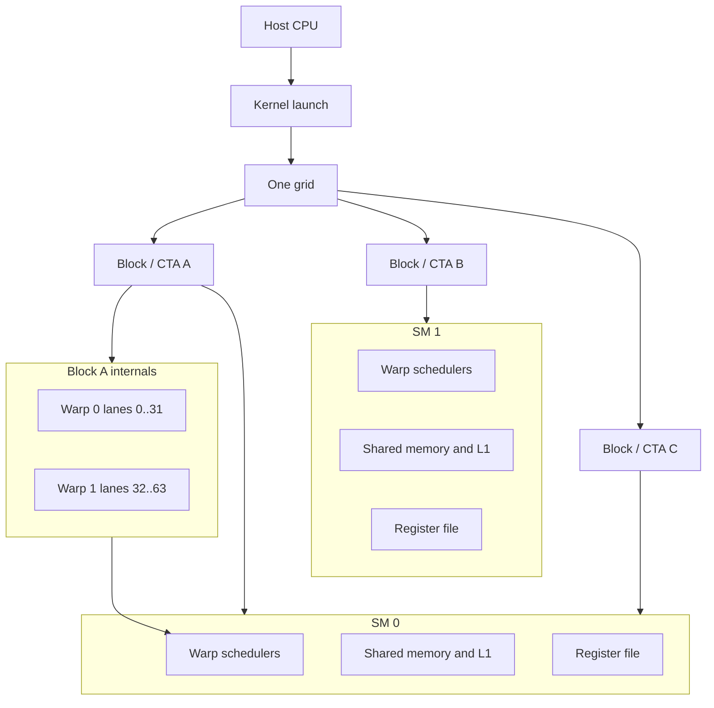
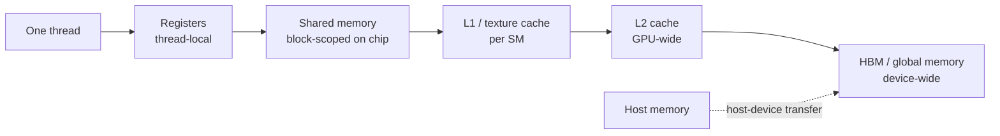
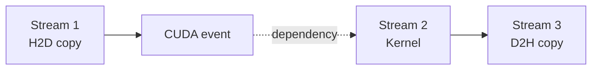
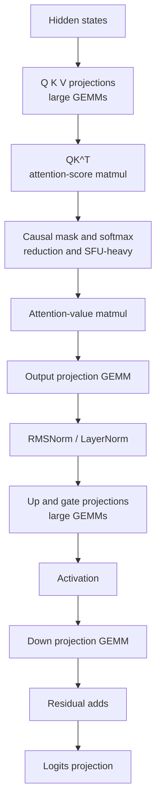

# NVIDIA GPU Execution Model

## Table of contents

- [Introduction](#introduction)
- [First-principles vocabulary](#first-principles-vocabulary)
- [Why GPU execution matters for LLMs](#why-gpu-execution-matters-for-llms)
- [CUDA execution hierarchy](#cuda-execution-hierarchy)
- [Streaming multiprocessor intuition](#streaming-multiprocessor-intuition)
- [Warps, SIMT, occupancy, and latency hiding](#warps-simt-occupancy-and-latency-hiding)
- [Memory hierarchy and memory access](#memory-hierarchy-and-memory-access)
- [Tensor Cores and GEMM mapping](#tensor-cores-and-gemm-mapping)
- [From Transformer block to GPU work](#from-transformer-block-to-gpu-work)
- [Prefill versus decode on GPUs](#prefill-versus-decode-on-gpus)
- [Bottleneck reasoning and profiling intuition](#bottleneck-reasoning-and-profiling-intuition)
- [Senior interview answer patterns](#senior-interview-answer-patterns)
- [Whiteboard explanation](#whiteboard-explanation)
- [Week 2 self-check](#week-2-self-check)
- [Sources](#sources)

## Introduction

Week 2 moves from NVIDIA as a platform to NVIDIA as an execution engine. Week 1 covered racks,
interconnects, software, and why NVIDIA wins at the platform level. This module goes one level
deeper: how a single NVIDIA GPU actually executes work, and how that execution model explains real
Transformer behavior in training and inference. The stable mental model comes from CUDA’s
programming model and memory model. What changes across generations are capacities, datatypes,
caches, asynchronous engines, and some scheduling details. Hopper H100/H200 are compute
capability 9.0, B200/GB200 are 10.0, GB300 is 10.3, and client or workstation Blackwell parts
also exist at 12.x with different per-SM limits, so interview answers should separate the stable
CUDA concepts from generation-specific numbers. Week 3 will go deeper into microarchitecture.

After this file, you should be able to explain, cleanly and without hand-waving:

- why Transformers are such a strong match for GPUs,
- how a kernel launch becomes blocks, warps, and issued instructions on SMs,
- why block shape, warp behavior, occupancy, and memory access patterns matter,
- why Tensor Cores help some Transformer operations much more than others,
- why prefill and decode stress a GPU differently, and
- how to reason from symptoms to likely bottlenecks before touching a profiler.

### Visual roadmap

This file includes these inline visuals at the point of use:

- CUDA programming model hierarchy: grid, block, warp, lane, and SM placement.
- Block scheduling onto SMs.
- Warp lane behavior.
- Hopper full-chip and Hopper SM diagrams.
- Blackwell Ultra full-chip and Blackwell Ultra SM diagrams.
- Memory hierarchy and coalesced-versus-strided access visuals.
- GEMM and Tensor Core tiling hierarchy.
- Transformer block to GPU-work mapping.
- Prefill versus decode with KV caching.
- Roofline-guided bottleneck analysis.

### Reference generations for this module

| Family | Representative parts | Compute capability | Why it matters here |
|---|---|---:|---|
| Hopper | H100, H200, GH200 | 9.0 | Baseline server reference for many current CUDA and LLM discussions |
| Blackwell server | B200, GB200 | 10.0 | Same CUDA model, newer server-side limits and memory hierarchy details |
| Blackwell Ultra | B300, GB300 | 10.3 | Same core execution model, more memory and newer serving-oriented emphasis |
| Blackwell client/workstation | RTX PRO 6000, RTX 5090 | 12.x | Same model, different limits |

Source note: this table condenses NVIDIA’s compute-capability list and the Hopper and Blackwell
tuning guides.

## First-principles vocabulary

The most common way to get lost in GPU interviews is to use words like *grid*, *warp*, *SM*, or
*occupancy* before you have made them precise. The definitions below are intentionally plain,
interview-useful, and slightly simplified. Use them first; add detail only if an interviewer asks
for it.

### Core CUDA and GPU terms

| Term | Plain, interview-useful definition |
|---|---|
| kernel | A function executed on the GPU by many threads in parallel |
| kernel launch | The host-side act of starting a kernel with a grid, block shape, and optional stream |
| grid | The full set of thread blocks created by one kernel launch |
| thread block / CTA | A cooperative group of threads that runs on one SM and shares shared memory |
| thread | The smallest programmer-visible execution context |
| warp | A group of 32 threads that is the basic scheduling and execution unit inside an SM |
| warp lane | A thread’s slot index, 0 through 31, inside its warp |
| SM | A streaming multiprocessor: the GPU execution core that hosts blocks and schedules warps |
| occupancy | Active warps per SM divided by the hardware maximum active warps per SM |
| eligible warp | An active warp that is ready to issue its next instruction |
| register | The fastest thread-local storage location |
| register file | The per-SM pool of registers partitioned across resident threads |
| shared memory | On-chip block-scoped scratchpad memory shared by threads in one block |
| L1 cache | The per-SM data cache; on modern NVIDIA server GPUs it is unified with shared-memory resources |
| L2 cache | The larger on-chip cache shared by all SMs |
| global memory | Device memory visible to all SMs; on server GPUs this is typically HBM |
| local memory | Thread-scoped by name, but physically off-chip and as expensive as global memory |
| HBM | High-bandwidth stacked DRAM attached to the GPU package and used as global memory |
| Tensor Core | Specialized matrix multiply-accumulate hardware for AI and HPC math |
| CUDA core | Interview shorthand for the SM’s general FP and INT execution datapaths |
| CUDA stream | An in-order work queue for operations such as kernel launches and copies |
| memory coalescing | Merging a warp’s memory accesses into as few global-memory transactions as possible |
| bank conflict | Multiple threads in a warp hit the same shared-memory bank, forcing serialization |
| tiling | Breaking a large problem into smaller tiles that fit blocks, warps, shared memory, and registers |
| arithmetic intensity | Work done per byte moved; the key concept behind roofline reasoning |

Glossary note: these definitions summarize CUDA’s programming model and hardware model, the CUDA
Best Practices memory and occupancy sections, Nsight Compute scheduler terminology, the matrix
multiplication guide’s arithmetic-intensity language, and TensorRT-LLM’s attention and KV-cache
terminology.

### Minimum interview vocabulary

| Term | One-line definition | Why it matters for LLMs | Common mistake |
|---|---|---|---|
| kernel | One GPU function launch | Transformer ops become kernels | Thinking one kernel means one thread |
| grid | All blocks from one launch | Sets total GPU work | Confusing grid with the whole GPU |
| block / CTA | One cooperative workgroup on one SM | Shared-memory tiling lives here | Mixing block with warp |
| warp | 32-thread execution unit | Divergence and coalescing happen here | Treating it as a programmer-chosen group |
| SM | GPU execution core | Blocks really run here | Equating one SM with one GPU |
| occupancy | Active warps / max warps | Helps hide latency | Treating it as utilization |
| shared memory | Fast on-chip scratchpad | Reuse and tiling for GEMMs and attention | Equating it with L1 |
| HBM / global memory | Large off-chip device memory | Weights and KV cache live here | Focusing only on FLOPS |
| Tensor Core | Matrix-MMA hardware | Powers high-throughput GEMMs and attention matmuls | Assuming every op uses it |
| arithmetic intensity | Work per byte moved | Separates compute limits from memory limits | Using peak FLOPS alone |

Source note: the table compresses the CUDA Programming Guide, CUDA Best Practices Guide, Nsight
Compute Profiling Guide, and NVIDIA matrix-multiplication documentation into interview shorthand.

## Why GPU execution matters for LLMs

Transformer workloads map well to GPUs because they contain large amounts of parallel work over
many tokens, heads, and hidden dimensions, and because much of the heavy lifting reduces to matrix
multiplication. NVIDIA’s best-practices guide makes the general point that GPUs are built for very
large numbers of lightweight concurrent threads, and NVIDIA’s matrix guide shows why GEMMs are the
fundamental building block for deep-learning layers. That is exactly the pattern you see in Q, K,
V projections, attention-value products, output projections, and MLP projections.

Peak FLOPS alone is not enough. The matrix guide explicitly uses arithmetic intensity to show why
some matrix multiplies are math-limited while others are memory-limited, and it notes that GEMV
cases are always memory-limited. That is one of the cleanest bridges from “GPU architecture” to
“LLM systems”: large batched GEMMs can keep Tensor Cores busy, while small-batch decode often
drifts toward matrix-vector-like behavior where memory traffic dominates.

The CUDA Best Practices Guide also says the GPU is ideally suited to computations that can run over
thousands or tens of thousands of concurrent threads, and that adjacent-thread memory coherence is
crucial because coalescing and cache locality strongly affect speedup. That is why practical LLM
performance depends on execution, memory movement, and scheduling together, not on a single spec
sheet number.

### CPU versus GPU mental model

NVIDIA states the contrast directly: CPU cores are designed to minimize latency for a small number
of threads, whereas GPUs are designed to handle a large number of concurrent, lightweight threads
to maximize throughput. On a CPU, threads are relatively heavyweight and context switches are
expensive. On a GPU, warps are lightweight, and the machine hides latency by switching to other
ready warps when one warp stalls on memory or dependencies.

That is the right interview mental model:

- **CPU**: spend more transistors making one or a few threads fast.
- **GPU**: spend more transistors making many threads progress at once.
- **LLM implication**: large dense phases like prefill and big GEMMs are GPU-friendly; irregular,
  small, sequential, or memory-dominated phases are harder to sustain at peak efficiency.

![CPU-GPU heterogeneous system and memory path][img-gpu-cpu-system]

*Source: [CUDA Programming Guide][src-cuda-guide], §1.2.2 “GPU Hardware Model,”
Figure 2 “A GPU has many streaming multiprocessors.”*

> **What it shows:** CPU and GPU are separate processing domains with separate attached memories,
> and the GPU is built from many SMs behind an L2 and memory controller path.
>
> **Why it matters:** it makes the execution model concrete: host launches work, SMs execute it,
> and data movement between host and device is not free.
>
> **Interviewer may ask:** “Why can a fast GPU kernel still produce little end-to-end speedup?”

### Common beginner traps

| Trap | Correct view | Why it matters |
|---|---|---|
| grid vs block | Grid = full launch; block = one workgroup | Foundation for later reasoning |
| block vs warp | Block = cooperation; warp = execution unit | Many LLM issues are warp-level |
| thread vs lane | A lane is just a thread’s slot within a warp | Useful when discussing divergence or lane masking |
| SM vs GPU | GPU = whole chip; SM = one execution core | More precise than “runs on GPU” |
| occupancy vs utilization | Occupancy is residency; utilization is useful work | High occupancy can still be slow |
| shared memory vs L1 | Shared memory is managed; L1 is a cache | Shared silicon, different semantics |
| global memory vs local memory | Local memory is thread-scoped but off-chip | Spilling can make kernels memory-heavy |
| CUDA core vs Tensor Core | CUDA cores are general; Tensor Cores do MMA | Not every op is Tensor Core dominated |
| bandwidth vs latency | Bandwidth is throughput; latency is time per access | Both can limit GPU performance |
| compute-bound vs memory-bound | Limit may be math rate or data movement | Core bottleneck reasoning |

Source note: this table summarizes the CUDA Programming Guide, CUDA Best Practices Guide, Nsight
Compute’s scheduler and occupancy definitions, and NVIDIA’s matrix and LLM inference documentation.

## CUDA execution hierarchy

The most important hierarchy statement in this file is this one:

> **One kernel launch creates one grid. A grid contains thread blocks. A thread block contains
> threads. Threads are grouped into warps of 32. Blocks are scheduled onto SMs. Warps are
> scheduled inside SMs. The programmer controls grid and block dimensions, but not the exact SM
> placement or order of block execution.**

CUDA’s programming-model chapter says a kernel is the function invoked for execution on the GPU,
and launching the kernel starts many threads in parallel. It then says those threads are organized
into blocks, and those blocks are organized into a grid. All threads of a thread block execute on a
single SM, which is why threads in a block can synchronize and share on-chip shared memory
efficiently. The same guide also says there are no guarantees about block scheduling order across
SMs, so different blocks must usually be independent.

### One kernel launch, one grid

![CUDA programming model hierarchy: grid of thread blocks][img-grid-of-thread-blocks]

*Source: [CUDA Programming Guide][src-cuda-guide], §1.2.2.1 “Thread Blocks and Grids,”
Figure 3 “Grid of Thread Blocks.”*

> **What it shows:** one kernel launch creates one grid, and that grid consists of many
> same-shaped thread blocks.
>
> **Why it matters:** this is the first correction to many fuzzy interview explanations; you do not
> “launch warps” or “launch SMs,” you launch a kernel with a grid and block shape.
>
> **Interviewer may ask:** “What exactly is a grid, and who chooses its dimensions?”

The programmer chooses the execution configuration: grid dimensions and thread-block dimensions.
Every thread can then compute its identity from built-in CUDA indices such as block index, thread
index, grid dimensions, and block dimensions. That is how a logical workload gets mapped onto GPU
threads.

### Blocks are scheduled onto SMs

![Block scheduling onto SMs][img-thread-block-scheduling]

*Source: [CUDA Programming Guide][src-cuda-guide], §1.2.2.1 “Thread Blocks and Grids,”
Figure 4 “Each SM has one or more active thread blocks.”*

> **What it shows:** blocks from the grid are assigned to available SMs, and multiple blocks can be
> active on one SM at the same time.
>
> **Why it matters:** block residency is constrained by threads, registers, shared memory, and other
> SM resources. That is the first bridge to occupancy.
>
> **Interviewer may ask:** “Does the programmer choose which SM a block runs on?”

The answer is **no**. NVIDIA’s programming guide and execution-model material both say the
scheduler assigns thread blocks to SMs, and applications cannot control or query the exact block to
SM mapping or rely on a particular scheduling order. That is a core reason why the CUDA model says
different blocks should generally not depend on one another. Blocks are the unit of cooperation and
shared-memory locality, not the unit of global ordering.

### Warps are the execution unit

Within a block, threads are organized into warps of 32. CUDA says warps execute in a SIMT
single-instruction, multiple-threads model: the warp executes one instruction stream, but threads
inside the warp may take different branches. When they do, the inactive threads are masked off
while the active subset runs. That is warp divergence. CUDA also notes that block sizes should
usually be multiples of 32 so you do not waste partially populated warps.

![Warp lanes and masking behavior][img-active-warp-lanes]

*Source: [CUDA Programming Guide][src-cuda-guide], §1.2.2.2 “Warps and SIMT,”
Figure 7 “Only threads with even thread index execute the body of the if statement.”*

> **What it shows:** lanes inside a warp can be active or masked off depending on control flow.
>
> **Why it matters:** divergence does not usually break correctness, but it does reduce useful work
> per issued instruction.
>
> **Interviewer may ask:** “What is warp divergence, and why does it hurt performance?”

### Faithful execution-model sketch



*Faithful original diagram based on [CUDA Programming Guide][src-cuda-guide], §1.2.1,
§1.2.2.1, and §1.2.2.2, plus CUDA’s execution-model appendix on launch configuration and NVIDIA’s
scheduler-assignment guidance.*

> **What it shows:** the full interview chain from host launch to grid to block to warp to SM.
>
> **Why it matters:** it connects the programmer-visible hierarchy to the hardware-visible
> scheduling points.
>
> **Interviewer may ask:** “If I choose the block size, what exactly is left for the runtime to
> decide?”

### Optional advanced layer: clusters

On compute capability 9.0 and later, CUDA adds an optional grouping called a thread-block cluster.
It does **not** replace grid or block; it sits between them as a locality and synchronization
feature. CUDA says blocks in a cluster are scheduled together within one GPC and can use
distributed shared memory. This is useful to know, but it is not the first thing to lead with in a
Week 2 interview answer unless the conversation is already deep into Hopper or Blackwell.

## Streaming multiprocessor intuition

At practical interview depth, an SM is the place where a block lives while it runs. It is the unit
that owns the resources that cap residency and throughput: registers, shared memory, L1 resources,
instruction and data paths, warp schedulers, load-store machinery, and Tensor Cores. When an SM has
resident blocks, it partitions their threads into warps and the warp schedulers issue instructions
from eligible warps.

### Hopper as the reference baseline

The Hopper architecture blog says a full GH100 has 144 SMs, while shipping H100 products use fewer
depending on SKU. The same source shows that H100 has 128 FP32 cores and 4 Tensor Cores per SM,
and the Hopper tuning guide says H100 keeps 64 maximum concurrent warps per SM, 64K 32-bit
registers per SM, and 228 KB shared memory capacity per SM, with a combined shared-memory, L1, and
texture structure reaching 256 KB. Hopper’s memory system also raises H100 L2 to 50 MB and HBM
bandwidth to above 3 TB/s on H100 SXM5.

![GH100 full-chip block diagram][img-gh100-full]

*Source: [NVIDIA Hopper Architecture In-Depth][src-hopper-blog], Figure 3
“GH100 Full GPU with 144 SMs.”*

> **What it shows:** the whole chip view: many SMs, GPC packaging, large L2, and external memory
> interfaces.
>
> **Why it matters:** it turns “GPU” from an abstraction into a concrete many-SM chip with shared
> cache and external HBM.
>
> **Interviewer may ask:** “At a high level, what sits between an SM and HBM?”

![GH100 streaming multiprocessor][i-h100-sm]

*Source: [NVIDIA Hopper Architecture In-Depth][src-hopper-blog], Figure 4
“GH100 streaming multiprocessor.”*

> **What it shows:** warp schedulers, dispatch units, register-file partitions, CUDA-core pipelines,
> Tensor Cores, load-store units, SFUs, TMA, and the unified L1/shared structure.
>
> **Why it matters:** this is the best single visual for explaining what an SM contains and why
> registers, shared memory, and Tensor Cores compete for attention in performance work.
>
> **Interviewer may ask:** “What resources inside an SM most directly affect occupancy and tensor
> kernel efficiency?”

Two interview points matter more than memorizing every box in that diagram:

1. **An SM is a multi-warp issue engine.** Its schedulers look for eligible warps and try to keep
   execution resources busy.
2. **An SM is also a resource container.** Too many registers, too much shared memory, or too many
   threads per block can reduce how many warps and blocks are resident at once.

### Blackwell and Blackwell Ultra in the same mental model

The Blackwell tuning guide says server Blackwell at compute capability 10.0 keeps the same 64
maximum warps per SM, the same 64K 32-bit registers per SM, and the same 228 KB shared-memory
capacity per SM as Hopper, with the same 256 KB combined L1, texture, and shared-memory maximum on
B200. The same guide also notes that workstation or client Blackwell at compute capability 12.0 has
different limits, including 48 warps per SM and 128 KB shared memory per SM. That is exactly the
kind of generation-specific detail that should be kept separate from the stable CUDA model.

The Blackwell Ultra deep-dive blog keeps the same core story but adds serving-relevant details. It
says Blackwell Ultra contains up to 160 SMs, 640 fifth-generation Tensor Cores, 288 GB HBM3E, up
to 8 TB/s HBM bandwidth, 10 TB/s die-to-die NV-HBI, and 256 KB of Tensor Memory per SM. It also
shows an SM diagram with four repeated subpartitions, warp schedulers, dispatch, register files,
CUDA cores, fifth-generation Tensor Cores, Tensor Memory, TMA, and a 256 KB unified L1/shared
structure.

![Blackwell Ultra full-chip view][i-bwu-chip]

*Source: [Inside NVIDIA Blackwell Ultra][src-bwu-inside], Figure 1
“NVIDIA Blackwell Ultra GPU chip explained.”*

> **What it shows:** a dual-reticle Blackwell Ultra GPU with GPCs, L2, HBM controllers,
> NVLink-C2C, PCIe Gen 6, and very large HBM capacity.
>
> **Why it matters:** it connects execution-model thinking to current AI-serving hardware:
> many SMs, large shared cache, and much larger model or KV-cache residency.
>
> **Interviewer may ask:** “What changed from Hopper to Blackwell Ultra that most affects long
> context and high-concurrency inference?”

![Blackwell Ultra SM architecture][i-bwu-sm]

*Source: [Inside NVIDIA Blackwell Ultra][src-bwu-inside], Figure 2
“Blackwell Ultra SM architecture.”*

> **What it shows:** warp schedulers, dispatch, register files, CUDA cores, fifth-generation Tensor
> Cores, Tensor Memory, TMA, and the unified shared/L1 structure.
>
> **Why it matters:** it shows that the SM is still the main unit of execution and locality, even as
> the accelerators and memory structures evolve.
>
> **Interviewer may ask:** “What is stable across generations, and what changed?”

### Stable concepts versus generation-specific details

The stable concepts are the ones you should lead with:

- kernels launch grids,
- grids contain blocks,
- blocks live on SMs,
- warps are the issue unit,
- registers and shared memory limit residency,
- L2 is shared across the GPU,
- global memory is off-chip and expensive,
- Tensor Cores accelerate matrix MMA,
- streams express concurrency and overlap.

The numbers that change with generation are the ones you should mention only when relevant:

- SM count,
- L2 size,
- HBM capacity and bandwidth,
- supported datatypes,
- asynchronous engines such as TMA,
- newer serving-oriented features such as Blackwell Ultra TMEM and attention acceleration.

## Warps, SIMT, occupancy, and latency hiding

CUDA’s warp model is the most important GPU execution concept to internalize after grid and block.
Within a block, threads are grouped into warps of 32. In the programming model, warp threads
progress together in SIMT style. That means branch behavior, memory access regularity, and
synchronization cost are all felt at warp granularity, not just at thread granularity.

### SIMT and divergence

CUDA says that if only some threads in a warp take a branch, the other lanes are masked off while
the taken path executes. This is warp divergence. It does not mean the warp is “broken”; it means
the machine is doing less useful work per issued instruction during the divergent region. Uniform
control flow is therefore better for throughput.

For LLMs, the cleanest places where divergence and irregularity hurt are usually not the big dense
GEMMs. They appear more often in small control-heavy kernels, masking logic, irregular indexing,
runtime dispatch paths, or serving-time special cases. Most production attention and GEMM kernels
are engineered to avoid that as much as possible.

### Occupancy versus utilization

NVIDIA defines occupancy as active warps per multiprocessor divided by the maximum possible active
warps. The purpose of occupancy is latency hiding: when one warp stalls, the SM can issue work from
another. But the Best Practices Guide also says higher occupancy does not always produce higher
performance; going from 66% to 100% occupancy does not usually translate into a proportional speed
increase.

This is one of the most important senior-level distinctions:

- **Occupancy** means the SM could have many warps resident.
- **Utilization** means the machine is actually issuing useful work at a high rate.
- **Eligible warps** are often the bridge between the two.

### Eligible warps and warp stalls

Nsight Compute’s Scheduler Statistics section says each scheduler maintains a pool of warps. On
each cycle, active warps that are not stalled are *eligible*. The scheduler picks from eligible
warps to issue instructions. If there are no eligible warps, the issue slot is skipped. NVIDIA says
many skipped issue slots indicate poor latency hiding. That is a much sharper performance clue than
looking at occupancy by itself.

This gives a clean interview answer to “why can high occupancy still be slow?”:

> Because the resident warps may all be waiting on the same thing: memory, dependencies, barriers,
> or pipeline availability. High residency is only potential. Eligible warps are the warps that can
> actually issue now.

### Register pressure and local memory

Register pressure occurs when a kernel needs too many registers per thread. NVIDIA notes that heavy
register use reduces the number of blocks and warps that can reside on an SM, which lowers
occupancy. If there is insufficient register space, variables may spill into local memory, which the
Best Practices Guide emphasizes is off-chip and as expensive as global memory. That is why a
“compute kernel” can become unexpectedly memory-sensitive when register pressure is high.

CUTLASS makes an important practical point for GEMM kernels: the blocked GEMM structure demands
large accumulator storage in registers, so occupancy is often lower than in many other GPU
workloads. CUTLASS then overlaps memory access and compute with software pipelining to compensate.
This is a useful interview nuance: low occupancy in a high-performance Tensor Core kernel is not
automatically bad.

## Memory hierarchy and memory access

For ML systems interviews, the memory hierarchy matters even if you never write custom CUDA. It is
the reason peak compute and delivered performance differ, the reason decode can be slow, and the
reason tiling, reuse, and fusion change real throughput so much. NVIDIA’s Best Practices Guide says
global, local, and texture memory have the greatest access latency, followed by constant memory,
shared memory, and the register file. Hopper and Blackwell tuning guides add that modern server
GPUs use a unified L1, texture, and shared-memory structure with runtime carveout control, backed
by a GPU-wide L2 and then HBM.

### Registers to HBM



*Faithful original diagram based on [CUDA Programming Guide][src-cuda-guide], §1.2.2,
the [CUDA Best Practices Guide][src-cuda-bpg], memory-spaces table and local/constant/texture
sections, plus the Hopper and Blackwell tuning guides on unified L1/shared structure.*

> **What it shows:** the ladder from per-thread on-chip storage up to GPU-wide off-chip memory,
> plus the host-device boundary.
>
> **Why it matters:** most performance work is some version of “keep data lower in this hierarchy
> for longer.”
>
> **Interviewer may ask:** “Where do weights, activations, tiles, and spilled variables actually
> live?”

A few interview-clean rules of thumb follow directly from these docs:

- **Registers** are the fastest storage, but private to one thread.
- **Shared memory** is on-chip, shared by a block, and good for tile reuse.
- **L1** is per-SM and helps coalesce and cache traffic. On Hopper and B200, it shares physical
  resources with shared memory.
- **L2** is shared across the whole GPU, so it is the first useful on-chip reuse point across SMs.
- **HBM/global memory** is large and high-bandwidth, but still far slower than on-chip storage, so
  repeated off-chip movement is usually the real tax.
- **Local memory** is not “fast local scratch.” It is off-chip spill space.

### Coalescing, strides, and bank conflicts

Global-memory coalescing is one of the most important warp-level rules in CUDA. NVIDIA says global
loads and stores by threads of a warp are combined into as few transactions as possible. For modern
devices, a simple rule is that the number of transactions is set by how many 32-byte segments are
needed to cover the addresses touched by the warp. Adjacent-thread, adjacent-word access is the
best case.

![Coalesced global-memory access][img-coalesced-access]

*Source: [CUDA C++ Best Practices Guide][src-cuda-bpg], §10.2.1.1 “A Simple Access Pattern,”
Figure 3 “Coalesced access.”*

> **What it shows:** adjacent warp threads touching adjacent words can be served by a small number
> of aligned memory transactions.
>
> **Why it matters:** it is the simplest path to good global-memory efficiency.
>
> **Interviewer may ask:** “Why does memory coalescing matter even when the GPU has caches?”

Strided access wastes bandwidth. NVIDIA’s Best Practices Guide shows that a stride of 2 already
drops load/store efficiency to 50%, and larger strides get progressively worse. This is one of the
clearest reasons that “same number of FLOPs” does not imply “same runtime.”

See the stride-2 access figure in the [CUDA C++ Best Practices Guide][src-cuda-bpg],
§10.2.1.4 “Strided Accesses.”

> **What it shows:** consecutive threads touch every other element instead of adjacent elements.
>
> **Why it matters:** wasted transactions mean wasted bandwidth, and bandwidth is often the real
> bottleneck in inference.
>
> **Interviewer may ask:** “What happens if a warp walks a tensor with the wrong stride?”

Shared memory is only fast when its bank structure is respected. NVIDIA says shared memory is split
into banks, and if multiple threads in a warp hit the same bank, the request is split into multiple
transactions. In the programming guide’s matrix-transpose example, a 32x32 layout creates a
32-way bank conflict when a warp walks a column, while padding to 32x33 removes the conflict.

**Precise figure reference for bank conflicts:** if you want the clearest official visual, open the
[CUDA Programming Guide][src-writing-simt-kernels], §2.3.4.2.2 “Shared Memory Bank Conflicts,”
Figure 17 “Bank structure in a 32 x 32 shared memory array” and Figure 18 “Bank structure in a
32 x 33 shared memory array.” The left figure shows the 32-way conflict; the right figure shows why
padding by one column fixes it.

### Shared memory, tiling, and asynchronous copies

NVIDIA’s matrix examples use shared memory for three recurring reasons:

- to turn uncoalesced global patterns into coalesced ones,
- to eliminate redundant global reads, and
- to stage tiles that many threads will reuse.

That is why tiling is so central to high-performance GEMM and attention kernels. Load a tile once
from HBM, keep it in shared memory or registers, and let many multiply-accumulate operations reuse
it. CUTLASS then pushes this all the way down to CTA tiles, warp tiles, and MMA instruction tiles.

On Hopper, NVIDIA adds the Tensor Memory Accelerator, a more capable asynchronous copy engine for
moving tensors between global memory and shared memory, including between shared-memory regions of
different SMs in a cluster. NVIDIA also notes that asynchronous copies can reduce register pressure
because they avoid the traditional intermediate register step. That is an important modern reason
why “memory movement” is part of the compute story, not separate from it.

### CUDA streams and overlap

CUDA’s programming guide defines a stream as a sequence of operations, effectively a work queue,
executed in order. Operations in the same stream are sequential. Different streams may overlap or
interleave if hardware resources and dependencies allow it. The Best Practices Guide shows the
basic pattern for overlapping asynchronous copies with kernel execution by using different streams,
and it notes that `cudaMemcpyAsync` requires pinned host memory.



*Faithful original sketch based on [CUDA Programming Guide][src-cuda-async], §2.5,
and [CUDA C++ Best Practices Guide][src-cuda-bpg], §10.1.2
“Asynchronous and Overlapping Transfers with Computation.”*

> **What it shows:** streams express ordered queues; events express dependencies; overlap happens
> only when dependencies and hardware permit it.
>
> **Why it matters:** serving systems often need to overlap copies, pre/post-processing, and kernel
> execution to reduce latency and improve throughput.
>
> **Interviewer may ask:** “If I use two streams, do I automatically get overlap?”

### Why HBM matters for LLMs

For LLM inference, the two biggest memory consumers are usually **model weights** and the
**KV cache**. NVIDIA’s LLM inference optimization post says exactly that, and gives the simple KV
cache scaling formula:

```text
Total KV cache bytes
≈ batch_size × sequence_length × 2 × num_layers × hidden_size × bytes_per_element
```

That linear growth with batch size and sequence length is why long-context and high-concurrency
serving can become memory dominated even when the raw compute hardware is extremely fast.

Blackwell Ultra makes this system-level point especially visible. NVIDIA says it pushes per-GPU HBM
to 288 GB and up to 8 TB/s, explicitly tying that capacity and bandwidth to larger KV caches,
larger models, and higher concurrency. That is a good example of why Week 1 platform-level thinking
and Week 2 execution-level thinking must connect.

## Tensor Cores and GEMM mapping

Tensor Cores are specialized hardware for matrix multiply-accumulate operations. They are not a
separate programming model from CUDA; they are execution resources inside the SM that optimized
libraries and kernels target when datatypes, shapes, and software paths line up. Hopper’s
fourth-generation Tensor Cores support FP8, FP16, BF16, TF32, FP64, and INT8 MMA modes, and
Blackwell adds newer formats such as MXFP8 and NVFP4.

### Why GEMM is the center of gravity

NVIDIA’s matrix guide says GEMMs are the building block for many neural-network operations. That is
why so much of Transformer acceleration is really “better GEMM mapping” plus “less memory
movement.” Tensor Cores matter because they raise throughput on the dense linear algebra that
dominates QKV projections, output projections, and MLP projections.

### GEMM tiling hierarchy

CUTLASS provides one of the cleanest official explanations of how GEMM maps to the CUDA execution
hierarchy. It shows a blocked loop nest where CTA tiles map to thread blocks, warp tiles map to
warps, and instruction-level MMA tiles map to Tensor Core instructions. The core idea is nested
tiling for concurrency and locality.

![CUTLASS GEMM hierarchy with epilogue][img-cutlass-gemm]

*Source: [CUTLASS Efficient GEMM in CUDA][src-cutlass-gemm], “Hierarchical Structure,” image
“gemm-hierarchy-with-epilogue.”*

> **What it shows:** CTA-level tiling, warp-level tiling, MMA instruction tiles, and how data moves
> from global memory through shared memory into registers and accumulation.
>
> **Why it matters:** it is the most concrete bridge from CUDA hierarchy to Tensor Core work.
>
> **Interviewer may ask:** “How does a large GEMM break down across blocks, warps, and Tensor
> Cores?”


*Faithful original sketch based on [CUTLASS Efficient GEMM in CUDA][src-cutlass-gemm], the
[NVIDIA Matrix Multiplication Background User's Guide][src-matrix-guide], and Hopper or Blackwell
SM documentation.*

> **What it shows:** the nested reuse path that lets the GPU do many FMAs per byte loaded.
>
> **Why it matters:** this is the mechanical reason Tensor Core kernels can be compute-dense even
> though HBM is still relatively “far away.”
>
> **Interviewer may ask:** “Why do tiling and shared memory matter for Tensor Cores?”

### Precision formats that matter in interviews

A good interview answer does **not** need instruction mnemonics. It does need a clear precision
story:

| Format | High-level role | Interview-safe takeaway |
|---|---|---|
| FP32 | General-purpose floating point | Common for numerically sensitive paths and accumulation |
| TF32 | Tensor Core-friendly FP32-style mode | Easier high-throughput path for many FP32 workloads |
| FP16 | Standard mixed-precision workhorse | Common for training and inference GEMMs |
| BF16 | FP16-like footprint with wider range | Widely used in modern training and inference |
| FP8 | Hopper-era low precision | Higher Tensor Core throughput when software and numerics allow |
| MXFP8 | Blackwell microscaled FP8 | Uses finer-grained scaling than plain FP8 |
| FP4 / NVFP4 | Blackwell-era ultra-low precision | Useful for inference memory efficiency |

NVIDIA’s Transformer Engine docs say H100 introduced FP8, and Blackwell added MXFP8 and NVFP4.
The same docs explain E4M3 and E5M2 as the two Hopper FP8 formats, with E4M3 favored for forward
precision and E5M2 favored for greater dynamic range. Blackwell’s NVFP4 and MXFP8 then push lower
precision with finer-grained scaling.

![Hopper FP8 formats and accumulator path][img-hopper-fp8]

*Source: [NVIDIA Hopper Architecture In-Depth][src-hopper-blog], Figure 6
“New NVIDIA Hopper FP8 precisions.”*

> **What it shows:** FP8 format choices and the mixed-precision accumulator/output story.
>
> **Why it matters:** it reminds you that “low precision” is not one thing; format and accumulator
> policy matter.
>
> **Interviewer may ask:** “What is the practical difference between FP16, BF16, and FP8 in a
> Transformer system?”

## From Transformer block to GPU work

A decoder-only Transformer block is a mix of dense linear algebra, reductions, elementwise math,
and memory traffic. In interview language, the key split is this:

- **Large dense projections and matmuls** are usually Tensor Core friendly.
- **Norms, softmax, residuals, masking, and various elementwise paths** are often more
  bandwidth-sensitive or latency-sensitive.
- **Kernel fusion** matters most for the smaller memory-heavy pieces.

### Transformer block to GPU-work sketch



*Faithful original sketch based on the [NVIDIA Matrix Multiplication Background User's Guide]
[src-matrix-guide], [TensorRT-LLM attention documentation][src-trt-llm-attention], and NVIDIA’s
LLM inference optimization post.*

> **What it shows:** the sequence of major operations in a Transformer block and where the big
> dense matmuls sit relative to the memory-sensitive pieces.
>
> **Why it matters:** it helps you answer “which parts are compute-heavy and which parts are
> memory-heavy?” without hand-waving.
>
> **Interviewer may ask:** “Which Transformer operations are usually Tensor Core limited, and which
> ones are not?”

### Interview heuristic for common Transformer operators

The table below is deliberately heuristic. Exact behavior depends on shapes, batch size, sequence
length, precision, fusion, and software stack. The point is not to memorize “always” rules. The
point is to classify operators the way a performance engineer would. This classification is an
interview-oriented inference from NVIDIA’s matrix, TensorRT-LLM, and LLM inference optimization
docs.

Useful operator classifications:

- **Q/K/V projection**: large GEMMs. High Tensor Core friendliness, medium bandwidth sensitivity,
  and one of the main dense compute phases.
- **Attention score matmul**: batched matmul. High Tensor Core friendliness and strong sequence
  length sensitivity because work grows with token and head dimensions.
- **Causal mask + softmax**: reduction, elementwise, and special-function work. Low Tensor Core
  friendliness, high bandwidth sensitivity, and high fusion sensitivity.
- **Attention-value matmul**: batched matmul. Often Tensor Core friendly and sequence-length
  sensitive, especially inside fused attention paths.
- **Output projection**: GEMM. High Tensor Core friendliness and similar behavior to QKV
  projections.
- **MLP up / gate / down projections**: GEMMs. High Tensor Core friendliness and often a major
  dense compute sink.
- **Activation function**: elementwise. Low Tensor Core friendliness, high bandwidth sensitivity,
  and expensive if it forces extra memory traffic.
- **RMSNorm / LayerNorm**: reduction plus elementwise work. Usually limited by memory movement and
  reduction behavior rather than dense math.
- **Residual add**: elementwise. Low Tensor Core friendliness, high bandwidth sensitivity, and a
  classic fusion target.
- **Logits projection**: GEMM in prefill, GEMV-like in small decode. Batch-size sensitive and less
  compute-efficient in small-batch decode.

A few interview-grade takeaways matter more than the whole table:

- QKV, output, and MLP projections are the obvious Tensor Core targets.
- Softmax and norms are often more about memory traffic, reductions, and special-function behavior
  than pure dense-math throughput. Blackwell Ultra’s own attention-layer-acceleration story calls
  out softmax-related transcendental work explicitly.
- Fusion matters because small or elementwise operators often spend too much time moving data
  between memory levels relative to the amount of math they do. TRT-LLM’s generation-phase
  attention kernel is a good example: it fuses bias, RoPE, and quantization-related work into the
  attention kernel rather than paying separate kernel overheads.

## Prefill versus decode on GPUs

NVIDIA’s LLM inference optimization guide gives the cleanest high-level split between the two
phases. In prefill, the full input is known, so the work is highly parallel and looks like
matrix-matrix computation. In decode, tokens are generated autoregressively one step at a time, so
the work becomes much closer to matrix-vector behavior and the speed of moving weights, keys,
values, and activations through memory can dominate latency. NVIDIA explicitly calls decode
memory-bound in this sense.

### Why prefill usually scales better

During prefill, the model processes many known tokens at once. That creates broad parallelism across
tokens and usually produces larger, denser GEMM shapes. Those are the conditions where Tensor Core
paths shine and the GPU can sustain high utilization. NVIDIA says prefill is highly parallelized and
effectively saturates GPU utilization.

### Why decode is harder to keep full

During decode, each new token depends on all prior KV state. That reduces parallelism across time
steps, and for small batch sizes many dense operations become much less favorable from an arithmetic
intensity perspective. NVIDIA’s matrix guide says GEMV is always memory-limited, and NVIDIA’s LLM
inference guide says decode is analogous to matrix-vector behavior where data movement dominates.
That is the right interview explanation for “why can decode underutilize a big GPU?”

### KV cache is the bridge between the phases

KV caching avoids recomputing old K and V tensors. The inference-optimization guide describes it as
a standard decode optimization, and TensorRT-LLM’s KV-cache documentation says it stores previously
computed key-value pairs for reuse during generation. This saves compute, but it also creates a
large memory footprint that grows with batch size and sequence length, and it shifts pressure
toward memory capacity, bandwidth, and cache-management policy.

![Prefill, decode, and KV caching][img-kv-caching]

*Source: [Mastering LLM Techniques: Inference Optimization][src-llm-inference-blog],
Figure 1 “An illustration of the key-value caching mechanism.”*

> **What it shows:** prefill computes and stores KV state in parallel; decode reuses cached K and V
> while generating the next token step by step.
>
> **Why it matters:** it is the clearest single visual for why prefill and decode stress the GPU
> differently.
>
> **Interviewer may ask:** “Why does KV caching help decode, and why can it still make decode a
> memory problem?”

### TensorRT-LLM details worth knowing at Week 2 depth

TensorRT-LLM’s attention docs give several practical serving-level details that are excellent
interview material:

- In the **context phase**, the fast path uses one attention kernel, and for larger sequences it
  uses FlashAttention-style IO-aware attention.
- In the **generation phase**, TensorRT-LLM uses a single masked-MHA kernel that can fuse
  preprocessing work like QKV bias and RoPE.
- TensorRT-LLM also adds **multi-block** masked-MHA when occupancy is low, especially in some
  small-batch and small-head-count cases.
- It supports **in-flight batching** and **chunked context** to interleave context and generation
  work and improve serving throughput.

That is enough for Week 2. The deeper details of paged KV cache, scheduling policy, long-context
sharding, and distributed serving belong in later weeks.

## Bottleneck reasoning and profiling intuition

A strong senior answer does not jump from a symptom straight to a fix. It first asks: *what class of
bottleneck is most plausible?* NVIDIA’s roofline and Nsight documentation, plus the CUDA best
practices and matrix guides, make that reasoning framework quite crisp.

### Practical bottleneck framework

Useful symptom-to-cause checks:

- **High FLOP demand with good arithmetic intensity**: likely compute-bound. Inspect Tensor Core
  utilization and SM pipeline utilization.
- **High memory traffic with low arithmetic intensity**: likely memory-bound. Inspect DRAM
  throughput, cache hit rates, and bytes moved.
- **Decent occupancy but few eligible warps**: likely latency-hiding trouble. Inspect scheduler
  stats, warp stalls, and dependency reasons.
- **Small kernels dominate the timeline**: likely launch overhead. Inspect kernel count, fusion
  opportunities, and later CUDA Graph options.
- **Multi-GPU step slows badly**: likely communication-bound. Inspect communication/compute
  overlap, NVLink timing, and NCCL timing.
- **Many small elementwise kernels between GEMMs**: likely fusion trouble. Inspect framework or
  runtime fusion opportunities.
- **Low Tensor Core use on GEMM-like ops**: likely shape, datatype, or software-path mismatch.
  Inspect precision path, tile shape, batch size, and sequence size.
- **Decode slow at small batch**: likely low arithmetic intensity or GEMV-like execution. Inspect
  batch size, in-flight batching, and tokens per step.
- **Poor global-memory efficiency**: likely poor coalescing. Inspect coalescing metrics, access
  stride, and layout.
- **Unexpectedly low occupancy**: likely register or shared-memory pressure. Inspect registers per
  thread and shared memory per block.
- **Shared-memory-heavy kernel stalls**: likely bank conflicts. Inspect shared-memory metrics,
  access pattern, and padding.

Source note: this table is a direct synthesis of the roofline guide, Nsight Compute scheduler and
memory-workload sections, the CUDA Best Practices Guide, CUTLASS, and NVIDIA’s matrix guide.

### Roofline and arithmetic intensity

Nsight Compute says a roofline chart combines the GPU’s peak performance and memory bandwidth with
arithmetic intensity into one chart. The ridge point separates the memory-bound region from the
compute-bound region. The achieved point shows where the kernel actually lands and how far it is
from the limiting roof. That is exactly the right first-principles tool for LLM kernel reasoning.

![Nsight Compute roofline overview][img-roofline-overview]

*Source: [Nsight Compute Profiling Guide][src-nsight-guide], §2.9.1 “Roofline Chart,”
image “roofline-overview.”*

> **What it shows:** the sloped memory-bandwidth roof, the flat peak-performance roof, the ridge
> point, and the achieved kernel point.
>
> **Why it matters:** it gives you a fast visual answer to “should I chase memory traffic or math
> throughput first?”
>
> **Interviewer may ask:** “How would you tell whether a kernel is memory-bound?”

A very practical interview shorthand follows directly from NVIDIA’s matrix guide:

- large dense GEMMs can be math-limited,
- smaller or skinnier GEMMs can become memory-limited,
- GEMV-like cases are always memory-limited.

### Nsight Compute: what to look at first

You do not need to be an Nsight power user for Week 2, but you should know what it is for.
Nsight Compute’s profiling guide highlights a few sections that matter immediately:

- **Launch statistics** and **occupancy** for launch shape and residency.
- **Scheduler Statistics** for active, eligible, and issuing warps.
- **Compute workload analysis** for which SM pipelines are hot.
- **Memory workload analysis** for DRAM, L2, L1/TEX, and shared-memory traffic.
- **Roofline** for arithmetic-intensity-based bottleneck reasoning.
- **Warp stall reasons** for barriers, dependencies, scoreboard waits, and similar symptoms.

A good interview answer to “How would you profile this?” is:

> I would first classify the kernel as likely compute-bound, memory-bound, or latency-hiding
> limited. Then I would check launch configuration and occupancy, Scheduler Statistics for eligible
> warps and skipped issue slots, Tensor Core or SM pipeline utilization, and memory-workload
> sections for DRAM and cache pressure. Only then would I choose an optimization direction.
>

### Common misconceptions

- **“More CUDA cores always means faster.”**
  Not by itself. Memory system behavior, Tensor Core use, launch shape, and kernel quality matter
  heavily.

- **“Peak FLOPS predicts real performance.”**
  Roofline and arithmetic intensity exist precisely because it does not.

- **“Maximum occupancy is always best.”**
  NVIDIA explicitly says higher occupancy does not always equal better performance.

- **“All Transformer operations are GEMMs.”**
  Softmax, norms, masking, residuals, and activation paths are not.

- **“Memory hierarchy only matters for CUDA programmers.”**
  It matters to anyone reasoning about LLM latency, throughput, KV cache, or serving cost.

- **“Tensor Cores solve every performance problem.”**
  They help dense MMA-heavy phases, not every reduction, elementwise path, or memory-bound decode
  kernel.

## Senior interview answer patterns

### Explain the NVIDIA GPU execution model

A clean senior answer is:

> A CUDA kernel launch creates one grid. That grid is made of many thread blocks. Each block runs
> on one SM and uses that SM’s registers and shared memory while it is resident. Threads inside a
> block are grouped into warps of 32, and warps are the execution and scheduling unit the SM issues.
> The programmer chooses grid and block sizes, but the runtime decides which SM gets which block and
> in what order. Performance then depends on how many warps stay eligible, how much data reuse you
> create in registers and shared memory, and how much pressure you put on L2 and HBM.
>

### What is a warp

> A warp is a group of 32 threads from the same block. It is the basic scheduling and issue unit
> inside an SM. Coalescing, divergence, and many scheduling effects are felt at warp granularity.
>

### Why does memory coalescing matter

> Because global-memory accesses are serviced in transactions. If a warp touches adjacent words in a
> well-aligned pattern, the hardware can serve the request with a small number of transactions. If
> the pattern is strided or badly aligned, you move more bytes than you use, so effective bandwidth
> falls.

### Why can decode underutilize a GPU

> Prefill has broad parallelism over many known input tokens and tends to look like matrix-matrix
> work. Decode generates one token at a time, relies on KV cache, and often behaves more like
> matrix-vector work, which NVIDIA’s matrix guide says is always memory-limited. That reduces Tensor
> Core efficiency and shifts the bottleneck toward memory movement and latency hiding.
>

### How do Tensor Cores help Transformers

> They accelerate the dense matrix multiply-accumulate operations that dominate QKV projections,
> attention matmuls, output projections, and MLP projections. They do not automatically fix norm,
> softmax, masking, or other memory-heavy or reduction-heavy paths.

### How would you tell if a workload is memory-bound

> I would look at arithmetic intensity relative to the roofline, then at achieved memory throughput,
> cache behavior, and whether the kernel sits in the memory-bound region. If the kernel is moving a
> lot of bytes for little math, or looks GEMV-like, I would expect it to be memory-bound.
>

### Why is maximum occupancy not always optimal

> Because occupancy only measures residency. A kernel with lower occupancy can still be faster if it
> uses registers and shared memory to raise reuse, reduce memory traffic, or keep Tensor Cores fed.
> CUTLASS GEMM kernels are a good mental model here.

## Whiteboard explanation

If you have two minutes and a marker, draw the explanation in this order:

```text
1. Host CPU -> launches kernel
2. One kernel -> one grid
3. Grid -> many thread blocks
4. One block -> one SM
5. One block -> warps of 32
6. SM -> warp schedulers + registers + shared/L1 + Tensor Cores + path to L2 -> HBM
7. Transformer block:
   QKV GEMMs -> attention score matmul -> softmax -> AV matmul -> MLP GEMMs
8. Annotate:
   big GEMMs = Tensor Core friendly
   softmax/norm/residual = more memory/fusion sensitive
   prefill = parallel and compute-dense
   decode = sequential and often memory-sensitive
```

The final spoken summary should be even shorter:

> Blocks are the unit of cooperation and shared-memory locality. Warps are the unit of scheduling
> and issue. SM resources determine occupancy. Memory movement determines much of real performance.
> Transformers are fast when their dense matmuls stay on good Tensor Core paths and when the rest of
> the block avoids wasting bandwidth.

## Week 2 self-check

Try to answer these without notes:

1. What exactly does one CUDA kernel launch create?
2. What is the difference between a grid and a block?
3. Why do all threads in a block execute on one SM?
4. What is a warp, and why is it the performance-critical unit?
5. What is a warp lane?
6. What is the difference between occupancy and utilization?
7. What is an eligible warp?
8. Why can higher occupancy fail to improve performance?
9. Why can register pressure reduce occupancy?
10. Why is local memory dangerous despite its name?
11. What are the main levels of the NVIDIA memory hierarchy that matter for LLMs?
12. Why does memory coalescing matter?
13. What is a shared-memory bank conflict?
14. Why are large GEMMs Tensor Core friendly?
15. Why are softmax and norms often less compute-dense than GEMMs?
16. Why does prefill usually use a GPU better than decode?
17. Why can decode become memory-bound?
18. What are the two biggest memory consumers in LLM inference?
19. How would you tell if a kernel is memory-bound?
20. What would you look at first in Nsight Compute?

## Sources

### Exact visual references used inline

- [CUDA Programming Guide][src-cuda-guide], §1.2.2 “GPU Hardware Model,” Figure 2.
  Image used inline: [gpu-cpu-system-diagram][img-gpu-cpu-system]
- [CUDA Programming Guide][src-cuda-guide], §1.2.2.1 “Thread Blocks and Grids,” Figure 3.
  Image used inline: [grid-of-thread-blocks][img-grid-of-thread-blocks]
- [CUDA Programming Guide][src-cuda-guide], §1.2.2.1 “Thread Blocks and Grids,” Figure 4.
  Image used inline: [thread-block-scheduling][img-thread-block-scheduling]
- [CUDA Programming Guide][src-cuda-guide], §1.2.2.2 “Warps and SIMT,” Figure 7.
  Image used inline: [active-warp-lanes][img-active-warp-lanes]
- [NVIDIA Hopper Architecture In-Depth][src-hopper-blog], Figure 3.
  Image used inline: [GH100 full-chip block diagram][img-gh100-full]
- [NVIDIA Hopper Architecture In-Depth][src-hopper-blog], Figure 4.
  Image used inline: [GH100 SM block diagram][i-h100-sm]
- [NVIDIA Hopper Architecture In-Depth][src-hopper-blog], Figure 6.
  Image used inline: [Hopper FP8 precisions][img-hopper-fp8]
- [Inside NVIDIA Blackwell Ultra][src-bwu-inside], Figure 1.
  Image used inline: [Blackwell Ultra GPU chip explained][i-bwu-chip]
- [Inside NVIDIA Blackwell Ultra][src-bwu-inside], Figure 2.
  Image used inline: [Blackwell Ultra SM architecture][i-bwu-sm]
- [CUDA C++ Best Practices Guide][src-cuda-bpg], §10.2.1.1, Figure 3.
  Image used inline: [coalesced-access][img-coalesced-access]
- [CUTLASS Efficient GEMM in CUDA][src-cutlass-gemm], “Hierarchical Structure.”
  Image used inline: [gemm-hierarchy-with-epilogue][img-cutlass-gemm]
- [Mastering LLM Techniques: Inference Optimization][src-llm-inference-blog], Figure 1.
  Image used inline: [key-value-caching][img-kv-caching]
- [Nsight Compute Profiling Guide][src-nsight-guide], §2.9.1 “Roofline Chart.”
  Image used inline: [roofline-overview][img-roofline-overview]

### Official NVIDIA CUDA documentation

- [CUDA Programming Guide][src-cuda-guide]
- [CUDA Programming Guide, Programming Model chapter][src-cuda-model]
- [CUDA Programming Guide, Writing SIMT Kernels][src-writing-simt-kernels]
- [CUDA Programming Guide, Asynchronous Execution][src-cuda-async]
- [CUDA C++ Best Practices Guide][src-cuda-bpg]
- [Hopper Tuning Guide][src-hopper-tuning]
- [Blackwell Tuning Guide][src-blackwell-tuning]
- [CUDA GPU Compute Capability list][src-cuda-gpus]

### NVIDIA architecture references

- [NVIDIA Hopper Architecture In-Depth][src-hopper-blog]
- [NVIDIA Blackwell Architecture][src-blackwell-architecture]
- [Inside NVIDIA Blackwell Ultra: The Chip Powering the AI Factory Era][src-bwu-inside]
- [NVIDIA Blackwell Ultra for the Era of AI Reasoning][src-blackwell-ultra-blog]

### Tensor Core, GEMM, and precision references

- [Matrix Multiplication Background User's Guide][src-matrix-guide]
- [CUTLASS Efficient GEMM in CUDA][src-cutlass-gemm]
- [Transformer Engine: Using FP8 and FP4][src-te-fp8]

### Profiling references

- [Nsight Compute Profiling Guide][src-nsight-guide]

### Transformer and LLM inference references

- [Mastering LLM Techniques: Inference Optimization][src-llm-inference-blog]
- [TensorRT-LLM attention documentation][src-trt-llm-attention]
- [TensorRT-LLM KV cache documentation][src-trt-llm-kvcache]

[src-cuda-guide]: https://docs.nvidia.com/cuda/cuda-programming-guide/index.html
[src-cuda-model]: https://docs.nvidia.com/cuda/cuda-programming-guide/01-introduction/programming-model.html
[src-writing-simt-kernels]: https://docs.nvidia.com/cuda/cuda-programming-guide/02-basics/writing-cuda-kernels.html
[src-cuda-async]: https://docs.nvidia.com/cuda/cuda-programming-guide/02-basics/asynchronous-execution.html
[src-cuda-bpg]: https://docs.nvidia.com/cuda/cuda-c-best-practices-guide/index.html
[src-hopper-tuning]: https://docs.nvidia.com/cuda/hopper-tuning-guide/index.html
[src-blackwell-tuning]: https://docs.nvidia.com/cuda/blackwell-tuning-guide/index.html
[src-cuda-gpus]: https://developer.nvidia.com/cuda/gpus
[src-hopper-blog]: https://developer.nvidia.com/blog/nvidia-hopper-architecture-in-depth/
[src-blackwell-architecture]: https://www.nvidia.com/en-us/data-center/technologies/blackwell-architecture/
[src-bwu-inside]: https://developer.nvidia.com/blog/inside-nvidia-blackwell-ultra-the-chip-powering-the-ai-factory-era/
[src-blackwell-ultra-blog]: https://developer.nvidia.com/blog/nvidia-blackwell-ultra-for-the-era-of-ai-reasoning/
[src-nsight-guide]: https://docs.nvidia.com/nsight-compute/ProfilingGuide/index.html
[src-matrix-guide]: https://docs.nvidia.com/deeplearning/performance/dl-performance-matrix-multiplication/index.html
[src-cutlass-gemm]: https://docs.nvidia.com/cutlass/4.2.1/media/docs/cpp/efficient_gemm.html
[src-te-fp8]: https://docs.nvidia.com/deeplearning/transformer-engine/user-guide/examples/fp8_primer.html
[src-llm-inference-blog]: https://developer.nvidia.com/blog/mastering-llm-techniques-inference-optimization/
[src-trt-llm-attention]: https://nvidia.github.io/TensorRT-LLM/advanced/gpt-attention.html
[src-trt-llm-kvcache]: https://nvidia.github.io/TensorRT-LLM/latest/features/kvcache.html

[img-gpu-cpu-system]: https://docs.nvidia.com/cuda/cuda-programming-guide/_images/gpu-cpu-system-diagram.png
[img-grid-of-thread-blocks]: https://docs.nvidia.com/cuda/cuda-programming-guide/_images/grid-of-thread-blocks.png
[img-thread-block-scheduling]: https://docs.nvidia.com/cuda/cuda-programming-guide/_images/thread-block-scheduling.png
[img-active-warp-lanes]: https://docs.nvidia.com/cuda/cuda-programming-guide/_images/active-warp-lanes.png
[img-gh100-full]: https://developer-blogs.nvidia.com/wp-content/uploads/2022/03/Full-H100-GPU-with-144-SMs-625x279.png
[i-h100-sm]: https://developer-blogs.nvidia.com/wp-content/uploads/2022/03/H100-Streaming-Multiprocessor-SM-625x869.png
[img-hopper-fp8]: https://developer-blogs.nvidia.com/wp-content/uploads/2022/03/New-Hopper-FP8-Precisions-625x340.jpg
[i-bwu-chip]: https://developer-blogs.nvidia.com/wp-content/uploads/2025/08/NVIDIA-Blackwell-Ultra-GPU-chip-png.webp
[i-bwu-sm]: https://developer-blogs.nvidia.com/wp-content/uploads/2025/08/Blackwell-Ultra-SM-architecture-png.webp
[img-coalesced-access]: https://docs.nvidia.com/cuda/cuda-c-best-practices-guide/_images/coalesced-access.png
[img-cutlass-gemm]: https://docs.nvidia.com/cutlass/4.2.1/_images/gemm-hierarchy-with-epilogue.png
[img-kv-caching]: https://developer-blogs.nvidia.com/wp-content/uploads/2023/11/key-value-caching_.png
[img-roofline-overview]: https://docs.nvidia.com/nsight-compute/_images/roofline-overview.png
