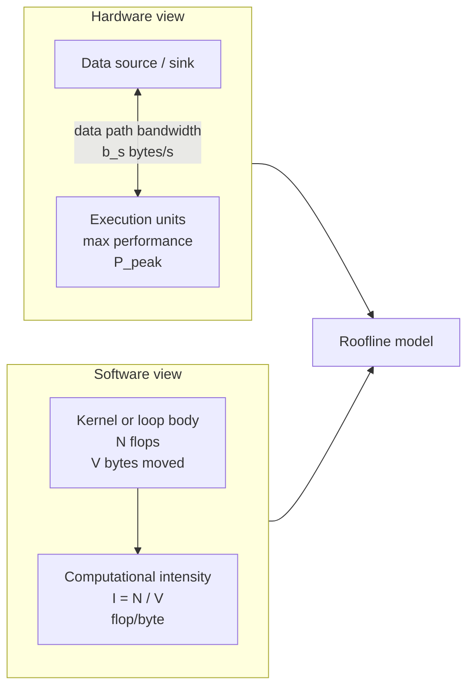
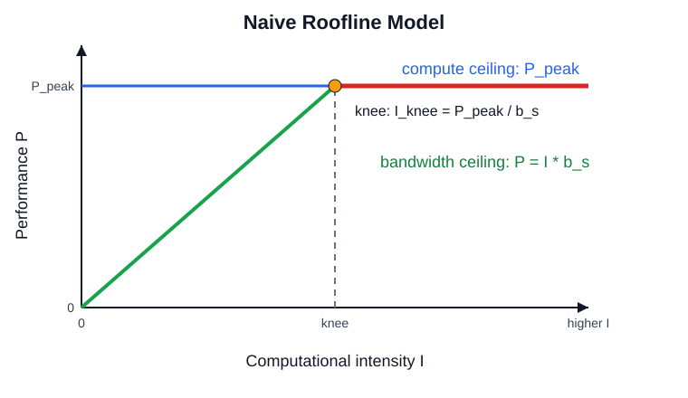
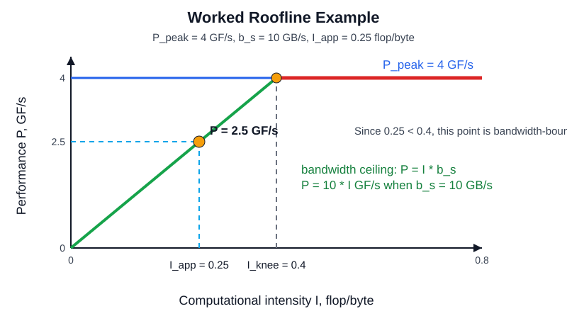

# Roofline Model

## Table of contents

- [What the roofline model answers](#what-the-roofline-model-answers)
- [The three quantities](#the-three-quantities)
- [Figure 1: hardware and software inputs](#figure-1-hardware-and-software-inputs)
- [The naive roofline equation](#the-naive-roofline-equation)
- [Figure 2: the roofline shape](#figure-2-the-roofline-shape)
- [Figure 3: worked example](#figure-3-worked-example)
- [How to use the model](#how-to-use-the-model)
- [How this maps to LLM workloads](#how-this-maps-to-llm-workloads)
- [Common mistakes](#common-mistakes)
- [Interview version](#interview-version)

## What the roofline model answers

The roofline model is a visual performance model for a kernel or application on a specific hardware
platform. It answers one practical question:

> Given this machine and this kernel, is performance more likely limited by compute throughput or by
> data movement?

The model combines two hardware facts with one software fact:

- The machine has a maximum compute rate.
- The machine has a maximum data-transfer rate.
- The kernel has a ratio of useful work to bytes moved.

That ratio tells you whether the kernel can keep the execution units busy. If each byte of data
enables a lot of arithmetic, the kernel may be compute-bound. If each byte enables little arithmetic,
the kernel is usually memory-bound.

## The three quantities

| Symbol | Meaning | Unit | Comes from |
|---|---|---|---|
| `P_peak` | Peak compute throughput | flop/s | Hardware execution units |
| `b_s` | Sustained bandwidth of the relevant data path | byte/s | Memory system |
| `I` | Computational intensity, equal to `N / V` | flop/byte | The code or kernel |

Where:

- `N` is the number of floating-point operations.
- `V` is the number of bytes transferred through the bottleneck data path.
- `I = N / V`.

Use the bandwidth for the data path you are reasoning about. For a simple first pass, this is often
HBM bandwidth. In a more detailed model, you can draw separate bandwidth ceilings for L2, HBM,
interconnect, or other memory levels.

## Figure 1: hardware and software inputs

The first figure separates the hardware view from the software view. Hardware gives you
`P_peak` and `b_s`. Software gives you `N` flops and `V` bytes, which combine into `I = N / V`.



The key idea is that performance depends on both sides. A powerful execution unit cannot help if
the data path cannot feed it. A high-bandwidth data path cannot help if the code has too little
independent arithmetic or uses the wrong execution units.

## The naive roofline equation

The core equation is:

```text
P = min(P_peak, I * b_s)
```

Read it as:

- `P_peak` is the compute ceiling.
- `I * b_s` is the data-path ceiling.
- The achievable performance `P` cannot exceed the lower of those two ceilings.

The data-path term has the right unit:

```text
I * b_s = flop/byte * byte/s = flop/s
```

This is why computational intensity matters. Increasing `I` means each byte fetched from memory
supports more computation, so the memory-bandwidth ceiling rises.

## Figure 2: the roofline shape

The roofline has two parts:

- A sloped bandwidth line: `P = I * b_s`
- A flat compute line: `P = P_peak`



The knee is the transition point:

```text
I_knee = P_peak / b_s
```

Interpretation:

- If `I < I_knee`, the kernel is bandwidth-bound in the naive model.
- If `I >= I_knee`, the kernel is compute-bound in the naive model.

This is an optimistic or "light speed" model. That is important: the roofline tells you
an upper bound, not a guaranteed speed. Real code can land below the roofline because of poor
coalescing, cache misses, dependency stalls, low occupancy, instruction overhead, branch behavior,
or failure to use the intended math units.

## Figure 3: worked example

Apply the model to a simple loop:

```c
double s = 0, a[];

for (i = 0; i < N; ++i) {
    s = s + a[i] * a[i];
}
```

Naive operation count per iteration:

- `a[i] * a[i]`: 1 multiply
- `s + ...`: 1 add
- Total: `2` floating-point operations

Naive data movement per iteration:

- One double loaded from `a[i]`
- One double is `8` bytes
- Total: `8` bytes

Computational intensity:

```text
I = 2 flops / 8 bytes = 0.25 flop/byte
```

Machine parameters:

```text
P_peak = 4 GF/s
b_s    = 10 GB/s
```

Bandwidth ceiling for this kernel:

```text
I * b_s = 0.25 flop/byte * 10 GB/s = 2.5 GF/s
```

Roofline prediction:

```text
P = min(4 GF/s, 2.5 GF/s) = 2.5 GF/s
```

Knee point:

```text
I_knee = P_peak / b_s = 4 / 10 = 0.4 flop/byte
```

Because `0.25 < 0.4`, the example is bandwidth-bound in the naive model.



What the figure teaches:

- The machine could do `4 GF/s` if compute were the limiter.
- This loop only has `0.25 flop/byte` of intensity.
- At `10 GB/s`, that much intensity can feed only `2.5 GF/s`.
- The predicted limit is therefore bandwidth, not compute.

The example is intentionally simplified. Real code may also include cache effects, reduction
dependencies, loop overhead, vectorization issues, and compiler behavior. The point is not the exact
number; the point is the bottleneck classification.

## How to use the model

Use roofline analysis in this order:

1. Pick the kernel or operation.
2. Count useful floating-point operations, `N`.
3. Estimate bytes moved through the relevant data path, `V`.
4. Compute `I = N / V`.
5. Get the hardware ceilings: `P_peak` and `b_s`.
6. Compute the bandwidth ceiling: `I * b_s`.
7. Compare `I * b_s` with `P_peak`.
8. Classify the likely bottleneck.
9. Compare measured performance with the roofline upper bound.

The model becomes more useful when you plot real measurements below the roofline. If a kernel is far
below both ceilings, the problem may not be raw compute or raw memory bandwidth. It may be stalls,
bad access patterns, launch overhead, poor occupancy, poor tiling, or missing Tensor Core use.

## How this maps to LLM workloads

Roofline thinking is useful for LLM systems because different model phases have different
computational intensity.

| Workload | Roofline intuition |
|---|---|
| Large prefill GEMMs | Often higher intensity and more compute-friendly |
| MLP projections | Usually dense GEMMs and Tensor Core friendly |
| QKV and output projections | Often good roofline candidates when shapes are large |
| Softmax and masking | Lower intensity and often bandwidth or latency sensitive |
| RMSNorm / LayerNorm | Usually memory and reduction heavy |
| Small-batch decode | Often lower intensity and harder to keep the GPU full |
| KV-cache reads | Can make decode strongly memory-bandwidth sensitive |

For an NVIDIA GPU, also choose the right ceiling:

- FP32 CUDA-core peak is not the right ceiling for BF16 Tensor Core GEMMs.
- Tensor Core peak is not the right ceiling for softmax or LayerNorm.
- HBM bandwidth is often the right first bandwidth ceiling for weights and KV cache.
- L2 or shared-memory bandwidth may matter for tiled kernels with strong reuse.

## Common mistakes

- **Using peak FLOPS alone.** Peak compute says nothing about whether bytes arrive fast enough.
- **Counting flops but not bytes.** Roofline needs both `N` and `V`.
- **Using the wrong bandwidth.** HBM, L2, shared memory, and interconnect are different data paths.
- **Using the wrong compute ceiling.** CUDA cores and Tensor Cores have different ceilings.
- **Treating the roofline as a prediction, not a bound.** It is optimistic.
- **Ignoring implementation quality.** Coalescing, tiling, occupancy, and vectorization still matter.
- **Ignoring batch and sequence shape.** The same operator can move regimes when shape changes.

## Interview version

A concise answer:

> A roofline model compares a kernel's arithmetic intensity with the hardware's compute and memory
> ceilings. Arithmetic intensity is flops per byte moved. The achievable performance is bounded by
> `min(P_peak, I * b_s)`. Low-intensity kernels are memory-bound because the bandwidth ceiling is
> below peak compute. High-intensity kernels can become compute-bound once they pass the knee
> `I_knee = P_peak / b_s`. It is an optimistic upper bound, so measured performance below the
> roofline points to implementation issues like poor memory access, stalls, low occupancy, or missing
> Tensor Core use.

For LLMs:

> Large GEMMs often have enough arithmetic intensity to use Tensor Cores well, especially in prefill.
> Decode, KV-cache reads, softmax, and normalization often have lower arithmetic intensity, so they
> can become memory- or latency-sensitive even on a GPU with very high peak FLOPS.
