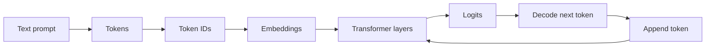
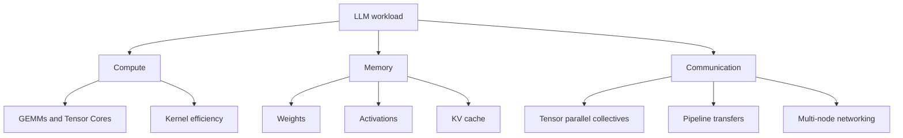
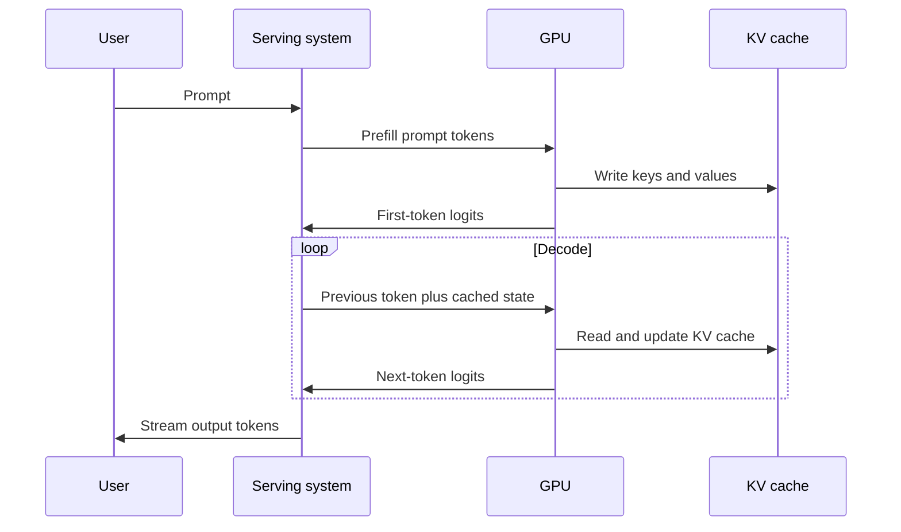
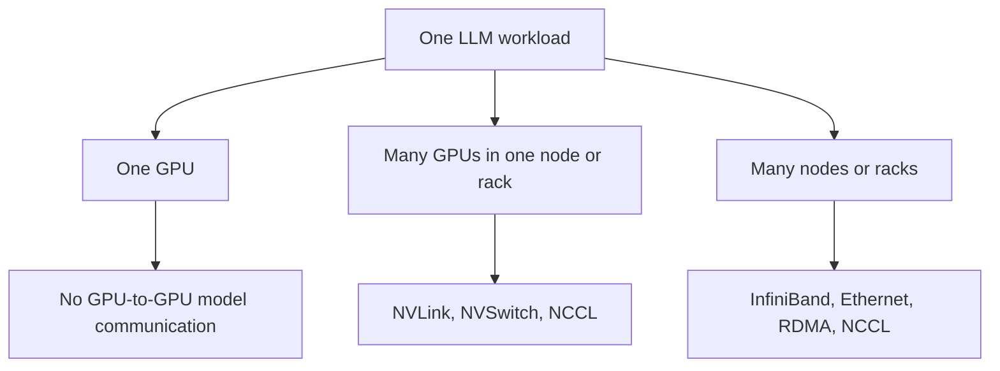
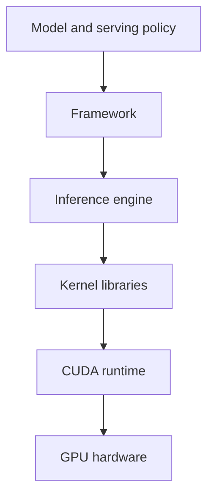

# LLM And GPU Bridge

This Week 1 module connects LLM concepts to GPU systems thinking.

The goal is not to teach CUDA programming yet. The goal is to build a strong
mental bridge between model behavior and hardware bottlenecks.

Use this file after reading:

1. `llms/01_llm_fundamentals.md`
2. `nvidia/01_latest_nvidia_platforms.md`

By the end, you should be able to look at an LLM workload and ask the right
systems questions:

```text
Where is the compute?
Where is the memory pressure?
Where is the communication?
Which phase are we optimizing?
```

Those questions are the foundation for NVIDIA, OpenAI, and Anthropic systems
interviews.

## Learning goals

By the end of this module, you should be able to:

- Explain an LLM as a compute, memory, and communication workload.
- Connect tokens, weights, activations, and KV cache to GPU pressure.
- Explain why prefill and decode stress hardware differently.
- Explain why peak FLOPS is not enough to evaluate an accelerator.
- Use a bottleneck framework for LLM training and inference questions.
- Explain why software and kernels are part of the hardware story.
- Give senior-level answers about LLM platform tradeoffs.

## The Week 1 mental model

The user sees text. The system sees tensors.



A GPU system does not understand words. It executes kernels over tensors,
moves data through memory hierarchy, and communicates across GPUs when needed.

For interviews, translate model language into systems language.

| Model term | Systems interpretation |
| --- | --- |
| Token | Unit of sequence processed by the model |
| Embedding | Dense vector entering the Transformer stack |
| Weight | Learned tensor stored in memory |
| Activation | Intermediate tensor produced during execution |
| Logit | Output score before decoding |
| KV cache | Stored attention state for future decode steps |
| Batch | Multiple requests or sequences processed together |
| Context length | Sequence length that drives attention and KV-cache size |

## The three bottleneck questions

Almost every LLM systems question can start with this triangle.



The senior-level move is to avoid guessing the bottleneck too early.

Ask:

```text
Which workload?
Which phase?
Which batch size?
Which context length?
Which model-parallel strategy?
Which latency target?
```

Only then should you decide whether the issue is compute, memory, communication,
software overhead, or scheduling.

## Training, prefill, and decode

Do not say "LLM performance" without specifying the phase.

| Phase | What happens | Typical pressure |
| --- | --- | --- |
| Training | Forward, backward, optimizer | compute, memory, communication |
| Prefill | Process prompt tokens | compute, attention, activation movement |
| Decode | Generate one token at a time | latency, memory bandwidth, KV cache |
| Serving | Schedule many requests | batching, tail latency, utilization |
| Reasoning | Spend more test-time compute | latency, cost, memory, scheduling |

This distinction is essential.

A training bottleneck may involve gradients and optimizer state. An inference
bottleneck may involve KV cache and latency. A decode bottleneck may have poor
Tensor Core utilization even on a GPU with high peak FLOPS.

## Prefill versus decode

Prefill and decode are both inference, but they behave differently.



Prefill has more parallel work across prompt tokens. Decode has a sequential
dependency because token `t + 1` depends on token `t`.

This is why an inference system can be fast at prompt processing but still slow
at token generation.

## Why GPUs fit LLMs

Transformer models contain many dense linear operations.

Examples include:

- query, key, and value projections,
- attention output projection,
- MLP up-projection,
- MLP down-projection,
- output projection to logits.

These operations map well to GPU matrix engines and optimized kernels.

But that is only part of the story.

| Need | GPU/platform capability |
| --- | --- |
| Dense math | Tensor Cores and optimized GEMMs |
| Low precision | FP8, FP4, BF16, FP16, and related formats |
| Model capacity | HBM capacity |
| Data movement | HBM bandwidth |
| Multi-GPU execution | NVLink, NVSwitch, NCCL |
| Multi-node scale | InfiniBand, Ethernet, RDMA, collectives |
| Production inference | TensorRT-LLM, Triton, serving frameworks |
| Developer productivity | CUDA, libraries, profilers, ecosystem |

A strong answer says:

> GPUs work well for LLMs because Transformer workloads expose dense tensor
> operations, but real performance depends on memory, communication, kernels,
> batching, and software integration.

## Why peak FLOPS is insufficient

Peak FLOPS is a useful headline number, but it is not an answer.

An accelerator can have high peak FLOPS and still perform poorly if:

- the model does not fit in memory,
- HBM bandwidth is too low,
- KV-cache traffic dominates decode,
- interconnect is weak,
- collectives are slow,
- kernels are immature,
- batch sizes are too small,
- tail latency constraints prevent large batches,
- software cannot expose the hardware efficiently.

Use this interview rule:

```text
Peak math only matters when the workload can feed the math units.
```

## Memory pressure

LLM memory pressure comes from several places.

| Item | Training | Inference |
| --- | --- | --- |
| Weights | required | required |
| Activations | saved for backward pass | temporary |
| Gradients | required | not used |
| Optimizer state | required | not used |
| KV cache | sometimes relevant | central |
| Temporary buffers | required | required |

For inference, KV cache is often the memory structure that surprises people.

A long context and many concurrent users can make KV-cache capacity and bandwidth
central to serving performance.

## KV cache intuition

Attention needs keys and values from earlier tokens.

During autoregressive decoding, recomputing all earlier keys and values every
time would be wasteful. Instead, serving systems store them in a KV cache.


The KV cache creates tradeoffs:

| More of this | Helps | Hurts |
| --- | --- | --- |
| Longer context | better use of prior information | more memory |
| More users | higher throughput opportunity | more KV-cache capacity |
| Larger batch | better utilization | higher latency risk |
| Higher precision cache | accuracy and stability | memory footprint |
| Lower precision cache | memory efficiency | possible quality risk |

A good Week 1 answer does not need exact formulas. It should say:

> KV cache converts autoregressive inference into a memory-capacity and
> memory-bandwidth problem, especially for long contexts and many concurrent
> requests.

## Communication pressure

Communication appears when the model or workload spans multiple GPUs or nodes.

Common sources include:

- tensor parallel collectives,
- pipeline stage transfers,
- expert parallel token dispatch,
- data-parallel gradient synchronization,
- sequence parallel communication,
- checkpointing and recovery,
- host-to-device and device-to-host movement.



The Week 1 distinction:

| Term | Meaning |
| --- | --- |
| Scale-up | tightly couple GPUs for one larger compute domain |
| Scale-out | connect nodes or racks into a larger cluster |
| Collective | communication pattern across many devices |
| Tensor parallelism | split tensor operations across GPUs |
| Pipeline parallelism | split layers or stages across GPUs |
| Expert parallelism | split MoE experts across GPUs |

## Worked example 1: decode bottleneck

Scenario:

```text
A serving system has good prefill throughput but poor tokens-per-second during
decode. GPU peak FLOPS is high, but utilization looks low.
```

Do not immediately blame the GPU.

Ask:

1. What is the batch size during decode?
2. What is the context length?
3. How large is the KV cache?
4. Is decode memory-bandwidth limited?
5. Are requests too latency-sensitive to batch well?
6. Are kernels optimized for small decode shapes?
7. Is the scheduler mixing prefill and decode effectively?

Possible explanation:

> Decode may be limited by memory traffic and sequential token generation rather
> than raw compute. The GPU can have high peak FLOPS while decode underutilizes
> Tensor Cores because each step is small and latency-sensitive.

Senior-level answer:

> I would separate prefill and decode metrics, inspect batch shape and context
> length, measure HBM bandwidth and KV-cache traffic, and check whether serving
> software can batch decode requests without violating latency targets.

## Worked example 2: model parallel bottleneck

Scenario:

```text
A model needs multiple GPUs. Single-GPU kernels are fast, but end-to-end latency
does not scale well as more GPUs are added.
```

Ask:

1. Which parallelism strategy is used?
2. How much communication happens per layer?
3. Are collectives on the critical path?
4. Is NVLink or network bandwidth saturated?
5. Are communication and compute overlapped?
6. Are tensor shapes large enough to amortize overhead?
7. Is the bottleneck intra-node or inter-node?

Possible explanation:

> The computation may scale, but communication can dominate if tensor-parallel
> collectives or pipeline transfers are frequent and poorly overlapped.

Senior-level answer:

> I would profile per-layer compute and communication, separate scale-up from
> scale-out traffic, inspect NCCL collective time, and test whether different
> parallelism choices improve the compute-to-communication ratio.

## Worked example 3: accelerator comparison

Scenario:

```text
A vendor claims a new accelerator has much higher TOPS than an NVIDIA GPU.
```

A weak answer accepts the claim.

A strong answer asks for workload context:

| Question | Why it matters |
| --- | --- |
| Which model? | Dimensions determine kernel shapes |
| Which phase? | training, prefill, and decode differ |
| Which batch size? | utilization depends on batching |
| Which context length? | attention and KV cache change |
| Which precision? | TOPS depends on numeric format |
| How much memory? | model and KV cache must fit |
| How much bandwidth? | decode may be memory-sensitive |
| Which interconnect? | multi-GPU execution needs communication |
| Which software stack? | kernels and compiler maturity matter |
| What latency target? | batching may be constrained |

Senior-level answer:

> I would not compare accelerators on TOPS alone. I would ask for tokens per
> second, time to first token, latency distribution, cost per token, memory
> footprint, batch and context assumptions, and software maturity.

## Roofline intuition

Week 1 does not require full roofline modeling, but the intuition matters.

```text
Performance is limited by either:
  compute throughput
  or data movement
```

If arithmetic intensity is high, compute may dominate. If arithmetic intensity
is low, memory bandwidth may dominate.

For LLMs, the dominant regime depends on the phase:

| Phase | Common intuition |
| --- | --- |
| Large GEMMs | often compute-friendly |
| Small decode steps | may underutilize compute |
| Long-context attention | can stress memory and bandwidth |
| KV-cache-heavy serving | may become memory sensitive |
| Multi-GPU execution | may become communication sensitive |

Do not use roofline as a buzzword. Use it to ask whether the workload can keep
the math units fed.

## Software is part of the system

Hardware capability is not enough.

Software determines whether the workload reaches the hardware efficiently.

Important layers include:



Examples:

| Layer | Example role |
| --- | --- |
| Serving scheduler | batches requests and manages latency |
| TensorRT-LLM | optimizes LLM inference execution |
| CUDA kernels | implement tensor operations |
| NCCL | handles GPU collectives |
| Compiler/runtime | maps operations to hardware |
| Profiler | reveals bottlenecks |

A strong hardware architect answer includes software because hardware that is
hard to program or hard to schedule may not deliver its theoretical performance.

## Behavioral connection

This module also helps behavioral interviews.

Senior interviews often ask about tradeoffs, not just definitions.

Use the same framework for leadership stories:

```text
Situation: workload or product constraint
Tradeoff: compute, memory, communication, schedule, cost, or risk
Decision: what you chose
Evidence: data or model used
Outcome: measurable result
Reflection: what you learned
```

For your background, good story themes include:

- performance modeling,
- accelerator architecture tradeoffs,
- PPA decisions,
- ISA or programming-model choices,
- hardware/software co-design,
- roadmap decisions under uncertainty,
- debugging a mismatch between model and silicon assumptions.

## Senior/principal answer patterns

### Question: Why are LLMs good GPU workloads?

Weak answer:

> LLMs do lots of math.

Strong answer:

> LLMs contain dense matrix operations that map well to Tensor Cores, but the
> platform also needs enough HBM capacity and bandwidth, efficient KV-cache
> handling, strong interconnect for multi-GPU execution, optimized collectives,
> and mature serving software.

### Question: Why can decode be slow even on a fast GPU?

Weak answer:

> The GPU is not powerful enough.

Strong answer:

> Decode is sequential at the token level and may involve small per-step
> operations plus KV-cache reads and writes. It can be latency-sensitive and
> memory-bandwidth sensitive, so peak FLOPS may not translate directly into
> tokens per second.

### Question: How do you evaluate a multi-GPU LLM system?

Weak answer:

> I would check whether it has enough GPUs.

Strong answer:

> I would identify the parallelism strategy, profile compute and communication,
> inspect collective overhead, separate scale-up and scale-out traffic, check
> memory capacity and bandwidth, and measure user-facing metrics such as time to
> first token, tokens per second, tail latency, and cost per token.

### Question: Why does KV cache matter?

Weak answer:

> It stores attention values.

Strong answer:

> KV cache stores prior attention state so decode does not recompute all earlier
> keys and values. It improves efficiency, but it also consumes memory and can
> make long-context, high-concurrency serving memory-capacity and
> memory-bandwidth sensitive.

## Interview checklist

When you get an LLM/GPU systems question, run this checklist.

```text
1. Clarify the phase:
   training, prefill, decode, serving, or reasoning.

2. Clarify the workload:
   model size, batch size, context length, precision, latency target.

3. Identify compute:
   GEMMs, attention, MLPs, Tensor Core utilization.

4. Identify memory:
   weights, activations, KV cache, HBM capacity, HBM bandwidth.

5. Identify communication:
   tensor parallel, pipeline parallel, expert parallel, data parallel.

6. Identify software:
   kernels, libraries, scheduler, inference engine, collectives.

7. State the likely bottleneck:
   but only after the assumptions are clear.
```

## Week 1 self-check

You are ready to move on when you can answer these without notes:

1. Why are LLMs both compute and memory workloads?
2. Why is decode different from prefill?
3. What is KV cache and why does it matter?
4. Why is peak FLOPS insufficient?
5. What is the difference between scale-up and scale-out?
6. Why do collectives matter for model parallelism?
7. What is a good first question when debugging poor LLM throughput?
8. How would you compare two accelerators for LLM inference?
9. Why is software part of the hardware platform story?
10. How would you explain this topic to an executive?

## What belongs in later weeks

Do not go too deep in Week 1 on:

- attention math,
- CUDA programming,
- Tensor Core instruction details,
- NCCL algorithms,
- kernel fusion,
- paging algorithms,
- MoE all-to-all design,
- long-context attention variants,
- detailed roofline calculations.

Those are later topics.

Week 1 is about building the correct systems lens.

## Sources

- Vaswani et al., "Attention Is All You Need."
  https://arxiv.org/abs/1706.03762

- Kwon et al., "Efficient Memory Management for Large Language Model Serving
  with PagedAttention."
  https://arxiv.org/abs/2309.06180

- NVIDIA Docs, "TensorRT-LLM."
  https://docs.nvidia.com/tensorrt-llm/

- NVIDIA Docs, "CUDA C++ Programming Guide."
  https://docs.nvidia.com/cuda/cuda-c-programming-guide/

- NVIDIA Developer, "NVIDIA Collective Communications Library."
  https://developer.nvidia.com/NCCL

- Williams, Waterman, and Patterson, "Roofline: An Insightful Visual
  Performance Model for Multicore Architectures."
  https://crd.lbl.gov/assets/pubs_presos/roofline-sc09.pdf
