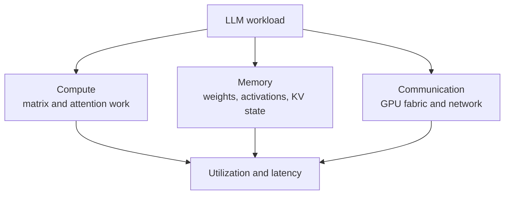
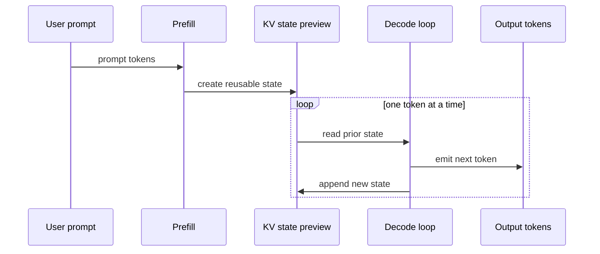

# Week 1: LLM And GPU Bridge

This bridge module translates Week 1 LLM vocabulary into the system language of compute,
memory, bandwidth, communication, PPA, and hardware/software co-design.

## Learning Goals

- Build a hardware architect's mental model of an LLM workload.
- Explain LLMs as matrix workloads, memory workloads, and communication workloads.
- Preview prefill, decode, training, inference, batching, and KV-cache pressure.
- Use the three recurring bottleneck questions throughout technical interviews.
- Connect LLM systems to custom silicon, PPA, programming models, and platform risk.

## Sourced Facts Versus Interview Synthesis

Sourced facts include the Transformer paper's parallelism motivation, PagedAttention's
KV-cache memory-management framing, and NVIDIA's public rack-scale platform material.
Interview synthesis appears where those facts are mapped into architecture prompts,
custom silicon tradeoffs, and senior/principal answer patterns.

## Why This Bridge Matters

LLM interviews can sound unfamiliar because the vocabulary is new. Under the vocabulary,
many questions are familiar: where is the compute, where is the state, how does data move,
and what does the software stack expose or hide?

For Nawab's background, the fastest path is to treat LLMs as accelerator workloads with
unusual sequence behavior, memory growth, and production scheduling constraints.

## The Hardware Architect's Mental Model Of An LLM

An LLM inference request is a stateful tensor program over a token sequence. The model
weights are mostly fixed during inference. The request state changes with prompt length,
generated length, batching policy, and decode scheduling.

Think in layers:

- Model layer: tokens, embeddings, attention, MLPs, logits.
- Tensor layer: matrix multiplies, reductions, reshapes, and elementwise operations.
- Memory layer: weights, activations, KV cache preview, and allocator behavior.
- System layer: batching, scheduling, queueing, communication, and failure handling.
- Platform layer: GPU, HBM, fabric, network, CUDA, libraries, and serving framework.

The Transformer paper matters here because it made sequence modeling highly parallelizable
relative to recurrent approaches in its original setting (Source 1). Modern serving papers
matter because production throughput can be limited by dynamic memory state, not only by
peak math throughput (Source 2).

## Compute, Memory, Communication Triangle

This original diagram synthesizes Week 1 LLM and NVIDIA platform sources (Sources 1, 2,
3, and 4).

## Workload Mapping Table

| LLM concept | Workload manifestation | Hardware pressure | Interview question |
| --- | --- | --- | --- |
| Weights | Mostly fixed model tensors | HBM capacity and bandwidth | Can weights stay resident? |
| Activations | Intermediate tensors | Capacity and data movement | What must be saved or recomputed? |
| Matrix multiply | Dense tensor operations | Tensor Core utilization | Are shapes efficient? |
| Attention | Context mixing | Compute plus memory traffic | What grows with sequence length? |
| KV cache preview | Stored attention state | Memory capacity and allocator pressure | How many tokens fit? |
| Batching | Many requests together | Utilization versus latency | What batch shape meets the SLA? |
| Prefill | Process prompt tokens | Parallel compute and memory traffic | How costly is the prompt? |
| Decode | Generate tokens stepwise | Loop latency and state reads | What limits tokens per second? |
| Inter-GPU communication | Model spans GPUs | Fabric bandwidth | Where does sync appear? |

## LLMs As Matrix Workloads

Many core operations in Transformer-style models are matrix or tensor operations. That is
why Tensor Cores, low precision, kernel efficiency, and batching matter.

First-order questions:

- What are the dominant tensor shapes?
- How much reuse is available?
- Does the batch shape expose enough parallelism?
- Is arithmetic intensity high enough to use the machine well?

## LLMs As Memory Workloads

LLMs are also memory workloads. Weights must be available, activations appear during
execution, and serving can accumulate KV-cache state as contexts and outputs grow.

PagedAttention is a useful preview source because it frames high-throughput LLM serving as
constrained by KV-cache memory size, fragmentation, and dynamic request shape (Source 2).
Week 1 does not yet cover KV-cache mechanics, but it does establish the warning: memory
capacity and bandwidth can decide whether compute is usable.

## LLMs As Communication Workloads

Large models and large batches often span multiple accelerators. Once that happens, the
system must move partial results, parameters, activations, or scheduling state across a
fabric.

NVIDIA's GB200 and GB300 public materials show why scale-up communication is first order:
the rack-scale systems are organized around 72-GPU NVLink domains for large AI workloads
(Sources 3, 4, and 5).

## Prefill, Decode, And KV-Cache Preview

Prefill processes the prompt tokens and prepares state for generation. Decode generates
output tokens step by step. The KV cache is the later-week mechanism that helps avoid
recomputing prior attention state during decode.

This original preview diagram is based on the Week 1 LLM serving sources, especially the
KV-cache memory motivation in PagedAttention (Source 2).

## Training Versus Inference, Preview Only

Training changes weights. It adds backward pass, optimizer state, checkpointing,
distributed training, and failure recovery concerns.

Inference holds weights fixed and serves requests. It emphasizes latency, throughput,
memory footprint, batching, request scheduling, and cost per token.

Both can use the same hardware family, but the bottlenecks and operational priorities can
be very different.

## The Three Recurring Bottleneck Questions

Use these questions in every technical interview answer:

1. Where is the compute?
2. Where is the memory capacity and bandwidth pressure?
3. Where is the communication?

If you can answer those three questions clearly, you can usually turn an unfamiliar LLM
topic into a structured systems discussion.

## How This Connects To Custom Silicon And PPA

Custom silicon interviews often reduce to whether a proposed design improves the limiting
resource for the target workload. LLM systems make that question more delicate because the
limiting resource can move with context length, batch size, precision, model architecture,
and serving policy.

Use this PPA framing:

- Performance: tokens per second, latency, throughput per rack, and utilization.
- Power: energy per token, cooling, memory power, and network power.
- Area: tensor datapaths, SRAM, HBM interfaces, IO, and control complexity.
- Software: compiler, kernel, runtime, and framework maturity.
- Product risk: whether the workload shape will still matter when the chip arrives.

The senior-level move is to avoid comparing peak FLOPS against peak FLOPS. Compare the
whole platform against a specified workload, SLA, software stack, and deployment model.

## How To Talk About LLMs In Hardware Interviews

- Start with workload shape before naming optimizations.
- Convert model terms into tensors, state, bandwidth, and synchronization.
- Identify the bottleneck you would measure first.
- State assumptions about batch size, context length, model size, and latency target.
- Separate scale-up and scale-out problems.
- Treat software as part of the architecture, not as an afterthought.

## Senior/Principal Interview Answer Pattern

1. Restate the workload and assumptions.
2. Identify compute, memory, and communication pressure.
3. Say what you would measure first and why.
4. Explain the likely tradeoff, not just the preferred solution.
5. Tie the answer to system impact: latency, throughput, cost, reliability, or roadmap.

Example pattern:

> I would not call this GPU-bound until I see utilization, memory bandwidth, queueing,
> context length, and decode latency. For LLM inference, the bottleneck may move between
> tensor math, KV-cache memory, and scheduling depending on batch shape and SLA.

## Design Prompts For Week 1

- A team says an LLM inference service is "GPU bound." What three measurements would you
  ask for before accepting that statement?
- A product manager asks why a rack-scale GPU system matters for LLMs. Give a two-minute
  answer that includes compute, memory, and communication.
- You are comparing a custom accelerator with an NVIDIA platform for inference. What
  assumptions must be fixed before the comparison is meaningful?
- A model's output latency rises with longer prompts. What Week 1 concepts help you form
  the first debugging hypothesis?

## Sources

- Source 1: Vaswani et al., "Attention Is All You Need."
  https://arxiv.org/abs/1706.03762

- Source 2: Kwon et al., "Efficient Memory Management for Large Language Model Serving."
  https://arxiv.org/abs/2309.06180

- Source 3: NVIDIA, "GB200 NVL Multi-Node Tuning Guide."
  https://docs.nvidia.com/multi-node-nvlink-systems/multi-node-tuning-guide/overview.html

- Source 4: NVIDIA developer blog, "GB200 NVL72 Delivers Trillion-Parameter LLM Training."
  https://developer.nvidia.com/blog/nvidia-gb200-nvl72-delivers-trillion-parameter-llm-training-and-real-time-inference

- Source 5: NVIDIA developer blog, "Blackwell Ultra for the Era of AI Reasoning."
  https://developer.nvidia.com/blog/nvidia-blackwell-ultra-for-the-era-of-ai-reasoning/
