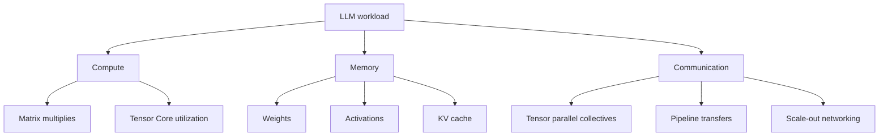
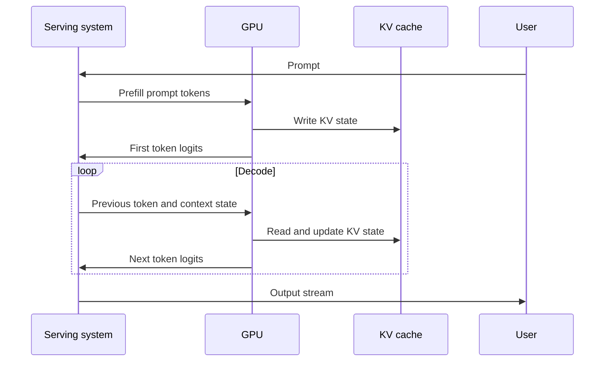

# LLM and GPU Bridge

This module connects Week 1 LLM concepts to GPU systems and custom accelerator
thinking.

It is written for a hardware architect who already understands PPA, bandwidth,
latency, bottleneck analysis, and hardware/software tradeoffs, but is building
LLM-specific vocabulary.

## Learning goals

By the end of this module, you should be able to:

- Describe an LLM as a compute, memory, and communication workload.
- Explain why LLM systems cannot be evaluated by peak FLOPS alone.
- Connect tokens, embeddings, weights, activations, and KV cache to hardware
  pressure.
- Preview prefill and decode without going deep into attention math.
- Use a repeatable bottleneck framework in interviews.
- Explain how LLM workload behavior affects custom silicon tradeoffs.

## Why this bridge matters

A model-only explanation is not enough for senior systems interviews.

A hardware-only explanation is also not enough. Interviewers want to know that
you can map model behavior onto hardware constraints.

The recurring questions are:

1. Where is the compute?
2. Where is the memory capacity and bandwidth pressure?
3. Where is the communication?

These questions should appear in almost every LLM systems interview answer.

## Hardware architect mental model

At a high level, an LLM inference request moves through these concepts:

This is not a full implementation. It is a workload map.

The hardware sees:

- Weight reads.
- Activation movement.
- Matrix multiplies.
- Attention operations.
- KV-cache reads and writes.
- Synchronization and communication when the model is partitioned.
- Scheduling and batching decisions in serving systems.

## Compute, memory, communication triangle

A strong interview answer usually identifies which corner of the triangle is
dominant for the scenario.

## LLM concepts mapped to hardware pressure

| LLM concept | Workload manifestation | Hardware pressure | Interview question |
| --- | --- | --- | --- |
| Weights | Learned parameter tensors | HBM capacity and bandwidth | Can the model fit? |
| Embeddings | Dense vectors per token | Table lookup and activation footprint | What enters the stack? |
| MLP layers | Large dense GEMMs | Tensor Core utilization | Is it compute-bound? |
| Attention | Token interaction | Compute and memory traffic | How does sequence length matter? |
| KV cache | Stored keys and values | HBM capacity and bandwidth | How many users fit? |
| Prefill | Process prompt tokens | Parallel compute and attention | What drives time to first token? |
| Decode | Generate one token at a time | Latency and memory bandwidth | What drives tokens per second? |
| Batching | Combine requests | Utilization versus latency | How do we improve throughput? |
| Tensor parallelism | Split tensors across GPUs | NVLink and collectives | What is the scale-up bottleneck? |
| Data parallelism | Replicate model for training | Scale-out synchronization | What is the network bottleneck? |

## LLMs as matrix workloads

Transformer layers contain many dense linear operations. These operations become
GEMMs or GEMM-like kernels in optimized implementations.

This is why GPUs and ML accelerators matter:

- They provide high throughput for dense math.
- They support low-precision formats.
- They expose specialized matrix units.
- They provide high memory bandwidth.

But peak math throughput is not the full story. A system can have impressive
FLOPS and still underperform if memory, communication, or software is weak.

## LLMs as memory workloads

LLM systems move and store a lot of data.

Important memory consumers include:

- Model weights.
- Activations.
- KV cache.
- Temporary buffers.
- Optimizer state during training.
- Gradients during training.

Inference often becomes memory-sensitive because decode repeatedly reads model
weights and KV-cache state while generating one token at a time.

The PagedAttention paper is a useful preview source because it explains how KV
cache memory management can limit serving throughput when memory is wasted.

## LLMs as communication workloads

Communication appears when a model, batch, or training job spans multiple GPUs
or nodes.

Common communication sources include:

- Tensor parallel collectives.
- Pipeline stage transfers.
- Expert parallel routing in mixture-of-experts models.
- Data-parallel gradient synchronization during training.
- KV-cache or state movement in serving systems.
- Host-to-device and device-to-host transfers.

For NVIDIA systems, this is where NVLink, NVSwitch, InfiniBand, Ethernet, RDMA,
and NCCL become central.

## Prefill and decode preview

LLM inference has two useful phases.

Prefill can expose more parallelism across prompt tokens. Decode has a
sequential dependency because each generated token depends on earlier generated
tokens.

Later modules will quantify how this affects latency, throughput, batching, and
GPU utilization.

## Training versus inference preview

Training and inference share model architecture but stress systems differently.

| Area | Training | Inference |
| --- | --- | --- |
| Main work | Forward, backward, optimizer | Prefill and decode |
| Weight update | Yes | No |
| Memory | Weights, activations, gradients, optimizer state | Weights and KV cache |
| Parallelism | Data, tensor, pipeline, expert | Tensor, pipeline, batching, replicas |
| Metric | Time to train and cost | Latency, throughput, cost per token |
| Failure mode | Poor scaling efficiency | Low utilization or high latency |

A senior answer should always clarify which phase is being discussed.

## How this connects to custom silicon and PPA

For custom silicon, the LLM workload raises familiar but specific questions:

- How much dense matrix throughput is useful?
- What precision formats are needed?
- How much on-chip SRAM is valuable?
- How much HBM capacity and bandwidth are required?
- What is the cost of KV-cache reads and writes?
- What interconnect bandwidth is needed for partitioned models?
- Which kernels dominate real workloads?
- How does software expose the hardware efficiently?
- What is the power cost of data movement versus compute?

The key interview move is to avoid generic accelerator claims. Tie every design
choice to a workload bottleneck.

## Senior/principal interview answer pattern

Weak answer:

> LLMs need GPUs because they do lots of compute.

Acceptable answer:

> LLMs use matrix multiplies and attention, so GPUs help.

Strong senior/principal answer:

> LLMs are compute, memory, and communication workloads. MLP and projection
> layers expose dense GEMMs, attention and KV cache create sequence-length and
> memory pressure, and distributed execution introduces scale-up and scale-out
> communication. The right optimization depends on whether the bottleneck is
> prefill, decode, training, or serving at fleet scale.

## Week 1 design prompts

Use these prompts for whiteboard practice:

1. A model fits on one GPU but has poor decode throughput. What do you inspect?
2. A model needs multiple GPUs for inference. What communication paths matter?
3. A serving system has high average throughput but bad tail latency. What could
   be happening?
4. A custom accelerator has high peak TOPS but weak memory bandwidth. Which LLM
   phases may suffer?
5. A team asks whether to optimize attention or MLP first. What workload data do
   you request?

## Sources

- Vaswani et al., "Attention Is All You Need."
  <https://arxiv.org/abs/1706.03762>

- Kwon et al., "Efficient Memory Management for Large Language Model Serving
  with PagedAttention."
  <https://arxiv.org/abs/2309.06180>

- NVIDIA, GB300 NVL72.
  <https://www.nvidia.com/en-us/data-center/gb300-nvl72/>

- NVIDIA, CUDA C++ Programming Guide.
  <https://docs.nvidia.com/cuda/cuda-c-programming-guide/>

- NVIDIA, TensorRT-LLM documentation.
  <https://docs.nvidia.com/tensorrt-llm/>
