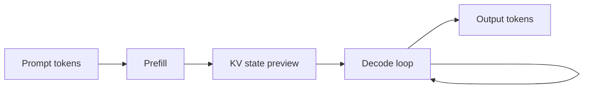

# Week 1: LLM And GPU Bridge

This bridge module translates Week 1 LLM vocabulary into the system language of compute,
memory, bandwidth, communication, and hardware/software co-design.

## Learning Goals

- Build a hardware architect's mental model of an LLM workload.
- Explain LLMs as matrix workloads, memory workloads, and communication workloads.
- Preview prefill, decode, training, and inference without going deep yet.
- Practice the three recurring bottleneck questions used throughout the curriculum.
- Talk about LLMs in interviews using precise terms and architecture intuition.

## Why This Bridge Matters

LLM interviews can sound unfamiliar at first because the vocabulary is different. Under
the vocabulary, many questions are familiar: where is the compute, where is the state, how
does data move, and what does the software stack expose or hide?

For Nawab's background, the fastest path is to treat LLMs as accelerator workloads with
unusual sequence behavior and production constraints. The Transformer paper motivates an
attention-based architecture that is parallelizable for training, while modern serving
papers show that memory management becomes critical in production (Sources 1 and 2).

## The Hardware Architect's Mental Model Of An LLM

An LLM is a repeated tensor program over a token sequence. The model weights are mostly
static during inference, while activations and serving state depend on prompt length, batch
shape, and generation length.

In Week 1, use this decomposition:

- Tokens define the sequence.
- Embeddings turn discrete IDs into dense vectors.
- The Transformer stack repeatedly transforms those vectors.
- Logits score possible next tokens.
- The serving system repeats the loop until output is complete.

## LLMs As Matrix Workloads

Many core operations in Transformer-style models are matrix or tensor operations. That is
why Tensor Cores, low precision, kernel efficiency, and batching matter.

The first-order hardware question is not "does the model use AI?" It is:

- What are the dominant tensor shapes?
- How much reuse is available?
- Does the batch shape expose enough parallelism?
- Is arithmetic intensity high enough to use the machine well?

## LLMs As Memory Workloads

LLMs are also memory workloads. Weights must be available, activations appear during
execution, and serving can accumulate KV-cache state as contexts and outputs grow.

PagedAttention is a useful preview source because it frames LLM serving throughput as
limited by KV-cache memory waste, fragmentation, and dynamic request shape (Source 2).
Week 1 does not yet cover KV-cache mechanics, but it does establish the warning: memory
capacity and bandwidth can decide whether compute is actually usable.

## LLMs As Communication Workloads

Large models and large batches often span multiple accelerators. Once that happens, the
system must move partial results, parameters, activations, or scheduling state across a
fabric.

NVIDIA's GB200 NVL72 material is a Week 1 example of why scale-up communication matters:
the platform is described as a rack-scale Grace Blackwell system with a 72-GPU NVLink
domain (Source 3). The point is not to memorize every number. The point is to notice that
communication is a first-class design axis.

## Prefill Versus Decode, Preview Only

Prefill processes the prompt tokens and prepares the model state needed for generation.
Decode generates output tokens step by step.

This original diagram is a simplified preview. Detailed attention math, KV-cache layout,
and serving schedulers come in later weeks.

## Training Versus Inference, Preview Only

Training changes weights. It adds backward pass, optimizer state, checkpointing, and
distributed training concerns.

Inference holds weights fixed and serves requests. It emphasizes latency, throughput,
memory footprint, batching, request scheduling, and cost per token.

Both can use the same hardware family, but the bottlenecks and operational priorities can
be different.

## The Three Recurring Bottleneck Questions

Use these questions in every technical interview answer:

1. Where is the compute?
2. Where is the memory capacity and bandwidth pressure?
3. Where is the communication?

If you can answer those three questions clearly, you can usually turn an unfamiliar LLM
topic into a structured systems discussion.

## How To Talk About LLMs In Hardware Interviews

- Start with workload shape before naming optimizations.
- Convert model terms into tensors, state, bandwidth, and synchronization.
- Identify the bottleneck you would measure first.
- State assumptions about batch size, context length, model size, and latency target.
- Separate scale-up and scale-out problems.
- Treat software as part of the architecture, not as an afterthought.

## Design Prompts For Week 1

- A team says an LLM inference service is "GPU bound." What three measurements would you
  ask for before accepting that statement?
- A product manager asks why a rack-scale GPU system matters for LLMs. Give a two-minute
  answer that includes compute, memory, and communication.
- You are comparing a custom accelerator with an NVIDIA platform for inference. What
  assumptions must be fixed before the comparison is meaningful?
- A model's output latency rises with longer prompts. What Week 1 concepts help you form
  the first debugging hypothesis?

## Sources

Source 1: Vaswani et al., "Attention Is All You Need."
https://arxiv.org/abs/1706.03762

Source 2: Kwon et al., "Efficient Memory Management for Large Language Model Serving."
https://arxiv.org/abs/2309.06180

Source 3: NVIDIA, "GB200 NVL Multi-Node Tuning Guide."
https://docs.nvidia.com/multi-node-nvlink-systems/multi-node-tuning-guide/overview.html

Source 4: NVIDIA developer blog, "GB200 NVL72 Delivers Trillion-Parameter LLM Training."
https://developer.nvidia.com/blog/nvidia-gb200-nvl72-delivers-trillion-parameter-llm-training-and-real-time-inference/
