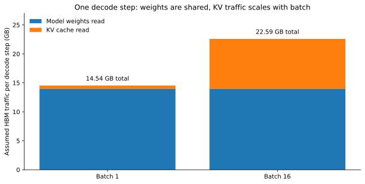
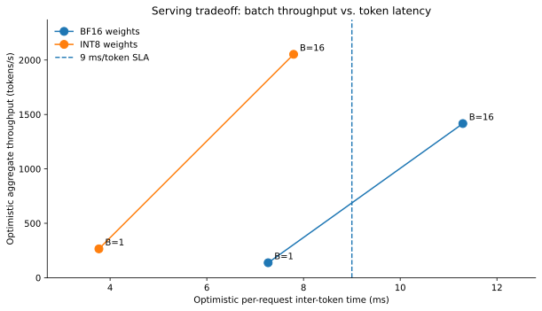

# Week 2 Systems: Applied Decode-Performance Case Study

**Target:** senior ML hardware/systems interview. **Timebox:** 60–75 minutes.
**Purpose:** make a quantitative hardware decision under an inference-latency constraint.

**Prerequisite, not repeated here:** [Transformer Architecture](../llms/02_transformer_architecture.md)
and [NVIDIA GPU Execution Model](../nvidia/02_gpu_execution_model.md).

For operator-to-hardware mapping, see [From Transformer Block to GPU Work][operator-mapping].
This exercise applies those foundations to decode latency, bandwidth, and batching.

## Table of Contents

- [Interview Prompt](#interview-prompt)
- [Worked Solution](#worked-solution)
- [Your 90-Second Interview Answer](#your-90-second-interview-answer)
- [Interview Scoring: 5-Point Checklist](#interview-scoring-5-point-checklist)
- [Sources](#sources)

## Interview Prompt

**Timebox:** 25 minutes; attempt before reading the solution.

> A team serves a 7B-parameter decoder-only LLM on one H100-class GPU. Prefill performs well,
> but interactive decode is slow. An architect must identify the limiting resource, estimate the
> benefit of possible changes, and preserve a **9 ms per-request inter-token latency SLA**.
> What would you recommend, and what evidence would change your mind?

Use **only these exercise assumptions**, not unverified real-world benchmark numbers:

| Given | Value |
|---|---|
| Model weights | 7B parameters, BF16, **14.0 GB** resident on GPU |
| Architecture | 32 layers; 32 query heads; 8 KV heads; head dimension 128 (GQA) |
| Context already cached | 4,096 tokens per request |
| KV representation | BF16, 2 bytes per element, separately stored K and V |
| Assumed effective HBM bandwidth | **2.0 TB/s** (2,000 GB/s), for this hypothetical |
| Assumed ideal compute rate | **200 TFLOP/s** BF16, for a coarse lower-bound check |
| Approximate compute per new token | **16 GFLOPs**, including attention; rounded exercise estimate |

**Simplifying assumptions:** Each decode step reads all model weights once for the batch and
reads the full KV history once for each request. The batch shares weight reads. Ignore L2 reuse,
launch overhead, cache-block paging, quantization overhead, network effects, and contention.
The results are **optimistic bounds**, not measured H100 timings or guaranteed achievable rates.
Treat this as one step at the stated context length; KV traffic grows as generation continues.

Solve the following before opening the answer section:

1. **Establish the floor.** Derive KV bytes per request from layers, KV heads, head width,
   sequence length, K+V, and bytes/element. Estimate minimum memory time per token at batch 1.
   Compare this with the ideal compute-time bound. Which resource is most likely limiting?
2. **Choose the serving mode.** At batch 16, compute weight + KV traffic per step, optimistic
   aggregate tokens/s, and per-request token latency. Does it satisfy the 9 ms SLA?
3. **Rank interventions.** Consider doubling Tensor Core arithmetic, switching **weights only**
   to 8-bit (7 GB; KV stays BF16), increasing batch to 16, or using a model with 4 KV heads.
   Identify the best immediate option for latency and for throughput. Which option changes the
   model architecture rather than merely the runtime?
4. **Defend the diagnosis.** Name **three measurements** you would request before changing
   production settings, plus one observation that would falsify your memory-bandwidth hypothesis.

## Worked Solution

**Timebox:** 15 minutes.

**1 — Bytes before FLOPs.** One request's KV cache is:

```text
2 (K + V) × 32 layers × 8 KV heads × 128 dimensions
× 4,096 history tokens × 2 bytes/BF16 = 536,870,912 bytes
≈ 0.537 GB = 512 MiB
```

At batch 1, optimistic read traffic is **14.0 + 0.537 = 14.537 GB**. The bandwidth floor is
**14.537 / 2,000 s = 7.27 ms per token**, or at most **138 tokens/s** on this toy model.
The ideal compute time is **16 GFLOPs / 200 TFLOP/s = 0.08 ms**.
The large gap makes a **memory-traffic limit** the leading hypothesis. Actual small decode GEMVs
may achieve far less than the assumed compute rate; neither roof is a measured latency.

**2 — Batching improves aggregate throughput but can hurt interactive latency.**

| Scenario | Weight read/step | KV read/step | Min. step time | Approx. aggregate cap |
|---|---:|---:|---:|---:|
| BF16 weights, batch 1 | 14.00 GB | 0.537 GB | **7.27 ms** | **138 tok/s** |
| BF16 weights, batch 16 | 14.00 GB | 8.590 GB | **11.29 ms** | **1,417 tok/s** |
| 8-bit weights, batch 1 | 7.00 GB | 0.537 GB | **3.77 ms** | **265 tok/s** |
| 8-bit weights, batch 16 | 7.00 GB | 8.590 GB | **7.79 ms** | **2,053 tok/s** |

Values are rounded from full-precision byte counts, not from the rounded GB values shown.

At batch 16, weight traffic is amortized across 16 output tokens, but KV reads scale with
requests. The **11.29 ms/token bound fails the 9 ms SLA**, even though aggregate throughput rises
roughly **10×**. The batch-16 ideal compute bound is **256 GFLOPs / 200 TFLOP/s = 1.28 ms**,
which remains below the memory floor under these assumptions.



*Figure 1 — Original calculation from the interview assumptions; not a profiler measurement.*

**3 — Optimize against the actual SLA, not a headline throughput number.**

- **Doubling Tensor Core throughput:** little predicted improvement if HBM traffic still sets
  the floor; verify with profiling before buying more compute.
- **8-bit weight-only quantization:** cuts modeled batch-1 floor to **3.77 ms** and batch-16
  floor to **7.79 ms**. It is the strongest simple candidate here, **provided model quality,
  dequantization overhead, and realized kernel speed are acceptable**.
  A floor below 9 ms makes the SLA potentially feasible, not guaranteed; measure actual token latency.
- **Batch 16 alone:** improves aggregate throughput but **violates** the illustrative 9 ms
  inter-token SLA; dynamic batching may yield a better operational compromise.
- **4 KV heads instead of 8:** halves KV traffic. At batch 1 the bound only changes from
  7.27 to **7.13 ms**, a modest improvement because weight reads dominate. At batch 16,
  it falls to about **9.15 ms**. This **changes the model architecture**; it is not a runtime
  toggle on a fixed checkpoint.



*Figure 2 — Original sensitivity analysis, not actual product throughput or latency.*
Connecting lines guide the eye between the two modeled batch sizes; they are not a measured performance curve.

**4 — Prove or disprove the hypothesis.** Ask for:

- **Kernel timeline and token latency split:** prefill versus decode, launch gaps, attention
  versus projection kernels, and achieved batch/sequence-length distribution.
- **Nsight Compute memory evidence:** effective DRAM throughput, actual bytes transferred,
  L2 hit rates, and unexpected traffic from temporary buffers or spilling.
- **SM execution evidence:** Tensor Core activity, eligible warps/issue efficiency, and
  pipeline stalls to distinguish bandwidth pressure from poor utilization.

**Falsifier:** decode is slow while *actual* DRAM throughput remains low and the timeline is
mostly idle gaps or tiny underfilled kernels. The simple bandwidth floor alone would not
explain that; inspect launch overhead, kernel shape, and scheduling before changing memory hardware.

## Your 90-Second Interview Answer

**Timebox:** 10 minutes.

> “I would start with bytes per generated token, not peak FLOPs. For this 7B BF16 model, weights
> alone are about 14 GB. A 4K context with 8 KV heads adds about 0.54 GB per request. At an
> assumed 2 TB/s of effective bandwidth, batch-1 decode has an optimistic 7.3 ms memory floor;
> the ideal compute floor is much smaller. I would therefore hypothesize memory-bound decode,
> then check actual DRAM traffic, scheduler activity, and the kernel timeline. Batching boosts
> aggregate throughput by reusing weight reads, but batch 16 pushes the modeled step time above
> our 9 ms SLA. Weight-only 8-bit quantization could improve both latency and throughput, if
> accuracy and kernel overhead validate. I would benchmark that against dynamic batching and
> retain the existing model until those measurements support the decision.”

### Interview Scoring: 5-Point Checklist

- [ ] Quantified weights **and** KV traffic with correct units.
- [ ] Separated optimistic hardware bounds from measured performance.
- [ ] Distinguished aggregate throughput from **per-request** latency.
- [ ] Chose an optimization against the **9 ms SLA**, with accuracy/runtime caveats.
- [ ] Proposed measurements that could **disprove** the first hypothesis.

**Defer to later weeks:** real multi-GPU serving, advanced KV paging, tensor/pipeline parallelism,
CUDA microarchitecture tuning, and production benchmarking methodology.

## Sources

- [NVIDIA: Mastering LLM Techniques - Inference Optimization][decode-inference]: background on decode,
  weight reuse through batching, KV memory, and quantization.
- [Repository Source Map](../references/sources.md#week-2-decode-performance-case-study).

All numerical assumptions and figures belong to this hypothetical exercise, not to a vendor benchmark.

[operator-mapping]: ../nvidia/02_gpu_execution_model.md#from-transformer-block-to-gpu-work
[decode-inference]: https://developer.nvidia.com/blog/mastering-llm-techniques-inference-optimization/
